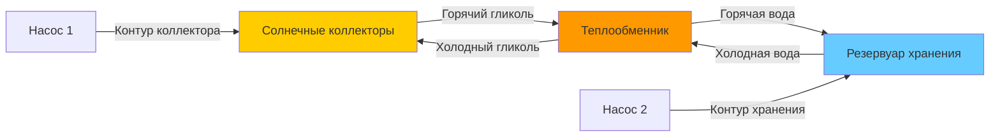

# Теплообменники для систем солнечного отопления

Теплообменники в системах солнечного отопления служат критическим интерфейсом между контуром коллектора и системой отопления или охлаждения здания. Эти устройства передают тепловую энергию, поддерживая гидравлическое разделение между контурами жидкостей, что позволяет обеспечить защиту от замерзания, контроль коррозии и оптимизацию системы.

## Основы теплопередачи

Интенсивность теплопередачи в солнечном теплообменнике следует фундаментальному соотношению:

$$Q = UA \cdot \Delta T_{lm}$$

где:
- $Q$ = интенсивность теплопередачи (Вт)
- $U$ = коэффициент теплопередачи (Вт/м²·К)
- $A$ = площадь поверхности теплопередачи (м²)
- $\Delta T_{lm}$ = логарифмическая средняя разность температур (К)

Логарифмическая средняя разность температур для противоточных схем рассчитывается как:

$$\Delta T_{lm} = \frac{(T_{h,in} - T_{c,out}) - (T_{h,out} - T_{c,in})}{\ln\left(\frac{T_{h,in} - T_{c,out}}{T_{h,out} - T_{c,in}}\right)}$$

## Типы теплообменников

### Пластинчатые теплообменники

Паяные или уплотняемые пластинчатые теплообменники доминируют в приложениях солнечного отопления благодаря компактному конструктиву и высокой эффективности. Гофрированная геометрия пластин создаёт турбулентный поток при низких числах Рейнольдса, увеличивая коэффициент конвективной теплопередачи.

**Преимущества:**
- Значения эффективности от 0,85 до 0,95
- Компактные размеры (10-20% от эквивалентного кожухотрубного теплообменника)
- Простая регулировка производительности путём добавления пластин
- Высокая турбулентность минимизирует отложения

**Ограничения:**
- Ограничения по давлению (обычно максимум 300 кПа для паяных аппаратов)
- Ограничения по температуре (максимум 150-200°C в зависимости от материала уплотнения)
- Большее падение давления, чем в кожухотрубных конструкциях

### Кожухотрубные теплообменники

Кожухотрубные конфигурации обеспечивают надёжность для высокого давления или высоких температур в приложениях солнечного отопления, особенно в концентрирующих системах солнечного отопления.

**Рекомендации по проектированию:**
- Выбор жидкости на трубной стороне: размещение жидкости, подверженной отложениям, на трубной стороне для облегчения очистки
- Расстояние между перегородками: от 0,2 до 1,0 диаметра корпуса для оптимальной теплопередачи
- Стандарты TEMA определяют механическое проектирование

### Змеевиковые теплообменники в резервуарах

Погружённые змеевиковые теплообменники интегрируются непосредственно в тепловые аккумулирующие резервуары, исключая необходимость во внешнем оборудовании теплообмена.

Коэффициент естественной конвекции на стороне резервуара значительно ниже, чем при принудительной конвекции во внешних теплообменниках:

$$h_{nat} = C \cdot \left(\frac{k}{L}\right) \cdot (Gr \cdot Pr)^n$$

где $Gr$ — число Грасгофа, а типичные значения $h_{nat}$ находятся в диапазоне 200-800 Вт/м²·К по сравнению с 2000-8000 Вт/м²·К при принудительной конвекции.

## Показатели производительности

### Эффективность теплообменника

Эффективность количественно определяет отношение фактической теплопередачи к максимально возможной теплопередаче:

$$\varepsilon = \frac{Q_{actual}}{Q_{max}} = \frac{C_{min}(T_{out} - T_{in})}{C_{min}(T_{h,in} - T_{c,in})}$$

где $C_{min}$ — минимальная тепловая производительность ($\dot{m} \cdot c_p$) из двух жидкостей.

Метод эффективности-NTU связывает эффективность с числом единиц передачи:

$$NTU = \frac{UA}{C_{min}}$$

Для противоточных теплообменников с равными тепловыми производительностями ($C_r = 1$):

$$\varepsilon = \frac{NTU}{1 + NTU}$$

### Температурный подход

Разность температур подхода количественно определяет, насколько близко температура на выходе холодной жидкости приближается к температуре на входе горячей жидкости. Более низкие температурные подходы указывают на лучшую производительность теплообменника, но требуют большей площади поверхности.

В справочнике ASHRAE "HVAC Systems and Equipment" рекомендуются температурные подходы 2-5°C для пластинчатых теплообменников и 5-10°C для кожухотрубных конструкций в приложениях солнечного отопления.

## Сравнение теплообменников

| Тип | Эффективность | Падение давления | Коэффициент стоимости | Типичные приложения |
|-----|--------------|------------------|---------------------|---------------------|
| Паяная пластина | 0,90-0,95 | Высокое | 1,0 | Жилые здания, малые коммерческие |
| Уплотняемая пластина | 0,85-0,92 | Высокое | 1,3 | Крупные коммерческие, лёгкое обслуживание |
| Кожухотрубная | 0,70-0,85 | Низкое | 1,8 | Высокие температуры, высокое давление |
| Змеевик в резервуаре | 0,60-0,75 | Низкое | 0,6 | Интегрированные системы хранения |
| Двойная стенка | 0,75-0,85 | Среднее | 2,5 | Подогрев питьевой воды |

## Методология расчёта размеров

### Необходимая площадь теплопередачи

Процесс проектирования начинается с определения необходимой интенсивности теплопередачи на основе выходной мощности батареи коллекторов:

$$A_{HX} = \frac{Q_{design}}{U \cdot \Delta T_{lm}}$$

Коэффициент теплопередачи $U$ учитывает конвективные сопротивления с обеих сторон плюс проводимость стенки:

$$\frac{1}{U} = \frac{1}{h_{hot}} + \frac{t}{k_{wall}} + \frac{1}{h_{cold}}$$

Для растворов гликоля и воды при 50°C при турбулентном потоке в пластинчатом теплообменнике:
- $h_{hot}$ = 3000-6000 Вт/м²·К (сторона контура коллектора)
- $h_{cold}$ = 3000-6000 Вт/м²·К (сторона нагрузки)
- $U$ = 1500-3000 Вт/м²·К (общее значение)

### Рассмотрения падения давления

Чрезмерное падение давления в теплообменнике увеличивает энергию на прокачку и может снизить эффективность солнечного коллектора. Общее падение давления в системе не должно превышать 50-70 кПа для типичных жилых систем.

## Конфигурация солнечного теплообменника

## Выбор теплоносителя и его свойства

### Теплоносители контура коллектора

**Растворы пропиленгликоля (30-50% по объёму):**
- Защита от замерзания до -20°C до -35°C
- Повышение вязкости снижает коэффициент теплопередачи на 15-30%
- Снижение удельной теплоёмкости на 10-15% по сравнению с водой
- Требует годового тестирования и замены каждые 5-7 лет

**Вода:**
- Используется в системах слива или в климатах, устойчивых к замерзанию
- Максимальная производительность теплопередачи
- Отсутствие деградации или требований замены

### Коррекция коэффициента теплопередачи

Уравнение Диттуса-Бёльтерта для турбулентного потока показывает эффекты вязкости:

$$Nu = 0.023 \cdot Re^{0.8} \cdot Pr^{0.3}$$

Для 50% пропиленгликоля при 50°C по сравнению с водой:
- Вязкость: в 3,5 раза выше
- Число Рейнольдса: в 3,5 раза ниже
- Коэффициент теплопередачи: примерно 60-70% от значения для воды

## Выбор материалов

### Рассмотрения коррозии

Системы солнечного отопления испытывают температуры стагнации, превышающие 150°C, что ускоряет коррозию в теплообменниках. Совместимость материалов определяется:

- **Медные сплавы:** подходят для растворов гликоля с надлежащими ингибиторами
- **Нержавеющая сталь 316:** требуется для систем с плохим качеством воды или высоким содержанием хлоридов
- **Алюминий:** ограничен специализированными низкотемпературными приложениями

### Защита от замерзания

Внешние теплообменники изолируют контур коллектора, позволяя растворам антифриза циркулировать через коллекторы, одновременно поддерживая чистую воду в хранилище. Эта конфигурация:
- Исключает риск загрязнения питьевой воды
- Позволяет использовать токсичный, но эффективный этиленгликоль в непитьевых контурах
- Обеспечивает защиту от перегрева через предохранительный клапан в изолированном контуре коллектора

## Интеграция с системой хранения

Коэффициент штрафа теплообменника учитывает разность температур через теплообменник:

$$F_R = \frac{1}{1 + \frac{F'_R \cdot A_c \cdot U_L}{2 \cdot \varepsilon \cdot \dot{m} \cdot c_p}}$$

где:
- $F'_R$ = коэффициент удаления тепла коллектором
- $A_c$ = площадь коллектора (м²)
- $U_L$ = коэффициент потерь тепла коллектором (Вт/м²·К)
- $\varepsilon$ = эффективность теплообменника

Эффективность теплообменника ниже 0,5 может снизить эффективность солнечной системы на 20-30%, что делает надлежащий расчёт размеров критически важным.

## Стратегии управления

Дифференциальные контроллеры температуры активируют насос коллектора при условии:

$$T_{collector} > T_{storage} + \Delta T_{on}$$

Типичные значения $\Delta T_{on}$ находятся в диапазоне 5-10°C. Теплообменник добавляет тепловое сопротивление, которое необходимо преодолеть, требуя более высоких температур коллектора перед началом полезной передачи энергии.

## Мониторинг производительности

Ключевые показатели производительности для солнечных теплообменников включают:

1. **Температурный подход:** постоянно контролируется для обнаружения отложений
2. **Падение давления:** увеличение указывает на образование накипи или скопление мусора
3. **Эффективность:** рассчитывается на основе измерений температуры и расхода

Стандарт ASHRAE 90.1 требует проверки при вводе в эксплуатацию, что производительность теплообменника соответствует спецификациям проекта с допуском 10%.

## Требования к техническому обслуживанию

**Ежегодный осмотр:**
- Тестирование концентрации и pH гликоля
- Измерение падения давления через теплообменник
- Визуальный осмотр утечек или коррозии

**Обслуживание каждые 5 лет:**
- Замена гликоля в контуре коллектора
- Очистка теплообменника при обнаружении отложений
- Замена уплотнений (уплотняемые пластинчатые аппараты)

Надлежащее техническое обслуживание сохраняет эффективность теплообменника выше 0,85 на протяжении срока службы системы в 20-25 лет, обеспечивая оптимальную производительность системы солнечного отопления.
