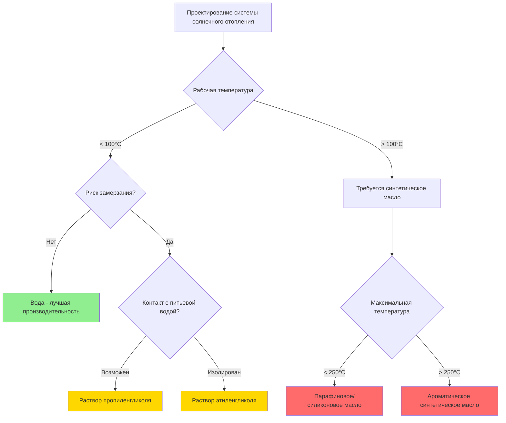

## Введение

Теплоносители (HTF) служат средой для транспортировки тепловой энергии от солнечных коллекторов к накопительным резервуарам или теплообменникам в системах солнечного отопления. Выбор подходящего теплоносителя напрямую влияет на эффективность системы, способность к защите от замерзания, диапазон рабочих температур и требования к техническому обслуживанию. Данный анализ рассматривает термофизические свойства, характеристики производительности и критерии выбора теплоносителей в приложениях HVAC солнечного отопления.

## Фундаментальные свойства теплоносителей

### Параметры тепловой производительности

Эффективность теплоносителя зависит от нескольких термофизических свойств, которые определяют теплопередачу и требования к мощности насоса.

**Теплоемкость** определяет энергию, транспортируемую на единицу массы:

$$Q = \dot{m} \cdot c_p \cdot \Delta T$$

Где:
- Q = скорость теплопередачи (Вт)
- $\dot{m}$ = массовый расход (кг/с)
- $c_p$ = удельная теплоемкость (Дж/кг·К)
- ΔT = перепад температуры (К)

**Теплопроводность** влияет на коэффициенты конвективной теплопередачи:

$$h = \frac{Nu \cdot k}{D_h}$$

Где:
- h = коэффициент конвективной теплопередачи (Вт/м²·К)
- Nu = число Нуссельта (безразмерный)
- k = теплопроводность (Вт/м·К)
- $D_h$ = гидравлический диаметр (м)

**Вязкость** определяет мощность насоса и характеристики режима течения. Число Рейнольдса определяет переход между ламинарным и турбулентным потоком:

$$Re = \frac{\rho \cdot v \cdot D_h}{\mu}$$

Где:
- Re = число Рейнольдса (безразмерный)
- ρ = плотность жидкости (кг/м³)
- v = скорость потока (м/с)
- μ = динамическая вязкость (Па·с)

## Распространенные теплоносители

### Вода

Чистая вода обеспечивает отличные термические свойства для систем солнечного отопления в климате без заморозков:

| Свойство | Значение (20°C) | Единицы |
|----------|-----------------|---------|
| Удельная теплоемкость | 4 186 | Дж/кг·К |
| Теплопроводность | 0,598 | Вт/м·К |
| Плотность | 998 | кг/м³ |
| Динамическая вязкость | 0,001 | Па·с |
| Диапазон работы | 0–100 | °C |

Вода обладает наивысшей удельной теплоемкостью и наименьшей стоимостью, но требует защиты от замерзания в холодном климате. Стандарт ASHRAE 90.1 требует защиты от замерзания для систем, подвергающихся воздействию температур окружающей среды ниже 4°C.

### Растворы пропиленгликоля

Пропиленгликоль (PG), смешанный с водой, обеспечивает защиту от замерзания при сохранении приемлемой тепловой производительности. Концентрация смеси определяет температуру замерзания:

| Концентрация PG | Точка замерзания | Защита от разрыва | $c_p$ (20°C) | Соотношение вязкостей |
|-----------------|------------------|-------------------|--------------|----------------------|
| 20% по объему | -7°C | -4°C | 4 050 Дж/кг·К | 1,8× |
| 30% по объему | -13°C | -9°C | 3 950 Дж/кг·К | 2,4× |
| 40% по объему | -21°C | -15°C | 3 850 Дж/кг·К | 3,5× |
| 50% по объему | -33°C | -23°C | 3 700 Дж/кг·К | 5,8× |

Пропиленгликоль нетоксичен, что делает его пригодным для систем с потенциальным риском загрязнения питьевой воды. Снижение удельной теплоемкости и повышение вязкости требуют более крупных насосов и теплообменников по сравнению с системами на воде.

### Растворы этиленгликоля

Этиленгликоль (EG) обеспечивает превосходную защиту от замерзания и более низкую вязкость, чем пропиленгликоль при эквивалентных концентрациях:

| Концентрация EG | Точка замерзания | $c_p$ (20°C) | Соотношение вязкостей |
|-----------------|------------------|--------------|----------------------|
| 30% по объему | -14°C | 3 900 Дж/кг·К | 2,0× |
| 40% по объему | -23°C | 3 750 Дж/кг·К | 2,8× |
| 50% по объему | -37°C | 3 600 Дж/кг·К | 4,2× |

Этиленгликоль обеспечивает лучшие характеристики теплопередачи, но является токсичным, требуя двойных стенок теплообменников при использовании в системах, подключенных к цепям питьевой воды, согласно стандарту ASHRAE 90.2.

### Синтетические термические масла

Системы солнечного отопления с высокой температурой, работающие выше 120°C, требуют синтетических масел с расширенной термической стабильностью:

| Тип жидкости | Диапазон температур | $c_p$ (100°C) | Термическая стабильность |
|-------------|---------------------|---------------|--------------------------|
| Парафиновое масло | -10–300°C | 2 200 Дж/кг·К | Хорошая |
| Ароматическое масло | 0–350°C | 2 100 Дж/кг·К | Отличная |
| Силиконовая жидкость | -40–250°C | 1 900 Дж/кг·К | Выдающаяся |

Эти жидкости позволяют работать при более высоких температурах коллектора, но требуют специализированных компонентов системы и процедур обращения из-за проблем воспламеняемости.

## Критерии выбора теплоносителя

### Влияние на проектирование системы

Выбор теплоносителя влияет на несколько параметров системы:

**Расчет насоса:** Жидкости с более высокой вязкостью требуют повышенной мощности насоса. Перепад давления в трубопроводе следует уравнению Дарси-Вейсбаха:

$$\Delta P = f \cdot \frac{L}{D_h} \cdot \frac{\rho \cdot v^2}{2}$$

Где f растет с вязкостью жидкости в ламинарном и переходном режимах потока.

**Расчет теплообменника:** Снижение теплопроводности и удельной теплоемкости требуют увеличения площади поверхности теплопередачи для поддержания эквивалентной производительности.

**Расчет расширительного бака:** Растворы гликолей демонстрируют большие коэффициенты теплового расширения, чем вода, требуя более крупных расширительных сосудов.

**Ингибиторы коррозии:** Все растворы гликолей требуют пакетов ингибиторов для предотвращения коррозии металлических компонентов системы. Стандарт ASHRAE 147 определяет протоколы испытаний для эффективности ингибиторов коррозии.

## Деградация теплоносителя и техническое обслуживание

### Термическая деградация

Продолжительное воздействие повышенных температур вызывает разложение теплоносителя. Окисление гликолей производит органические кислоты, которые снижают pH и ускоряют коррозию:

- Максимальная рекомендуемая рабочая температура: 120°C для PG, 135°C для EG
- Температуры застоя в вакуумных трубчатых коллекторах могут превышать 200°C
- Системы защиты от перегрева необходимы для предотвращения деградации жидкости

### Требования к мониторингу

Регулярное тестирование жидкости поддерживает производительность системы:

| Параметр | Частота испытаний | Пороговое значение |
|----------|------------------|-------------------|
| pH | Ежегодно | < 7,0 |
| Резервная щелочность | Ежегодно | < 50% от начального |
| Удельный вес | Ежегодно | ±5% от целевого |
| Визуальный осмотр | Ежегодно | Обесцвечивание/осадок |

Замена жидкости требуется, когда pH падает ниже приемлемых пределов или резервная щелочность истощается, обычно каждые 5–10 лет в зависимости от условий работы.

## Заключение

Выбор теплоносителя значительно влияет на производительность системы солнечного отопления, требования к техническому обслуживанию и затраты жизненного цикла. Вода обеспечивает оптимальные термические свойства там, где защита от замерзания не требуется. Растворы пропиленгликоля предлагают оптимальный баланс между защитой от замерзания, безопасностью и производительностью для большинства приложений HVAC в условиях холодного климата. Этиленгликоль обеспечивает превосходные характеристики теплопередачи в изолированных системах. Приложения с высокой температурой выше 120°C требуют синтетических масел с надлежащей термической стабильностью. Надлежащий выбор теплоносителя, интеграция проектирования системы и протоколы технического обслуживания обеспечивают надежную долгосрочную работу систем HVAC солнечного отопления.
