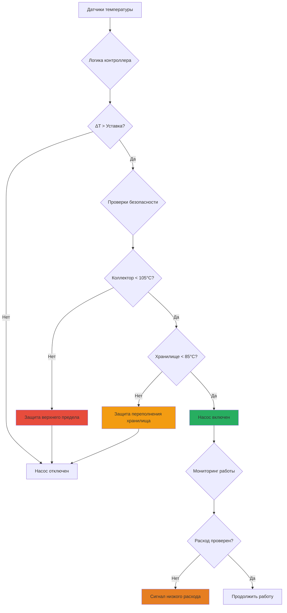

Циркуляционные насосы и системы управления являются критическими компонентами активных солнечных тепловых систем, прямо влияя на эффективность системы, надежность и потребление паразитной энергии. Правильный выбор размера насоса и реализация стратегии управления определяют, превышает ли собранная солнечная энергия электроэнергию, необходимую для циркуляции жидкости.

## Основные принципы работы

Солнечные тепловые системы циркуляции работают на основе управления дифференциалом температуры. Контроллер активирует циркуляционный насос, когда температура коллектора превышает температуру хранилища на заранее установленное значение, обычно 5-10°C. Это обеспечивает добавление циркулирующей жидкостью чистой тепловой энергии в хранилище, а не извлечение тепла в неблагоприятных условиях.

Базовая логика управления следует:

$$\Delta T_{on} = T_{collector} - T_{storage} \geq \Delta T_{set,on}$$

$$\Delta T_{off} = T_{collector} - T_{storage} \leq \Delta T_{set,off}$$

Где:
- $T_{collector}$ = температура на выходе коллектора или в кармане абсорбирующей пластины (°C)
- $T_{storage}$ = температура в резервуаре солнечного хранилища (°C)
- $\Delta T_{set,on}$ = дифференциал для запуска насоса (обычно 7-10°C)
- $\Delta T_{set,off}$ = дифференциал для остановки насоса (обычно 3-5°C)

Гистерезис между значениями включения и отключения предотвращает короткие циклы, которые ускоряют износ насоса и увеличивают потребление паразитной энергии.

## Методология выбора размера насоса

Надлежащий выбор насоса требует расчета общего напора системы и определения оптимального расхода на основе площади и типа коллектора.

### Требования к расходу

ASHRAE 90.1 и спецификации производителей предоставляют рекомендации по расходу:

**Для плоских коллекторов:**

$$\dot{m} = 0.015 \text{ to } 0.020 \frac{\text{кг}}{\text{с} \cdot \text{м}^2} \times A_c$$

**Для коллекторов с вакуумными трубками:**

$$\dot{m} = 0.010 \text{ to } 0.015 \frac{\text{кг}}{\text{с} \cdot \text{м}^2} \times A_c$$

Где $A_c$ = валовая площадь коллектора (м²)

Более высокие расходы улучшают теплопередачу, но увеличивают энергию на перекачивание. Оптимальный расход максимизирует соотношение собранной тепловой энергии к паразитной энергии перекачивания.

### Расчет напора системы

Общий динамический напор состоит из статического напора, потерь на трение и перепадов давления компонентов:

$$H_{total} = H_{static} + H_{friction} + H_{components}$$

**Статический напор:**
Вертикальное расстояние от центра линии насоса до наивысшей точки массива коллекторов плюс вертикальное расстояние возврата.

**Потери на трение:**
Уравнение Дарси-Вейсбаха применяется для турбулентного потока (Re > 4000):

$$H_f = f \frac{L}{D} \frac{v^2}{2g}$$

Где:
- $f$ = коэффициент трения (0.02-0.04 для медной трубки)
- $L$ = длина трубопровода (м)
- $D$ = внутренний диаметр (м)
- $v$ = скорость жидкости (м/с)
- $g$ = ускорение свободного падения (9.81 м/с²)

Для растворов гликоля вязкость значительно увеличивается при низких температурах. Число Рейнольдса определяет режим потока:

$$Re = \frac{\rho v D}{\mu}$$

При 0°C 40% пропиленового гликоля имеет вязкость примерно в 2.5 раза выше, чем у воды, пропорционально увеличивая потери на трение в условиях ламинарного потока.

**Перепады давления компонентов:**

| Компонент | Перепад давления (кПа) |
|-----------|---------------------|
| Плоский коллектор | 3-8 за единицу |
| Коллектор с вакуумными трубками | 2-5 за единицу |
| Теплообменник (пластинчатый) | 10-35 |
| Фильтр | 3-7 |
| Обратный клапан | 5-12 |
| Расходомер | 5-15 |
| Балансировочный клапан | 8-20 |

### Расчет мощности насоса

Теоретическая гидравлическая мощность:

$$P_{hydraulic} = \frac{\dot{m} \times g \times H_{total}}{\rho}$$

С учетом эффективности насоса:

$$P_{electric} = \frac{P_{hydraulic}}{\eta_{pump}} = \frac{\dot{m} \times g \times H_{total}}{\rho \times \eta_{pump}}$$

Где $\eta_{pump}$ колеблется от 0.25-0.45 для малых циркуляторов до 0.60-0.75 для более крупных многоступенчатых насосов.

## Типы насосов и выбор

### Циркуляторы с мокрым ротором

Интегрированные установки насос-двигатель, где ротор работает погруженным в теплоноситель. Они доминируют в жилых и легких коммерческих солнечных приложениях благодаря компактному размеру, тихой работе и возможности работы с растворами гликоля.

**Характеристики:**
- Диапазон мощности: 20-200 Вт
- Возможность по напору: 2-8 м
- Расходы: 5-80 л/мин
- Эффективность: 15-35% в точке проектирования
- Подходит для систем до 20 м² площади коллектора

**Пределы температуры:**
Стандартные циркуляторы с мокрым ротором переносят непрерывную температуру жидкости до 110°C. Высокотемпературные версии рассчитаны на 130°C в теплоносителе для находящихся под давлением систем, где защита от застоя зависит от объема расширения, а не от испарения.

### Циркуляторы с тремя скоростями

Традиционные циркуляторы предлагают три фиксированных режима скорости, выбираемых механическим переключателем или электрическим входом. Хотя и просты и надежны, они обеспечивают минимальную оптимизацию эффективности при изменяющихся солнечных условиях.

### Насосы переменной скорости (ECM)

Электронно-коммутируемые моторные насосы непрерывно регулируют скорость для поддержания постоянного дифференциального давления или пропорционального управления давлением. Продвинутые модели включают автоматические алгоритмы адаптации, которые оптимизируют рабочую точку на основе характеристик системы.

**Сравнение производительности:**

| Тип насоса | Диапазон эффективности | Годовая энергия | Гибкость управления |
|-----------|-----------------|---------------|---------------------|
| Одна скорость | 15-30% | 180-350 кВт·ч/год | Отсутствует |
| Три скорости | 18-32% | 120-280 кВт·ч/год | Ручное/сезонное |
| Переменная ECM | 25-45% | 60-140 кВт·ч/год | Непрерывное автоматическое |

Для типичной жилой системы площадью 10 м², переход от односкоростной к переменной скорости циркуляции снижает паразитную энергию на 100-200 кВт·ч в год, улучшая эффективный коэффициент производительности солнечной энергии (SCOP).

### Фотоэлектрические прямые насосы

Насосы постоянного тока без щеток, питаемые напрямую от выделенных фотоэлектрических панелей, исключают требования к контроллеру и подключению к сети. Выход фотоэлектрических элементов естественным образом коррелирует с доступностью солнечной тепловой энергии — скорость насоса увеличивается с интенсивностью солнечного света.

**Соображения проектирования:**

$$P_{PV} \geq \frac{P_{pump,rated}}{\eta_{MPPT}} \times SF$$

Где:
- $P_{PV}$ = пиковая мощность панели фотоэлектрических элементов (Вт)
- $P_{pump,rated}$ = мощность насоса при расходе проектирования (Вт)
- $\eta_{MPPT}$ = эффективность отслеживания точки максимальной мощности (0.92-0.97)
- $SF$ = коэффициент безопасности (1.2-1.5) для работы вне пиковых часов

Системы с фотоэлектрическими элементами прямого подключения исключают потребление контроллера в режиме ожидания (3-8 Вт непрерывно) и обеспечивают врожденную устойчивость к отключениям электроэнергии. Однако они требуют тщательного соответствия напряжения фотоэлектрических элементов характеристикам двигателя насоса.

## Дифференциальные контроллеры

Дифференциальный контроллер температуры служит мозгом системы, обрабатывая входные сигналы датчиков и управляя работой насоса, позиционированием клапана и функциями безопасности.

### Размещение датчиков

**Датчик коллектора:**
Установите в самой горячей точке массива коллекторов — обычно в выходном коллекторе или кармане абсорбирующей пластины. Для многорядных массивов поместите датчик на выходе ряда, получающего максимальное солнечное воздействие. Избегайте мест, затронутых стоячими карманами жидкости или кондуктивной передачей тепла от крепежного оборудования.

**Датчик хранилища:**
Разместите в нижней трети резервуара хранилища, где возвращается жидкость. Это место реагирует на фактически запасенную энергию, а не на стратифицированный горячий верхний слой, предотвращая преждевременное отключение насоса, когда остается полезное тепло для сбора.

**Дополнительные датчики:**
- Датчик верхнего предела коллектора: отключает циркуляцию при 95-105°C для предотвращения деградации жидкости
- Датчик защиты от мороза: активирует циркуляцию при температурах, близких к замерзанию (системы слива)
- Датчик окружающей среды вне помещений: обеспечивает стратегии защиты от мороза и прогностические алгоритмы

### Алгоритмы управления

**Базовое управление дифференциалом:**
Простая работа вкл/выкл на основе фиксированных дифференциалов температуры. Подходит для систем без значительной тепловой массы между коллектором и хранилищем.

**Пропорциональное управление скоростью:**
Насосы переменной скорости модулируют расход пропорционально дифференциалу температуры:

$$\text{Скорость}(\%) = K_p \times (\Delta T - \Delta T_{set})$$

Где $K_p$ = пропорциональный коэффициент усиления (обычно 5-10%/°C)

Более высокие дифференциалы указывают на сильные солнечные условия, требующие повышенного расхода. Эта стратегия максимизирует мгновенную эффективность путем работы коллекторов вблизи оптимального повышения температуры.

**Адаптивные алгоритмы:**
Продвинутые контроллеры включают алгоритмы обучения, которые регулируют уставки на основе исторической производительности, интеграции прогноза погоды и прогнозирования нагрузки. Они могут улучшить годовую долю солнечной энергии на 3-7% по сравнению с управлением с фиксированной уставкой.

### Функции безопасности и защиты

Современные контроллеры интегрируют несколько уровней защиты:

**Критические функции защиты:**

1. **Отключение верхнего предела** - Предотвращает деградацию жидкости и срабатывание избыточного давления, останавливая циркуляцию, когда коллектор превышает максимальную номинальную температуру

2. **Превышение температуры хранилища** - Защищает от риска ожога и активации предохранительного клапана, предотвращая добавление тепла в полностью заряженное хранилище

3. **Проверка расхода** - Отслеживает фактическую циркуляцию жидкости через переключатель потока или скорость изменения температуры для обнаружения отказа насоса или блокировки

4. **Защита от мороза** - Активирует циркуляцию или инициирует слив, когда температура коллектора приближается к замерзанию в системах слива

5. **Обнаружение неисправности датчика** - Определяет разомкнутые/закороченные неисправности датчика и переходит в безопасный режим работы

## Оптимизация паразитной энергии

Коэффициент паразитной энергии количественно определяет потребленную электроэнергию относительно поставленной тепловой энергии:

$$PER = \frac{E_{parasitic}}{Q_{delivered}}$$

Где:
- $E_{parasitic}$ = годовая электроэнергия насоса и управления (кВт·ч)
- $Q_{delivered}$ = годовая тепловая энергия в нагрузку (кВт·ч)

Хорошо спроектированные системы достигают PER < 0.02 (2% паразитная энергия). Плохой выбор размера насоса или стратегии управления могут превышать PER = 0.10, исключая экономическую целесообразность.

**Стратегии оптимизации:**

| Стратегия | Снижение PER | Реализация |
|----------|---------------|----------------|
| Насосы переменной скорости | 30-50% | Замена циркуляторов фиксированной скорости |
| Увеличенная уставка ΔT | 10-20% | Повышение с 5°C до 8-10°C |
| Реле отключения в ночное время | 15-25% | Жесткое отключение в часы без солнца |
| Фотоэлектрическое прямое подключение | 40-60% | Исключение контроллера с питанием переменного тока |
| Правильный размер трубопровода | 10-15% | Минимизация потерь на трение напора |

## Интеграция с системой автоматизации здания

Контроллеры солнечной тепловой энергии интегрируются с системами автоматизации зданий через стандартные протоколы:

- **BACnet MS/TP** - Встроенная поддержка в коммерческих контроллерах для интеграции с BMS
- **Modbus RTU/TCP** - Распространенный промышленный протокол для обмена данными
- **0-10 VDC** - Аналоговое управление скоростью для модуляции насоса
- **Сухой контакт** - Простые сигналы включения/отключения

Интеграция обеспечивает управление со стороны спроса, при котором солнечная зарядка приоритизирует периоды низкой нагрузки на здание или высоких тарифов коммунальных служб. Продвинутые стратегии включают прогностический предварительный нагрев перед занятостью и работу абсорбционного охладителя, управляемого солнечной тепловой энергией.

## Стандарты и спецификации

- **ASHRAE 90.1** Раздел 6.5.4 - Требования для систем солнечной теплоты, включая управление насосом и датчики температуры
- **ASHRAE 191** - Стандарт мониторинга систем солнечной теплоты
- **SRCC OG-300** - Операционные рекомендации Корпорации рейтинга и сертификации солнечной энергии для систем солнечного водяного отопления
- **Стандарты Гидравлического института** - Выбор насоса, установка и требования к эффективности
- **NFPA 70 (NEC)** Статья 694 - Электрические требования для оборудования солнечной тепловой энергии

Правильный выбор и конфигурация циркуляционных насосов и контроллеров обеспечивает, что системы солнечной теплоты поставляют чистый положительный вклад энергии на протяжении всего 20-25-летнего срока службы. Успех требует соответствия производительности насоса гидравлическим характеристикам системы при реализации стратегий управления, которые активируют циркуляцию только тогда, когда чистое получение тепла превышает паразитное потребление.
