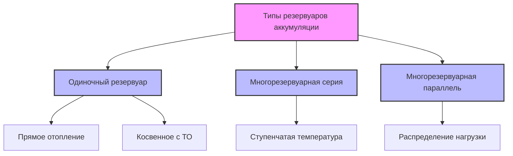
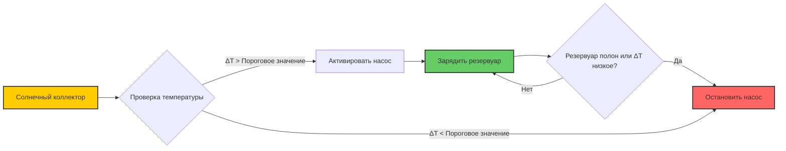

## Обзор

Резервуары тепловой аккумуляции на базе солнечной энергии разделяют сбор солнечной энергии и потребление тепла зданием, обеспечивая непрерывную работу HVAC несмотря на прерывистое солнечное излучение. Резервуар аккумуляции функционирует как тепловой конденсатор, накапливая энергию в периоды высокого солнечного излучения и отдавая её при снижении выходной мощности коллектора ниже требуемой нагрузки. Производительность резервуара критически зависит от тепловой стратификации, эффективности изоляции и стратегий управления зарядкой/разрядкой.

## Основные принципы теплопередачи

### Энергетический баланс

Нестационарный энергетический баланс для резервуара аккумуляции:

$$\rho V c_p \frac{dT}{dt} = \dot{Q}_{solar} - \dot{Q}_{load} - \dot{Q}_{loss}$$

где $\rho$ = плотность воды (кг/м³), $V$ = объем резервуара (м³), $c_p$ = удельная теплоемкость (Дж/кг·К), $T$ = средняя температура резервуара (К), $\dot{Q}_{solar}$ = тепловой вход от коллектора (Вт), $\dot{Q}_{load}$ = передача тепла потребителю (Вт), $\dot{Q}_{loss}$ = потери тепла при стоянии (Вт).

### Потери тепла при стоянии

Потери тепла из изолированного резервуара аккумуляции подчиняются соотношению:

$$\dot{Q}_{loss} = UA(T_{tank} - T_{ambient})$$

где $U$ = общий коэффициент теплопередачи (Вт/м²·К), $A$ = площадь поверхности резервуара (м²). Значение U зависит от толщины изоляции и коэффициента теплопроводности:

$$U = \frac{1}{\frac{1}{h_i} + \frac{t_1}{k_1} + \frac{t_2}{k_2} + \frac{1}{h_o}}$$

где $h_i$ и $h_o$ = коэффициенты конвекции внутри и снаружи (Вт/м²·К), $t$ = толщина слоя изоляции (м), $k$ = коэффициент теплопроводности (Вт/м·К).

## Тепловая стратификация

### Динамика стратификации

Тепловая стратификация—вертикальный градиент температуры внутри резервуара—критична для эффективности солнечной системы. Горячая вода естественно поднимается, а холодная вода опускается, создавая различные температурные слои. Степень стратификации количественно оценивается числом стратификации:

$$St = \frac{T_{top} - T_{bottom}}{T_{mean} - T_{ambient}}$$

Значения St > 0,7 указывают на сильную стратификацию, тогда как St < 0,3 соответствует полностью перемешанным условиям.

### Число Ричардсона

Устойчивость стратификации характеризуется числом Ричардсона:

$$Ri = \frac{g \beta \Delta T H}{v^2}$$

где $g$ = ускорение свободного падения (9,81 м/с²), $\beta$ = коэффициент объемного расширения (1/К), $\Delta T$ = разность температур (К), $H$ = высота резервуара (м), $v$ = характеристическая скорость (м/с). Ri > 1 указывает на устойчивую стратификацию.

## Методология расчета объема резервуара

### Расчет объема

ASHRAE 90.1 и справочник приложений ASHRAE предоставляют руководство по расчету. Минимальный объем хранилища:

$$V = \frac{Q_{daily} \times D}{c_p \rho \Delta T_{usable}}$$

где $Q_{daily}$ = суточная потребность в энергии (Дж), $D$ = дни аккумуляции, $\Delta T_{usable}$ = полезная разность температур (К).

Для жилых систем солнечного нагрева воды типичный расчет составляет 50-75 л на квадратный метр площади коллектора. Для коммерческих систем характерны 25-50 л/м² из-за более постоянных профилей нагрузки.

### Соотношение размеров

Отношение высоты к диаметру влияет на стратификацию. Оптимальные соотношения находятся в диапазоне 2:1 до 4:1. Высокие, узкие резервуары способствуют стратификации, но увеличивают перепад давления при циркуляции. Соотношение между соотношением размеров (AR) и эффективностью стратификации ($\eta_{strat}$) эмпирически выглядит так:

$$\eta_{strat} = 1 - e^{-0.3 \times AR}$$

## Типы конфигурации резервуаров

### Сравнение типов резервуаров

| Конфигурация | Качество стратификации | Требования по площади | Начальная стоимость | Сложность | Применение |
|--------------|------------------------|----------------------|---------------------|-----------|-----------|
| Одиночный вертикальный резервуар | От хорошего до отличного | Умеренное | Низкая | Низкая | Жилые, малые коммерческие |
| Несколько резервуаров в серии | Отличное | Высокое | Умеренная | Умеренная | Крупные системы с переменными нагрузками |
| Резервуар с внутренним ТО | Хорошее | Низкое | Умеренная | Низкая | Закрытые системы с антифризом |
| Напорный резервуар | Умеренное | Низкое | Высокая | Умеренная | Высокие здания |
| Атмосферный резервуар | Отличное | Высокое | Низкая | Низкая | Крупные коммерческие системы |

## Конструктивные особенности для повышения производительности

### Конфигурация входа/выхода

Правильное расположение портов необходимо для поддержания стратификации:

- **Вход из коллектора**: Расположен на высоте 75-85% объема резервуара для закрытых систем
- **Возврат из коллектора**: Нижнее соединение с диффузором
- **Подача потребителю**: Верхние 90-95% объема резервуара
- **Возврат потребителя**: Нижняя треть с устройством стратификации

### Устройства стратификации

Множество технологий улучшают или сохраняют стратификацию:

- **Диффузоры**: Снижают скорость струи на входе, предотвращая перемешивание
- **Тканевые стратификаторы**: Гибкие мембраны, создающие физическое разделение
- **Перегородки**: Горизонтальные пластины, препятствующие вертикальному потоку
- **Входные трубы с перфорацией**: Равномерно распределяют поток

Эффективность диффузора характеризуется коэффициентом перемешивания:

$$MF = \frac{\Delta T_{actual}}{\Delta T_{ideal}}$$

Значения, близкие к 1,0, указывают на минимальное перемешивание.

## Требования к изоляции

### Анализ потерь тепла

Стандарт ASHRAE 90.1 предусматривает минимальные значения RSI для резервуаров аккумуляции. Для солнечных приложений экономически оправданы более высокие уровни изоляции. Срок окупаемости дополнительной изоляции:

$$PBP = \frac{C_{insulation}}{\Delta Q_{loss} \times \eta_{sys} \times C_{energy} \times H_{annual}}$$

где $C_{insulation}$ = добавочная стоимость изоляции, $\Delta Q_{loss}$ = снижение скорости потерь тепла, $\eta_{sys}$ = эффективность системы, $C_{energy}$ = стоимость энергии, $H_{annual}$ = годовые рабочие часы.

### Рекомендуемые значения RSI

| Объем резервуара (л) | Климатическая зона | Минимальное значение RSI (м²·К/Вт) | Типичная толщина изоляции (мм) |
|---------------------|-------------------|-------------------------------------|--------------------------------|
| < 500 | Все | 2,1 | 75-100 |
| 500-2000 | Отопительный климат | 2,6 | 100-125 |
| 500-2000 | Умеренный климат | 2,1 | 75-100 |
| > 2000 | Отопительный климат | 3,5 | 125-150 |
| > 2000 | Умеренный климат | 2,6 | 100-125 |

## Выбор материалов

### Конструкция резервуара

Выбор материала сбалансирован между коррозионной стойкостью, термальным расширением и стоимостью:

- **Стальной с эмалевым покрытием**: Отличная коррозионная стойкость, требует замены анода
- **Нержавеющая сталь**: Долгий срок службы, высокая стоимость, подходит для высокотемпературных приложений
- **Сталь с полимерным покрытием**: Хорошая защита от коррозии, температурное ограничение 90°C
- **Бетон**: Очень большие объемы (>10 000 л), требует гидроизоляционного покрытия

### Защита от коррозии

Резервуары солнечной аккумуляции работают при повышенных температурах, ускоряющих коррозию. Методы защиты включают:

- Жертвенные аноды (магний или алюминий)
- Катодная защита с наложенным током
- Ингибиторы коррозии в теплоносителе системы
- Контроль pH (поддерживать 7,5-8,5)

## Интеграция с солнечными коллекторами

### Управление температурой

Температура на выходе коллектора должна быть управляема, чтобы предотвратить перегрев:

$$T_{col,out} = T_{tank,top} + \frac{\dot{Q}_{col}}{\dot{m} c_p}$$

Когда $T_{col,out}$ превышает пределы проектирования (обычно 95-110°C для систем с гликолем), требуется модуляция потока или отвод тепла.

### Стратегии зарядки

Дифференциальный температурный контроллер активирует циркуляцию, когда:

$$\Delta T = T_{collector} - T_{tank,low} > \Delta T_{on}$$

Типичные значения $\Delta T_{on}$ = 8-10°C, $\Delta T_{off}$ = 3-5°C.

## Показатели производительности

### Эффективность аккумуляции

Общая эффективность аккумуляции за цикл зарядки/разрядки:

$$\eta_{storage} = \frac{Q_{delivered}}{Q_{stored}} = 1 - \frac{\int \dot{Q}_{loss} dt}{Q_{stored}}$$

Хорошо спроектированные резервуары достигают $\eta_{storage}$ = 0,85-0,95 за 24-часовые циклы.

### Анализ эксергии

Эксергия (доступная работа), накопленная в резервуаре при температуре T:

$$Ex = mc_p\left[(T - T_0) - T_0\ln\frac{T}{T_0}\right]$$

где $T_0$ = температура окружающей среды (К). Этот показатель учитывает качество накопленной энергии, а не только её количество.

## Техническое обслуживание и мониторинг

Критические точки мониторинга включают:

- Датчики температуры на нескольких высотах (минимум 3 места)
- Испытание предохранительного клапана (ежегодно)
- Проверка анода (ежегодно для эмалированных резервуаров)
- Промывка отложений (ежегодно или полугодово)
- Целостность изоляции (визуальный осмотр ежегодно)

Размещение датчиков температуры на высоте 10%, 50% и 90% объема резервуара позволяет мониторить стратификацию и обнаруживать неисправности.

## Стандарты и требования норм

- **ASHRAE 90.1**: Требования энергоэффективности для тепловой аккумуляции
- **ASHRAE 62.1**: Контроль легионеллы для хранения горячей воды для хозяйственных нужд
- **ASME Section VIII**: Проектирование сосудов под давлением для напорных резервуаров
- **NSF/ANSI 61**: Материалы контактирующие с питьевой водой
- **SRCC OG-300**: Сертификация систем солнечного отопления

Резервуары, хранящие воду выше 60°C, требуют снижения риска легионеллы посредством периодических циклов пастеризации или непрерывной циркуляции.

---

*Это содержание отражает установленные инженерные принципы проектирования и эксплуатации резервуаров тепловой аккумуляции на базе солнечной энергии, задокументированные в справочниках ASHRAE и отраслевых стандартах.*
