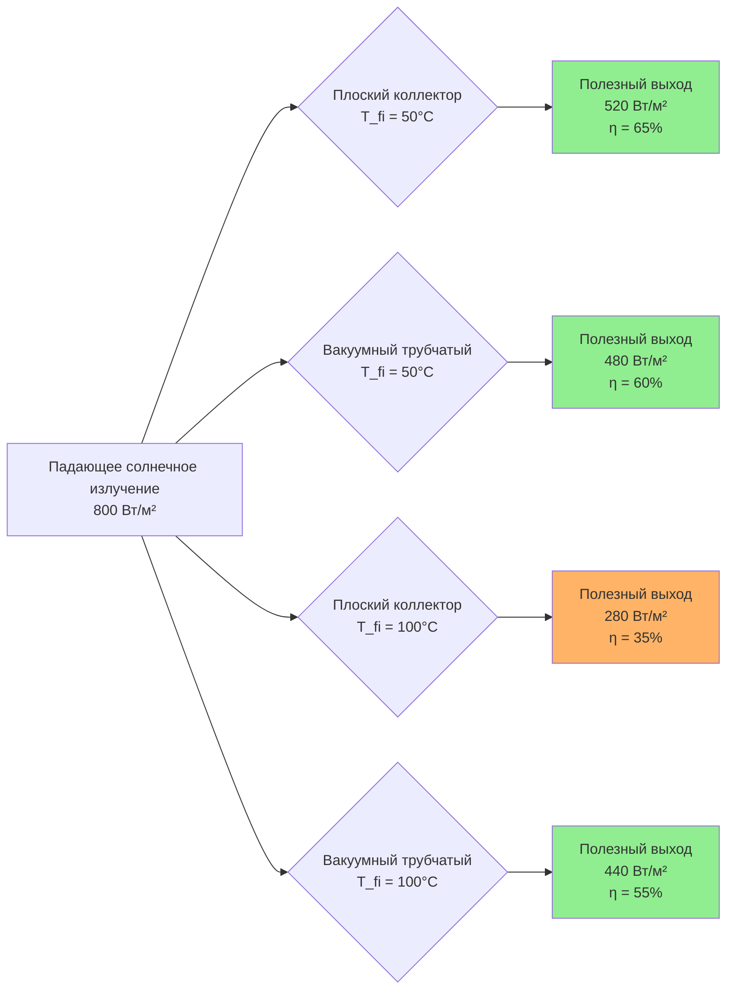

Солнечные тепловые коллекторы преобразуют падающее солнечное излучение в тепловую энергию для применения в системах HVAC, включая отопление помещений, горячее водоснабжение, абсорбционное охлаждение и технологический нагрев. Фундаментальная задача при проектировании коллектора состоит в максимизации поглощения солнечной энергии при минимизации тепловых потерь в окружающую среду.

## Классификация коллекторов

Солнечные тепловые коллекторы классифицируются по коэффициенту концентрации, диапазону рабочей температуры и требованиям к отслеживанию:

| Тип коллектора | Коэффициент концентрации | Рабочая температура (°C) | Требуется отслеживание |
|---|---|---|---|
| Плоский | 1 | 30–80 | Нет |
| Вакуумный трубчатый | 1 | 50–150 | Нет |
| Составной параболический (CPC) | 1,5–5 | 60–180 | По выбору |
| Параболический желоб | 15–45 | 150–400 | Одноосное |
| Параболическая тарелка | 100–1000 | 400–1500 | Двухосное |
| Центральный приёмник | 300–1500 | 500–1200 | Двухосное |

Приложения HVAC преимущественно используют неконцентрирующие коллекторы (плоские и вакуумные трубчатые) благодаря их способности захватывать рассеянное излучение, исключать механизмы отслеживания и эффективно работать в разнообразных климатических условиях.

## Фундаментальный энергетический баланс

Тепловые характеристики любого солнечного коллектора подчиняются уравнению энергетического баланса:

$$Q_u = A_c [G_T (\tau\alpha) - U_L(T_c - T_a)]$$

Где:
- $Q_u$ = полезный тепловой выход (Вт)
- $A_c$ = полная площадь коллектора (м²)
- $G_T$ = полная солнечная облучённость на плоскости коллектора (Вт/м²)
- $\tau\alpha$ = произведение пропускания и поглощения
- $U_L$ = общий коэффициент тепловых потерь (Вт/м²·К)
- $T_c$ = средняя температура коллектора (°C)
- $T_a$ = температура окружающего воздуха (°C)

Величина $G_T(\tau\alpha)$ представляет поглощённую солнечную энергию, а $U_L(T_c - T_a)$ количественно определяет тепловые потери через теплопроводность, конвекцию и радиацию.

## Оптические свойства

Оптическая эффективность солнечного коллектора зависит от взаимодействия между падающим излучением и материалами коллектора посредством процессов пропускания, поглощения и отражения.

**Пропускание глазури:**
Солнечное излучение должно пройти через материал глазури, прежде чем достичь абсорбера. Низкожелезистое закалённое стекло достигает значений пропускания:

$$\tau = \tau_r \cdot \tau_a \cdot \tau_d$$

Где:
- $\tau_r$ = пропускание с учётом потерь на отражение (≈ 0,92 для одинарного остекления)
- $\tau_a$ = пропускание с учётом поглощения в стекле (≈ 0,98)
- $\tau_d$ = пропускание с учётом рассеяния и дефектов (≈ 0,99)

Типичные одинарно остекленённые системы достигают $\tau$ = 0,90, в то время как двойное остекление снижает значение до $\tau$ = 0,82 из-за дополнительных потерь на отражение и поглощение.

**Поглощающая способность абсорбера:**
Покрытие пластины абсорбера определяет долю падающего излучения, преобразуемого в тепловую энергию. Селективные покрытия максимизируют солнечную поглощающую способность ($\alpha$) в видимом спектре (0,3–0,7 мкм), минимизируя при этом тепловую излучательную способность ($\varepsilon$) в инфракрасном спектре (>2,5 мкм).

Распространённые технологии селективных покрытий включают:

| Тип покрытия | Поглощающая способность (α) | Излучательная способность (ε) | Соотношение α/ε | Температура стабильности (°C) |
|---|---|---|---|---|
| Чёрная краска | 0,95 | 0,90 | 1,06 | 100 |
| Чёрный хром | 0,95 | 0,10 | 9,5 | 250 |
| Чёрный никель | 0,93 | 0,08 | 11,6 | 200 |
| Кермет (Al-N) | 0,96 | 0,05 | 19,2 | 400 |
| TiNOₓ | 0,95 | 0,04 | 23,8 | 450 |

Эффективное произведение пропускания и поглощения учитывает множественные отражения между глазурью и абсорбером:

$$(\tau\alpha) = \frac{\tau \alpha}{1-(1-\alpha)\rho_d}$$

Где $\rho_d$ — диффузная отражательная способность глазури (≈ 0,16 для стекла).

## Механизмы тепловых потерь

Тепловые потери из коллектора в окружающую среду происходят через три различных механизма, действующих параллельно.

**Верхние потери (конвекция и радиация):**
Коэффициент верхних потерь объединяет конвективный теплообмен с окружающим воздухом и радиационный обмен с небом:

$$U_t = \left[\frac{1}{h_c + h_r}\right]^{-1}$$

Коэффициент конвективного теплообмена изменяется в зависимости от скорости ветра:

$$h_c = 5,7 + 3,8V_w$$

Где $V_w$ = скорость ветра (м/с).

Радиационный теплообмен между абсорбером и глазурью следует уравнению:

$$h_r = \varepsilon \sigma \frac{(T_p^2 + T_g^2)(T_p + T_g)}{(1/\varepsilon_p + 1/\varepsilon_g - 1)}$$

Где:
- $\varepsilon_p$ = излучательная способность абсорбера
- $\varepsilon_g$ = излучательная способность глазури (≈ 0,88 для стекла)
- $\sigma$ = постоянная Стефана-Больцмана (5,67×10⁻⁸ Вт/м²·К⁴)
- $T_p$, $T_g$ = абсолютные температуры абсорбера и глазури (К)

**Нижние и боковые потери:**
Потери тепла через теплопроводность в изоляции рассчитываются из:

$$U_b = \frac{k}{L}$$

Где $k$ = теплопроводность изоляции (Вт/м·К) и $L$ = толщина изоляции (м). Стандартные конструкции используют 50–100 мм минеральной ваты ($k$ ≈ 0,04 Вт/м·К) или пенополиуретана ($k$ ≈ 0,025 Вт/м·К), что дает $U_b$ = 0,4–0,8 Вт/м²·К.

Общий коэффициент потерь объединяет компоненты:

$$U_L = U_t + U_b + U_e$$

Типичные значения для плоских коллекторов: $U_L$ = 3,5–5,0 Вт/м²·К.

## Эффективность коллектора

Стандарт ASHRAE 93 определяет мгновенную тепловую эффективность как отношение полезного теплового выхода к падающему солнечному излучению:

$$\eta = \frac{Q_u}{A_c G_T} = F_R(\tau\alpha) - F_R U_L \frac{T_{fi} - T_a}{G_T}$$

Коэффициент съёма тепла ($F_R$) учитывает повышение температуры теплоносителя и неидеальный теплообмен от абсорбера к жидкости:

$$F_R = \frac{\dot{m} c_p}{A_c U_L}\left[1 - \exp\left(-\frac{A_c U_L F'}{\dot{m} c_p}\right)\right]$$

Где:
- $\dot{m}$ = массовый расход (кг/с)
- $c_p$ = удельная теплоёмкость жидкости (Дж/кг·К)
- $F'$ = коэффициент эффективности коллектора

Уравнение эффективности линейно по переменной приведённой температуры:

$$T^* = \frac{T_{fi} - T_a}{G_T}$$

Построение графика эффективности в зависимости от $T^*$ дает прямую линию с:
- Ординатой в начале координат = $F_R(\tau\alpha)$ (оптическая эффективность)
- Наклон = $-F_R U_L$ (коэффициент потерь тепла)

**Сравнение характеристик при G_T = 800 Вт/м², T_a = 20°C:**

При низких рабочих температурах ($T^*$ < 0,05) плоские коллекторы достигают сопоставимой или превосходящей эффективности вакуумных трубчатых. При повышенных температурах ($T^*$ > 0,10) вакуумные трубчатые коллекторы сохраняют значительно более высокую эффективность благодаря снижению конвективных потерь.

## Конструкция плоского коллектора

Плоские коллекторы состоят из чёрной пластины абсорбера с интегрированными или присоединёнными проточными каналами, прозрачной глазури и изолированного корпуса. Геометрия абсорбера существенно влияет на тепловые и гидравлические характеристики.

**Варианты конфигурации потока:**

1. **Трубка и лист**: Медные трубки, припаянные к алюминиевому или медному листу
2. **Трубка в полосе**: Проточные каналы, образованные двухслойной прокаткой металлических полос
3. **Змеевик**: Единая непрерывная трубка, следующая зигзагообразному шаблону
4. **Параллельный поток**: Несколько подъёмов, соединённых с входными/выходными коллекторами

Эффективность оребрения связывает теплопередачу от пластины абсорбера к трубкам жидкости:

$$F = \frac{\tanh[m(W/2)]}{m(W/2)}$$

Где:
- $W$ = расстояние между трубками (м)
- $m = \sqrt{U_L/(k_p \delta)}$
- $k_p$ = теплопроводность абсорбера (Вт/м·К)
- $\delta$ = толщина абсорбера (м)

Для медных абсорберов ($k_p$ = 385 Вт/м·К, $\delta$ = 0,5 мм, $W$ = 120 мм), эффективность оребрения превышает 0,95, обеспечивая эффективный теплосъём по всей площади пластины.

## Модификатор угла падения

Оптические свойства глазури и абсорбера изменяются в зависимости от угла падения солнечного излучения. Модификатор угла падения (IAM) количественно определяет деградацию эффективности при ненормальном падении:

$$K_{\tau\alpha}(\theta) = \frac{(\tau\alpha)_\theta}{(\tau\alpha)_n}$$

Где $\theta$ = угол между солнечным лучом и нормалью к коллектору.

Испытания по ASHRAE 93 определяют IAM при углах падения 30°, 45° и 60°. Распространённое эмпирическое соотношение:

$$K_{\tau\alpha}(\theta) = 1 - b_0\left(\frac{1}{\cos\theta} - 1\right)$$

Типичные значения: $b_0$ = 0,10–0,15 для одинарно остекленённых плоских коллекторов, $b_0$ = 0,05–0,08 для вакуумных трубчатых коллекторов с цилиндрическими абсорберами.

## Испытания и сертификация

Стандарт ASHRAE 93-2010 устанавливает процедуры испытаний для определения тепловых характеристик. Испытания проводятся в контролируемых условиях:

- Солнечная облучённость: 800–1000 Вт/м² на плоскости коллектора
- Угол падения: <30° при испытании эффективности
- Скорость ветра: 2,2–4,5 м/с
- Температура окружающей среды: варьируется для достижения диапазона $(T_{fi} - T_a)$

Корпорация Solar Rating and Certification Corporation (SRCC) управляет сертификацией OG-100, требующей:
- Испытания производительности по ASHRAE 93
- Испытания на долговечность (термоциклирование, проникновение дождя, устойчивость к ударам)
- Оценка материалов
- Инспекция обеспечения качества

Рейтинги SRCC предоставляют стандартизированные данные о производительности при указанных рабочих условиях, позволяя проводить сравнение между производителями.

## Критерии выбора коллектора

Выбор типа коллектора зависит от требований приложения и местных климатических условий:

**Плоские коллекторы предпочтительны при:**
- Рабочих температурах < 70°C (горячее водоснабжение, подогрев бассейнов)
- Высокой доле рассеянного излучения (облачные климаты)
- Требовании недорогих решений (200–400 $/м²)
- Приоритетах простоты установки и обслуживания
- Кровельных жилых приложениях

**Вакуумные трубчатые коллекторы предпочтительны при:**
- Рабочих температурах > 80°C (абсорбционное охлаждение, технологический нагрев)
- Холодных температурах окружающей среды с тепловыми нагрузками
- Ограниченной площади крыши требуется максимальный выход на м²
- Проблематичном скоплении снега на плоских поверхностях
- Приемлемости более высоких капитальных вложений (400–700 $/м²)

**Матрица принятия решения:**

| Параметр | Преимущество плоского | Преимущество вакуумного трубчатого |
|---|---|---|
| Стоимость за м² | ✓ | |
| Эффективность при низкой температуре | ✓ | |
| Эффективность при высокой температуре | | ✓ |
| Холодный климат | | ✓ |
| Рассеянное излучение | ✓ | |
| Ветроустойчивость | | ✓ |
| Сброс снега | | ✓ |
| Защита от перегрева | ✓ | |
| Затраты на замену | ✓ | |

## Соображения интеграции

Эффективная интеграция солнечных коллекторов в системы HVAC требует внимания к гидравлическому, тепловому и управляющему проектированию:

**Выбор расхода:**
Оптимальный расход уравновешивает высокий съём тепла (высокий расход) против энергии насоса (низкий расход). Стандартная практика: 0,015–0,020 кг/с на м² площади коллектора.

**Теплоноситель:**
- Вода: Наименьшая стоимость, лучшие тепловые свойства, требует защиты от замерзания
- Пропиленгликоль (30–50%): Защита от замерзания до -30°C, снижение теплопередачи
- Этиленгликоль: Превосходная тепловая производительность, токсичен, избегать в системах питьевого водоснабжения

**Перепад давления:**
Общий перепад давления в системе коллекторов не должен превышать пропускную способность насоса. Коллекторы, соединённые последовательно, накапливают перепад давления линейно; параллельные системы снижают расход на каждый участок, но усложняют балансировку.

**Защита от застоя:**
При отключении питания или низких нагрузках коллекторы достигают температуры застоя (150–250°C). Системы требуют:
- Предохранительные клапаны, рассчитанные на условия застоя
- Расширительные бачки, рассчитанные на полное испарение жидкости
- Трубопроводы и фитинги, пригодные для высоких температур
- Составы на основе гликоля, стабильные при максимальной температуре

Стандарт ASHRAE 90.1 требует защиты от перегрева для всех систем солнечного теплоснабжения площадью более 6 м².

## Стандарты и справочные материалы

- **ASHRAE 93-2010**: Методы испытаний для определения тепловых характеристик солнечных коллекторов
- **ASHRAE 90.1-2019**: Энергетический стандарт для зданий, кроме малоэтажных жилых зданий
- **ASHRAE 191-2020**: Стандарт для мониторинга систем солнечного теплоснабжения
- **ISO 9806**: Солнечная энергия — Солнечные тепловые коллекторы — Методы испытаний
- **SRCC OG-100**: Рекомендации по эксплуатации и минимальные стандарты для сертификации солнечных коллекторов

Солнечные тепловые коллекторы обеспечивают проверенную технологию для снижения потребления ископаемого топлива в приложениях HVAC. Успешная реализация требует понимания физики, определяющей оптическую эффективность и тепловые потери, правильного выбора на основе требований рабочей температуры и интеграционного проектирования, учитывающего защиту от замерзания, перегрева и управления.
