## Принципы концентрации

Концентрирующие солнечные тепловые коллекторы используют отражающую или преломляющую оптику для фокусирования прямой нормальной облучённости (DNI) на небольшой приёмник, достигая плотности потока в 10-1000 раз выше, чем некконцентрирующие коллекторы. Такая концентрация позволяет работать при температурах от 150°C до более 500°C, что пригодно для промышленной тепловой обработки, выработки электроэнергии и двухступенчатого абсорбционного охлаждения.

Фундаментальный коэффициент концентрации характеризует производительность оптической системы:

$$C = \frac{A_{апертуры}}{A_{приёмника}}$$

Где:
- C = геометрический коэффициент концентрации (безразмерный)
- A_апертуры = общая отражающая/преломляющая площадь (м²)
- A_приёмника = площадь поверхности поглотителя (м²)

Максимальная теоретическая концентрация следует из второго закона термодинамики и ограничена углом приёма:

$$C_{макс} = \frac{1}{\sin^2 \theta_a}$$

Для θ_a = 0,27° (угловой радиус Солнца), C_макс ≈ 46 200 для трёхмерной концентрации (точечный фокус) и C_макс ≈ 215 для двумерной концентрации (линейный фокус).

## Параболические жёлоба

Параболические желобные коллекторы (ПЖК) представляют наиболее зрелую концентрирующую технологию для приложений HVAC. Параболический отражатель фокусирует DNI на эвакуированную приёмную трубу, расположенную вдоль фокальной линии.

### Оптическая геометрия

Геометрия параболы следует уравнению:

$$y^2 = 4fx$$

Где f — фокусное расстояние. Краевой угол φ_r определяет глубину параболы относительно ширины апертуры:

$$\phi_r = \tan^{-1}\left(\frac{W}{4f}\right)$$

Типичные краевые углы варьируются от 70° до 90°. Коэффициент концентрации параболического жёлоба:

$$C = \frac{W}{d_{трубы} + 2\delta}$$

Где:
- W = ширина апертуры (м)
- d_трубы = наружный диаметр приёмной трубы (м)
- δ = допуск на ошибку слежения (м)

Практические коэффициенты концентрации: 15-80 для параболических желобов с одноосным слежением.

### Конструкция приёмной трубы

```mermaid
graph LR
    subgraph "Поперечное сечение приёмной трубы ПЖК"
        A[Селективное покрытие<br/>α > 0.95, ε < 0.10] --> B[Стальная поглощающая труба<br/>70-100 мм НД]
        B --> C[Вакуумный зазор<br/>10⁻⁴ до 10⁻⁵ Па]
        C --> D[Стеклянная оболочка<br/>115-125 мм НД]
        D --> E[Антиотражающее покрытие<br/>τ > 0.96]
    end

    style A fill:#2c3e50
    style B fill:#7f8c8d
    style C fill:#ecf0f1
    style D fill:#3498db
```

Эвакуированный приёмник минимизирует конвективные потери при сохранении структурной целостности при рабочих температурах 300-400°C. Селективное поглощающее покрытие достигает высокой солнечной поглощательной способности (α > 0,95) и низкой тепловой излучательности (ε < 0,10 при 400°C).

### Тепловая производительность

Полезный тепловой выход на единицу площади апертуры:

$$Q_u = A_{ап} [G_{DNI} \eta_o - U_L(T_p - T_a)]$$

Где:
- G_DNI = прямая нормальная облучённость (Вт/м²)
- η_o = оптическая эффективность (обычно 0,70-0,75)
- U_L = коэффициент теплопотерь приёмника (Вт/м·К на единицу длины)
- T_p = температура приёмника (K)
- T_a = температура окружающей среды (K)

Оптическая эффективность учитывает потери на отражение, прозрачность стеклянной оболочки и геометрические факторы:

$$\eta_o = \rho \tau \gamma \alpha K(\theta)$$

Где:
- ρ = отражательная способность зеркала (0,93-0,95 для серебристого стекла)
- τ = прозрачность стеклянной оболочки (0,96)
- γ = коэффициент перехвата (0,92-0,98)
- α = поглощательная способность поглотителя (0,95)
- K(θ) = модификатор угла падения

**Типичные параметры производительности:**

| Параметр | Значение | Условие эксплуатации |
|-----------|----------|-------------------|
| Пиковая эффективность | 65-72% | Нормальное падение, 300°C |
| Диапазон рабочих температур | 150-400°C | Ограничение теплоносителя |
| Коэффициент концентрации | 25-80 | Стандартные конструкции |
| Тепловые потери | 150-350 Вт/м | При температуре приёмника 350°C |
| Годовая эффективность | 45-55% | Включая потери на слежение |

### Системы слежения

Одноосное слежение ориентирует коллектор для поддержания положения Солнца перпендикулярно оси параболы. Ориентация оси север-юг максимизирует годовой сбор энергии, но подвергается косинусным потерям:

$$G_{эфф} = G_{DNI} \cos(\theta_z)$$

Где θ_z — компонента зенитного угла, перпендикулярная оси коллектора.

Слежение с востока на запад исключает сезонные эффекты склонения, но снижает летнюю производительность. Оптимальная ориентация зависит от широты и профиля нагрузки.

## Линейные концентраторы Френеля

Линейные концентраторы Френеля (ЛКФ) аппроксимируют параболическую концентрацию, используя множество плоских или слегка изогнутых зеркальных сегментов, которые отслеживаются независимо для фокусирования на неподвижный приподнятый приёмник.

### Компромисс между стоимостью и эффективностью

Системы ЛКФ снижают затраты благодаря:
- Плоским зеркальным сегментам (более низкие производственные затраты)
- Неподвижной структуре приёмника (исключает гибкие шланги)
- Сниженной ветровой нагрузке (ближе к земле)
- Упрощённому механизму слежения

Снижения производительности включают:
- Более низкий коэффициент концентрации (15-40 против 25-80 для ПЖК)
- Косинусные потери от плоских зеркал
- Блокировку и затенение между рядами зеркал

Оптическая эффективность для ЛКФ:

$$\eta_{o,ЛКФ} = \rho \tau \gamma \alpha \cos(\theta_t) f_{блок} f_{тень}$$

Где:
- θ_t = угол слежения для каждого зеркального сегмента
- f_блок = коэффициент блокировки (0,85-0,95)
- f_тень = коэффициент затенения (0,90-0,98)

Типичная оптическая эффективность ЛКФ: 55-65% в сравнении с 70-75% для ПЖК.

### Вторичный концентратор

Многие конструкции ЛКФ включают составной параболический концентратор (СПК) в качестве вторичного отражателя вокруг приёмной трубы. СПК увеличивает эффективный угол приёма, снижая требования точности слежения:

$$\theta_{приём} = \sin^{-1}\left(\frac{1}{C_{вторичная}}\right)$$

Коэффициент вторичной концентрации 1,5-2,0 позволяет допуск слежения ±1° при сохранении коэффициентов перехвата выше 0,90.

## Параболические тарелки

Параболические системы тарелок достигают наивысших коэффициентов концентрации (500-3000) благодаря трёхмерной геометрии точечного фокуса. Двухосное слежение поддерживает нормальное падение в течение дня.

### Производительность концентрации

Коэффициент концентрации тарелки:

$$C = \frac{\pi D^2 / 4}{\pi d_{пр}^2 / 4} = \left(\frac{D}{d_{пр}}\right)^2$$

Для тарелки диаметром 10 м с приёмником диаметром 0,15 м:

$$C = \left(\frac{10}{0,15}\right)^2 = 4444$$

Такая экстремальная концентрация производит температуры приёмника, превышающие 800°C, что позволяет интегрировать двигатель Стирлинга или генерировать перегретый пар.

### Коэффициент перехвата

Не всё отражённое излучение достигает приёмника из-за оптических несовершенств и формы Солнца. Коэффициент перехвата γ связан с ошибкой слежения σ_слеж, ошибкой наклона зеркала σ_наклон и угловым размером приёмника:

$$\gamma = \exp\left[-\frac{(\theta_{пр}/2)^2}{2(\sigma_{итог}^2 + \sigma_{солнце}^2)}\right]$$

Где:

$$\sigma_{итог} = \sqrt{4\sigma_{наклон}^2 + \sigma_{слеж}^2}$$

Для σ_наклон = 2 мрад, σ_слеж = 1 мрад и θ_пр = 20 мрад, коэффициент перехвата γ ≈ 0,97.

## Требования к прямой нормальной облучённости

Концентрирующие коллекторы реагируют только на DNI — часть солнечного излучения, поступающую из прямого луча Солнца. Рассеянное и цирконсолярное излучение не может быть сфокусировано и представляет потерянную энергию.

Соотношение между глобальной горизонтальной облучённостью (GHI), DNI и рассеянной горизонтальной облучённостью (DHI):

$$GHI = DNI \cos(\theta_z) + DHI$$

Концентрирующие коллекторы требуют мест с высокой годовой суммой DNI:
- Отличные: >2400 кВт·ч/м²·год (юго-западная часть США, Ближний Восток, Северная Африка)
- Хорошие: 2000-2400 кВт·ч/м²·год (Испания, Австралия, Южная Африка)
- Предельные: 1600-2000 кВт·ч/м²·год (южная Франция, южная Италия)
- Неблагоприятные: <1600 кВт·ч/м²·год (северная Европа, северо-восточная часть США)

Облачность, влажность и аэрозольная нагрузка резко снижают DNI, при этом минимально влияя на рассеянное излучение, что делает концентрирующие системы непригодными для влажного или часто облачного климата.

## Теплоносители

Высокотемпературная эксплуатация требует специализированных теплоносителей:

**Синтетическое масло (Therminol VP-1, Dowtherm A)**
- Диапазон температур: 12-400°C
- Термическая стабильность: разлагается выше 400°C
- Давление пара: низкое (<100 кПа при 400°C)
- Требует азотного экрана
- Стандарт для коммерческих систем ПЖК

**Расплавленная соль (60% NaNO₃, 40% KNO₃)**
- Диапазон температур: 238-565°C (жидкая фаза)
- Отличная термическая стабильность
- Высокая теплоёмкость: 1550 Дж/кг·К
- Низкое давление пара
- Требует защиты от замерзания ниже 238°C
- Позволяет интегрировать накопление тепловой энергии

**Вода/пар**
- Прямое генерирование пара в приёмнике
- Диапазон температур: 100-500°C при повышенном давлении
- Отсутствие потерь в теплообменнике
- Осложнения двухфазного потока
- Используется в некоторых конструкциях ЛКФ

Выбор теплоносителя влияет на системную эффективность через коэффициент теплоудаления коллектора F_R:

$$F_R = \frac{\dot{m} c_p}{A_{ап} U_L} \left[1 - \exp\left(-\frac{A_{ап} U_L}{\dot{m} c_p}\right)\right]$$

Более высокая тепловая ёмкость жидкости улучшает F_R, но увеличивает требования к мощности насоса.

## Приложения HVAC

### Технологический обогрев

Концентрирующие коллекторы поставляют промышленное технологическое тепло при температурах, недостижимых для плоских или эвакуированных трубчатых коллекторов:

| Приложение | Диапазон температур | Тип коллектора |
|-----------|-------------------|----------------|
| Пищевая промышленность | 120-180°C | ПЖК, ЛКФ |
| Текстильное крашение | 140-200°C | ПЖК, ЛКФ |
| Химическое производство | 180-300°C | ПЖК |
| Опреснение (MED) | 60-90°C многоступенчатое | ЛКФ с оптимизацией на низкие температуры |
| Генерирование пара | 180-350°C | ПЖК, ЛКФ |

### Абсорбционное охлаждение

Двухступенчатые абсорбционные чиллеры LiBr-вода требуют температур генератора 140-180°C, что соответствует выходу ПЖК и высокопроизводительных ЛКФ. Коэффициент производительности солнечного охлаждения:

$$COP_{солнечн} = \eta_{коллектор} \times COP_{чиллер}$$

Для η_коллектор = 0,55 и COP_чиллер = 1,2:

$$COP_{солнечн} = 0,55 \times 1,2 = 0,66$$

Это благоприятно сравнивается с приводимым фотоэлектрикой испарительным охлаждением (η_ФЭ × COP_ИО = 0,18 × 3,5 = 0,63) в областях с высокой DNI, особенно с учётом потерь электропередачи и пиковых тарифов на спрос.

## Стандарты и испытания

**ASHRAE 93-2010** процедуры испытания применяются к концентрирующим коллекторам с модификациями для требований слежения. Ключевые метрики включают:

- Мгновенная эффективность при нормальном падении
- Модификатор угла падения K(θ)
- Постоянная времени для теплового отклика
- Проверка коэффициента перехвата

**ASTM E905** предусматривает конкретные методы испытания для коллекторов со слежением, включая:
- Определение оптической эффективности
- Характеризацию тепловых потерь при повышенных температурах
- Измерение точности слежения

Согласно **ASHRAE 90.1-2019** раздел 6.5.5, концентрирующие солнечные тепловые системы должны включать:
- Защиту от избыточного давления, рассчитанную на условия стагнации
- Защиту от замерзания для теплоносителей
- Автоматическое дефокусирование при неисправности оборудования
- Размещение термического расширения в трубопроводах

## Сравнение производительности

| Тип коллектора | Коэффициент концентрации | Рабочая температура | Годовая эффективность | Требование DNI | Капитальная стоимость |
|---------------|-------------------------|-------------------|----------------------|----------------|----------------------|
| Параболический жёлоб | 25-80 | 150-400°C | 45-55% | Высокое | $200-350/м² |
| Линейный Френель | 15-40 | 120-300°C | 35-45% | Высокое | $150-250/м² |
| Параболическая тарелка | 500-3000 | 300-800°C | 55-70% | Очень высокое | $300-500/м² |
| Эвакуированная труба | 1 | 50-150°C | 40-60% | Низкое-среднее | $400-700/м² |

Концентрирующие коллекторы достигают экономической жизнеспособности, когда высокотемпературная тепловая энергия имеет премиальную стоимость — либо вытесняя дорогостоящие ископаемые топлива в технологической обработке, либо позволяя высокоэффективные термодинамические циклы, недоступные для неконцентрирующих технологий. Строгие требования DNI ограничивают развёртывание аридными и полуаридными регионами с годовой суммой DNI, превышающей 2000 кВт·ч/м².
