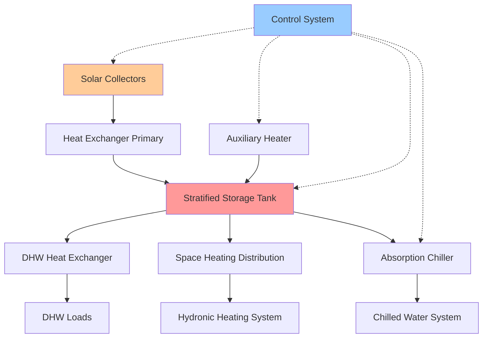

Комбинированные солнечные тепловые системы интегрируют множество функций—отопление помещений, приготовление горячей воды для нужд (ГВН) и потенциально охлаждение—в единые конфигурации, которые максимизируют солнечную долю и улучшают экономическую жизнеспособность. Эти системы требуют сложных стратегий управления и теплового контроля для баланса конкурирующих нагрузок при различных профилях потребления.

## Архитектура системы

Комбинированные системы обычно используют центральный бак теплового аккумулятора со стратификацией для подачи нескольких нагрузок при различных требованиях к температуре. Основной энергетический баланс для многофункциональной солнечной тепловой системы:

$$Q_{solar} = Q_{heating} + Q_{DHW} + Q_{cooling,thermal} + Q_{losses} + \Delta U_{storage}$$

где $Q_{solar}$ представляет собой собранную солнечную энергию, отдельные члены Q представляют тепловые потребности, а $\Delta U_{storage}$ учитывает изменение энергии в аккумуляторе.

### Типы конфигураций

**Последовательная конфигурация:**
Солнечные коллекторы заряжают аккумулятор, который последовательно подает тепло на отопление, ГВН и нагрузки охлаждения через отдельные теплообменники. Такое расположение обеспечивает максимальную тепловую стратификацию, но требует больших объемов аккумулятора.

**Параллельная конфигурация:**
Нагрузки черпают энергию непосредственно из коллекторов при наличии, аккумулятор обеспечивает буферизацию и резервное копирование. Это снижает требования к объему аккумулятора, но нарушает стратификацию и точность управления.

**Гибридная конфигурация:**
ГВН получает приоритетное прямое нагревание от коллекторов, тогда как отопление помещений и охлаждение используют подачу через аккумулятор. Это уравновешивает требования к температуре ГВН (60–71 °C) против более низких температур отопления помещений (32–60 °C).

## Проектирование теплового аккумулятора

Расчет объема аккумулятора для комбинированных систем требует анализа разнообразия нагрузок и временного несоответствия между сбором и потреблением. Расчет емкости аккумулятора:

$$V_{storage} = \frac{(Q_{heating,daily} + Q_{DHW,daily}) \times f_{solar} \times t_{autonomy}}{\rho c_p \Delta T_{usable}}$$

где:
- $V_{storage}$ = объем аккумулятора (м³)
- $Q_{daily}$ = ежедневная тепловая потребность (кДж/сутки)
- $f_{solar}$ = целевая солнечная доля (безразмерная)
- $t_{autonomy}$ = требуемая длительность автономности (сутки)
- $\rho$ = плотность воды (1000 кг/м³)
- $c_p$ = удельная теплоемкость (4.18 кДж/кг·°C)
- $\Delta T_{usable}$ = полезная разница температур (°C)

**Улучшение стратификации:**

Тепловая стратификация поддерживает высокотемпературные зоны для ГВН и абсорбционного охлаждения при сохранении более низких температур для эффективного сбора и отопления помещений. Ключевые устройства стратификации:

- **Внутренние перегородки:** Горизонтальные пластины снижают конвективное перемешивание
- **Диффузорные впускные отверстия:** Распределение с низкой скоростью сохраняет температурные слои
- **Внешние теплообменники:** Исключают конвекцию, вызванную внутренней спиралью
- **Управление зарядкой по температуре:** Управляющие клапаны направляют поток на соответствующие уровни бака

Число Ричардсона характеризует стабильность стратификации:

$$Ri = \frac{g \beta \Delta T H}{u^2}$$

Поддерживайте $Ri > 10$ для обеспечения стабильной стратификации, где $g$ — ускорение свободного падения, $\beta$ — коэффициент теплового расширения, $\Delta T$ — вертикальная разница температур, $H$ — высота бака, $u$ — характеристическая скорость.

## Управление нагрузками и контроль

Комбинированные системы требуют иерархических стратегий управления, которые расставляют приоритеты в нагрузках на основе требований к температуре и срочности.

### Иерархия управления

| Приоритет | Тип нагрузки | Диапазон температур | Стратегия управления |
|-----------|-----------|-------------------|------------------|
| 1 | ГВН | 60–71 °C | Прямое солнечное при наличии, резервное вспомогательное |
| 2 | Абсорбционное охлаждение | 71–93 °C | График с предварительным нагревом аккумулятора |
| 3 | Отопление помещений | 32–60 °C | На основе аккумулятора с компенсацией погоды |
| 4 | Зарядка аккумулятора | Переменная | Дифференциальное управление с логикой стратификации |

**Дифференциальное управление температурой:**

Активация насоса коллектора на основе дифференциала температур между выходом коллектора и возвратом аккумулятора:

$$\Delta T_{on} = T_{collector} - T_{storage,return} > \Delta T_{threshold,on}$$

Типичные пороги: $\Delta T_{on}$ = 8–11 °C, $\Delta T_{off}$ = 3–4 °C (гистерезис предотвращает циклирование).

**График нагрузок:**

Для систем с абсорбционным охлаждением предварительный нагрев аккумулятора до повышенных температур (82–93 °C) в периоды высокой солнечной радиации позволяет работать охладителю во время пикового дневного спроса. Требуемая энергия аккумулятора:

$$Q_{preheat} = \dot{Q}_{cooling} \times COP_{absorption}^{-1} \times t_{cooling}$$

где $\dot{Q}_{cooling}$ — холодопроизводительность, $COP_{absorption}$ — коэффициент производительности охладителя (обычно 0,6–0,8), $t_{cooling}$ — длительность периода охлаждения.

## Показатели производительности

### Солнечная доля

Солнечная доля количественно определяет долю общей тепловой нагрузки, обеспеченной солнечной энергией:

$$f_{solar} = \frac{Q_{solar,delivered}}{Q_{total,load}} = 1 - \frac{Q_{auxiliary}}{Q_{total,load}}$$

Комбинированные системы обычно достигают $f_{solar}$ = 0,4–0,7 в умеренном климате, с вариацией в зависимости от площади коллектора, объема аккумулятора и согласования нагрузок.

### Эффективность системы

Общая эффективность системы учитывает потери сбора, аккумулирования и распределения:

$$\eta_{system} = \eta_{collector} \times \eta_{storage} \times \eta_{distribution}$$

| Компонент | Типичная эффективность | Механизмы потерь |
|-----------|-------------------|------------------|
| Коллекторы | 0,40–0,70 | Оптические, конвективные, радиационные |
| Аккумулятор | 0,85–0,95 | Теплопотери в режиме ожидания, перемешивание |
| Распределение | 0,90–0,98 | Теплопотери в трубопроводах, работа насоса |
| **Итого** | **0,30–0,60** | **Совокупные потери** |

## Оптимизация сезонной производительности

Комбинированные системы испытывают значительные сезонные изменения в составе нагрузок и производительности коллекторов.

**Летняя работа:**
- ГВН и охлаждение доминируют
- Высокая солнечная радиация обеспечивает повышенные температуры аккумулятора
- Риск перегрева требует защиты от перегрева

**Зимняя работа:**
- Отопление помещений становится основной нагрузкой
- Более низкая солнечная радиация и эффективность коллектора
- Увеличенное потребление вспомогательной энергии

**Переходные сезоны:**
- Оптимальное согласование между сбором и нагрузками отопления
- Достижение пиковой солнечной доли
- Минимальное требуемое вспомогательное энергопотребление

Годовая солнечная доля с взвешиванием по распределению нагрузок:

$$f_{solar,annual} = \frac{\sum_{i=1}^{12} (Q_{solar,i})}{\sum_{i=1}^{12} (Q_{load,i})}$$

## Системы тригенерации

Продвинутые комбинированные системы интегрируют производство электроэнергии наряду с отоплением и охлаждением, создавая конфигурации солнечной тригенерации. Фотоэлектрические-тепловые (ФЭ/Т) коллекторы вырабатывают электроэнергию при одновременном захвате отходящего тепла для тепловых нагрузок:

$$\eta_{combined} = \eta_{electrical} + \eta_{thermal,recovered}$$

Типичная производительность: $\eta_{electrical}$ = 0,15–0,20, $\eta_{thermal}$ = 0,45–0,60, дающие $\eta_{combined}$ = 0,60–0,80.

Выработка электроэнергии компенсирует паразитные нагрузки насосов и управления, улучшая чистую производительность системы и позволяя работать независимо от сети во время оптимальных условий.

## Рекомендации по проектированию в соответствии со стандартами ASHRAE

ASHRAE Standard 90.1 требует надлежащей изоляции и интеграции управления для солнечных тепловых систем. Ключевые требования:

- **Баки аккумулятора:** Минимальная теплоизоляция RSI 2.2
- **Трубопроводы:** Минимум 2,5 см изоляции на наружных участках
- **Контур коллектора:** Защита от замерзания в климатах ниже 0 °C при расчетной температуре
- **Управление:** Автоматическое ограничение температуры аккумулятора для предотвращения ожогов (максимум 60 °C для подачи ГВН)

ASHRAE Standard 62.1 требования к вентиляции применяются к механическим помещениям, где размещено оборудование комбинированной системы, с особым внимание к мониторингу концентрации паров гликоля в замкнутых контурах с антифризом.

## Экономический анализ

Комбинированные системы выигрывают от совместного использования инфраструктурных затрат (коллекторы, аккумулятор, управление), распределяемых по нескольким нагрузкам. Дополнительная рентабельность:

$$LCOE_{combined} < LCOE_{heating} + LCOE_{DHW} + LCOE_{cooling}$$

благодаря экономии от масштаба и улучшенному использованию мощности. Типичные сроки окупаемости варьируются от 8 до 15 лет в зависимости от местных затрат на энергию, льгот и доступности солнечного ресурса.

**Стратегия оптимизации:**

Размер коллекторов и аккумулятора следует оптимизировать для максимизации производительности в переходные сезоны, когда нагрузки отопления и охлаждения перекрываются минимально, позволяя производству ГВН использовать полную емкость системы. Этот подход дает превосходную экономику по сравнению с увеличением размеров для пиковых потребностей зимнего отопления или летнего охлаждения. Оптимальная площадь коллектора уравновешивает первоначальные затраты в сравнении с годовой солнечной долей:

$$A_{collector,optimal} = f\left(\frac{Q_{annual,total}}{I_{annual,total}}, C_{collector}, C_{auxiliary}, f_{solar,target}\right)$$

Круглогодичное использование поддерживает производительность коллектора выше 60%, предотвращая экономический штраф за сезонный простой, который влияет на однофункциональные системы. Эта непрерывная эксплуатация распределяет капитальные затраты на максимальное годовое энергоснабжение, улучшая приведенную стоимость энергии и ускоряя период окупаемости инвестиций.
