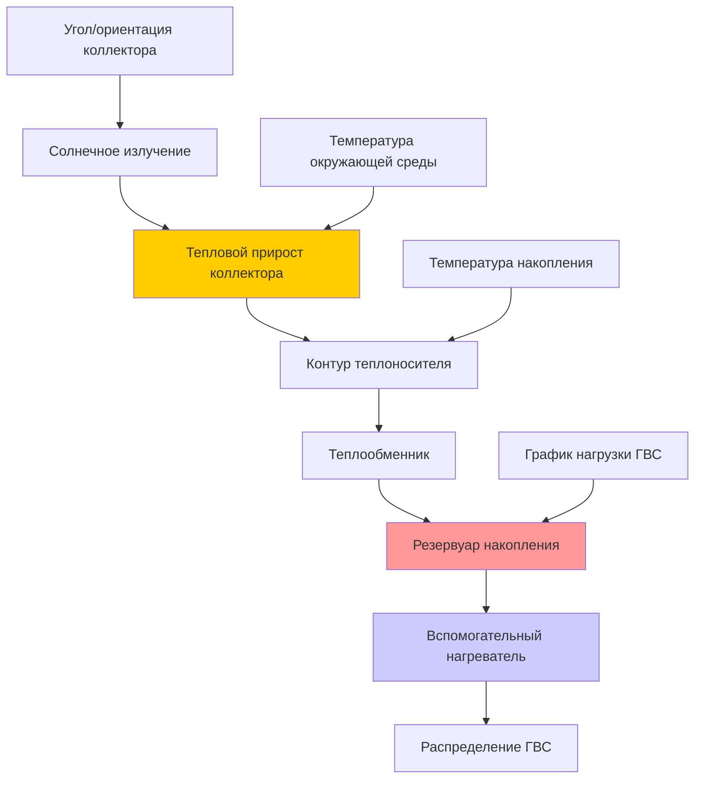

Солнечные тепловые системы горячего водоснабжения (ГВС) преобразуют солнечное излучение непосредственно в тепловую энергию для подогрева воды, обеспечивая одно из наиболее экономичных применений солнечной энергии в зданиях. Эти системы достигают эффективности теплового преобразования 40-70%, значительно выше, чем фотоэлектрические панели, и обеспечивают простые периоды окупаемости 5-12 лет в зависимости от климата и стоимости традиционного топлива.

## Конфигурации систем

Солнечные системы ГВС используют четыре основные конфигурации, каждая из которых подходит для определённых климатических условий и применений.

### Системы прямой циркуляции

Системы прямого (открытого) контура перекачивают питьевую воду непосредственно через коллекторы. Эти системы обеспечивают простоту и эффективность, но требуют защиты от замерзания, ограничивая применение климатическими зонами ASHRAE 1-3 с минимальным риском замерзания. Обратные клапаны предотвращают обратную термосифонную циркуляцию ночью, а предохранительные клапаны защищают от ожогов горячей водой.

### Системы косвенной циркуляции

Системы косвенного (замкнутого) контура циркулируют теплоноситель—обычно раствор пропиленгликоля—через коллекторы и теплообменник. Теплообменник передаёт энергию питьевой воде в резервуаре накопления. Эти системы защищают от замерзания и подходят для всех климатических зон. Теплообменник вводит штраф в виде снижения эффективности на 5-15% по сравнению с системами прямого контура.

### Системы дренирования

Системы дренирования используют воду в качестве теплоносителя, но автоматически опорожняют коллекторы при остановке насоса, обеспечивая встроенную защиту от замерзания без гликоля. Эти системы требуют правильного уклона труб (не менее 0,64 см на 30 см) и монтажа коллекторов для обеспечения полного слива. Резервуар дренирования должен вмещать весь объём массива коллекторов плюс трубопроводы.

### Системы термосифонирования

Пассивные системы термосифонирования полагаются на естественную конвекцию—горячая вода поднимается из коллекторов в повышенный резервуар накопления. Эти системы исключают насосы и органы управления, но требуют, чтобы резервуар накопления был расположен выше коллекторов с достаточной разницей в высоте (не менее 30 см) для создания адекватной циркуляции. Применение ограничено зданиями в один этаж или установками, где высота резервуара достижима.

## Расчеты теплопередачи и определение размеров

Полезный энергетический прирост от солнечного коллектора определяется уравнением Хоттеля-Виллиера-Блисса:

$$Q_u = A_c F_R[(\tau\alpha)I_T - U_L(T_{in} - T_a)]$$

Где:
- $Q_u$ = полезный энергетический прирост (кДж/ч)
- $A_c$ = валовая площадь коллектора (м²)
- $F_R$ = коэффициент удаления тепла коллектором (безразмерный, обычно 0,85-0,95)
- $\tau\alpha$ = произведение пропускания-поглощения (обычно 0,75-0,85)
- $I_T$ = полное солнечное излучение на плоскость коллектора (кДж/ч·м²)
- $U_L$ = коэффициент общих потерь тепла (кДж/ч·м²·°C)
- $T_{in}$ = температура входа в коллектор (°C)
- $T_a$ = температура окружающего воздуха (°C)

Эффективность коллектора варьируется в зависимости от условий работы:

$$\eta = F_R(\tau\alpha) - F_R U_L \frac{(T_{in} - T_a)}{I_T}$$

Эта линейная зависимость показывает, что эффективность снижается по мере повышения температуры коллектора выше окружающей среды или снижения солнечного излучения. Высокопроизводительные коллекторы имеют крутые склоны (высокое $F_R(\tau\alpha)$) и пологое снижение эффективности (низкое $F_R U_L$).

### Методология определения размеров системы

Стандарт ASHRAE 90.1 предоставляет расчёты доли солнечной энергии, но детальное определение размеров следует методу f-диаграмм. Суточное потребление горячей воды определяет накопление и площадь коллектора:

$$V_{storage} = (1.5 \text{ to } 2.0) \times V_{daily}$$

Определение размеров площади коллектора для 60-80% доли солнечной энергии в благоприятных климатических условиях:

$$A_c = \frac{Q_{daily}}{F_R(\tau\alpha) \times H_T \times 0.6}$$

Где $H_T$ — суточное полное солнечное излучение на плоскость коллектора (кДж/сутки·м²) и 0,6 представляет консервативный коэффициент эффективности системы.

## Конструкция резервуара накопления

Резервуары теплового накопления для солнечных систем ГВС требуют стратификации для максимизации эффективности коллектора. Стратификация поддерживает холодную воду внизу (вход в коллектор), обеспечивая более высокую эффективность коллектора, в то время как горячая вода накапливается вверху для использования в быту.

| Конфигурация накопления | Преимущества | Недостатки |
|----------------------|------------|---------------|
| Один резервуар с внутренним теплообменником | Компактный, защищен от замерзания | Более низкая стратификация, риск загрязнения теплообменника |
| Внешний теплообменник с одним резервуаром | Лёгкое обслуживание теплообменника | Снижение стратификации, паразитная мощность насоса |
| Два резервуара последовательно | Отличная стратификация, разделение резервного источника | Требования по площади, более высокая стоимость |
| Резервуар в резервуаре | Хорошая стратификация, компактный | Ограничено меньшими объёмами |

Соотношения высоты к диаметру резервуара 2:1 до 3:1 способствуют стратификации. Дифузоры входа снижают перемешивание во время циклов зарядки. Резервуары предварительного подогрева солнечной энергией должны обеспечивать достаточный объём для хранения на 1-2 дня, чтобы компенсировать пасмурные периоды и оптимизировать вклад солнечной энергии.

## Параметры производительности системы

### Доля солнечной энергии

Доля солнечной энергии (SF) представляет долю общей энергии ГВС, обеспечиваемой солнцем:

$$SF = \frac{Q_{solar}}{Q_{total}} = \frac{Q_{total} - Q_{auxiliary}}{Q_{total}}$$

Целевые показатели проектирования обычно находятся в диапазоне 60-80%. Более высокие доли солнечной энергии увеличивают стоимость системы без пропорционального выигрыша из-за убывающей отдачи в периоды с низким солнечным излучением. Увеличение размеров для 90%+ доли солнечной энергии приводит к летней стагнации и снижению экономической целесообразности.

## Стратегии управления

Дифференциальные контроллеры температуры активируют циркуляционные насосы, когда температура коллектора превышает температуру накопления на установленный дифференциал (обычно дифференциал включения 8-11°C, дифференциал выключения 3-4°C). Это предотвращает потери тепла из накопления в холодные коллекторы, одновременно обеспечивая активацию насоса при наличии полезного прироста.

Продвинутые органы управления включают:
- Защиту от перегрева (предел коллектора 82-93°C)
- Активацию защиты от замерзания (температура датчика 3-6°C)
- Блокировку вспомогательного нагревателя при наличии солнечной энергии
- Рециркуляцию для заправки системы дренирования

## Рассмотрения при установке

Монтаж коллектора требует учёта структурных нагрузок, гидроизоляции и оптимальной ориентации. Установки в направлении на юг (в северном полушарии) под углами наклона, равными широте ± 15°, максимизируют годовой сбор энергии. Встроенный в крышу монтаж снижает ветровые нагрузки, но усложняет доступ для обслуживания.

Трубопровод должен быть рассчитан на надлежащие скорости потока—обычно 0,0108-0,0162 л/мин на квадратный метр площади коллектора. Чрезмерные скорости потока улучшают удаление тепла, но увеличивают энергию насоса; недостаточный поток снижает эффективность. Толщина изоляции должна быть 2,5-5 см для всех трубопроводов, с особым вниманием к наружным трубам и соединениям теплообменника.

Расширительные баки компенсируют тепловое расширение теплоносителя. Определение размеров следует стандартным гидравлическим практикам, но должно учитывать более высокие рабочие температуры (до 121°C во время условий стагнации).

## Контроль производительности

Стандарт ASHRAE 191P устанавливает протоколы мониторинга производительности для солнечных тепловых систем. Ключевые параметры включают:
- Температуру входа и выхода коллектора
- Скорости потока через контур коллектора
- Солнечное излучение на плоскость коллектора
- Температуры резервуара накопления на различных высотах
- Потребление вспомогательной энергии

Годовой мониторинг проверяет, что системы достигают проектной доли солнечной энергии и выявляет деградацию из-за загрязнения, утечек или отказов органов управления.

## Требования кодекса

Стандарт ASHRAE 90.1 требует положений, готовых к солнечной энергии, для определённых типов зданий, включая место на крыше, структурную ёмкость и пути кабелепровода. Местные коды могут требовать систем солнечного ГВС для нового строительства. Международный код водопровода (IPC) и Единый код водопровода (UPC) управляют практикой установки, включая предотвращение обратного потока, сброс давления и управление тепловым расширением.

Надлежащий ввод в эксплуатацию в соответствии с руководством ASHRAE 1.1 гарантирует, что система работает как спроектирована, с проверкой последовательности управления, скоростей потока и функций безопасности перед заселением.
