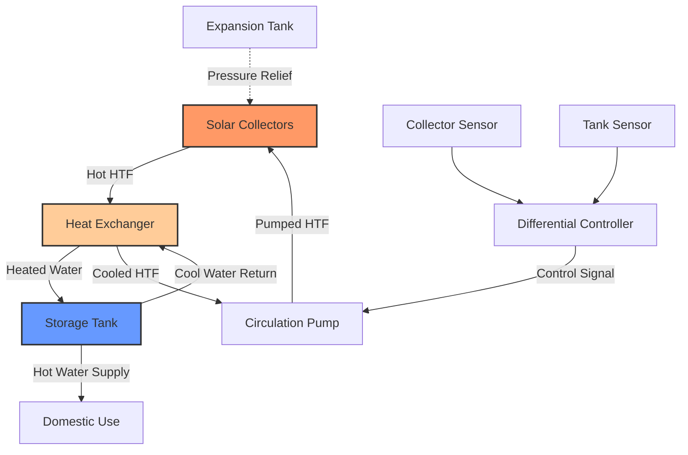

# Активные системы солнечного горячего водоснабжения

Активные системы солнечного горячего водоснабжения (ГВС) используют насосы и контроллеры для циркуляции теплоносителя через солнечные коллекторы, передавая захваченную солнечную энергию в хранилище питьевой воды. Эти системы достигают более высокой эффективности, чем пассивные конструкции, благодаря оптимизированным расходам жидкости, конфигурациям теплообмена и интеллектуальным стратегиям управления.

## Конфигурации систем

### Системы прямой циркуляции

Системы прямой циркуляции прокачивают питьевую воду непосредственно через солнечные коллекторы. Эта конфигурация минимизирует потери при теплообмене, но ограничивает применение климатами без заморозков или требует защиты сливом.

**Энергетический баланс:**

$$Q_{useful} = \dot{m} c_p (T_{out} - T_{in}) = A_c \eta_c I_T$$

Где:
- $Q_{useful}$ = полезный тепловой прирост (Вт)
- $\dot{m}$ = массовый расход (кг/с)
- $c_p$ = удельная теплоёмкость воды, 4186 Дж/(кг·К)
- $T_{out}, T_{in}$ = температуры выхода/входа коллектора (°C)
- $A_c$ = площадь коллектора (м²)
- $\eta_c$ = эффективность коллектора (безразмерная)
- $I_T$ = полная солнечная радиация (Вт/м²)

### Системы непрямой циркуляции

Системы непрямой циркуляции используют замкнутый контур теплоносителя, отделённый от питьевой воды теплообменником. Эта конфигурация обеспечивает защиту от замерзания с помощью незамерзающих растворов и предотвращает образование накипи в коллекторах.

**Эффективность теплообменника:**

$$\varepsilon = \frac{Q_{actual}}{Q_{maximum}} = \frac{T_{h,in} - T_{h,out}}{T_{h,in} - T_{c,in}}$$

Где:
- $\varepsilon$ = эффективность теплообменника (типично 0,4–0,8)
- $T_{h,in}, T_{h,out}$ = температуры входа/выхода горячей жидкости (°C)
- $T_{c,in}$ = температура входа холодной жидкости (°C)

### Системы слива

Системы слива сливают контур коллектора при остановке насоса, устраняя риски замерзания и перегрева. Система требует поднятых хранилищ или вакуумных клапанов и работает с водой в качестве теплоносителя.

**Объём резервуара слива:**

$$V_{drainback} = V_{collectors} + V_{piping} + V_{safety}$$

Где:
- $V_{drainback}$ = объём резервуара слива (л)
- $V_{collectors}$ = внутренний объём коллектора (л)
- $V_{piping}$ = объём трубопровода в зоне слива (л)
- $V_{safety}$ = запас прочности, обычно 20% (л)

## Проектирование компонентов системы

### Расчёт площади коллекторной батареи

Площадь коллектора напрямую влияет на долю солнечной энергии — часть годового энергоснабжения ГВС, обеспеченную солнцем. ASHRAE 90.1 и местные энергетические коды могут предусматривать минимальные доли солнечной энергии для соответствия требованиям возобновляемой энергии.

**Рекомендуемая площадь коллектора:**

$$A_c = \frac{f_{solar} \cdot Q_{annual}}{I_{annual} \cdot \eta_{system}}$$

Где:
- $f_{solar}$ = целевая доля солнечной энергии (типично 0,5–0,8)
- $Q_{annual}$ = годовой спрос энергии ГВС (кВтч/год)
- $I_{annual}$ = годовая солнечная радиация (кВтч/м²/год)
- $\eta_{system}$ = общая эффективность системы (типично 0,3–0,5)

| Климатическая зона | Площадь коллектора на человека (м²) | Ожидаемая доля солнечной энергии |
|---|---|---|
| Жаркий-Сухой (Феникс) | 0,8–1,2 | 0,70–0,85 |
| Жаркий-Влажный (Майами) | 1,0–1,5 | 0,65–0,80 |
| Смешанный (Св. Луис) | 1,5–2,0 | 0,50–0,70 |
| Холодный (Миннеаполис) | 2,0–2,5 | 0,40–0,60 |
| Морской (Сиэтл) | 1,8–2,3 | 0,45–0,65 |

### Выбор циркуляционного насоса

Расходы насоса уравновешивают эффективность коллектора и паразитное энергопотребление. ASHRAE Standard 90.2 рекомендует расходы 0,01–0,02 кг/(с·м²) площади коллектора для жидкостных систем.

**Расчёт напора насоса:**

$$H_{total} = \Delta P_{collectors} + \Delta P_{piping} + \Delta P_{HX} + \Delta P_{fittings}$$

Где:
- $H_{total}$ = полный напор системы (Па)
- $\Delta P$ — перепады давления через компоненты (Па)

Типичные перепады давления в системе:

| Компонент | Перепад давления (кПа) |
|---|---|
| Плоские коллекторы (на панель) | 5–15 |
| Вакуумные трубчатые коллекторы (на панель) | 3–10 |
| Пластинчатый теплообменник | 20–50 |
| Трубопровод (на 10 м эквивалентной длины) | 2–8 |
| Клапаны и фитинги | 5–20 |

### Конфигурация накопительного бака

Ёмкость накопления влияет на производительность системы, обеспечивая тепловую массу для временного накопления энергии. Недостаточная ёмкость бака снижает долю солнечной энергии из-за раннего утреннего повышения температуры; избыточная ёмкость увеличивает потери при хранении.

**Рекомендуемый объём хранилища:**

$$V_{storage} = 50–75 \text{ л/м² площади коллектора}$$

Двухбаковые системы разделяют солнечный подогрев и вспомогательное отопление, улучшая расслоение и солнечный вклад. Однобаковые системы со вспомогательными нагревательными элементами требуют тщательного управления во избежание замещения солнечных приобретений вспомогательной энергией.

## Стратегии управления

### Контроллер с дифференциальной температурой

Дифференциальный контроллер активирует циркуляцию, когда температура коллектора превышает температуру хранилища на уставку дифференциала (ΔT), обычно 5–10°C. Это предотвращает потерю тепла для коллекторов в периоды низкой радиации.

**Логика управления:**

$$\text{Насос ВКЛ если: } T_{collector} > T_{storage} + \Delta T_{on}$$
$$\text{Насос ВЫКЛ если: } T_{collector} < T_{storage} + \Delta T_{off}$$

Где:
- $\Delta T_{on}$ = дифференциал включения, обычно 7–10°C
- $\Delta T_{off}$ = дифференциал отключения, обычно 3–5°C

Гистерезис между дифференциалами включения/отключения предотвращает циклирование и продлевает срок службы насоса.

### Защита от перегрева

Системы требуют защиты от высокой температуры во избежание кипения, нарастания давления и деградации гликоля. Методы защиты включают:

- **Отключение по температурному пределу**: отключить насос при превышении хранилищем 85–90°C
- **Отвод тепла**: активировать вспомогательный сброс тепла или ночное охлаждение
- **Активация слива**: слить коллекторы при приближении температур стагнации к пределам

## Метрики производительности

### Доля солнечной энергии

Доля солнечной энергии количественно определяет вклад возобновляемой энергии:

$$f_{solar} = 1 - \frac{Q_{auxiliary}}{Q_{total}}$$

Где:
- $Q_{auxiliary}$ = ввод вспомогательной энергии (кВтч/год)
- $Q_{total}$ = годовой спрос энергии ГВС (кВтч/год)

### Эффективность системы

Годовая эффективность системы учитывает производительность коллектора, потери при теплообмене, потери хранения и паразитную энергию:

$$\eta_{annual} = \frac{Q_{delivered}}{I_{total} \cdot A_c}$$

Где:
- $Q_{delivered}$ = чистая доставленная солнечная энергия (кВтч/год)
- $I_{total}$ = полная годовая радиация на плоскости коллектора (кВтч/м²/год)

## Методы защиты от замерзания

### Системы с гликолем в замкнутом контуре

Растворы пропиленгликоля (25–50% по объёму) обеспечивают защиту от замерзания до −20°C до −50°C. Концентрация гликоля должна учитывать самую низкую ожидаемую температуру окружающей среды с запасом прочности.

**Понижение точки замерзания:**

Проконсультируйтесь с кривыми точки замерзания пропиленгликоля. Примеры концентраций:

| Концентрация гликоля (% об.) | Точка замерзания (°C) | Точка разрыва (°C) |
|---|---|---|
| 25% | −12 | −15 |
| 35% | −20 | −23 |
| 45% | −29 | −32 |
| 50% | −34 | −37 |

Системы с гликолем требуют ежегодного тестирования и замены каждые 3–5 лет из-за термической деградации.

### Защита со сливом

Системы слива автоматически сливают при остановке циркуляции, устраняя требование незамерзайки. Рассмотрения при проектировании включают:

- Минимальный уклон трубопровода 1–2% для полного слива
- Удаление воздуха из коллекторных коллекторов
- Расчёт насоса для начального заполнения против гидростатического давления
- Резервуар слива с воздушным объёмом

## Требования к установке

### Изоляция трубопровода

ASHRAE Standard 90.1 предусматривает минимальную изоляцию R-3 до R-5 для уличного солнечного трубопровода. Потерь тепла от неизолированного трубопровода значительно снижают эффективность системы.

**Потери тепла трубопровода:**

$$Q_{loss} = \frac{2\pi k L (T_{fluid} - T_{ambient})}{\ln(r_o/r_i)}$$

Где:
- $k$ = теплопроводность изоляции (Вт/(м·К))
- $L$ = длина трубопровода (м)
- $r_o, r_i$ = внешние/внутренние радиусы изоляции (м)

### Крышная установка

Установка коллектора должна выдерживать ветровые нагрузки согласно ASCE 7 и обеспечивать надлежащий дренаж. Оптимальный угол наклона приблизительно соответствует широте для круглогодовой производительности или широта ± 15° для сезонной оптимизации.

### Клапан смешивания для защиты от ожогов

Системы солнечного ГВС могут производить температуры доставки, превышающие 70°C. ASHRAE Standard 90.2 и сантехнические коды требуют термостатических смесительных клапанов для ограничения температуры выхода до 49–60°C в целях защиты от ожогов.

**Смешивание в клапане смешивания:**

$$\dot{m}_{total} T_{mixed} = \dot{m}_{hot} T_{hot} + \dot{m}_{cold} T_{cold}$$

Где:
- $\dot{m}$ — массовые расходы (кг/с)
- $T$ — температуры (°C)

## Вспомогательное резервное отопление

Вспомогательное отопление обеспечивает ГВС в периоды недостаточной солнечной радиации. Стратегии интеграции включают:

| Конфигурация | Преимущества | Недостатки |
|---|---|---|
| Двухбаковая последовательная | Максимальное расслоение солнца | Более высокие затраты, требования к площади |
| Однобаковая двухэлементная | Более низкие затраты, компактность | Вспомогательная может замещать солнце |
| Внешний безбаковый | Неограниченная ёмкость | Нет резервного хранилища |
| Вспомогательная тепловая помпа | Высокая эффективность | Более высокие начальные затраты |

Конструкции бак-в-баке позиционируют солнечное предварительное нагреваемое хранилище в пределах вспомогательного бака, объединяя преимущества двухбаковых систем в одном сосуде.

## Требования к техническому обслуживанию

Активные системы требуют периодического технического обслуживания:

- Тестирование концентрации гликоля (ежегодно)
- Проверка работы насоса (ежеквартально)
- Проверка давления в системе (ежеквартально)
- Калибровка датчиков (ежегодно)
- Проверка теплообменника (интервалы 5 лет)
- Очистка остекления коллектора (по мере необходимости, зависит от климата)

Надлежащим образом поддерживаемые активные системы солнечного ГВС достигают 15–25-летнего срока службы при замене компонентов, продлевающей эксплуатацию сверх первоначального срока проектирования.

## Экономические соображения

Окупаемость системы зависит от расходов на вспомогательное топливо, солнечного ресурса и затрат на установку. Федеральные налоговые льготы (инвестиционный налоговый кредит) и государственные стимулы значительно влияют на экономику проекта. Анализ стоимости жизненного цикла согласно ASHRAE 90.1 должен учитывать рост энергии, затраты на техническое обслуживание и резервы на замену.

Активные системы солнечного ГВС представляют зрелую, доказанную технологию снижения потребления ископаемого топлива в жилых и коммерческих приложениях при соответствии все более строгим требованиям энергетических кодексов.
