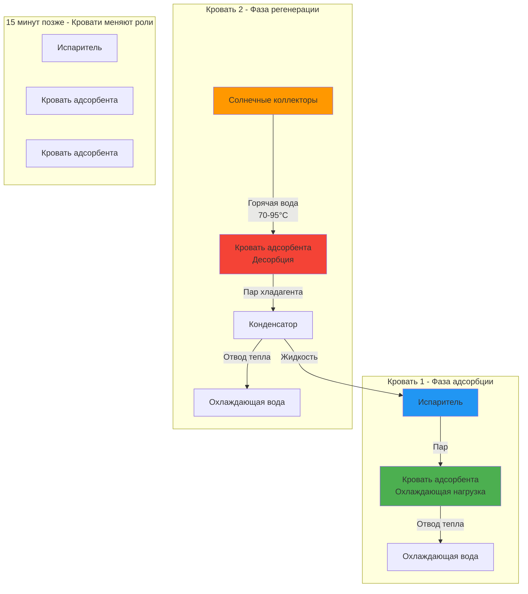
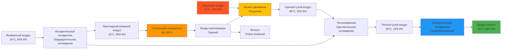

Системы солнечного охлаждения преобразуют солнечную тепловую энергию в полезную производительность охлаждения, решая фундаментальный парадокс того, что пиковый спрос на охлаждение совпадает с максимальной солнечной доступностью. В отличие от систем компрессионного охлаждения, приводимых фотоэлектричеством, технологии теплового охлаждения непосредственно используют собранную тепловую энергию, устраняя потери электрического преобразования и снижая пиковый электрический спрос в критические летние периоды.

## Термодинамическая основа солнечного охлаждения

Обычное компрессионное охлаждение требует энергии высокого качества для привода механического компрессора. Солнечное тепловое охлаждение заменяет эту электрическую работу тепловой энергией, работая на фундаментально различных термодинамических принципах.

Теоретический максимальный коэффициент производительности для любого теплоприводимого цикла охлаждения ограничен эффективностью Карно:

$$\text{COP}_{Carnot} = \frac{T_e}{T_g - T_e} \cdot \frac{T_g - T_c}{T_c}$$

Где:
- $T_e$ = абсолютная температура испарителя (К)
- $T_g$ = абсолютная температура генератора (источника тепла) (К)
- $T_c$ = абсолютная температура конденсатора/отвода тепла (К)

Для типичных условий ($T_e$ = 280 К, $T_g$ = 360 К, $T_c$ = 305 К):

$$\text{COP}_{Carnot} = \frac{280}{360-280} \cdot \frac{360-305}{305} = 3,5 \cdot 0,18 = 0,63$$

Практические системы достигают 60-80% этого теоретического предела, что дает рабочие значения COP 0,4-0,8 для термически приводимых циклов.

## Категории технологий солнечного охлаждения

Солнечное тепловое охлаждение охватывает три основных семейства технологий, различаемые по своим термодинамическим циклам и рабочим жидкостям.

### Системы абсорбционного охлаждения

Абсорбционные системы используют пары жидкого абсорбента-хладагента для создания теплового компрессора. Наиболее распространенные конфигурации:

**Циклы одинарного действия:**
- Требуемая температура коллектора: 70-95°C
- Тепловой COP: 0,65-0,75
- Рабочие пары: LiBr-H₂O (кондиционирование воздуха), NH₃-H₂O (субнулевые приложения)
- Подходящие коллекторы: вакуумированные трубчатые, высокопроизводительные плоские

**Циклы двойного действия:**
- Требуемая температура коллектора: 140-180°C
- Тепловой COP: 1,1-1,3
- Рабочие пары: только LiBr-H₂O
- Подходящие коллекторы: вакуумированные трубчатые, параболические желобы, составные параболические концентраторы

Связь производительности охлаждения с солнечным входом:

$$Q_{cooling} = Q_{solar} \cdot \eta_{collector} \cdot \text{COP}_{absorption}$$

Для системы одинарного действия с эффективностью коллектора 60% и COP 0,70:

$$Q_{cooling} = Q_{solar} \cdot 0,60 \cdot 0,70 = 0,42 \cdot Q_{solar}$$

Это показывает, что 1 кВ падающего солнечного излучения производит приблизительно 420 Вт производительности охлаждения при проектных условиях.

### Системы адсорбционного охлаждения

Адсорбционные системы используют материалы с твердым адсорбентом (силикагель, цеолиты, активированный уголь), которые физически связывают молекулы хладагента на их поверхности. Цикл работает в пакетном режиме с парными кроватями, чередующимися между фазами адсорбции и регенерации.

**Ключевые характеристики производительности:**

| Параметр | Значение | Примечания |
|-----------|---------|-----------|
| Температура регенерации | 65-95°C | Ниже абсорбции |
| Тепловой COP | 0,4-0,6 | Ниже абсорбции |
| Время цикла | 10-30 минут | Пакетная операция |
| Модуляция производительности охлаждения | Плохая | Только пошаговые изменения |
| Рабочее давление | 0,6-2 кПа | Требуется глубокий вакуум |

Мгновенная охлаждающая мощность во время фазы адсорбции:

$$\dot{Q}_{cooling} = \dot{m}_{ref} \cdot h_{fg} = \frac{m_{ads} \cdot \Delta x}{t_{cycle}} \cdot h_{fg}$$

Где:
- $m_{ads}$ = масса адсорбента (кг)
- $\Delta x$ = изменение концентрации адсорбата (кг хладагента/кг адсорбента)
- $t_{cycle}$ = длительность цикла (с)
- $h_{fg}$ = скрытая теплота хладагента (кДж/кг)

Для силикагеля-воды с $\Delta x$ = 0,15 кг/кг в цикле 600 с:

$$\dot{Q}_{cooling} = \frac{100 \text{ кг} \cdot 0,15}{600 \text{ с}} \cdot 2450 \text{ кДж/кг} = 61,3 \text{ кВ}$$

### Десикативное испарительное охлаждение

Системы солнечного десиканта удаляют влагу из воздуха вентиляции через гигроскопические материалы, что позволяет последующему испарительному охлаждению достичь условий подачи воздуха без механического охлаждения.

**Конфигурация колеса твердого десиканта:**

Психрометрический процесс включает три отчетливых изменения состояния:

1. **Осушение десикантом** (приближение постоянной энтальпии):
   $$W_2 = W_1 - \Delta W$$
   $$T_2 = T_1 + \frac{\Delta W \cdot h_{ads}}{c_p}$$

2. **Чувствительный теплообмен** (постоянное отношение влажности):
   $$T_3 = T_2 - \varepsilon_{HX}(T_2 - T_{cool})$$

3. **Испарительное охлаждение** (постоянное приближение температуры мокрого термометра):
   $$T_4 = T_3 - \varepsilon_{evap}(T_3 - T_{wb,3})$$

Комбинированный системный COP на тепловой основе:

$$\text{COP}_{thermal} = \frac{h_a - h_g}{Q_{regen}}$$

Где $h_a$ = энтальпия наружного воздуха, $h_g$ = энтальпия воздуха подачи.

## Стратегии интеграции солнечных коллекторов

Соответствие технологии коллектора требованиям системы необходимо для достижения целевой производительности и экономической жизнеспособности.

### Выбор коллектора в зависимости от температуры

**Уравнение производительности коллектора (ASHRAE 93):**

$$\eta = F_R(\tau\alpha) - F_R U_L \frac{T_{f,avg} - T_a}{G_T}$$

| Приложение | Требуемая Температура | $(T_{f,avg} - T_a)/G_T$ | Выбор коллектора | Ожидаемая $\eta$ |
|-------------|---------------------|--------------------------|------------------|-----------------|
| Регенерация десиканта | 80-100°C | 0,06-0,08 | Вакуумированная трубка | 55-65% |
| Абсорбция одинарного действия | 85-95°C | 0,07-0,09 | Вакуумированная трубка | 50-60% |
| Адсорбционное охлаждение | 70-90°C | 0,05-0,07 | Плоская/вакуумированная трубка | 60-70% |
| Абсорбция двойного действия | 160-180°C | 0,14-0,18 | Параболический желоб | 45-55% |

Параметр температуры $(T_{f,avg} - T_a)/G_T$ напрямую определяет эффективность коллектора. Более высокие рабочие температуры требуют концентрирующих коллекторов для поддержания приемлемой эффективности.

### Интеграция теплового хранилища

Системы солнечного охлаждения выигрывают от теплового хранилища в двух конфигурациях:

**Горячее хранилище (пред-генератор):**
Сохраняет высокотемпературный флюид из коллекторов для непрерывной работы чиллера во время переходных облачных процессов или вечерних пиков охлаждения.

$$V_{hot} = \frac{Q_{cooling} \cdot t_{autonomy}}{\text{COP} \cdot \rho c_p \Delta T \cdot \eta_{storage}}$$

Для охлаждения 100 кВт, автономность 3 часов, COP = 0,7, $\Delta T$ = 15 К:

$$V_{hot} = \frac{100 \text{ кВт} \cdot 3 \text{ ч} \cdot 3600 \text{ с/ч}}{0,7 \cdot 1000 \text{ кг/м}^3 \cdot 4,18 \text{ кДж/кг·K} \cdot 15 \text{ K} \cdot 0,9} = 27,4 \text{ м}^3$$

**Холодное хранилище (пост-чиллер):**
Сохраняет охлажденную воду, производимую во время пиковой доступности солнца для использования во время пиков охлаждающих нагрузок.

$$V_{cold} = \frac{Q_{load,peak} \cdot t_{discharge}}{\rho c_p \Delta T \cdot \eta_{discharge}}$$

Холодное хранилище требует больших объемов из-за ограниченного температурного дифференциала (обычно 6-8 К для охлажденной воды).

## Показатели производительности на уровне системы

### Солнечная доля

Доля годовой охлаждающей энергии, поставляемой солнцем:

$$SF = \frac{\sum Q_{solar,cooling}}{\sum Q_{total,cooling}}$$

Достижимые солнечные доли зависят от климата, размера системы и вспомогательной охлаждающей способности:
- Переразмеренные системы: SF = 0,90-1,0 (чрезмерные капитальные затраты)
- Оптимально размеренные: SF = 0,60-0,80 (экономический оптимум)
- Недоразмеренные системы: SF = 0,40-0,60 (пропущенная солнечная возможность)

### Коэффициент первичной энергии

Сравнение с обычным электрическим компрессионным охлаждением:

$$\text{PER} = \frac{\text{COP}_{VC}}{\text{COP}_{thermal}/\eta_{solar}}$$

Где $\eta_{solar}$ — среднегодовая эффективность солнечного коллектора. Для типичных значений (COP$_{VC}$ = 3,0, COP$_{thermal}$ = 0,7, $\eta_{solar}$ = 0,55):

$$\text{PER} = \frac{3,0}{0,7/0,55} = \frac{3,0}{1,27} = 2,36$$

Это указывает на то, что система солнечного теплового охлаждения потребляет в 2,36 раза больше первичной энергии на единицу охлаждения, чем обычный чиллер, если солнечная тепловая и сетевая электроэнергия имеют равные коэффициенты первичной энергии. Однако, учитывая типичный коэффициент первичной энергии сетевой электроэнергии 3,0:

$$\text{PER}_{corrected} = \frac{3,0 \cdot 3,0}{0,7/0,55} = \frac{9,0}{1,27} = 7,1$$

Система солнечного охлаждения демонстрирует существенную экономию первичной энергии при надлежащем учете потерь генерации и передачи.

## Оценка экономической производительности

### Нивелированная стоимость охлаждения

Полная стоимость жизненного цикла на единицу доставленного охлаждения:

$$\text{LCOC} = \frac{C_{capital} \cdot \text{CRF} + C_{O\&M,annual}}{\sum_{annual} Q_{cooling}}$$

Где коэффициент возврата капитала:

$$\text{CRF} = \frac{i(1+i)^n}{(1+i)^n - 1}$$

**Представительная структура затрат (2025):**

| Компонент | Стоимость | Единица |
|-----------|----------|--------|
| Солнечные коллекторы (вакуумированная трубка) | $400-600 | $/м² |
| Тепловое хранилище | $300-500 | $/м³ |
| Абсорбционный чиллер одинарного действия | $500-800 | $/кВ охлаждения |
| Абсорбционный чиллер двойного действия | $700-1000 | $/кВ охлаждения |
| Адсорбционный чиллер | $800-1200 | $/кВ охлаждения |
| Прочие системные компоненты | $200-400 | $/кВ охлаждения |

Для системы одинарного действия 100 кВт с коллекторами 200 м², хранилищем 20 м³:
- Коллекторы: $110 000
- Чиллер: $65 000
- Хранилище: $8 000
- Прочие компоненты: $30 000
- **Итого: $213 000** или $2 130/кВ

При 15% CRF (8% процентная ставка, 15 лет), $8 000 годовое O&M, 500 часов/год полной нагрузки:

$$\text{LCOC} = \frac{\$213,000 \cdot 0,15 + \$8,000}{100 \text{ кВ} \cdot 500 \text{ ч}} = \frac{\$39,950}{50,000 \text{ кВт·ч}} = \$0,80/\text{кВт·ч}$$

Это сравнивается с обычным электрическим охлаждением примерно на $0,10-0,25/кВт·ч в зависимости от тарифов на электроэнергию, что указывает на то, что солнечное тепловое охлаждение требует благоприятных условий для экономической жизнеспособности.

## Процедуры проектирования и оптимизация

### Методология размеров

1. **Определить проектную охлаждающую нагрузку** с использованием процедур расчета нагрузки ASHRAE (Глава 18, Fundamentals)

2. **Установить солнечный ресурс** из данных TMY3 или модели ASHRAE Clear Sky:
   $$G_{T} = G_{bn} \cos\theta + G_{d} \left(\frac{1+\cos\beta}{2}\right) + G_g \rho_{ground} \left(\frac{1-\cos\beta}{2}\right)$$

3. **Выбрать площадь коллектора** для достижения целевой солнечной доли:
   $$A_c = \frac{SF \cdot Q_{annual,cooling}}{\text{COP}_{thermal} \cdot \eta_{collector,avg} \cdot H_{annual}}$$

4. **Размер теплового хранилища** для желаемой автономности (обычно 2-4 часа)

5. **Указать вспомогательное охлаждение** для обработки периодов дефицита

### Стратегии управления

Эффективное управление максимизирует солнечный вклад при обеспечении комфорта жильцов:

**Архитектура каскадного управления:**

**Ключевые параметры управления:**
- Включение коллектора: $T_{collector} > T_{storage} + 5\text{K}$
- Включение чиллера: $T_{hot} > T_{generator,min} + 3\text{K}$
- Включение вспомогательного: $T_{zone} > T_{setpoint} + 0,5\text{K}$ при недостаточности солнца
- Приоритет зарядки хранилища: Когда SOC < 50% и охлаждающая нагрузка удовлетворена

## Стандарты ASHRAE и справочные материалы проектирования

**ASHRAE 90.1 - Стандарт энергии для зданий кроме малоэтажных жилых зданий**
- Раздел 6.4.1.1: Требования минимальной эффективности для абсорбционных чиллеров
- Раздел 6.5.6: Методология признания кредитов солнечных тепловых систем

**ASHRAE Handbook - Системы и оборудование HVAC**
- Глава 18: Абсорбционное охлаждение, адсорбционное охлаждение
- Глава 41: Системы солнечной энергии, производительность коллектора

**ASHRAE Handbook - Fundamentals**
- Глава 14: Информация о климатическом дизайне (данные солнечного излучения)
- Глава 18: Расчеты охлаждающих и отопительных нагрузок нежилых зданий

**ASHRAE Standard 93**
- Методы испытаний для определения тепловой производительности солнечных коллекторов

**ASHRAE Standard 191**
- Метод испытания для измерения использования энергии и энергетической эффективности солнечных тепловых коллекторов

## Анализ пригодности применения

Солнечное охлаждение достигает оптимальной технико-экономической производительности, когда совпадают несколько благоприятных условий:

**Благоприятные условия:**
- Высокое прямое нормальное излучение (>5 кВт·ч/м²/день в среднегодовом исчислении)
- Совпадающие охлаждающие нагрузки с доступностью солнца
- Высокие тарифы на электроэнергию или тарифы с измерением времени использования с пиковым летним ценообразованием
- Доступная площадь крыши/земли для установки коллектора
- Постоянные круглогодичные охлаждающие нагрузки
- Высокие скрытые нагрузки, подходящие для десикативной технологии
- Доступ к низкостоимостной тепловой энергии для регенерации (отходящее тепло, когенерация)

**Сложные условия:**
- Влажные климаты с обширным облачным покровом
- Короткие охлаждающие сезоны (низкое годовое использование)
- Низкие тарифы на электроэнергию
- Площадки с ограниченным пространством
- Пиковые охлаждающие нагрузки, возникающие в утренние/вечерние часы
- Приложения, требующие быстрой модуляции производительности

Дерево решений по выбору технологии приоритезирует соответствие характеристик системы требованиям приложения, обеспечивая термодинамическую, экономическую и операционную жизнеспособность в течение 15-25-летнего срока действия системы.

---

Технология солнечного охлаждения представляет термодинамически обоснованный подход к снижению пикового электрического спроса и потребления первичной энергии в зданиях с преобладающим охлаждением. Успех требует тщательной интеграции технологии коллектора, теплового хранилища и охлаждающего оборудования с нагрузками здания и стратегиями управления. При надлежащем проектировании для подходящих приложений системы солнечного охлаждения достигают солнечных долей 60-80% с экономией первичной энергии 40-60% в сравнении с обычными системами электрического компрессионного охлаждения.
