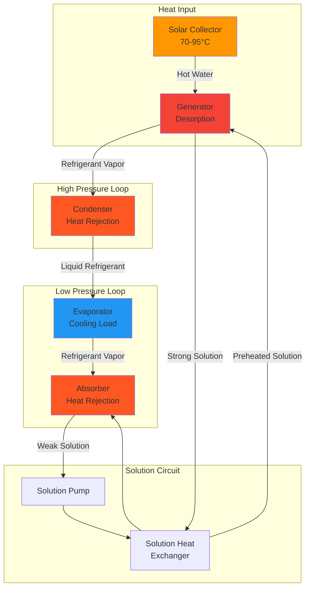
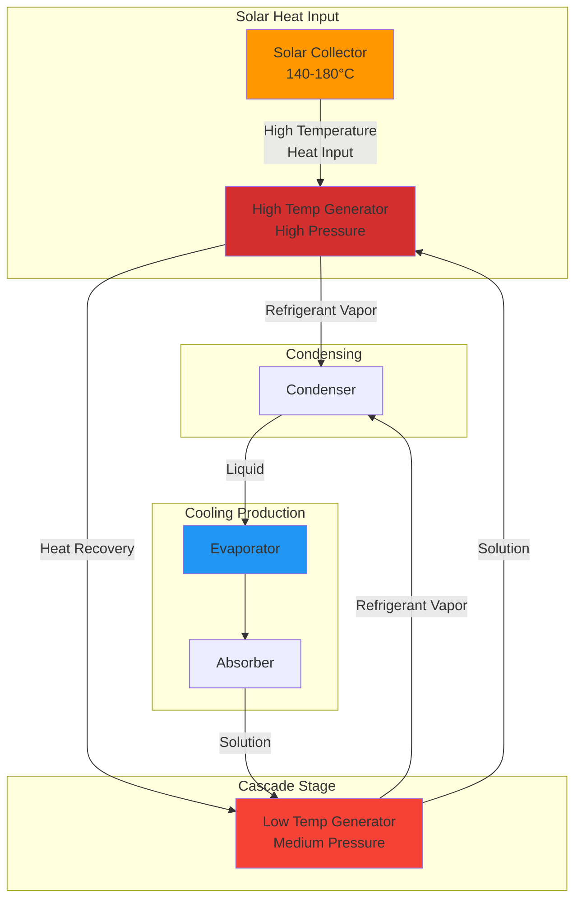

## Основы солнечного абсорбционного охлаждения

Солнечное абсорбционное охлаждение преобразует тепловую энергию от солнечных коллекторов в холодопроизводительность посредством термически управляемого холодильного цикла. В отличие от систем паровой компрессии, требующих высокопотенциальной электрической энергии, абсорбционные системы работают на низкотемпературной и среднетемпературной тепловой энергии (70-200°C), что делает их идеальными для интеграции с солнечными тепловыми коллекторами.

Абсорбционный цикл заменяет механический компрессор тепловым компрессором, состоящим из абсорбера, генератора, насоса раствора и теплообменника. Это фундаментальное различие позволяет прямую связь с солнечными тепловыми коллекторами.

## Рабочие пары жидкостей

Два основных сочетания хладагент-абсорбент доминируют в приложениях солнечного абсорбционного охлаждения:

### Системы ЛiBr-вода

**Конфигурация:** Вода служит хладагентом; бромид лития (ЛiBr) служит абсорбентом

**Характеристики:**
- Температуры испарителя: 3-10°C
- Температуры генератора: 70-95°C (одноступенчатые), 140-180°C (двухступенчатые)
- Рабочее давление: Глубокий вакуум (0,6-7 кПа)
- Высокий COP: 0,7-0,8 (одноступенчатые), 1,1-1,3 (двухступенчатые)
- **Ограничение:** Не может производить температуры ниже 0°C (точка замерзания воды)
- Риск кристаллизации при высоких концентрациях ЛiBr

**Применение:** Кондиционирование воздуха, технологическое охлаждение выше 0°C

### Системы аммиак-вода

**Конфигурация:** Аммиак (NH₃) служит хладагентом; вода служит абсорбентом

**Характеристики:**
- Температуры испарителя: от -60 до +10°C
- Температуры генератора: 120-180°C
- Рабочее давление: Повышенное (200-2000 кПа)
- Более низкий COP: 0,5-0,7
- Требует выпрямляющей колонны (летучесть воды)

**Применение:** Производство льда, холодное хранилище, низкотемпературные приложения

## Одноступенчатый абсорбционный цикл

**Баланс энергии - генератор:**

$$Q_g = \dot{m}_r h_{fg} + \dot{m}_s (h_{s,out} - h_{s,in})$$

Где:
- $Q_g$ = подвод тепла в генератор (кВт)
- $\dot{m}_r$ = массовый расход хладагента (кг/с)
- $h_{fg}$ = скрытая теплота парообразования (кДж/кг)
- $\dot{m}_s$ = массовый расход раствора (кг/с)

**Коэффициент полезного действия:**

$$COP = \frac{Q_e}{Q_g} = \frac{\text{Холодопроизводительность}}{\text{Подвод тепла}}$$

Для одноступенчатых систем ЛiBr-вода:

$$COP_{SE} = 0,65 - 0,75$$

Практические значения зависят от:
- Температуры генератора (выше $T_g$ → ниже COP)
- Температуры испарителя (ниже $T_e$ → ниже COP)
- Температуры охлаждающей воды (выше $T_{cw}$ → ниже COP)

## Двухступенчатый абсорбционный цикл

Двухступенчатые системы используют два генератора, работающих на разных уровнях давления, извлекая дополнительную энергию из источника тепла. Высокотемпературный генератор (HTG) работает при 140-180°C, а низкотемпературный генератор (LTG) работает при 70-95°C, используя тепло, отвергаемое HTG.

**COP двухступенчатого цикла:**

$$COP_{DE} = 1,1 - 1,3$$

Улучшение производительности обусловлено каскадным восстановлением тепла:

$$Q_{LTG} = Q_{HTG,reject}$$

**Баланс тепла на обоих генераторах:**

$$Q_{solar} = Q_{HTG} = Q_e \left(\frac{1}{COP_{DE}}\right)$$

## Сопряжение с солнечными коллекторами

### Согласование температур

Критическое требование: температура на выходе солнечного коллектора должна превышать минимальную температуру генератора с достаточным запасом для приближения в теплообменнике.

| Тип системы | Температура генератора | Требуемая температура коллектора | Тип коллектора |
|-------------|------------------------|--------------------------------|----------------|
| Одноступенчатая ЛiBr | 75-90°C | 85-100°C | Вакуумная трубка, плоская пластина |
| Двухступенчатая ЛiBr | 145-175°C | 160-190°C | Вакуумная трубка, параболический желоб |
| NH₃-H₂O одноступенчатая | 120-150°C | 135-165°C | Вакуумная трубка |

### Конфигурация системы

**Прямое сопряжение:** Солнечный контур непосредственно питает генератор

$$\dot{m}_{solar} c_p (T_{out} - T_{in}) = Q_g$$

**Непрямое сопряжение с аккумулятором:** Тепловой аккумулятор буферирует, разделяя доступность солнечной энергии от потребности в охлаждении

$$V_{storage} = \frac{Q_{cooling} \times t_{autonomy}}{\rho c_p \Delta T \times \eta_{storage}}$$

Где:
- $V_{storage}$ = объем резервуара аккумулятора (м³)
- $t_{autonomy}$ = часы работы без солнечного ввода
- $\eta_{storage}$ = эффективность аккумуляции (0,85-0,95)

### Оптимизация производительности

**Солнечная доля:** Часть годовой холодопроизводительности, обеспеченная солнечной энергией

$$SF = \frac{Q_{solar,delivered}}{Q_{cooling,total}}$$

Типичные солнечные доли: 60-80% для хорошо спроектированных систем в климате с высокой инсоляцией.

## Требования по отводу тепла

Абсорбционные системы отводят тепло в трех точках: конденсатор, абсорбер и (для двухступенчатых) LTG. Общий отвод тепла превышает холодопроизводительность:

$$Q_{rejection} = Q_g + Q_e$$

Для COP = 0,7:

$$Q_{rejection} = 1,43 \times Q_e + Q_e = 2,43 \times Q_e$$

**Расчет градирни:**

$$\dot{m}_{cw} = \frac{Q_{rejection}}{c_p \Delta T_{cw}}$$

Стандартный подход: повышение температуры 5-7°C на контуре охлаждающей воды.

## Руководящие принципы проектирования ASHRAE

**Стандарт ASHRAE 90.1** рассматривает требования эффективности абсорбционных холодильных машин в разделе 6.4.1.1. Минимальные значения эффективности:

- Одноступенчатая, с воздушным охлаждением: COP ≥ 0,60
- Одноступенчатая, с водяным охлаждением: COP ≥ 0,70
- Двухступенчатая, косвенного нагрева: COP ≥ 1,00

**Справочник ASHRAE - Системы и оборудование HVAC (глава 18)** предоставляет детальные процедуры проектирования абсорбционных систем, включая:
- Таблицы свойств хладагента для ЛiBr-вода и NH₃-H₂O
- Кривые производительности с частичной нагрузкой
- Стратегии предотвращения кристаллизации
- Требования к системе очистки для систем с воздушным охлаждением

## Рассмотрение при интеграции системы

**Модуляция мощности:** Абсорбционные холодильные машины модулируют путем изменения подвода тепла в генератор. Достижимы соотношения включения-выключения 10-100% при ступенчатой или непрерывной модуляции.

**Паразитные нагрузки:** Мощность насоса раствора минимальна (1-2% от холодопроизводительности), но вентиляторы и насосы градирни потребляют 3-5% холодопроизводительности.

**Тепловая инертность:** Большие объемы хладагента и раствора обеспечивают встроенное аккумулирование, сглаживая кратковременные солнечные переходные процессы без выделенного теплового аккумулятора.

**Защита от кристаллизации:** Системы ЛiBr требуют циклов разбавления при продолжительном отключении при повышенных температурах окружающей среды. Концентрация раствора должна оставаться ниже пределов насыщения.

## Экономическое и экологическое исполнение

Солнечное абсорбционное охлаждение исключает работу электрического сжатия, снижая пиковый спрос на электроэнергию в летние периоды охлаждения. Это снижение спроса обеспечивает значительную экономию затрат на коммунальные услуги при структурах ставок, зависящих от времени.

Коэффициент первичной энергии (PER) сравнивает общее потребление первичной энергии с обычными системами:

$$PER = \frac{E_{electric,conventional}}{E_{thermal,solar} / \eta_{solar} + E_{parasitic}}$$

Значения, превышающие 1,2, указывают на благоприятное исполнение первичной энергии по сравнению с обычными электрическими холодильными машинами, особенно когда эффективность солнечного тепла остается выше 50%.
