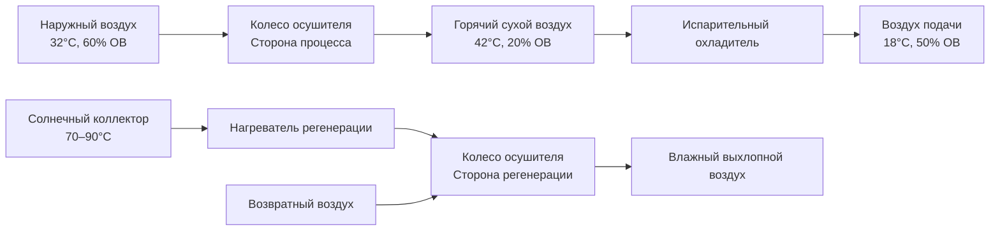
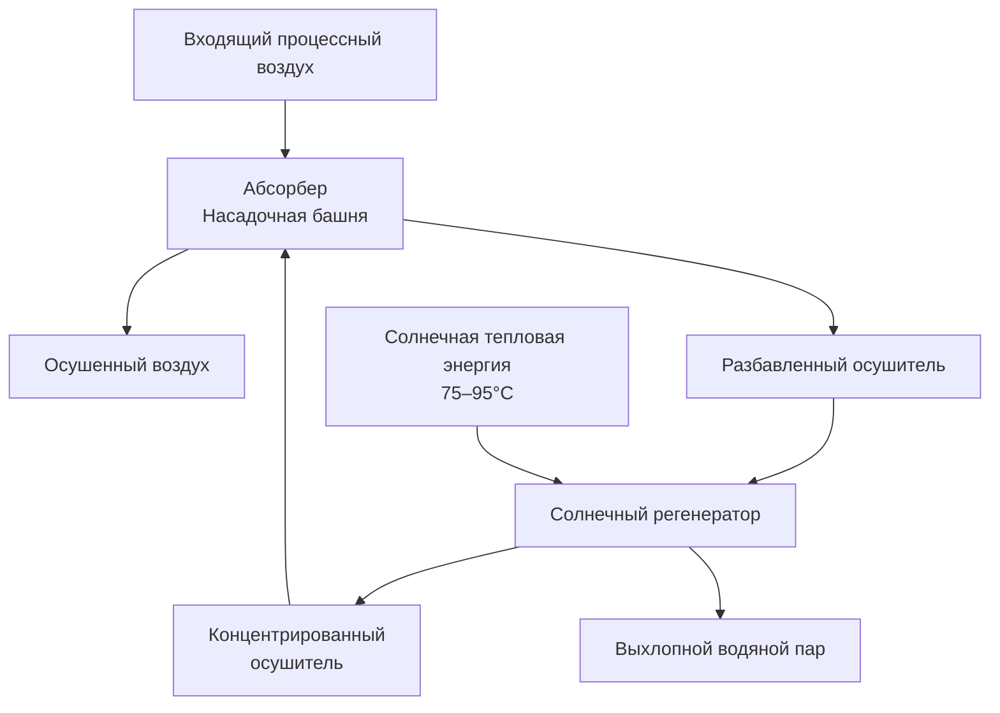

## Обзор

Солнечные системы десорбционного охлаждения интегрируют гигроскопические материалы с солнечной тепловой энергией для обеспечения одновременного осушения и чувствительного охлаждения. Эти системы используют термодинамические свойства осушителей — веществ с высокой влагоотдачей, — которые поглощают водяной пар из воздуха, выделяя тепло в процессе. Солнечные тепловые коллекторы поставляют энергию регенерации, необходимую для удаления поглощенной влаги из осушителя, завершая термодинамический цикл.

Фундаментальное преимущество заключается в преобразовании низкопотенциальной тепловой энергии (70–95°C) от солнечных коллекторов в холодопроизводительность, исключая потребление электричества компрессорной установкой и одновременно решая проблемы скрытых теплонагрузок непосредственно.

## Термодинамические принципы

### Процесс осушения осушителем

Процесс удаления влаги подчиняется термодинамике сорбции. Когда воздух контактирует с поверхностью осушителя, водяной пар переходит из влажного воздуха в осушитель в соответствии с разностью парциального давления пара:

$$
\dot{m}_w = h_m A_s (P_{v,air} - P_{v,desiccant})
$$

Где:
- $\dot{m}_w$ = скорость передачи влаги (кг/с)
- $h_m$ = коэффициент массопередачи (кг/с·м²·Па)
- $A_s$ = поверхность осушителя (м²)
- $P_{v,air}$ = парциальное давление пара в воздухе (Па)
- $P_{v,desiccant}$ = парциальное давление пара на поверхности осушителя (Па)

Процесс адсорбции является экзотермическим и выделяет скрытую теплоту конденсации и теплоту адсорбции:

$$
q_{ads} = \dot{m}_w (h_{fg} + \Delta h_{ads})
$$

Где:
- $q_{ads}$ = выделение тепла при адсорбции (Вт)
- $h_{fg}$ = скрытая теплота парообразования (2440 кДж/кг при 25°C)
- $\Delta h_{ads}$ = дифференциальная теплота адсорбции (200–400 кДж/кг)

Это выделение тепла повышает температуру воздуха при осушении, обычно 10–15°C для силикагеля и 15–25°C для систем с хлоридом лития.

### Требования энергии на регенерацию

Солнечная тепловая энергия управляет регенерацией осушителя путем обращения равновесия сорбции. Требуемая тепловая энергия на килограмм удаленной влаги:

$$
Q_{regen} = \dot{m}_w \left( h_{fg,regen} + \Delta h_{ads} + c_p \Delta T_{sensible} \right)
$$

Где:
- $Q_{regen}$ = тепловой ввод регенерации (кДж/кг)
- $h_{fg,regen}$ = скрытая теплота при температуре регенерации
- $c_p \Delta T_{sensible}$ = чувствительное нагревание осушителя и воздуха

Типичная энергия регенерации составляет 3000–4500 кДж/кг удаленной влаги в зависимости от температуры регенерации и типа осушителя.

## Конфигурации систем

### Системы с ротационным колесом осушителя

Ротационные колеса осушителя содержат силикагель или материал молекулярного сита, структурированные в матрицу сотовой конструкции. Колесо непрерывно вращается между процессными и регенерационными воздушными потоками:

**Параметры производительности:**

| Параметр | Типичный диапазон | Единицы |
|----------|-------------------|---------|
| Скорость вращения колеса | 8–20 | об/ч |
| Линейная скорость | 2,0–3,5 | м/с |
| Удаление влаги | 6–12 | г/кг сухого воздуха |
| Температура регенерации | 70–90 | °C |
| Тепловой COP | 0,5–0,8 | – |

### Системы с жидким осушителем

Жидкие осушители (хлорид лития, бромид лития, хлорид кальция) контактируют с воздухом в насадочных башнях или распылительных камерах. Концентрированный раствор поглощает влагу и становится разбавленным, затем солнечное тепло регенерирует раствор:

**Сравнение жидких осушителей:**

| Осушитель | Концентрация | Темп. реген. | Давление пара | Коррозионность |
|-----------|--------------|--------------|----------------|----------------|
| LiCl | 35–42% | 65–85°C | Очень низкое | Высокая |
| LiBr | 45–55% | 70–90°C | Низкое | Умеренная |
| CaCl₂ | 38–45% | 75–95°C | Умеренное | Очень высокая |

## Интеграция с солнечной тепловой системой

### Требования коллекторов

Системы солнечного осушения требуют коллекторов промежуточной температуры, производящих выход 70–95°C. Коллекторы с вакуумными трубками (ЭТК) обеспечивают оптимальную производительность благодаря более высокой эффективности при повышенных температурах:

**Сравнение эффективности коллекторов:**

| Тип коллектора | Пиковая эффективность | Эффективность при 80°C | Коэффициент стоимости |
|----------------|----------------------|------------------------|----------------------|
| Плоский | 75–80% | 35–45% | 1,0× |
| Вакуумная трубка | 65–75% | 50–65% | 1,8–2,5× |
| Параболический | 70–75% | 55–70% | 2,0–3,0× |

### Интеграция теплового аккумулятора

Оптимизация солнечной доли требует теплового аккумулятора для буферизации вариативности выхода коллектора. Размерование резервуара аккумулятора следует:

$$
V_{storage} = \frac{Q_{cooling,daily} \cdot t_{storage}}{c_p \rho \Delta T \cdot \eta_{storage}}
$$

Где:
- $V_{storage}$ = объем аккумулятора (м³)
- $Q_{cooling,daily}$ = суточное потребление холодопроизводительности (кВт·ч)
- $t_{storage}$ = длительность аккумуляции (часы)
- $\eta_{storage}$ = эффективность аккумуляции (0,85–0,95)

Типичные установки используют 50–100 литров на м² площади коллектора для суточного аккумулирования.

## Показатели производительности

### Коэффициент производительности

COP системы солнечного осушения учитывает как тепловые, так и электрические вводы:

$$
COP_{thermal} = \frac{Q_{cooling}}{Q_{solar} + Q_{parasitic,thermal}}
$$

$$
COP_{electrical} = \frac{Q_{cooling}}{W_{fans} + W_{pumps}}
$$

Тепловой COP обычно находится в диапазоне 0,5–0,8, в то время как электрический COP превышает 10–20 благодаря минимальным нагрузкам компрессора.

### Солнечная доля

Доля энергии регенерации, поставляемая солнечными коллекторами:

$$
SF = \frac{Q_{solar,useful}}{Q_{regen,total}}
$$

Хорошо спроектированные системы достигают солнечной доли 0,60–0,85 в солнечных климатах, а дополнительное отопление обеспечивает резервное питание в периоды низкой инсоляции.

## Соображения по применению

### Пригодность климата

Солнечное осушение показывает оптимальную производительность в жарко-влажных климатах, где:
- Скрытые теплонагрузки превышают 30% от общего охлаждения
- Солнечная инсоляция превышает 5 кВт·ч/м²·сут
- Коэффициенты влажности окружающей среды превышают 12 г/кг

Требования ASHRAE Standard 62.1 на вентиляционный воздух во влажных климатах создают существенные скрытые теплонагрузки, идеально соответствующие возможностям осушения.

### Интеграция с обычными системами

Гибридные конфигурации объединяют осушение осушителем с компрессионным чувствительным охлаждением:

**Сравнение систем:**

| Конфигурация | Обработка скрытых нагрузок | Обработка чувствительных нагрузок | Электропотребление | Сложность |
|--------------|---------------------------|----------------------------------|------------------|----------|
| Только осушитель | Отличная | Плохая | Очень низкое | Низкая |
| Гибридная | Отличная | Отличная | Умеренное | Высокая |
| Обычная | Плохая | Отличная | Высокое | Низкая |

### Экономический анализ

Первоначальные затраты на капитальное строительство для систем солнечного осушения варьируются от $800–1500 на кВт холодопроизводительности (приблизительно 850–1600 евро), что в 2–3 раза выше обычных систем. Однако операционная экономия в жарко-влажных климатах с высокими затратами на электричество дает периоды окупаемости 8–15 лет.

Энергетические модели ASHRAE Standard 90.1 демонстрируют снижение потребления первичной энергии на 40–60% по сравнению с обычными системами при благоприятных приложениях.

## Руководящие принципы проектирования

### Методология определения размера

1. **Рассчитать пиковую скрытую теплонагрузку** из психрометрического анализа ASHRAE
2. **Определить скорость удаления влаги** на основе условий процессного воздуха
3. **Определить размер компонента осушителя** для требуемой холодопроизводительности осушения
4. **Рассчитать энергию регенерации** из термодинамических требований
5. **Определить размер массива солнечных коллекторов** для целевой солнечной доли
6. **Спроектировать тепловой аккумулятор** для согласования профиля нагрузки

### Стратегии управления

Оптимальная производительность требует:
- Модуляции температуры регенерации в зависимости от влажности окружающей среды
- Переменной скорости вращения колеса или потока раствора в зависимости от влажностной нагрузки
- Отслеживания солнечных коллекторов для максимального тепловога прироста
- Последовательности гибридной системы для минимизации вспомогательной энергии

## Будущие разработки

Исследования передовых материалов сосредоточены на композитных осушителях с повышенной влагоемкостью и более низкими температурами регенерации (55–70°C), позволяющими использовать плоские коллекторы и повышающих тепловой COP до 1,0–1,2.

Интеграция с фотоэлектрическими-тепловыми (PVT) коллекторами, производящими как электричество, так и тепловую энергию, представляет перспективный путь для улучшенной общей эффективности и экономики системы.

---

**Ссылки:**
- ASHRAE Handbook—HVAC Systems and Equipment, Chapter 24: Desiccant Dehumidification and Pressure Drying Equipment
- ASHRAE Standard 90.1: Energy Standard for Buildings Except Low-Rise Residential Buildings
- ASHRAE Standard 62.1: Ventilation for Acceptable Indoor Air Quality
