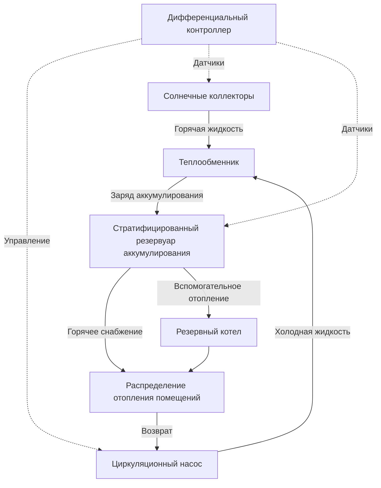

## Обзор

Системы солнечного отопления помещений преобразуют солнечную радиацию в полезную тепловую энергию для отопления зданий. Эти системы снижают нагрузки на традиционное отопление за счет пассивных архитектурных элементов или активного механического сбора и распределения, достигая доли солнечной энергии 30-70% в надлежащим образом спроектированных установках.

Фундаментальное преобразование энергии следует формуле:

$$Q_{useful} = A_c F_R[(\tau\alpha)I_T - U_L(T_i - T_a)]$$

Где:
- $Q_{useful}$ = полезный прирост энергии (Вт)
- $A_c$ = площадь коллектора (м²)
- $F_R$ = коэффициент удаления тепла (безразмерный)
- $\tau\alpha$ = произведение пропускания и поглощения (безразмерный)
- $I_T$ = полная падающая радиация (Вт/м²)
- $U_L$ = общий коэффициент потерь (Вт/м²·К)
- $T_i$ = температура входящей жидкости (К)
- $T_a$ = температура окружающей среды (К)

## Классификация систем

### Активные системы солнечного отопления

Активные системы используют механическое оборудование для сбора, аккумулирования и распределения солнечной тепловой энергии.

**Ключевые компоненты:**
- Солнечные коллекторы (плоские или евакуированные трубы)
- Насосы циркуляции теплоносителя
- Резервуары теплового аккумулирования (обычно 50-75 л на м² коллектора)
- Теплообменники
- Система распределения (гидравлическая или воздушная)
- Дифференциальные контроллеры температуры

**Типы систем:**

| Тип системы | Теплоноситель | Метод распределения | Защита от замерзания | Типичный КПД |
|-------------|---------------------|---------------------|-------------------|-------------------|
| Прямой жидкостной | Вода | Гидравлическая | Слив/гликоль | 35-50% |
| Косвенный жидкостной | Гликоль/вода | Теплообменник в гидравлическую | Встроенная | 30-45% |
| Воздушные системы | Воздух | Воздуховоды принудительного обдува | Не требуется | 25-40% |
| С дренированием | Вода | Гидравлическая с резервуаром слива | Гравитационный слив | 35-50% |

### Пассивные системы солнечного отопления

Пассивные системы используют проектирование ограждающих конструкций для улавливания, аккумулирования и распределения солнечной энергии без механического оборудования.

**Системы прямого поступления:**
- Солнечная радиация проходит через остекление, обращенное на юг
- Тепловая масса (бетон, кирпичная кладка, вода) поглощает и накапливает энергию
- Тепло высвобождается в периоды без солнца за счет естественной конвекции и излучения

Расчет эффективной площади апертуры:

$$A_{eff} = A_g \times \tau \times LCR$$

Где $A_g$ — площадь остекления, $\tau$ — пропускание, $LCR$ — коэффициент соотношения нагрузки и коллектора.

**Системы косвенного поступления:**
- Тепловая аккумулирующая стена (стена Тромба или водяная стена), расположенная между остеклением и помещением
- Толщина стены обычно 200-400 мм для кирпичной кладки
- Вентиляционные отверстия термоциркуляции обеспечивают конвективный теплопередачу

**Системы изолированного поступления:**
- Зимние сады и пристроенные теплицы улавливают солнечную энергию
- Термоизоляция от основного здания позволяет температуре плавать
- Общая стена с тепловой массой передает энергию в кондиционируемое помещение

## Анализ производительности коллектора

КПД солнечного коллектора варьируется в зависимости от условий эксплуатации согласно уравнению Хоттеля-Виллиера-Блисса:

$$\eta = F_R(\tau\alpha) - F_R U_L \frac{(T_i - T_a)}{I_T}$$

Параметры производительности для распространенных типов коллекторов:

| Тип коллектора | $F_R(\tau\alpha)$ | $F_R U_L$ (Вт/м²·К) | Температура застоя (°C) | Стоимость ($/м²) |
|----------------|-------------------|---------------------|----------------------|-------------|
| Одинарное остекление плоский | 0.70-0.75 | 4.5-6.0 | 90-120 | 150-250 |
| Двойное остекление плоский | 0.65-0.70 | 3.0-4.0 | 110-140 | 200-300 |
| Евакуированная труба | 0.65-0.72 | 1.0-2.0 | 180-250 | 400-600 |
| Неостекленный коллектор | 0.85-0.90 | 15-25 | 40-60 | 50-100 |

Угол наклона коллектора для максимального годового сбора тепловой энергии для отопления помещений приблизительно равен:

$$\beta = \phi + 15°$$

Где $\phi$ — широта. Для отопления с преобладанием зимы увеличьте на дополнительные 10-15°.

## Интеграция теплового аккумулирования

Тепловое аккумулирование разделяет сбор и нагрузку и обеспечивает энергию в периоды без солнца. Размер емкости аккумулирования следует:

$$V_{storage} = \frac{A_c \times Q_{daily} \times \tau_{storage}}{\rho c_p \Delta T}$$

Параметры проектирования:
- Период аккумулирования ($\tau_{storage}$): 1-3 дня для жилых приложений
- Температурный диапазон ($\Delta T$): 10-20 К для жидкостных систем
- Соотношение объемов: 50-100 л воды на м² площади коллектора

**Конфигурация аккумулирования:**

Эффективность стратификации существенно влияет на производительность системы. Температурный градиент в аккумулировании должен поддерживать:

$$\frac{dT}{dz} \geq 5 \text{ К/м}$$

Где $z$ — вертикальная координата высоты.

## Методология размера системы

Доля солнечной энергии представляет процент тепловой нагрузки на отопление, обеспеченный солнечной энергией:

$$SF = 1 - \frac{Q_{aux}}{Q_{load}}$$

Метод f-диаграммы (ASHRAE Standard 93) обеспечивает оценки месячной доли солнечной энергии на основе безразмерных параметров:

**Безразмерная поглощенная радиация:**

$$X = \frac{A_c F_R U_L (T_{ref} - T_a)\Delta t}{Q_{load}}$$

**Безразмерный прирост коллектора:**

$$Y = \frac{A_c F_R (\tau\alpha) \overline{H_T}}{Q_{load}}$$

Где $T_{ref}$ = 100°C эталонная температура, $\Delta t$ = временной период, $\overline{H_T}$ = среднесуточная месячная радиация на коллектор.

Экономический оптимум достигается, когда предельная стоимость дополнительной площади коллектора равна текущей стоимости экономии топлива. Размер системы обычно нацелен на SF = 40-60% для экономической эффективности в большинстве климатов.

## Интеграция системы распределения

### Гидравлическое распределение

Низкотемпературные системы радиантного отопления полов лучше соответствуют температурам выходящего потока солнечных коллекторов (30-50°C), чем традиционные радиаторы, требующие 60-80°C.

Расчет расхода для контура коллектора:

$$\dot{m} = \frac{Q_{useful}}{c_p \Delta T_{design}}$$

Расчетное повышение температуры в коллекторах: 5-10 К для оптимального коэффициента удаления тепла.

### Распределение с принудительным обдувом воздухом

Системы на основе воздуха интегрируются с традиционным канальным отоплением. Расходы воздуха в контуре коллектор-аккумулирование:

$$\dot{V} = \frac{A_c \times 10-15 \text{ л/с на м²}}{1}$$

Удельный объем теплового аккумулирования в каменном слое: 0.2-0.3 м³ на м² площади коллектора.

## Стратегии управления

Дифференциальные контроллеры температуры активируют циркуляцию, когда:

$$T_{collector} \geq T_{storage} + \Delta T_{on}$$

Типичные установки:
- $\Delta T_{on}$ = 5-8 К (включение насоса)
- $\Delta T_{off}$ = 2-3 К (выключение насоса)
- Верхний предел: 90-95°C (защита коллектора)

Продвинутые последовательности управления включают:
- Защита коллектора от замерзания (активация дренирования или циркуляция гликоля)
- Защита от перегрева (отвод тепла или увеличение циркуляции)
- Зарядка аккумулирования с приоритизацией нагрузки
- Блокировка вспомогательного отопления при наличии солнечной энергии

## Рекомендации по проектированию в соответствии со стандартами ASHRAE

**ASHRAE Standard 90.2** указывает критерии пассивного солнечного проектирования:
- Площадь остекления, обращенного на юг: 7-12% от площади кондиционируемого помещения
- Тепловая масса: минимум 6× площадь остекления
- Ночная изоляция рекомендуется для улучшения R-value

**ASHRAE Standard 93** определяет процедуры испытаний коллекторов:
- Испытания тепловой производительности в установившемся режиме
- Определение постоянной времени
- Характеризация модификатора угла падения

**Справочник ASHRAE—Приложения HVAC, глава 35** предоставляет подробное руководство по проектированию для приложений солнечной энергии, включая анализ затенения, расчеты нагрузок и методологии экономической оценки.

Мониторинг производительности системы должен отслеживать:
- Достигнутую долю солнечной энергии в сравнении с проектной
- КПД коллектора при различных условиях эксплуатации
- Стратификацию температуры аккумулирования
- Потребление паразитической энергии (насосы, управление)

Надлежащий ввод в эксплуатацию проверяет калибровку датчиков, последовательности управления, уравновешивание расходов и профили зарядки аккумулирования для обеспечения достижения проектной производительности.

## Оптимизация производительности

Ключевые стратегии оптимизации:
- Минимизировать тепловые потери в трубопроводе (R-value изоляции ≥ 1.0 м²·К/Вт)
- Максимизировать наклон коллектора и выравнивание по азимуту (допуск ±15°)
- Реализовать сброс температуры на стороне нагрузки в зависимости от условий на улице
- Планировать вспомогательное отопление для предотвращения истощения аккумулирования
- Ежегодное обслуживание пропускания остекления и целостности селективного покрытия

Надлежащим образом спроектированные системы солнечного отопления помещений обеспечивают надежную низкоуглеродистую тепловую энергию с жизненным циклом системы 20-30 лет и простыми сроками окупаемости 8-15 лет в зависимости от стоимости традиционного топлива и доступности местного солнечного ресурса.
