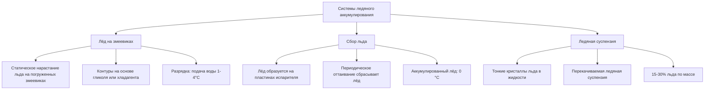
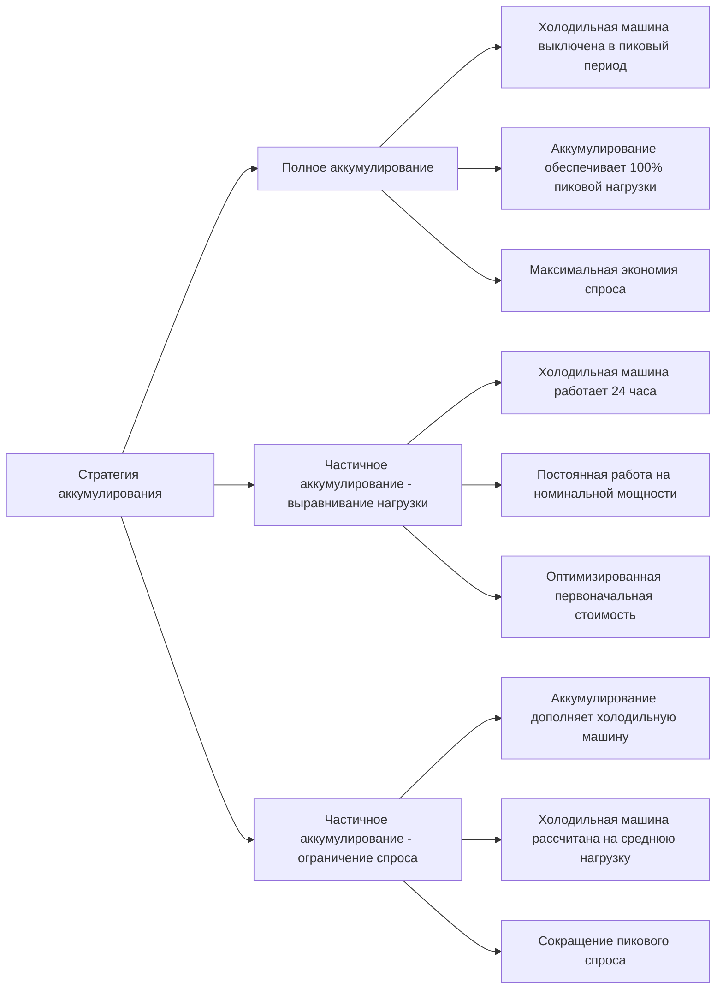

## Обзор систем аккумулирования тепловой энергии

Системы аккумулирования тепловой энергии (TES) развязывают производство охлаждения от потребления, позволяя коммунальным компаниям смещать электрический спрос от пиковых периодов. Эти системы сохраняют охлаждающую способность в непиковые часы, когда тарифы на электроэнергию ниже и оборудование работает более эффективно, а затем разряжаются в периоды пиковой нагрузки.

Фундаментальный принцип предусматривает аккумулирование явного тепла (изменение температуры) или скрытого тепла (фазовый переход) в аккумулирующей среде. Передовые системы TES достигают плотности энергии в диапазоне от 10 кВт·ч/м³ для явного аккумулирования холодной воды до более чем 80 кВт·ч/м³ для ледяного аккумулирования скрытого тепла.

## Ледяное тепловое аккумулирование

### Физические принципы

Ледяное аккумулирование использует скрытое тепло плавления воды (334 кДж/кг) для достижения высокой плотности энергии в компактных объёмах. При зарядке холодильная машина производит лёд или ледо-водяную смесь при температурах от −10 °C до 0 °C. При разрядке тёплая обратная вода плавит лёд, поглощая тепловую энергию.

Полная ёмкость аккумулирования сочетает явные и скрытые компоненты:

$$Q_{total} = m_{water} \cdot c_p \cdot \Delta T_{sensible} + m_{ice} \cdot h_{fusion}$$

Где:
- $Q_{total}$ = полная охлаждающая способность (кДж)
- $m_{water}$ = масса воды (кг)
- $c_p$ = удельная теплоёмкость воды (4,18 кДж/(кг·K))
- $\Delta T_{sensible}$ = изменение температуры при явном охлаждении (K)
- $m_{ice}$ = масса образовавшегося льда (кг)
- $h_{fusion}$ = скрытое тепло плавления (334 кДж/кг)

### Конфигурации ледяного аккумулирования

### Расчёты проектирования

Для коммерческого здания, требующего 500 кВт·ч холодильного аккумулирования:

$$V_{tank} = \frac{Q_{required}}{\rho_{water} \cdot \left(c_p \cdot \Delta T + f_{ice} \cdot h_{fusion}\right)}$$

При условии 85% доли льда при полной зарядке:

$$V_{tank} = \frac{500 \text{ кВт·ч} \times 3{,}600 \text{ кДж/кВт·ч}}{1000 \text{ кг/м}^3 \times \left(4,18 \times 10 + 0,85 \times 334\right)} = 21,8 \text{ м}^3$$

Это представляет приблизительно 60% сокращение объёма в сравнении с эквивалентным аккумулированием холодной воды.

## Аккумулирование холодной воды

### Стратифицированные резервуары

Аккумулирование холодной воды опирается на тепловую стратификацию — различия в плотности поддерживают отдельные слои тёплой и холодной воды. Число Ричардсона количественно определяет устойчивость стратификации:

$$Ri = \frac{g \cdot \beta \cdot \Delta T \cdot H}{u^2}$$

Где:
- $Ri$ = число Ричардсона (безразмерная величина)
- $g$ = ускорение свободного падения (9,81 м/с²)
- $\beta$ = коэффициент объёмного теплового расширения (°C⁻¹)
- $\Delta T$ = разность температур между слоями (°C)
- $H$ = высота резервуара (м)
- $u$ = характеристическая скорость (м/с)

Устойчивая стратификация требует $Ri > 10$. Конструкция диффузора поддерживает низкие скорости входа (< 0,05 м/с) для предотвращения перемешивания.

Ёмкость аккумулирования для систем холодной воды:

$$Q_{storage} = \rho \cdot V \cdot c_p \cdot \Delta T \cdot \eta_{thermal}$$

Для резервуара объёмом 5 000 м³ с дифференциалом 12 °C и 85% тепловой эффективностью:

$$Q_{storage} = 1000 \times 5000 \times 4,18 \times 12 \times 0,85 = 213{,}000 \text{ МДж} = 59{,}200 \text{ кВт·ч}$$

## Материалы с фазовым переходом (PCM)

### Критерии выбора материала

Системы PCM используют материалы с температурами фазового перехода, согласованными с приложениями HVAC (обычно 5-25 °C для охлаждения). Критерии выбора включают:

| Свойство | Требование | Типичные значения |
|----------|-------------|------------------|
| Температура плавления | Зависит от приложения | 8-15 °C (охлаждение) |
| Скрытое тепло | > 150 кДж/кг | 150-250 кДж/кг |
| Теплопроводность | > 0,5 Вт/(м·K) | 0,2-0,6 Вт/(м·K) |
| Переохлаждение | < 2 °C | 0,5-3 °C |
| Стабильность цикла | > 10 000 циклов | зависит от материала |

### Ёмкость аккумулирования PCM

Эффективная теплопроводность определяет скорости зарядки/разрядки:

$$\frac{dQ}{dt} = k_{eff} \cdot A \cdot \frac{\Delta T}{\delta}$$

Где:
- $\frac{dQ}{dt}$ = скорость передачи тепла (Вт)
- $k_{eff}$ = эффективная теплопроводность (Вт/(м·K))
- $A$ = площадь передачи тепла (м²)
- $\Delta T$ = разность температур (K)
- $\delta$ = характеристический размер (м)

Улучшенные системы PCM включают металлические матрицы, добавки графита или микроинкапсуляцию для повышения теплопроводности с типичных значений 0,2 Вт/(м·K) до 2-5 Вт/(м·K).

## Сезонное подземное аккумулирование тепловой энергии

### Аккумулирование тепловой энергии в водоносном слое (ATES)

Системы ATES вводят теплообменную жидкость в водоносные слои в течение одного сезона и извлекают её в противоположные сезоны. Аккумулированная тепловая энергия подчиняется:

$$Q_{seasonal} = \rho_{water} \cdot V_{aquifer} \cdot c_p \cdot \Delta T \cdot \eta_{recovery}$$

Эффективность восстановления обычно составляет 50-70% при сезонном аккумулировании, что учитывает потери тепла к окружающей геологии и неполное гидравлическое восстановление.

### Аккумулирование тепловой энергии в скважинах (BTES)

BTES состоит из вертикальных скважин (глубиной 50-200 м), содержащих теплообменники. Тепло диффундирует в окружающий грунт/скальные породы. Длина теплового проникновения за время $t$ составляет:

$$\delta_{thermal} = \sqrt{4 \alpha t}$$

Где $\alpha$ — коэффициент теплового проникновения (м²/с). Для цикла сезонного аккумулирования продолжительностью 6 месяцев в граните ($\alpha \approx 1,2 \times 10^{-6}$ м²/с):

$$\delta_{thermal} = \sqrt{4 \times 1,2 \times 10^{-6} \times 15{,}552{,}000} = 8,6 \text{ м}$$

Этот расчёт определяет минимальное расстояние между скважинами для предотвращения теплового взаимодействия.

## Стратегии смещения нагрузки

### Полное аккумулирование в сравнении с частичным

### Экономический анализ

Экономия на плате за спрос при частичном аккумулировании:

$$\text{Экономия} = \Delta \text{кВ}_{demand} \times \text{Тариф}_{\$/\text{кВ}} \times 12 \text{ месяцев} + \Delta \text{кВт·ч} \times \text{Тариф}_{\$/\text{кВт·ч}}$$

ASHRAE Standard 90.1 предоставляет процедуры расчёта для демонстрации экономии затрат на энергию при реализации TES.

## Стратегии управления и оптимизация

Передовые последовательности управления максимизируют экономическую выгоду:

1. **Приоритетная зарядка**: завершить производство льда/холодной воды в периоды с самыми низкими расходами
2. **Оптимизация разрядки**: высвободить аккумулированное охлаждение для минимизации платежей за пиковый спрос
3. **Управление запасами**: поддерживать минимальный резерв для непредвиденных нагрузок
4. **Прогноз на основе погоды**: корректировать зарядку на основе прогнозов на следующий день

Состояние заряда (SOC) при разрядке подчиняется:

$$\text{SOC}(t) = \text{SOC}_0 - \int_0^t \frac{\dot{Q}_{load}(\tau)}{Q_{total}} d\tau$$

Где $\dot{Q}_{load}$ представляет мгновенную охлаждающую нагрузку, обеспечиваемую аккумулированием.

## Стандарты проектирования и ссылки

**Стандарты ASHRAE:**
- ASHRAE Guideline 36: High-Performance Sequences of Operation for HVAC Systems (интеграция аккумулирования)
- ASHRAE Standard 90.1: Energy Standard for Buildings (кредиты TES)
- ASHRAE Applications Handbook, Chapter 51: Thermal Storage

**Ключевые параметры проектирования:**
- Минимальная теплоизоляция резервуара: RSI 1,8-3,5 (зависит от климата)
- Максимальные скорости зарядки/разрядки: 0,1-0,3 от полной ёмкости в час
- Дифференциалы температур: 10-16 °C для холодной воды, 8-12 °C для ледяных систем
- Коэффициенты безопасности: 1,1-1,15 для определения размера ёмкости аккумулирования

Передовое аккумулирование тепловой энергии представляет критическую технологию для гибкости сетей, интеграции возобновляемой энергии и снижения операционных затрат в современных системах HVAC.
