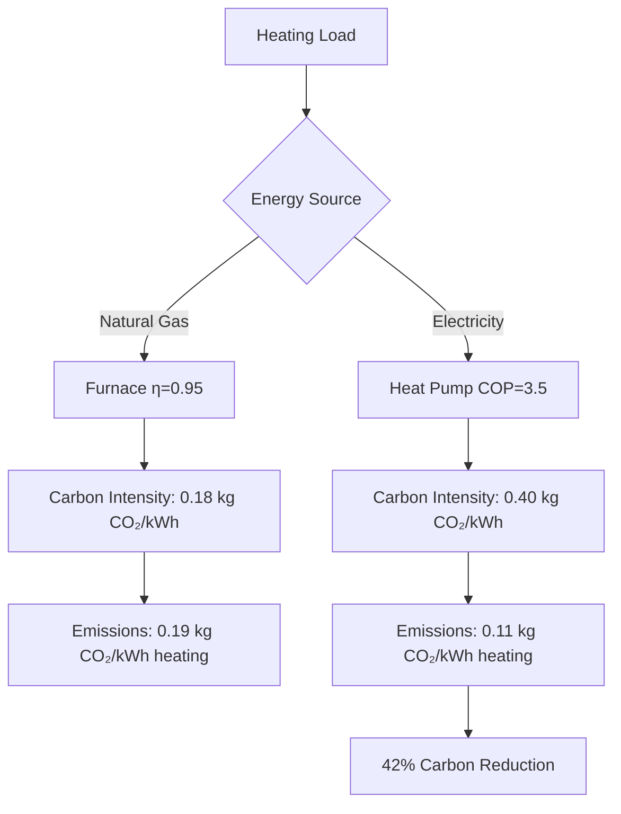
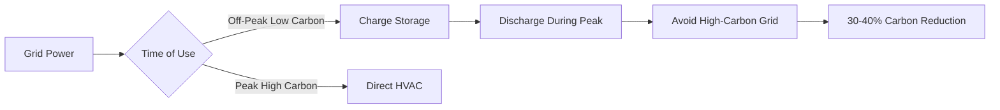

# Стратегии снижения углеродных выбросов в системах HVAC

Снижение углеродных выбросов в системах HVAC охватывает как операционные углеродные выбросы от потребления энергии, так и воплощенный углерод от производства оборудования и использования хладагентов. Системы HVAC обычно представляют 40-60% потребления энергии зданием, что делает их основной целью для декарбонизации.

## Источники углеродных выбросов

Системы HVAC способствуют углеродным выбросам через три основных канала:

**Операционный углерод**: Энергия, потребляемая во время работы системы, преобразуется в углеродные выбросы в зависимости от интенсивности углеродных выбросов электросети. Это представляет наибольший вклад на протяжении срока службы оборудования.

**Воплощенный углерод**: Производство, транспортировка и установка оборудования HVAC приводит к выбросам углерода. Системы с высокой интенсивностью оборудования, такие как переменный расход хладагента, имеют более высокий воплощенный углерод, чем более простые подходы.

**Углерод хладагента**: Прямые выбросы от утечки хладагента и косвенные выбросы от штрафов по энергии, связанные со свойствами хладагента, в совокупности создают значительное климатическое воздействие.

## Снижение операционного углерода

### Оптимизация энергоэффективности

Взаимосвязь между потреблением энергии и углеродными выбросами следует уравнению:

$$
\text{Carbon Emissions} = E_{\text{annual}} \times \text{EF}_{\text{grid}} \times \eta_{\text{transmission}}
$$

Где:
- $E_{\text{annual}}$ = годовое потребление энергии (кВт·ч)
- $\text{EF}_{\text{grid}}$ = коэффициент выбросов электросети (кг CO₂/кВт·ч)
- $\eta_{\text{transmission}}$ = коэффициент эффективности передачи

Ключевые стратегии эффективности включают:

| Стратегия | Потенциал снижения углерода | Стоимость внедрения | Период окупаемости |
|----------|---------------------------|---------------------|----------------|
| Высокоэффективные холодильные машины (COP 6,5+) | 25-35% | Высокая | 8-12 лет |
| Системы тепловых насосов | 40-60% | Средняя-Высокая | 5-10 лет |
| Спрос-контролируемая вентиляция | 15-25% | Низкая-Средняя | 2-4 года |
| Оптимизация расширенного управления | 10-20% | Средняя | 3-5 лет |
| Вентиляция с рекуперацией энергии | 20-30% | Средняя | 4-7 лет |
| Приводы переменной скорости | 15-25% | Низкая-Средняя | 2-4 года |

### Снижение нагрузки через проектирование

Прямое снижение нагрузок отопления и охлаждения уменьшает углеродные выбросы. Уравнение снижения нагрузки охлаждения:

$$
Q_{\text{reduced}} = Q_{\text{baseline}} - \left(Q_{\text{envelope}} + Q_{\text{ventilation}} + Q_{\text{internal}}\right)_{\text{improved}}
$$

Улучшения ограждающих конструкций зданий снижают передаваемые нагрузки:

$$
Q_{\text{envelope}} = U \times A \times \Delta T
$$

Где более низкие значения U (улучшенная изоляция) непосредственно снижают $Q_{\text{envelope}}$ и соответствующие углеродные выбросы.

## Электрификация и переход на другие источники топлива

### Развертывание тепловых насосов

Замена ископаемого топлива на отопление электрическими тепловыми насосами снижает углеродные выбросы в сетях с интенсивностью углерода ниже 0,5 кг CO₂/кВт·ч. Сравнение углеродных выбросов:

$$
\text{Carbon}_{\text{fossil}} = \frac{Q_{\text{heating}}}{\eta_{\text{furnace}}} \times \text{EF}_{\text{fuel}}
$$

$$
\text{Carbon}_{\text{heat pump}} = \frac{Q_{\text{heating}}}{\text{COP}_{\text{HP}}} \times \text{EF}_{\text{electric}}
$$

Для тепловых насосов для снижения углеродных выбросов:

$$
\frac{Q_{\text{heating}}}{\text{COP}_{\text{HP}}} \times \text{EF}_{\text{electric}} < \frac{Q_{\text{heating}}}{\eta_{\text{furnace}}} \times \text{EF}_{\text{fuel}}
$$

## Управление хладагентом

### Выбор хладагента с низким потенциалом глобального потепления

Потенциал глобального потепления хладагента (GWP) определяет прямое воздействие на выбросы. Стандарт ASHRAE 34 классифицирует хладагенты по безопасности и экологическим свойствам.

| Хладагент | GWP (100 лет) | Применение | Статус |
|-------------|----------------|-------------|--------|
| R-410A | 2 088 | Жилые/Легкие коммерческие | Снятие с производства |
| R-32 | 675 | Жилые/Легкие коммерческие | Переходный |
| R-454B | 466 | Жилые/Легкие коммерческие | Альтернатива с низким GWP |
| R-513A | 631 | Холодильные машины | Альтернатива с низким GWP |
| R-1234ze | 7 | Холодильные машины | Сверхнизкий GWP |
| R-744 (CO₂) | 1 | Коммерческое охлаждение | Натуральный хладагент |
| R-717 (Аммиак) | 0 | Промышленный | Натуральный хладагент |

Полное эквивалентное потепление (TEWI) объединяет прямые и косвенные выбросы:

$$
\text{TEWI} = \text{GWP} \times L_{\text{annual}} \times n + \text{GWP} \times m \times (1-\alpha) + n \times E_{\text{annual}} \times \beta
$$

Где:
- $L_{\text{annual}}$ = годовой уровень утечки (кг/год)
- $n$ = срок службы системы (лет)
- $m$ = количество заряда хладагента (кг)
- $\alpha$ = коэффициент рекуперации в конце жизненного цикла
- $E_{\text{annual}}$ = годовое потребление энергии (кВт·ч)
- $\beta$ = коэффициент выбросов при выработке электроэнергии (кг CO₂/кВт·ч)

### Предотвращение утечек и рекуперация

Герметизация хладагента снижает прямые выбросы. Стандарт ASHRAE 15 требует обнаружения утечек для зарядов, превышающих пороговые значения. Стратегии включают:

- Ежеквартальные проверки утечек для систем с зарядом более 22,7 кг
- Системы автоматического обнаружения утечек
- Паяные соединения вместо механических фитингов
- Надлежащая эвакуация и рекуперация при техническом обслуживании
- Рекламация хладагента в конце жизненного цикла

## Интеграция возобновляемых источников энергии

### Генерация на месте

Генерация солнечной энергии через фотоэлектрические системы снижает операционный углерод за счет смещения электроэнергии от сети:

$$
\text{Carbon Avoided} = E_{\text{PV}} \times \text{EF}_{\text{grid}} \times (1 - f_{\text{curtailment}})
$$

Пиковые нагрузки охлаждения совпадают с пиковой генерацией солнца, создавая благоприятный синергизм для снижения углерода.

### Накопление тепловой энергии

Тепловое накопление смещает потребление энергии HVAC на периоды с более низкой интенсивностью углерода в сети или более высокой генерацией возобновляемых источников:

$$
Q_{\text{storage}} = m \times c_p \times \Delta T \times \eta_{\text{storage}}
$$

Для ледяного хранилища:

$$
Q_{\text{storage}} = m \times h_{\text{fusion}} \times \eta_{\text{storage}}
$$

Где $h_{\text{fusion}}$ = 334 кДж/кг для воды обеспечивает высокую плотность энергии.

## Оптимизация управления

Стратегии расширенного управления снижают углеродные выбросы благодаря интеллектуальной работе:

**Спрос-реагирование**: Снижение нагрузок HVAC в периоды высокой интенсивности углерода в сети путем предварительного охлаждения или временного ослабления уставок в границах комфорта.

**Прогнозирующее управление**: Алгоритмы машинного обучения предсказывают оптимальное включение оборудования на основе прогнозов погоды, паттернов присутствия людей и прогнозов интенсивности углерода в сети.

**Регулировка и реагирование**: Сброс температур подачи, статического давления и расходов на основе фактических потребностей зоны, а не условий проектирования:

$$
T_{\text{supply,reset}} = T_{\text{supply,design}} + \Delta T_{\text{reset}}(1 - \text{Load Fraction})
$$

## Проверка производительности

Руководство ASHRAE 14 предоставляет протоколы измерения и проверки для валидации снижения углеродных выбросов. Подходы нормализованного измеренного потребления энергии (NMEC) количественно определяют экономию:

$$
\text{Savings} = \left(\text{Baseline Energy} - \text{Reporting Period Energy}\right) \pm \text{Adjustments}
$$

Проверка снижения углеродных выбросов требует:

- Непрерывное измерение энергии с интервалом 15 минут
- Запись температуры наружного воздуха
- Отслеживание присутствия людей или параметров эксплуатации
- Статистический анализ с коэффициентом вариации среднеквадратической ошибки (CV-RMSE) ниже 25%

Точный учет углерода преобразует измеренную экономию энергии в снижение углеродных выбросов, используя предельные или средние коэффициенты выбросов электросети, подходящие для границы анализа.

## Путь к нулевому углероду

Достижение нулевого углеродного HVAC требует сочетания нескольких стратегий:

1. **Максимизация эффективности**: Развертывание наиболее эффективного оборудования и средств управления
2. **Электрификация систем**: Замена систем на ископаемом топливе тепловыми насосами
3. **Выбор хладагентов с низким GWP**: Минимизация прямых выбросов
4. **Интеграция возобновляемых источников энергии**: Генерация на месте или соглашения о закупке электроэнергии
5. **Внедрение хранилища**: Смещение нагрузок на периоды с низким углеродом
6. **Оптимизация операции**: Непрерывный комиссионинг и мониторинг производительности

Путь снижения углеродных выбросов следует закону убывающей отдачи, при этом начальные улучшения эффективности обеспечивают наивысшую экономическую эффективность перед требованием интеграции возобновляемых источников энергии для полной декарбонизации.
