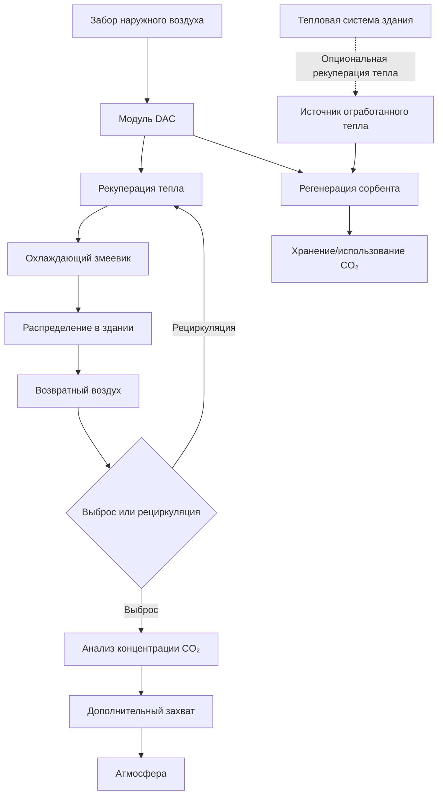

# Улавливание углерода в системах HVAC

Технологии улавливания углерода, интегрированные с системами HVAC, представляют новый подход к достижению отрицательных выбросов углерода в зданиях. Эти системы активно удаляют CO₂ из атмосферы или захватывают его из выпускных потоков здания, преобразуя атмосферный углерод в стабильные формы для долгосрочного хранения.

## Интеграция прямого захвата воздуха

Системы прямого захвата воздуха (DAC) могут быть интегрированы с оборудованием HVAC здания для удаления CO₂ непосредственно из потоков вентиляционного воздуха. Фундаментальное уравнение массопередачи, управляющее абсорбцией CO₂:

$$N_{CO_2} = k_L a (C_{bulk} - C_{interface})$$

Где:
- $N_{CO_2}$ = скорость массопередачи CO₂ (кг/м³·с)
- $k_L$ = коэффициент массопередачи жидкой фазы (м/с)
- $a$ = площадь поверхности раздела на единицу объема (м²/м³)
- $C_{bulk}$ = концентрация CO₂ в основном потоке (кг/м³)
- $C_{interface}$ = концентрация CO₂ на границе раздела (кг/м³)

### Технологии абсорбции

| Технология | Эффективность захвата | Энергетический штраф | Температура регенерации | Химическая стабильность |
|------------|----------------------|---------------------|------------------------|-----------------------|
| Абсорбция аминами | 85-95% | 2,5-4,0 ГДж/т CO₂ | 120-150°C | Умеренная (деградация) |
| Твердый сорбент | 75-90% | 1,8-3,2 ГДж/т CO₂ | 80-120°C | Высокая |
| Мембранное разделение | 60-85% | 1,2-2,8 ГДж/т CO₂ | Н/П | Очень высокая |
| Криогенное разделение | 90-98% | 2,0-3,5 ГДж/т CO₂ | -100 до -50°C | Н/П |

Энергия, требуемая для DAC, масштабируется в зависимости от концентрации CO₂ в атмосфере согласно термодинамическим пределам:

$$W_{min} = RT \ln\left(\frac{P_{pure}}{P_{atm}}\right)$$

Где:
- $W_{min}$ = минимальная работа разделения (кДж/моль)
- $R$ = универсальная газовая постоянная (8,314 Дж/моль·K)
- $T$ = абсолютная температура (K)
- $P_{pure}$ = давление чистого CO₂ (Па)
- $P_{atm}$ = парциальное давление CO₂ в атмосфере (Па)

При концентрации CO₂ в атмосфере 420 ppm теоретическая минимальная энергия составляет примерно 20 кДж/моль (250 кДж/кг CO₂). Практические системы требуют 1500-2500 кДж/кг из-за термодинамических потерь.

## Стратегии интеграции с системами HVAC

### Точки интеграции

**Путь приточного воздуха**: Модули DAC, расположенные выше охлаждающих змеевиков, снижают концентрацию CO₂ в вентиляционном воздухе с 420 ppm до 200-300 ppm. Этот подход обеспечивает непрерывное улавливание, пропорциональное расходу вентиляции:

$$\dot{m}_{CO_2} = \dot{V} \cdot \rho \cdot (C_{in} - C_{out})$$

Где:
- $\dot{m}_{CO_2}$ = скорость захвата CO₂ (кг/с)
- $\dot{V}$ = расход вентиляции (м³/с)
- $\rho$ = плотность воздуха (кг/м³)
- $C_{in}$ = входная концентрация CO₂ (кг/кг)
- $C_{out}$ = выходная концентрация CO₂ (кг/кг)

**Путь выпускного воздуха**: Захват CO₂ из выпускных потоков воздуха обеспечивает более высокие концентрации (800-1200 ppm в занятых помещениях), снижая энергию разделения на 40-60% по сравнению с захватом наружного воздуха.

**Выделенные системы**: Автономные установки секвестрации работают независимо от HVAC, используя отработанное тепло здания для регенерации сорбента. Эти системы разделяют секвестрацию и требования вентиляции.

## Минерализация и материальное улавливание углерода

Строительные материалы, включающие захваченный CO₂, обеспечивают постоянное улавливание через реакции минерализации. Карбонизация бетона следует уравнению:

$$Ca(OH)_2 + CO_2 \rightarrow CaCO_3 + H_2O$$

Эта реакция улавливает 0,79 кг CO₂ на кг Ca(OH)₂, сохраняя углерод в стабильной форме карбоната кальция с постоянством на миллион лет.

### Бетон, отвержденный углеродом

| Параметр | Обычный бетон | Бетон, отвержденный углеродом | Улучшение |
|----------|---------------|------------------------------|---------:|
| Время отверждения | 28 дней | 24 часа | 96% сокращение |
| Прочность на сжатие | Базовая | +10 до +20% | Повышенная |
| Поглощение CO₂ | 0,05 кг/кг | 0,15-0,25 кг/кг | 3-5× увеличение |
| Воплощенный углерод | 0,15 кг CO₂/кг | 0,05-0,08 кг CO₂/кг | 50-65% сокращение |

## Показатели производительности и оценка

Стандарт ASHRAE 228-2023 устанавливает протоколы для количественной оценки улавливания углерода, интегрированного в здание. Ключевые показатели включают:

**Чистая скорость захвата углерода**:

$$NCR = \dot{m}_{captured} - \dot{m}_{operational} - \dot{m}_{embodied}$$

Где:
- $NCR$ = чистое сокращение углерода (кг CO₂/год)
- $\dot{m}_{captured}$ = годовой захват CO₂ (кг/год)
- $\dot{m}_{operational}$ = операционные выбросы от энергии секвестрации (кг/год)
- $\dot{m}_{embodied}$ = годовой воплощенный углерод (кг/год)

**Эффективность захвата углерода**:

$$\eta_c = \frac{\text{захвачен CO₂}}{\text{выброшен CO₂ для энергии захвата}} \times 100\%$$

Жизнеспособные системы, интегрированные в здание, требуют $\eta_c > 300\%$ для оправдания энергетических инвестиций. Системы, питаемые от возобновляемых источников энергии на месте или использующие отработанное тепло, достигают значений $\eta_c$ 500-800%.

## Энергетические соображения системы

Регенерация химических сорбентов доминирует в потреблении энергии. Интеграция тепла с системами здания снижает паразитные нагрузки:

- **Абсорционные чиллеры**: Отработанное тепло от генератора (85-95°C) регенерирует сорбенты низкой температуры
- **Системы ТЭЦ**: Выпускное тепло (120-180°C) управляет регенерацией средней температуры
- **Конденсаторы тепловых насосов**: Отвергнутое тепло (40-55°C) предварительно нагревает воздух регенерации
- **Солнечные тепловые системы**: Концентрированная солнечная энергия обеспечивает 150-250°C для высокоэффективной регенерации

Эффективность адсорбции с температурным колебанием:

$$\eta_{TSA} = \frac{q_{ads} - q_{des}}{Q_{heating} + W_{compression}}$$

Где:
- $q_{ads}$ = теплота адсорбции (кДж/кг)
- $q_{des}$ = теплота десорбции (кДж/кг)
- $Q_{heating}$ = энергия регенерационного нагрева (кДж/кг)
- $W_{compression}$ = работа сжатия (кДж/кг)

## Рамки внедрения

**Фаза проектирования**:
1. Количественно определить выбросы углерода здания (операционные и воплощенные)
2. Оценить доступные источники отработанного тепла и температуры
3. Размер системы захвата для целевой скорости секвестрации
4. Интегрировать с последовательностями управления HVAC
5. Оценить пути хранения или использования захваченного CO₂

**Операционная фаза**:
1. Контролировать скорости захвата и потребление энергии
2. Оптимизировать циклы регенерации на основе доступности тепла
3. Проверить секвестрацию через протоколы третьих сторон
4. Отрегулировать работу с учетом вариаций углеродной интенсивности сети

**Экономический анализ**:
Анализ затрат жизненного цикла должен учитывать доход от углеродных кредитов, избежанные затраты на выбросы и штрафы за энергию. Текущие затраты захвата варьируются от 150-400 долл. за тонну CO₂ для систем, интегрированных в здание, по сравнению с 600-1000 долл. для промышленных объектов DAC. Интеграция с существующей инфраструктурой HVAC снижает капитальные затраты на 35-50%.

Интегрированное с зданием улавливание углерода переводит системы HVAC из углеродно-нейтральных в углеродно-отрицательные операции, поддерживая агрессивные цели декарбонизации, согласованные с обязательством ASHRAE 2030 и стандартами зданий с нулевым выбросом.
