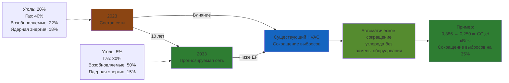

Оперативный углерод представляет выбросы парниковых газов, производимые на этапе эксплуатации систем HVAC в течение их жизненного цикла. В отличие от воплощенного углерода (выбросы от производства и установки), оперативный углерод составляет 70-85% от общих выбросов жизненного цикла в большинстве коммерческих зданий, что делает его основной целью для усилий по декарбонизации.

## Методология расчета выбросов углерода

### Основная формула расчета

Выбросы оперативного углерода от систем HVAC рассчитываются по формуле:

$$CO_2e = E \times EF \times t$$

Где:
- **CO₂e** = Выбросы углекислого газа эквивалента (кг CO₂e)
- **E** = Скорость потребления энергии (кВт)
- **EF** = Коэффициент выбросов (кг CO₂e/кВт·ч)
- **t** = Время работы (часы)

### Коэффициенты выбросов, специфичные для топлива

Различные источники энергии производят разные углеродные интенсивности:

| Источник энергии | Коэффициент выбросов (кг CO₂e/кВт·ч) | Типичное применение |
|------------------|-------------------------------------|---------------------|
| Природный газ (сгорание) | 0,184 | Печи, котлы |
| Электроэнергия (средний по США) | 0,386 | Тепловые насосы, чиллеры |
| Электроэнергия (сетка с углеводородами) | 0,820 | Региональные вариации |
| Электроэнергия (возобновляемая сетка) | 0,020-0,050 | Регионы чистой энергии |
| Городское паровое отопление | 0,140-0,220 | Коммерческие здания в городах |
| Мазут №2 | 0,252 | Резервное питание |

**Примечание:** Коэффициенты выбросов значительно варьируются в зависимости от региона, состава электросети и времени суток. Данные о углеродной интенсивности в реальном времени обеспечивают более точные расчеты, чем годовые средние.

### Полный расчет углерода системы

Для полной системы HVAC:

$$CO_{2e,total} = \sum_{i=1}^{n} (E_i \times EF_i \times t_i \times \eta_i^{-1})$$

Где:
- **i** = Отдельный компонент системы (чиллер, котел, приточная установка, насосы, вентиляторы)
- **η** = Эффективность системы (COP для охлаждения, AFUE для отопления)

## Стратегии сокращения оперативного углерода

```mermaid
graph TD
    A[Сокращение оперативного углерода] --> B[Оптимизация эффективности]
    A --> C[Замена топлива]
    A --> D[Декарбонизация электросети]
    A --> E[Управление нагрузкой]

    B --> B1[Высокоэффективное оборудование<br/>SEER 18+, COP 4.0+]
    B --> B2[Оптимизация управления<br/>На основе AI, прогнозирующее]
    B --> B3[Правильный размер системы<br/>Исключить избыточность]

    C --> C1[Электрификация<br/>Тепловые насосы]
    C --> C2[Интеграция возобновляемых<br/>Солнечное тепло, ФЭ]
    C --> C3[Районная энергетика<br/>Утилизация тепла]

    D --> D1[Оптимизация по времени использования<br/>Периоды низкого углерода]
    D --> D2[Реакция на спрос<br/>Ответ на сигнал сети]
    D --> D3[Накопление энергии<br/>Тепловое/батарейное]

    E --> E1[Оптимизация уставки<br/>Расширенные мертвые зоны]
    E --> E2[Управление по присутствию<br/>DCV, зонирование]
    E --> E3[Свободное охлаждение/отопление<br/>Экономайзеры]

    style A fill:#2C5F8D
    style B fill:#4A7BA7
    style C fill:#4A7BA7
    style D fill:#4A7BA7
    style E fill:#4A7BA7
```

## Электрификация и развертывание тепловых насосов

### Влияние на углерод при замене топлива

Углеродное преимущество замены газового отопления на электрические тепловые насосы зависит от углеродной интенсивности сети:

$$\Delta CO_2e = Q \times \left(\frac{EF_{газ}}{\eta_{газ}} - \frac{EF_{эл}}{COP_{ТН}}\right)$$

Где:
- **Q** = Тепловая нагрузка (кВт·ч тепла)
- **EF_газ** = 0,184 кг CO₂e/кВт·ч
- **η_газ** = Эффективность газовой печи (0,80-0,96)
- **EF_эл** = Коэффициент выбросов сети (переменный)
- **COP_ТН** = Коэффициент производительности теплового насоса (2,5-4,5)

### Пороговая углеродная интенсивность сети

Тепловые насосы снижают выбросы углерода при условии:

$$EF_{эл} < \frac{EF_{газ} \times COP_{ТН}}{\eta_{газ}}$$

Для теплового насоса с COP = 3,0 и газовой печью при 95% AFUE:

$$EF_{эл} < \frac{0,184 \times 3,0}{0,95} = 0,581 \text{ кг CO}_2\text{e/кВт·ч}$$

Этот порог достигается в большинстве регионов сети США и продолжает улучшаться по мере увеличения доли возобновляемых источников энергии.

## Влияние декарбонизации электросети

### Оптимизация углерода по времени использования

Углеродная интенсивность сети варьируется почасово в зависимости от порядка запуска. Сдвиг нагрузок HVAC на периоды низкого углерода снижает выбросы:

**Типичная дневная схема углеродной интенсивности (газ/уголь):**

| Период времени | Углеродная интенсивность | Стратегия |
|----------------|--------------------------|-----------|
| 00:00-06:00 | 0,320 кг/кВт·ч | Предварительное охлаждение/отопление с накопителем |
| 06:00-10:00 | 0,450 кг/кВт·ч | Умеренные нагрузки |
| 10:00-18:00 | 0,520 кг/кВт·ч | Минимизировать нагрузки, использовать накопитель |
| 18:00-22:00 | 0,480 кг/кВт·ч | Переместить некритичные нагрузки |
| 22:00-24:00 | 0,360 кг/кВт·ч | Зарядить тепловой накопитель |

## Измерение и верификация

### Непрерывный углеродный учет

Современные системы управления HVAC интегрируют отслеживание углерода в реальном времени:

1. **Учет энергии:** Раздельный учет систем HVAC (чиллеры, котлы, приточные установки)
2. **Интеграция коэффициентов выбросов:** API-соединение с данными об интенсивности углерода в сети
3. **Расчет в реальном времени:** Непрерывное вычисление CO₂e
4. **Обратная связь по оптимизации:** Коррекция управления на основе влияния на углерод

### Годовое сообщение об углероде

$$CO_{2e,годовой} = \sum_{месяц=1}^{12} \left(E_{месяц} \times EF_{месяц}\right)$$

Отслеживайте год за годом сокращение от базовых показателей. Типичные целевые показатели сокращения:
- **2030:** Сокращение на 50% от базовых показателей 2020 года
- **2040:** Сокращение на 80% от базовых показателей 2020 года
- **2050:** Нулевые оперативные выбросы углерода

## Потенциал сокращения, специфичный для технологии

| Модернизация технологии | Сокращение углерода | Примечания по внедрению |
|-------------------------|-------------------|------------------------|
| Замена печи с 80% AFUE на тепловой насос (COP 3,5) | 40-60% | Зависит от сети |
| Модернизация чиллера с 0,8 кВт/кВт охлаждения на 0,5 кВт/кВт охлаждения | 37,5% | Прямое сокращение |
| Внедрение оптимального управления запуском/остановом | 10-15% | Без замены оборудования |
| Добавление экономайзера к агрегату с 100% наружным воздухом | 20-30% | Зависит от климата |
| Регулируемые приводы на насосах/вентиляторах | 25-40% | Нагрузки на неполную мощность |
| Управление вентиляцией по спросу (DCV) | 15-25% | Вариация присутствия |

## Проектирование пути декарбонизации

Систематический подход к устранению оперативного углерода:

1. **Количественное определение базовых показателей:** Установите текущие выбросы с разбивкой по видам топлива
2. **Максимизация эффективности:** Оптимизируйте существующие системы перед переходом на другое топливо
3. **Стратегическая электрификация:** Преобразуйте газовые нагрузки в электрические тепловые насосы
4. **Интеграция возобновляемых источников:** Локальная солнечная ФЭ или закупка возобновляемой энергии
5. **Сетевое интерактивное управление:** Сдвиг нагрузок на периоды низкого углерода
6. **Компенсация остатков:** Компенсация углерода за оставшиеся неизбежные выбросы

Наиболее экономичный путь объединяет повышение эффективности (наименьшие затраты на тонну сокращенного CO₂e) со стратегической электрификацией, рассчитанной на тренды декарбонизации сети. В регионах с чистой электросетью немедленная электрификация обеспечивает максимальное углеродное преимущество. В регионах, зависимых от угля, повышение эффективности и отсроченная электрификация могут оптимизировать оба показателя: углерод и затраты.

## Заключение

Сокращение оперативного углерода в системах HVAC требует количественного анализа потребления энергии, коэффициентов выбросов и эффективности системы. Комбинация повышения эффективности оборудования, стратегической электрификации и декарбонизации электросети создает путь к нулевым оперативным выбросам углерода к 2050 году. Учет углерода в реальном времени и сетевое интерактивное управление обеспечивают автоматическую оптимизацию, в то время как непрерывное измерение гарантирует ответственность перед целевыми показателями снижения.
