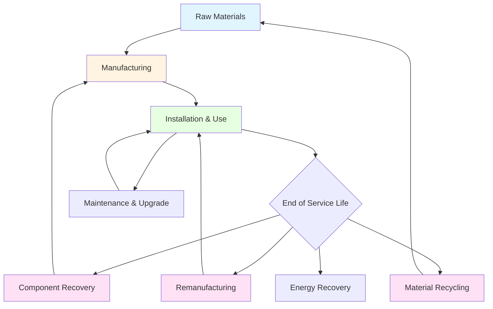

Принципы циклической экономики, применяемые к системам HVAC, минимизируют потребление ресурсов и образование отходов через замкнутые потоки материалов, продление жизненного цикла оборудования и проектирование для разборки и повторного использования. Это контрастирует с традиционными линейными моделями, где оборудование производится, используется и утилизируется.

## Рамочная структура циклической экономики для HVAC

Модель циклической экономики для систем HVAC состоит из трех основных контуров:

**Компоненты технического контура:**
- Восстановление материалов и переработка металлов, хладагентов и полимеров
- Переманufacturing и восстановление компонентов
- Продление срока службы оборудования благодаря модульному конструированию
- Рекуперация энергии из выведенных из эксплуатации систем

**Интеграция биологического контура:**
- Биобазированные изоляционные материалы, безопасно биоразлагаемые
- Натуральные хладагенты с нулевой экологической стойкостью
- Компостируемые фильтрующие элементы

**Трансформация модели обслуживания:**
- Оборудование как услуга вместо владения оборудованием
- Контракты, основанные на производительности, стимулирующие долговечность
- Ответственность производителя за восстановление в конце жизненного цикла

## Коэффициенты восстановления и переработки материалов

Оборудование HVAC содержит значительные объемы восстанавливаемых материалов с различной экономической ценностью и экологическим воздействием.

| Категория материала | Типовое содержание (% массы) | Коэффициент восстановления | Экологическая ценность |
|------------------|--------------------------|---------------|---------------------|
| Медь | 15-25% | 95-98% | Высокая – экономия энергии |
| Алюминий | 8-15% | 90-95% | Высокая – снижение энергии на 95% |
| Сталь | 40-55% | 85-92% | Средняя – распространенный ресурс |
| Компрессорное масло | 2-4% | 70-85% | Средняя – потенциал повторной перегонки |
| Хладагенты | 1-3% | 60-80% | Критическая – снижение GWP |
| Полимеры | 5-10% | 20-40% | Низкая – проблемы загрязнения |
| Электроника | 3-8% | 40-60% | Высокая – редкоземельные элементы |

## Восстановление хладагента и управление жизненным циклом

Восстановление хладагента представляет критический элемент циклической экономики из-за высокого потенциала глобального потепления и нормативных требований согласно разделу 608 EPA и международным обязательствам по Монреальскому протоколу.

**Расчет эффективности восстановления:**

Коэффициент восстановления хладагента количественно определяет цикличность:

$$R_f = \frac{m_{recovered}}{m_{original}} \times 100\%$$

где $m_{recovered}$ – масса извлеченного хладагента, $m_{original}$ – первоначальная зарядка системы.

**Стандарты качества рекламации:**

Стандарт ASHRAE 34 и стандарт AHRI 700 определяют требования чистоты для рекламированных хладагентов:

$$P_{reclaimed} \geq 99,5\% \text{ (по массе)}$$

Рекламированный хладагент, соответствующий этим спецификациям, работает идентично девственному хладагенту при этом снижая воплощенный углерод на 85-92%.

## Принципы конструирования для разборки

Реализация циклической экономики требует преднамеренных решений проектирования, облегчающих восстановление материалов:

**Механические крепежные элементы в сравнении с постоянными соединениями:**
- Болтовые соединения: 100% обратимые, позволяют повторное использование компонентов
- Сварные соединения: требуют резки, нарушают структурную целостность
- Клеевые соединения: требуется химическое разделение, загрязнение материала

**Архитектура модульных компонентов:**

Оборудование, спроектированное со стандартизированными взаимозаменяемыми модулями, продлевает срок службы благодаря выборочной замене компонентов вместо полной утилизации системы.

$$L_{system} = L_{base} + \sum_{i=1}^{n} \Delta L_i$$

где $L_{system}$ – общий срок службы системы, $L_{base}$ – срок службы базовой конструкции, $\Delta L_i$ – продление срока службы от замены каждого модуля.

**Стандарты идентификации материалов:**

ISO 11469 устанавливает требования маркировки для пластиковых компонентов массой свыше 25 граммов, позволяя автоматизированную сортировку при переработке.

## Анализ переманufacturing в сравнении с новым оборудованием

Переmanufacturing восстанавливает 85-95% стоимости компонента, потребляя 15-30% энергии, необходимой для производства нового оборудования.

| Показатель производительности | Переманufactured | Новое оборудование |
|-------------------|----------------|---------------|
| Потребление энергии (производство) | 15-30% | 100% |
| Отходы материалов | 5-10% | 8-15% |
| Гарантия производительности | 95-100% номинальная | 100% номинальная |
| Стоимость | 50-70% | 100% |
| Время выполнения | 2-4 недели | 8-16 недель |
| Период гарантии | 1-3 года | 3-10 лет |
| Воплощенный углерод | 200-400 кг CO₂e | 1200-1800 кг CO₂e |

## Стратегии продления срока службы компонентов

**Восстановление компрессора:**

Переборка компрессора восстанавливает наиболее энергоемкий компонент. Процесс включает:
1. Разборку и очистку
2. Замену подшипников (основной компонент износа)
3. Проверку обмотки двигателя и перемотку при необходимости
4. Восстановление поверхности пластины клапана
5. Сборку с новыми уплотнениями
6. Испытание производительности согласно спецификациям OEM

Восстановленные компрессоры достигают 95-98% исходной эффективности при 40-60% стоимости замены.

**Восстановление теплообменника:**

Очистка катушек и выпрямление оребрения восстанавливают 90-95% исходной тепловой пропускной способности. Коэффициент восстановления тепловой производительности:

$$\eta_{restored} = \frac{UA_{cleaned}}{UA_{new}} = \frac{1}{1 + R_{fouling,residual}/R_{total}}$$

где $UA$ – общий коэффициент теплопередачи, $R_{fouling,residual}$ – остаточное сопротивление загрязнению после очистки.

## Экономический анализ циклических моделей

**Сравнение общей стоимости владения:**

$$TCO_{circular} = C_{initial} + \sum_{t=1}^{L} \frac{C_{operation,t} + C_{maintenance,t} - V_{recovery}}{(1+r)^t}$$

где $V_{recovery}$ – восстановленная стоимость в конце жизненного цикла, обычно 15-30% первоначальной стоимости для оборудования HVAC.

**Восстановление стоимости материала:**

Типовой кровельный блок мощностью 35,2 кВт содержит примерно 1070-1610 долл. в восстанавливаемых материалах:
- Медь: 535-805 долл.
- Алюминий: 200-335 долл.
- Сталь: 107-160 долл.
- Ядро компрессора: 134-200 долл.
- Хладагент: 67-134 долл.

## Препятствия реализации и решения

**Технические препятствия:**
- Проприетарные конструкции компонентов, ограничивающие обслуживание третьей стороной
- Смешанные материалы, требующие сложного разделения
- Загрязнение смазочными материалами и покрытиями

**Экономические препятствия:**
- Низкие затраты на девственные материалы, снижающие стимулы переработки
- Затраты на рабочую силу при разборке, превышающие стоимость материала
- Ограниченная инфраструктура обратной логистики

**Нормативные решения:**
- Мандаты расширенной ответственности производителя
- Системы залога-возврата для хладагентов и компрессоров
- Требования содержания переработанных материалов в спецификациях закупок
- Налоговые льготы для переманufactured оборудования

## Будущие технологии циклической экономики

**Цифровые паспорта продуктов:**

RFID-теги и отслеживание на блокчейне позволяют полную документацию истории материалов, облегчая восстановление и повторное использование. Каждый компонент несет встроенные данные о:
- Составе материала и марках
- Дате и месте производства
- Истории обслуживания и оставшемся полезном сроке службы
- Оптимальных процедурах разборки
- Совместимости объектов переработки

**Передовое разделение материалов:**

Системы робоческой разборки с поддержкой AI достигают чистоты материала 95%+ благодаря оптической сортировке и автоматизированному извлечению компонентов, улучшая экономику операций переработки.

**Закупки на основе производительности:**

Модели оборудования как услуги согласовывают стимулы производителя с долговечностью и перерабатываемостью, создавая экономические мотивы для принципов циклического проектирования.

Переход к моделям циклической экономики в системах HVAC снижает экологическое воздействие при одновременном создании экономической ценности благодаря восстановлению материалов, повторному использованию компонентов и продлению жизненного цикла оборудования.
