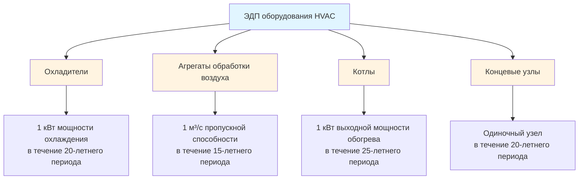

Экологические декларации продуктов (ЭДП) предоставляют стандартизированную, проверенную третьей стороной информацию о воздействии на окружающую среду оборудования HVAC в течение его жизненного цикла. Эти соответствующие ISO 14025 документы количественно определяют экологические нагрузки, включая воплощенный углерод, истощение ресурсов и воздействие на экосистему, позволяя осуществить обоснованный выбор оборудования для устойчивых проектов зданий.

## Основы оценки жизненного цикла

ЭДП основываются на методологии оценки жизненного цикла (LCA) для количественной оценки воздействия на окружающую среду на пяти отдельных этапах:

**Этапы жизненного цикла:**
- **A1-A3 (Этап продукции):** Извлечение сырья, транспортировка на производство и производство
- **A4-A5 (Этап строительства):** Транспортировка на площадку и установка
- **B1-B7 (Этап эксплуатации):** Операции, техническое обслуживание, ремонт, замена и восстановление
- **C1-C4 (Этап конца жизни):** Демонтаж, транспортировка, переработка отходов и утилизация
- **D (За пределами жизненного цикла):** Извлечение, переработка и повторное использование преимуществ

Общее воздействие на окружающую среду $E_{total}$ объединяет вклады всех этапов:

$$E_{total} = \sum_{i=A1}^{A3} E_i + \sum_{j=A4}^{A5} E_j + \sum_{k=B1}^{B7} E_k + \sum_{l=C1}^{C4} E_l + E_D$$

Для оборудования HVAC этапы B6 (энергия эксплуатации) и B7 (вода при эксплуатации) доминируют в общем воздействии на окружающую среду, как правило, представляя 80-95% экологических нагрузок жизненного цикла.

## Количественная оценка углеродного следа

ЭДП сообщают потенциал глобального потепления (GWP) в кг CO₂-эквивалента на объявленную единицу. Для охладителя, работающего в течение его расчетного срока службы:

$$GWP_{total} = GWP_{embodied} + GWP_{operational} + GWP_{refrigerant}$$

Где выбросы при эксплуатации зависят от эффективности и углеродной интенсивности электросети:

$$GWP_{operational} = \frac{Q_{cooling} \cdot t_{operation} \cdot I_{carbon}}{COP \cdot \eta_{plant}}$$

**Переменные:**
- $Q_{cooling}$ = Мощность охлаждения (кВт)
- $t_{operation}$ = Часы работы в течение жизненного цикла (ч)
- $I_{carbon}$ = Углеродная интенсивность электросети (кг CO₂/кВт·ч)
- $COP$ = Коэффициент производительности (безразмерный)
- $\eta_{plant}$ = Коэффициент эффективности системы (безразмерный)

Утечка хладагента способствует дополнительному потенциалу потепления:

$$GWP_{refrigerant} = m_{charge} \cdot L_{annual} \cdot t_{service} \cdot GWP_{ref}$$

Где $m_{charge}$ - масса заряда хладагента (кг), $L_{annual}$ - годовой уровень утечки (%), $t_{service}$ - срок службы (лет), и $GWP_{ref}$ - потенциал потепления, специфичный для хладагента.

## Категории воздействия на окружающую среду

ЭДП оценивают несколько категорий воздействия за пределами изменения климата:

| Категория воздействия | Единица | Значимость для HVAC |
|-----------------|------|----------------|
| Потенциал глобального потепления | кг CO₂-экв | Энергия эксплуатации, выбросы хладагента |
| Потенциал разрушения озона | кг CFC-11-экв | Утечки хладагента, вспенивающие агенты изоляции |
| Потенциал подкисления | кг SO₂-экв | Производственные процессы, производство энергии |
| Потенциал эвтрофикации | кг PO₄-экв | Загрязнение воды при производстве |
| Создание фотохимического озона | кг C₂H₄-экв | Выбросы ЛОС при производстве |
| Истощение абиотических элементов | кг Sb-экв | Извлечение меди, алюминия, редкоземельных элементов |
| Истощение абиотических ископаемых | МДж | Потребление энергии в течение жизненного цикла |
| Истощение воды | м³ | Использование воды при производстве, охлаждение при эксплуатации |

## Правила категории продуктов для HVAC

Правила категории продуктов (PCR) устанавливают методологии расчета и требования к отчетности, специфичные для типов оборудования HVAC. Ключевые документы PCR включают:

**PCR на основе ООН CPC:**
- **Охладители и тепловые насосы:** EN 15804+A2, ISO 21930
- **Агрегаты обработки воздуха:** PCR 2019:14 Construction Products
- **Котлы и печи:** PCR 2012:01 Building Products
- **Концевые узлы:** EN 17213 HVAC Products

Определения функциональной единицы различаются по типам оборудования:

## Моделирование энергии эксплуатации

Стандарт ASHRAE 205 предоставляет стандартизированное представление данных рейтинга производительности, обеспечивая точный расчет энергии эксплуатации для ЭДП. Годовое потребление энергии:

$$E_{annual} = \int_0^{8760} \frac{Q_{load}(t)}{COP(t, T_{outdoor}, PLR)} dt$$

Где $COP(t, T_{outdoor}, PLR)$ представляет эффективность, изменяющуюся во времени, в зависимости от наружной температуры и коэффициента частичной нагрузки. Представление таблиц стандарта 205 обеспечивает точное интегрирование по фактическим профилям нагрузки вместо рейтингов в единой точке.

Для систем переменного расхода хладагента (VRF) одновременная работа охлаждения и обогрева требует моделирования рекуперации энергии:

$$E_{VRF} = E_{cooling} + E_{heating} - E_{recovery} + E_{auxiliary}$$

Эффективность рекуперации зависит от конфигурации сети трубопроводов хладагента и алгоритмов управления.

## Инвентаризация материалов и производство

Инвентаризация материалов ЭДП количественно определяет массу и состав основных компонентов:

| Компонент | Основной материал | Типичная доля массы | Углеродная интенсивность |
|-----------|------------------|----------------------|------------------|
| Теплообменники | Медь, алюминий | 30-45% | 3,5-8,0 кг CO₂/кг |
| Компрессоры | Сталь, медь | 20-35% | 2,0-3,5 кг CO₂/кг |
| Корпуса | Сталь, гальванизированная | 15-25% | 1,8-2,4 кг CO₂/кг |
| Изоляция | Полиуретан, стекловолокно | 5-10% | 3,0-4,5 кг CO₂/кг |
| Хладагент | HFC, HFO, натуральный | 1-3% | 0,2-2,1 кг CO₂/кг |
| Электроника | Печатная плата, полупроводники | 2-5% | 15-50 кг CO₂/кг |

Энергетическая интенсивность производства варьируется в зависимости от сложности оборудования. Производство спирального компрессора требует приблизительно 45-65 МДж/кг готового продукта, в то время как сборка центробежного охладителя потребляет 25-35 МДж/кг благодаря более простым процессам сборки относительно массы продукта.

## Требования проверки третьей стороной

ISO 14025 требует независимую проверку третьей стороной данных и методологии ЭДП. Объем проверки включает:

1. **Соответствие PCR:** Подтверждение того, что объявленная единица, границы системы и категории воздействия соответствуют применимым правилам категории продуктов
2. **Оценка качества данных:** Оценка первичных источников данных, выбора вторичной базы данных и процедур распределения
3. **Проверка расчетов:** Независимый пересчет экологических показателей из данных инвентаризации
4. **Проверка прозрачности:** Оценка допущений, ограничений и раскрытия неопределенности

Операторы программ (UL Environment, EPD International, IBU) поддерживают протоколы проверки и квалификацию рецензентов. Стандарт ASHRAE 203 ссылается на проверку ЭДП как документацию для раскрытия воплощенного углерода оборудования.

## Применение ЭДП в системах рейтинга зеленого строительства

Программы сертификации зеленого строительства включают использование ЭДП:

**Требования LEED v4.1:**
- **MR Credit EPD:** 1-2 балла за продукты с отраслевыми или специфичными для продуктов ЭДП
- **MR Credit Sourcing:** ЭДП демонстрируют ответственное извлечение и производство
- **Минимальные пороги:** 20+ постоянно установленные продукты с ЭДП

**BREEAM International:**
- **Mat 01 LCA:** ЭДП способствуют оценке жизненного цикла на уровне здания
- **Mat 03 Responsible Sourcing:** Проверенные экологические декларации получают баллы

Экологическая ценность $V_{env}$ выбора оборудования на основе сравнения ЭДП:

$$V_{env} = \frac{GWP_{baseline} - GWP_{selected}}{GWP_{baseline}} \cdot 100\%$$

Выбор охладителя с 15% более низким GWP жизненного цикла в сравнении с базовым значением представляет количественное улучшение окружающей среды, поддерживающее документацию сертификации.

## Методология сравнительной оценки

ЭДП позволяют прямое сравнение оборудования при условии идентичных PCR и функциональных единиц. Для выбора воздухоохлаждаемого охладителя:

При сравнении оборудования с различными сроками службы эквивалентное годовое воздействие на окружающую среду обеспечивает нормализованное сравнение:

$$E_{annual,eq} = \frac{E_{total} \cdot r}{1 - (1 + r)^{-n}}$$

Где $r$ представляет норму дисконта для окружающей среды (обычно 0-3%) и $n$ - срок службы в годах.

## Будущие разработки и цифровые ЭДП

Цифровые форматы ЭДП обеспечивают автоматическую интеграцию информационного моделирования зданий (BIM). Расширения схемы IFC4.3 поддерживают присоединение данных ЭДП к объектам строительных элементов, облегчая оценку жизненного цикла всего здания во время проектирования.

Машиночитаемые форматы ЭДП (JSON-LD, XML) обеспечивают вычислительную обработку данных об окружающей среде для алгоритмов оптимизации. Программное обеспечение для моделирования энергии зданий все чаще включает базы данных ЭДП, рассчитывая объединенный операционный и воплощенный углерод во время выбора системы.

Текущий исследовательский проект ASHRAE RP-1868 разрабатывает стандартизированные методологии генерирования ЭДП, специфичные для категорий оборудования HVAC, улучшая согласованность и сравнимость между производителями и типами продуктов.
