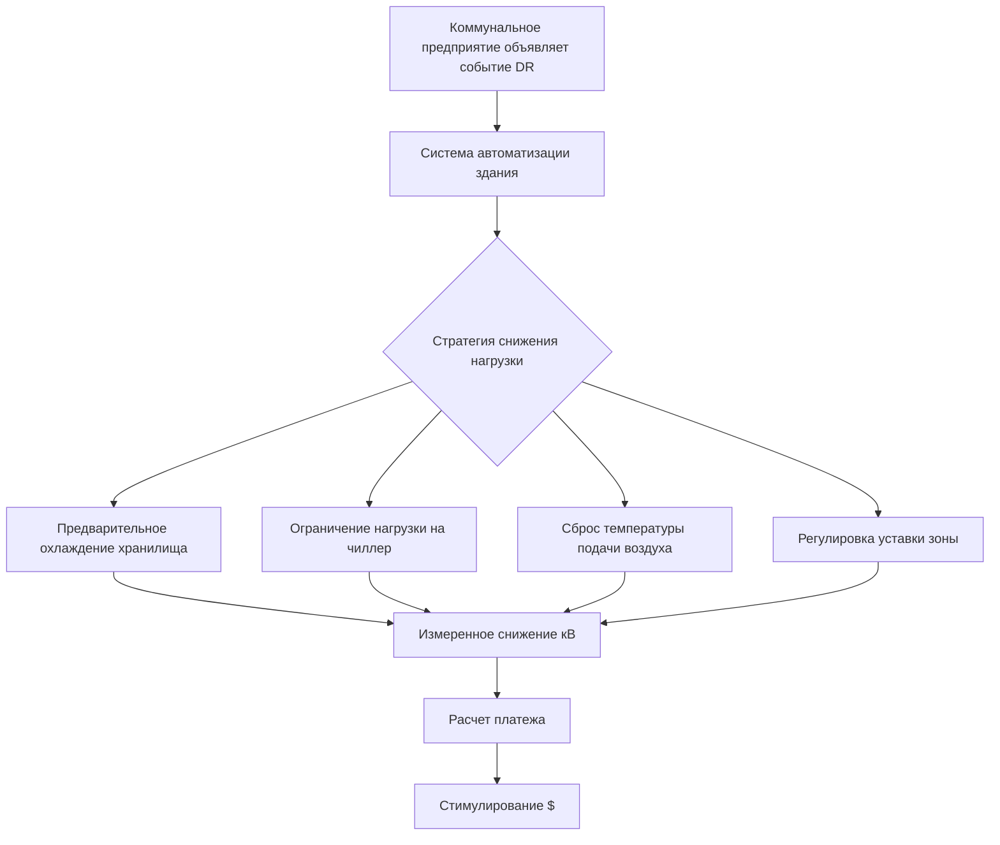

Государственные программы стимулирования существенно снижают барьер первичных затрат на высокоэффективное оборудование и системы HVAC, ускоряя трансформацию рынка в сторону зданий с низким энергопотреблением. Эти программы работают через различные механизмы, включая прямые возмещения, налоговые кредиты, графики ускоренной амортизации, стимулы на основе производительности и структуры низкопроцентного финансирования.

## Механизмы федеральных налоговых кредитов

Инвестиционный налоговый кредит (ITC) для коммерческих систем HVAC предоставляет процентные кредиты для квалифицирующегося энергоэффективного оборудования. Экономическая ценность вытекает из отношения временной стоимости денег:

$$PV_{кредит} = \frac{C_{оборудование} \times r_{кредит}}{(1 + i)^n}$$

где $C_{оборудование}$ представляет стоимость установленного оборудования, $r_{кредит}$ — применимая ставка кредита (обычно 0,10–0,30), $i$ — ставка дисконтирования и $n$ — задержка налогового года. При немедленном применении кредита $n = 0$ и текущая стоимость равна номинальной сумме кредита.

### Коммерческое вычитание зданий раздел 179D

Налоговое вычитание для энергоэффективных коммерческих зданий (179D) вознаграждает проекты, достигающие снижения затрат на энергию относительно базовой производительности стандарта ASHRAE 90.1. Структура вычитания следует многоуровневому подходу:

| Снижение стоимости энергии | Максимальное вычитание | Стоимость компонента HVAC |
|----------------------|-------------------|----------------------|
| ≥25% всего здания | $5,00/м² | $0,65–1,83/м² |
| ≥20% только HVAC | $1,83/м² | $1,83/м² |
| ≥15% только HVAC | $0,65/м² | $0,65/м² |

Вычитание уменьшает налоговый доход, а не налоговое обязательство напрямую. Для налогоплательщика в предельной налоговой ставке $t_m$ экономия после налогообложения становится:

$$S_{179D} = D_{макс} \times A_{пол} \times t_m$$

где $D_{макс}$ — ставка вычитания на квадратный метр и $A_{пол}$ — площадь кондиционируемого помещения.

## Программы управления спросом коммунальных предприятий

Программы управления спросом (DR) компенсируют владельцам зданий за снижение пикового электрического спроса во время критических условий в сети. Системы HVAC представляют собой наибольшую управляемую электрическую нагрузку в большинстве коммерческих зданий, что делает их основными активами DR.

Структура платежей за стимулирование обычно следует:

$$I_{DR} = \sum_{e=1}^{N_e} (кВ_{базовый,e} - кВ_{фактический,e}) \times r_{платеж} \times t_{событие}$$

где $N_e$ — количество событий в сезон, $кВ_{базовый}$ представляет исходную нагрузку клиента, $кВ_{фактический}$ — измеренный спрос во время события, $r_{платеж}$ — ставка платежа ($/кВч) и $t_{событие}$ — продолжительность события.

## Структуры стимулирования на основе производительности

Программы, основанные на производительности, связывают выплаты стимулирования с измеренными энергосбережениями, а не только со спецификациями оборудования. Подход измерения и проверки (M&V) следует процедурам Guideline 14 ASHRAE или Международного протокола измерения и проверки производительности (IPMVP).

Расчет нормализованного годового энергосбережения корректирует вариации погоды:

$$E_{сэкономлено,норм} = E_{базовый,норм} - E_{фактический,норм}$$

где нормализованная энергия определяется путем регрессионного анализа:

$$E_{норм} = a_0 + a_1 \times HDD_{18} + a_2 \times CDD_{18}$$

Коэффициенты $a_0$, $a_1$ и $a_2$ устанавливаются во время базового периода. Градусодни отопления (HDD) и градусодни охлаждения (CDD) используют 18°C в качестве стандартной базовой температуры в соответствии с практикой ASHRAE.

## Преимущества ускоренной амортизации

Модифицированная система ускоренного возмещения стоимости (MACRS) позволяет сокращенные графики амортизации для квалифицирующегося оборудования HVAC. Стандартные системы HVAC следуют 39-летней амортизации для недвижимого имущества, но квалифицирующие улучшения могут использовать графики на 5, 7 или 15 лет.

Текущая стоимость налоговых щитов амортизации в соответствии с MACRS следует:

$$PV_{амортизация} = C_{оборудование} \times t_m \times \sum_{j=1}^{N} \frac{d_j}{(1+i)^j}$$

где $d_j$ представляет коэффициент амортизации MACRS для года $j$, и $N$ — период восстановления. Для имущества на 5 лет коэффициенты составляют [0,20, 0,32, 0,192, 0,1152, 0,1152, 0,0576], отражающие двойное убывающее сальдо с соглашением о половине года.

## Программы возмещения в штатах и на местном уровне

Региональные программы существенно различаются по структуре и уровням финансирования. Общие подходы включают:

**Возмещения на основе мощности**: Платежи на киловатт мощности охлаждения для оборудования, превышающего минимальные пороги эффективности. Типичная структура: $$/кВ = f(EER, IPLV)$ где полнолитровая эффективность (EER) и частичная нагрузка (IPLV) определяют уровни платежей.

**Возмещения на основе энергосбережения**: Платеж рассчитывается на основе прогнозируемого годового снижения энергии:

$$R_{энергия} = \Delta E_{годовой} \times r_{стимул} \times \min\left(1, \frac{C_{кап}}{C_{проект}}\right)$$

где $\Delta E_{годовой}$ — прогнозируемое годовое энергосбережение (кВч/год), $r_{стимул}$ — ставка стимулирования ($/кВч) и функция минимума ограничивает стимулы процентом от стоимости проекта $C_{кап}/C_{проект}$.

## Оптимизация комбинированного стимулирования

Несколько программ стимулирования можно объединить, когда это разрешено нормативами. Оптимальная комбинация максимизирует чистую текущую стоимость (NPV):

$$NPV = -C_{дополнительная} + \sum I_k + PV_{энергосбережения} + PV_{налоговые\,выгоды}$$

где $C_{дополнительная}$ представляет премию стоимости за высокоэффективное оборудование по сравнению с минимумом кода, $\sum I_k$ — сумма применимых возмещений и стимулов, и член текущей стоимости учитывает текущие операционные сбережения и налоговые эффекты.

## Сравнение типов программ стимулирования

| Тип программы | Время платежа | Требование проверки | Уровень риска | Типичное значение |
|-------------|----------------|-------------------------|------------|---------------|
| Возмещение оборудования | После установки | Спецификация + счет | Низкий | $540–5400/кВ |
| На основе производительности | Годовой/текущий | M&V согласно ASHRAE 14 | Средний | $0,18–0,54/кВч сэкономлено |
| Налоговый кредит (ITC) | Налоговый год | Сертификация профессионала | Низкий | 10–30% стоимости |
| Раздел 179D | Налоговый год | Энергомодель + сертификат ПЭ | Средний | $0,65–5,38/м² |
| Управление спросом | За событие | Измерение в реальном времени | Низкий | $540–2160/кВ-год |
| Бонус MACRS | Налоговый год | Классификация активов | Низкий | PV амортизации |

## Требования соответствия и документирования

Участие в программе требует существенного документирования, включая:

- Подробные спецификации оборудования и сертификаты (рейтинги AHRI)
- Сертификация профессиональным инженером прогнозируемой производительности
- Отчеты о проверке установки и наладке согласно Guideline 1.1 ASHRAE
- Текущие данные мониторинга для программ на основе производительности
- Документация налоговой базы для графиков амортизации

Процедуры предварительного одобрения различаются по программам, но обычно требуют подачи документации по проектированию перед закупкой оборудования для обеспечения приемлемости.

## Экономическое воздействие программы

Государственные стимулы снижают простой период окупаемости инвестиций в высокоэффективные системы HVAC:

$$SPP_{со\,стимулом} = \frac{C_{дополнительная} - I_{всего}}{S_{годовой}}$$

по сравнению с базовым:

$$SPP_{базовый} = \frac{C_{дополнительная}}{S_{годовой}}$$

где $I_{всего}$ представляет общую стоимость стимула и $S_{годовой}$ — годовую экономию эксплуатационных расходов. Стимулы, снижающие 30–50% дополнительных затрат, могут превратить экономически маргинальные проекты в благоприятные инвестиции.

Эффективность программ стимулирования в стимулировании трансформации рынка зависит от уровней стимулирования, превышающих пороговую ставку дисконта рынка, и от решения как экономических, так и информационных барьеров для принятия технологии.
