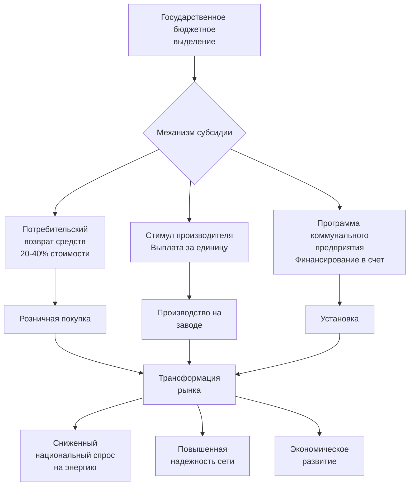

## Обзор

Развивающиеся страны внедряют специализированные программы стимулирования для ускорения внедрения эффективных HVAC систем, одновременно решая уникальные проблемы, включая ограниченный доступ к капиталу, неформальный строительный сектор и быструю урбанизацию. Эти программы используют международное климатическое финансирование, льготное кредитование и стратегии трансформации рынка для снижения первоначальных затрат и развития местного технического потенциала.

Потенциал экономии энергии на развивающихся рынках превышает 40-60% от базового потребления из-за минимальных стандартов эффективности и использования неэффективного оборудования. Программы сосредоточены на жилом охлаждении, коммерческих зданиях и инфраструктуре холодовой цепи, критически важной для экономического развития.

## Категории программ

### Механизмы углеродного финансирования

Международные системы углеродных кредитов обеспечивают потоки доходов для проектов эффективности HVAC за счет верифицированного сокращения выбросов.

**Механизм чистого развития (CDM):**
Проекты генерируют Сертифицированные единицы сокращения выбросов (CER) на основе демонстрируемой экономии энергии:

$$
\text{CERs} = \frac{(E_{\text{baseline}} - E_{\text{project}}) \times \text{EF}_{\text{grid}} \times t}{1000}
$$

Где:
- $E_{\text{baseline}}$ = базовое потребление энергии (кВт·ч/год)
- $E_{\text{project}}$ = потребление энергии проектом (кВт·ч/год)
- $\text{EF}_{\text{grid}}$ = коэффициент выбросов сети (кг CO₂/кВт·ч)
- $t$ = период кредитования (лет)

**Добровольные углеродные рынки:**
Покупатели частного сектора приобретают верифицированные углеродные единицы (VCU) по рыночным ценам в диапазоне 5-50 долларов за тонну CO₂e, обеспечивая дополнительное финансирование проектов для высокоэффективных чиллеров, модернизации зданий и систем районного охлаждения.

### Льготное финансирование

Банки развития и двусторонние агентства предлагают кредиты ниже рыночной ставки для инвестиций в эффективность.

| Учреждение | Процентная ставка | Срок | Льготный период | Применение |
|-------------|----------------|------|-----------------|------------|
| World Bank IBRD | 1,5-3,0% | 15-20 лет | 3-5 лет | Крупная инфраструктура |
| Asian Development Bank | 1,0-2,5% | 20-25 лет | 3-5 лет | Региональные проекты |
| Green Climate Fund | 0-2,0% | 20-40 лет | 5-10 лет | Климатическое смягчение |
| KfW Development Bank | 0,75-1,5% | 20-30 лет | 5-10 лет | Техническое сотрудничество |

**Эффективная стоимость капитала:**

Текущая стоимость экономии энергии определяет жизнеспособность проекта на льготных условиях:

$$
\text{NPV} = \sum_{t=1}^{n} \frac{S_t - C_t}{(1 + r)^t} - I_0
$$

Где:
- $S_t$ = годовая экономия энергии (валюта)
- $C_t$ = годовые эксплуатационные расходы (валюта)
- $r$ = учетная ставка (льготная ставка 1-3%)
- $I_0$ = первоначальные инвестиции
- $n$ = срок службы проекта (лет)

Льготные ставки сокращают периоды окупаемости с 8-12 лет до 3-5 лет для замены коммерческих чиллеров.

### Программы прямых субсидий

Правительства субсидируют эффективное оборудование для снижения барьеров первоначальных затрат.

**Программа India UJALA:**
Распространила 370 миллионов светодиодных ламп и расширила охват на сверхэффективные кондиционеры с 40% субсидией капитала для устройств, достигающих EER ≥ 3,5 Вт/Вт (ISEER ≥ 4,5). Программа снизила пиковый спрос на 9000 МВт.

**Программа Mexico FIDE:**
Предоставляет субсидии, покрывающие 30-50% стоимости оборудования для коммерческих чиллеров, превышающих минимальную эффективность на 20%. Требует проверку производительности третьей стороной в соответствии с протоколами тестирования ASHRAE Standard 90.1.

### Программы технической помощи

Развитие потенциала решает пробелы в знаниях, ограничивающие развертывание эффективных HVAC.

**Компоненты:**
- **Обучение проектированию:** Применение основ ASHRAE для тропического климата
- **Стандарты установки:** Обработка хладагента, герметизация воздуховодов, наладка системы
- **Программы сертификации:** Лицензирование техников, связанное с метриками эффективности
- **Демонстрационные проекты:** Общественные здания, демонстрирующие лучшие практики

**UNEP United for Efficiency (U4E):**
Предоставляет модельные нормативные акты, процедуры испытаний и руководство по политике для разработки минимальных стандартов энергоэффективности (MEPS). Более 60 стран внедрили фреймворки U4E для комнатных кондиционеров.

## Структуры финансирования

### Финансирование на основе результатов

Программы предоставляют выплаты при верификации производительности, а не авансовые субсидии.

**Структура:**

1. **Оценка базового уровня:** Проверка энергопотребления до вмешательства в соответствии с протоколом ASHRAE Level II
2. **Установка:** Развертывание оборудования с независимой верификацией
3. **Период мониторинга:** 12-24 месяца данных измеренного потребления
4. **Расчет платежа:**

$$
P = (E_{\text{saved}} \times C_{\text{energy}} \times f) - C_{\text{admin}}
$$

Где:
- $P$ = выплата исполнителю
- $E_{\text{saved}}$ = верифицированная экономия энергии (кВт·ч)
- $C_{\text{energy}}$ = стоимость энергии (валюта/кВт·ч)
- $f$ = коэффициент распределения (0,5-0,8)
- $C_{\text{admin}}$ = административные расходы

Этот подход передает риск производительности исполнителям и обеспечивает фактическую экономию.

### Смешанное финансирование

Объединяет льготные государственные средства с коммерческим капиталом для улучшения экономики проекта.

**Пример структуры капитала:**
- Грантовое финансирование: 20% (субсидия оборудования)
- Льготный кредит: 30% (2% ставка, 15 лет)
- Коммерческий долг: 30% (8% ставка, 10 лет)
- Собственный капитал: 20% (целевой внутренний коэффициент доходности 15%)

Средневзвешенная стоимость капитала: 6,5% против 12% для чистого коммерческого финансирования.

## Приложения для конкретных секторов

### Жилое охлаждение

Быстрый рост владения домашними кондиционерами (ежегодный рост на 15-30% в Юго-Восточной Азии) определяет направление программ.

**Программа энергоэффективности Bangladesh:**
- Минимальный EER 2,9 Вт/Вт для комнатного кондиционера
- 30% возврат средств для устройств ≥ 3,3 Вт/Вт
- Погашение коммунального предприятия в счет счета в течение 36 месяцев
- Достигнут объем продаж 180 000 единиц за 2 года

### Развитие холодовой цепи

Аграрные экономики требуют эффективной инфраструктуры холодильного оборудования.

**Фонд сельскохозяйственной инфраструктуры India:**
- Выделение 10 миллиардов долларов на холодные хранилища, камеры созревания и упаковочные дома
- Процентная ставка 3% для проектов, использующих аммиак или CO₂-хладагент
- Требования к теплоизоляции: U-value ≤ 0,25 Вт/м²·K согласно ASHRAE Guideline 36
- Минимумы COP: 4,0 для холодного хранилища, 3,5 для транспортного охлаждения

### Коммерческие здания

Программы ориентированы на отели, больницы и розничные помещения с высокими охлаждающими нагрузками.

**Зеленые стимулы зданий Philippines:**
- Налоговые кредиты: 20% от стоимости сертификации зелени
- Налоговые каникулы на доход: 4-6 лет для зданий LEED Gold+
- Освобождение от пошлин: Импортированное высокоэффективное оборудование
- Ускоренная выдача разрешений для проектов, превышающих ASHRAE 90.1 на 30%

## Проблемы реализации

**Проникновение неформального сектора:**
60-80% строительства происходит вне регулируемых каналов во многих странах. Программы должны привлекать неформальных установщиков через обучение и сертификацию, а не через принуждение.

**Ненадежность сети:**
Колебания напряжения и отключения электроэнергии сокращают срок службы оборудования. Стимулы должны включать стабилизаторы напряжения и защиту от скачков напряжения в качестве приемлемых расходов.

**Местная производственная мощность:**
Высокие импортные пошлины на эффективное оборудование (15-35% во многих странах) компенсируют льготы субсидий. Программы все чаще обусловливают стимулы требованиями к местному содержанию.

**Мониторинг и верификация:**
Ограниченная инфраструктура измерения затрудняет верификацию экономии энергии. Статистическая выборка и подходы с допусками в соответствии с протоколами IPMVP предоставляют экономичные альтернативы универсальному измерению.

## Связанные темы

- [Международные метрики эффективности](../../../../international-perspectives/international-efficiency-metrics/cooling-efficiency-global/_index.md)
- [Здания с нулевым энергетическим балансом](../../../../sustainability-emerging-tech-economics/sustainability-green-building/net-zero-energy-buildings/_index.md)
- Методы экономического анализа
- [Системы рейтинга зеленого строительства](../../../../sustainability-emerging-tech-economics/sustainability-green-building/green-building-rating-systems/leed-certification/_index.md)
