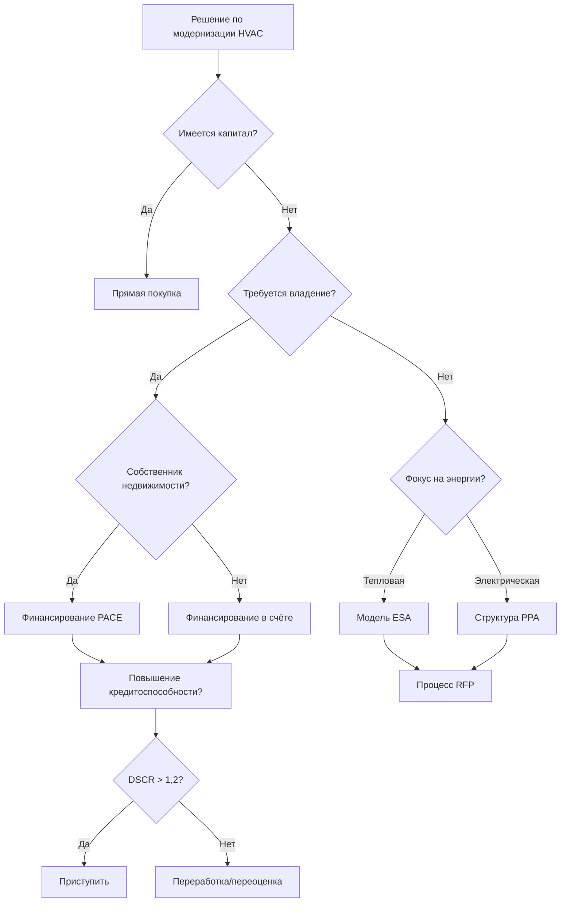

## Обзор

Механизмы финансирования преобразуют капиталоёмкие модернизации HVAC в инвестиции с положительным денежным потоком, выравнивая структуры платежей с экономией энергии. Эти финансовые инструменты решают главное препятствие внедрению энергоэффективности: начальные капитальные требования, часто превышающие 538-1615 $/м² для комплексной модернизации механических систем.

Фундаментальное предложение стоимости опирается на соотношение между обслуживанием долга и снижением затрат на энергию:

$$
NPV_{project} = \sum_{t=1}^{n} \frac{(S_t - P_t - O_t)}{(1+r)^t} - C_0
$$

Где:
- $NPV_{project}$ = Чистая приведённая стоимость финансовой структуры (руб.)
- $S_t$ = Экономия энергии в году t (руб./год)
- $P_t$ = Финансовый платёж в году t (руб./год)
- $O_t$ = Дополнительные затраты на О&М в году t (руб./год)
- $r$ = Ставка дисконтирования (десятичная)
- $C_0$ = Начальные капитальные инвестиции (руб.)
- $n$ = Срок финансирования (годы)

## Property Assessed Clean Energy (PACE)

Финансирование PACE привязывает обязательства по погашению к оценкам налогов на имущество, а не к личному кредитному рейтингу, создавая передаваемые залоговые права, которые сохраняются при смене собственника.

### Структура механизма

Модель, основанная на оценках, позволяет долгосрочное финансирование (15-25 лет), соответствующее сроку службы оборудования. Обязательства по платежам следуют собственности, решая проблему разделённого стимула, когда владельцы зданий не спешат инвестировать в улучшения, когда арендаторы получают выгоду от экономии энергии.

К квалифицированным улучшениям HVAC обычно относятся:
- Замена центральных установок (холодильные машины, котлы, градирни)
- Модернизация кровельных блоков на высокоэффективные модели
- Системы автоматизации и управления зданием
- Установка экономайзеров и модификация воздушных цепей

### Анализ потока денежных средств

Структуры PACE нацелены на коэффициенты покрытия долгом (DSCR) 1,10-1,25:

$$
DSCR = \frac{NOI + E_{savings}}{D_s}
$$

Где:
- $DSCR$ = Коэффициент покрытия долгом (безразмерный)
- $NOI$ = Чистый операционный доход до улучшения (руб./год)
- $E_{savings}$ = Годовое снижение затрат на энергию (руб./год)
- $D_s$ = Годовой платёж по долгу (руб./год)

Для замены холодильной машины стоимостью 500 000 руб. с годовой экономией 75 000 руб., 20-летнее финансирование под 6% даёт:

$$
D_s = C_0 \times \frac{r(1+r)^n}{(1+r)^n-1} = 500{,}000 \times \frac{0.06(1.06)^{20}}{(1.06)^{20}-1} = 43{,}648 \text{ руб./год}
$$

Это даёт DSCR = 75 000 / 43 648 = 1,72, что указывает на сильную жизнеспособность проекта.

## Energy Service Agreements (ESA)

ESA передают собственность оборудования HVAC третьим сторонам-поставщикам, которые продают услуги по тепловой энергии, а не аппаратное обеспечение. Клиент платит за выпуск отопления/охлаждения (руб./кВт-ч или руб./ГДж), а поставщик владеет, эксплуатирует и обслуживает всё механическое оборудование.

### Модели ценообразования, основанные на термодинамике

Цены ESA отражают поставляемую тепловую энергию, скорректированную на эффективность системы:

$$
C_{thermal} = \frac{C_{energy} \times Q_{delivered}}{COP_{seasonal}}
$$

Где:
- $C_{thermal}$ = Стоимость единицы поставляемой тепловой энергии (руб./ГДж)
- $C_{energy}$ = Стоимость энергетического товара (руб./кВт·ч)
- $Q_{delivered}$ = Тепловая энергия, доставленная в зоны (ГДж)
- $COP_{seasonal}$ = Сезонный коэффициент производительности (безразмерный)

Поставщики получают прибыль, устанавливая высокоэффективное оборудование (COP 4,0-5,5), взимая тарифы на основе базовой производительности (COP 3,0-3,5), захватывая маржу эффективности.

### Матрица распределения рисков

| Категория риска | Традиционное владение | Модель ESA |
|--------------|----------------------|-----------|
| Отказ оборудования | Собственник здания | Поставщик услуг |
| Деградация производительности | Собственник здания | Поставщик услуг |
| Устаревание технологии | Собственник здания | Поставщик услуг |
| Волатильность цен на энергию | Собственник здания | Разделённый/хеджированный |
| Рост затрат на техническое обслуживание | Собственник здания | Поставщик услуг |

## Power Purchase Agreements (PPA)

PPA применяются в основном к генерирующим активам (комбинированная генерация, солнечная тепловая энергия, тепловые насосы с наземным источником), где клиенты закупают энергоресурсы по фиксированным ставкам руб./кВт·ч ниже коммунальных тарифов.

### Экономическая структура

Ставка PPA должна удовлетворять:

$$
PPA_{rate} < T_{utility} - \frac{C_{transmission} + C_{distribution}}{E_{annual}}
$$

Где:
- $PPA_{rate}$ = Договорная цена энергии (руб./кВт·ч)
- $T_{utility}$ = Розничный коммунальный тариф (руб./кВт·ч)
- $C_{transmission}$ = Избежанные затраты на передачу (руб.)
- $C_{distribution}$ = Избежанные затраты на распределение (руб.)
- $E_{annual}$ = Годовое производство энергии (кВт·ч/год)

Для систем геотермальных тепловых насосов эффективная ставка PPA отражает как вытеснение энергии отопления, так и охлаждения. Геотермальный тепловой насос мощностью 703 кВт, вырабатывающий 2 000 000 кВт·ч в год по цене 8 руб./кВт·ч, генерирует 160 000 руб./год доходов для разработчика.

## On-Bill Financing (OBF)

OBF интегрирует погашение кредитов в счета коммунальных услуг, используя существующую инфраструктуру выставления счетов коммунальных предприятий и механизмы сбора. Такой подход достигает 95-98% уровня погашения по сравнению с 75-85% для обычных кредитов на оборудование.

### Программы Tariffed On-Bill (TOB)

Коммунальные предприятия возмещают затраты через тарифные надбавки, которые функционируют как неизбежные платежи. Механизм создаёт первоочередные обязательства, которые остаются при счётчике независимо от изменений занятости.

Структуры платежей удовлетворяют ограничению "нейтральности счёта":

$$
\Delta B_{monthly} = S_{monthly} - P_{monthly} \geq 0
$$

Где:
- $\Delta B_{monthly}$ = Чистое изменение ежемесячного счёта (руб.)
- $S_{monthly}$ = Ежемесячная экономия энергии (руб.)
- $P_{monthly}$ = Ежемесячный платёж по финансированию (руб.)

## Сравнительные финансовые показатели

| Механизм | Срок (годы) | Процентная ставка | Требование кредитоспособности | Переводимость |
|-----------|-------------|---------------|-------------------|-----------------|
| PACE | 15-25 | 5,5-7,5% | На основе собственности | Полный переход |
| ESA | 10-20 | Неявный 4-8% | Минимальный | Продолжение услуги |
| PPA | 15-25 | Неявный 5-9% | Кредитоспособность | Переводимый |
| OBF | 5-15 | 0-6% | Умеренный | На основе счётчика |
| Коммерческий кредит | 5-10 | 6-10% | Сильный кредит | Непереводимый |

## Каркас принятия решений при внедрении

## Рассмотрение стандартов ASHRAE

Стандарт ASHRAE 100-2018 (Energy Efficiency in Existing Buildings) устанавливает протоколы энергетических аудитов, которые информируют анализ целесообразности финансирования. Аудиты уровня II (детальные энергетические обследования) обеспечивают точность в пределах ±20% для прогнозов экономии, соответствуя требованиям андеррайтинга для большинства программ.

Для измерения и проверки, ASHRAE Guideline 14-2014 определяет приемлемые допуски калибровки:
- Ежемесячная калибровка: CV(RMSE) ≤ 15%, NMBE ≤ ±5%
- Почасовая калибровка: CV(RMSE) ≤ 30%, NMBE ≤ ±10%

Эти пороги управляют проверкой производительности в контрактах ESA и PPA, защищая как поставщиков, так и клиентов от споров по поводу экономии.

## Практическое применение

Выбор механизма финансирования зависит от организационных ограничений:

**PACE подходит**: Собственникам собственности с долгосрочными периодами владения, стремящимся улучшить стоимость активов при сохранении капитала для основных операций.

**ESA подходит**: Организациям, ищущим учёт операционных расходов, не имеющим возможности обслуживания или требующим гарантированной производительности.

**PPA подходит**: Проектам со значительными генерирующими компонентами, когда производство энергии может быть учтено отдельно от потребления объекта.

**OBF подходит**: Меньшим проектам (1,7-17 млн руб.), где административная простота и высокие уровни погашения оправдывают участие в программе коммунального предприятия.

Оптимальная структура минимизирует средневзвешенную стоимость капитала, одновременно выравнивая обязательства по платежам с измеримой производительностью по энергии.
