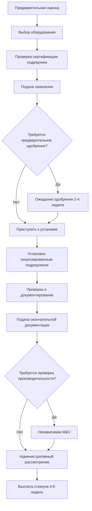

Программы стимулирования региональных органов власти обеспечивают целевую финансовую поддержку для модернизации систем HVAC на основе местных климатических условий, энергетической инфраструктуры и приоритетов политики. Эти программы работают на уровне штатов, провинций, округов и муниципалитетов, предлагая скидки, налоговые кредиты, низкопроцентное финансирование и стимулы на основе производительности, которые дополняют федеральные инициативы.

## Структура программы и администрирование

Региональные программы стимулирования HVAC демонстрируют три основные организационные модели:

**Государственные энергетические офисы** администрируют централизованные программы с единообразными требованиями для всех юрисдикций. Эти офисы устанавливают пороги эффективности, как правило, на 15-25% выше федеральных минимумов, и координируют распределение финансирования через назначенных подрядчиков или прямые заявки потребителей.

**Комиссии коммунальных предприятий** надзирают программы, финансируемые через сборы на основе системы, которые добавляют 0,001-0,005 доллара США за кВт⋅ч к ставкам электроэнергии. Доход финансирует инициативы энергоэффективности, включая модернизацию HVAC, с годовыми бюджетами в диапазоне 5-50 млн долларов США в зависимости от численности населения обслуживаемой территории.

**Муниципальные строительные отделы** реализуют местные постановления, требующие повышения эффективности во время ремонта или замены оборудования. Эти программы интегрируются с процессами лицензирования, делая участие в стимулировании обязательным для одобрения лицензии в прогрессивных юрисдикциях.

## Методологии расчета стимулов

Региональные программы рассчитывают стимулы, используя формулы на основе мощности, эффективности или производительности.

### Стимулы на основе мощности

Простые скидки масштабируются линейно с мощностью оборудования:

$$I_{\text{cap}} = C \times Q$$

где $I_{\text{cap}}$ — размер стимула (долл. США), $C$ — ставка стимула на тонну (долл. США/т), а $Q$ — мощность оборудования (т). Типичные значения варьируются от 150-400 долларов США за тонну для кондиционирования воздуха и 200-600 долларов США за тонну для тепловых насосов.

### Стимулы на основе эффективности

Многоуровневые структуры вознаграждают более высокие уровни эффективности:

$$I_{\text{eff}} = I_{\text{base}} + \Delta I \times (E_{\text{actual}} - E_{\text{min}})$$

где $I_{\text{base}}$ — базовый стимул (долл. США), $\Delta I$ — дополнительный стимул за единицу эффективности (долл. США/единица), $E_{\text{actual}}$ — эффективность установленного оборудования, а $E_{\text{min}}$ — минимальная квалифицирующая эффективность.

### Стимулы на основе производительности

Передовые программы измеряют фактическую экономию энергии:

$$I_{\text{perf}} = \frac{\text{долл. США}}{\text{кВт⋅ч}} \times (E_{\text{baseline}} - E_{\text{measured}}) \times \text{годы}$$

где проверка производительности происходит через поддиапазонное или целостное анализ за периоды базовой линии продолжительностью 12-24 месяца.

## Региональная адаптация климата

Программы калибруют уровни стимулирования для решения региональных климатических проблем и энергетических профилей.

| Климатическая зона | Приоритетная технология | Типовой стимул | Показатель производительности |
|--------------|-------------------|-------------------|-------------------|
| Жарко-влажный | ВС SEER, осушение | 300-500 долл. США/т | SEER ≥16, скрытая мощность |
| Жарко-сухой | Испарительное охлаждение, высокий EER | 200-400 долл. США/т | EER ≥13, энергоэффективность воды |
| Холодный | Тепловые насосы с холодным климатом | 500-1200 долл. США/т | HSPF ≥10, COP при −15°C |
| Смешанный-влажный | Двухтопливные системы, ERV | 400-700 долл. США/система | Интегрированная эффективность |
| Морской | Рекуперация тепла, экономайзеры | 250-600 долл. США/единица | Часы бесплатного охлаждения |

Регионы с холодным климатом приоритизируют тепловую производительность, предлагая улучшенные стимулы для оборудования, сохраняющего ≥70% тепловой мощности при внешней температуре −15°C согласно ASHRAE Standard 116. Программы жаркого климата подчеркивают контроль коэффициента чувствительного тепла (SHR), вознаграждая системы, поддерживающие 0,65-0,75 SHR во всех диапазонах работы.

## Коммерческие структуры программ

Коммерческие и промышленные программы используют более сложные механизмы стимулирования, чем жилые программы.

### Расчет пользовательского стимула

Инженерный анализ определяет экономию в конкретном проекте:

$$I_{\text{custom}} = \min(P \times \Delta E_{\text{annual}} \times C_{\text{energy}}, \text{Cap})$$

где $P$ — процент стимула (обычно 0,30-0,50), $\Delta E_{\text{annual}}$ — верифицированная годовая экономия энергии (кВт⋅ч или термы), $C_{\text{energy}}$ — избежанная стоимость энергии (долл. США/кВт⋅ч), и Cap — максимальный стимул (часто 50% стоимости проекта).

### Интеграция реакции на спрос

Стимулы сокращения пикового спроса дополняют экономию энергии:

$$I_{\text{DR}} = \frac{\text{долл. США}}{\text{кВт}} \times \Delta D_{\text{peak}} \times N_{\text{events}}$$

где $\Delta D_{\text{peak}}$ — контролируемое снижение нагрузки (кВт) и $N_{\text{events}}$ — годовое количество событий (50-100 часов типично). Коммерческие охладители с тепловым аккумулированием получают 300-800 долл. США/кВт смещаемой нагрузки.

## Процесс подачи заявки

## Механизмы финансирования и устойчивость

Региональные программы получают финансирование из множественных источников, которые влияют на долгосрочную стабильность:

**Сборы потребителей** обеспечивают постоянное финансирование, но сталкиваются с политическим давлением во время дебатов о повышении ставок. Программы, финансируемые через сборы общественных выгод, показывают стабильность бюджета от года к году в 85-95%.

**Доход от ценообразования углерода** в юрисдикциях с ограничением и торговлей или налогом на углерод выделяет 10-40% доходов на энергоэффективность зданий. Эти фонды демонстрируют более высокую волатильность, коррелируя с ценами на углеродных рынках и нормативными корректировками.

**Выделения из общих доходов** колеблются в зависимости от законодательных бюджетных циклов, создавая 30-60% годовую изменчивость. Многолетние авторизации улучшают преемственность программы.

## Совмещение стимулов и ограничения

Большинство региональных программ позволяют комбинировать (совмещать) стимулы с федеральными налоговыми кредитами в соответствии с потолком общей стоимости:

$$I_{\text{total}} \leq k \times C_{\text{project}}$$

где $k$ варьируется от 0,50-0,75 в зависимости от типа проекта и юрисдикции. Программы явно запрещают получение множественных стимулов за одно и то же повышение эффективности из разных региональных источников.

## Требования соответствия и проверки

Региональные программы требуют определенных уровней документирования на основе сумм стимулов:

- **Уровень 1 (0-2 500 долл. США)**: Данные с таблички оборудования, счет, фотографии установки
- **Уровень 2 (2 500-10 000 долл. США)**: Вышеуказанное плюс отчет о вводе в эксплуатацию, измерения воздушного потока
- **Уровень 3 (10 000-50 000 долл. США)**: Вышеуказанное плюс инженерные расчеты, энергетическая модель
- **Уровень 4 (>50 000 долл. США)**: Вышеуказанное плюс независимая M&V согласно ASHRAE Guideline 14

Проверка использует статистические методы, обеспечивающие 90% уверенность и 10% точность для заявлений об экономии, превышающих 25 000 долл. США годовой стоимости.

## Требования сети подрядчиков

Программы поддерживают квалифицированные списки подрядчиков, требующие:

- Государственная/провинциальная лицензия HVAC со сроком не менее 3 лет
- Страховое покрытие ответственности ≥1 000 000 долл. США совокупный общий объем
- Завершение программного обучения (8-16 часов)
- Проверка качества установки на 5-15% работ
- Оценки удовлетворенности клиентов ≥4,0/5,0 в среднем за год

Эти требования снижают дефекты установки с базовых показателей отрасли 60-70% до средних показателей программы 15-25%, согласно полевым исследованиям, подтверждающим достигнутую эффективность.

## Результаты производительности

Региональные программы демонстрируют измеримое влияние на внедрение энергоэффективного оборудования. Штаты с комплексными программами стимулирования показывают на 25-40% более высокие средние установленные рейтинги SEER по сравнению со штатами с минимальными программами. Уровни коммерческого участия сильно коррелируют с уровнями стимулирования, увеличиваясь с базовых 8-12% до 35-55%, когда стимулы покрывают 30-50% дополнительных затрат на высокоэффективное оборудование.

Программы, включающие обучение подрядчиков и проверку качества, достигают 85-95% от теоретической экономии энергии, в сравнении с 50-70% для программ, основанных только на стимулировании, без надзора за установкой.
