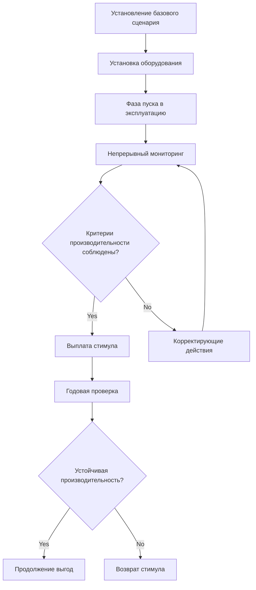

## Обзор ландшафта программ стимулирования HVAC в Азиатско-Тихоокеанском регионе

Правительства стран Азиатско-Тихоокеанского региона применяют разнообразные финансовые механизмы для ускорения внедрения высокоэффективных систем HVAC, начиная от прямых капитальных субсидий до платежей, основанных на производительности. Эти программы решают проблемы быстрой урбанизации и растущего спроса на охлаждение в регионе, который превысил 1800 ТВтч в год по состоянию на 2024 год. Понимание термодинамических и экономических основ этих стимулов позволяет оптимально структурировать проекты.

## Основные региональные категории стимулов

### Системы торговли сертификатами энергоэффективности

Несколько юрисдикций Азиатско-Тихоокеанского региона применяют механизмы, основанные на сертификатах, при которых улучшения в области энергоэффективности HVAC генерируют торгуемые кредиты. Количественная оценка экономии энергии следует стандартизированным протоколам измерения:

$$
E_{saved} = \int_{t_1}^{t_2} (P_{baseline} - P_{actual}) \, dt
$$

где $E_{saved}$ представляет проверенную экономию энергии (кВтч), $P_{baseline}$ — потребление электроэнергии по базовому сценарию (кВ), а $P_{actual}$ — измеренное потребление после модернизации HVAC.

Расчеты стоимости сертификата включают:

$$
V_{cert} = E_{saved} \times CF \times P_{market}
$$

где $V_{cert}$ — стоимость сертификата, $CF$ — коэффициент конвертации (обычно 1 сертификат на МВтч сэкономленной энергии), а $P_{market}$ — рыночная клиринговая цена.

### Программы капитальных субсидий

Прямые капитальные субсидии снижают барьеры начальных инвестиций для оборудования высокой эффективности. Структура субсидий обычно следует ступенчатому подходу на основе коэффициента производительности (COP) или сезонного коэффициента энергоэффективности (SEER):

| Тип оборудования | Мин. энергоэффективность | Размер субсидии | Макс. субсидия |
|---------------|----------------|--------------|--------------|
| Воздухоохлаждаемые чиллеры | COP ≥ 3,2 | 15-25% | $50 000 |
| Водоохлаждаемые чиллеры | COP ≥ 5,5 | 20-30% | $150 000 |
| Системы VRF | SEER ≥ 16 | 10-20% | $30 000 |
| Тепловые насосы | COP ≥ 4,0 | 15-25% | $40 000 |

Экономическая оптимизация учитывает сроки субсидирования и тепловую производительность:

$$
NPV = \sum_{n=1}^{N} \frac{S_n}{(1+r)^n} + S_{initial} - C_{total}
$$

где $NPV$ — чистая приведенная стоимость, $S_n$ — годовая экономия энергии, $r$ — ставка дисконтирования, $S_{initial}$ — авансовая субсидия, а $C_{total}$ — общая стоимость проекта.

## Структуры программ по странам

### Программа энергоэффективности Сингапура

Сингапур предлагает субсидии, основанные на производительности, которые покрывают до 50% квалифицирующихся затрат на модернизацию чиллерных установок. Условия приемлемости включают:

- Минимальное снижение энергоемкости на 10%
- Соответствие стандарту энергоэффективности SS 564
- Независимое измерение и верификация (M&V)

Расчет субсидии включает плотность нагрузки охлаждения и часы работы:

$$
G_{max} = Q_{cooling} \times h_{annual} \times (COP_{new}^{-1} - COP_{existing}^{-1}) \times C_{energy} \times M \times 0.5
$$

где $G_{max}$ — максимальная субсидия, $Q_{cooling}$ — проектная пропускная способность охлаждения (кВ), $h_{annual}$ — годовые часы работы, а $M$ — множитель субсидии (обычно 3-5 лет).

### Субсидия Японии на передовое энергосберегающее оборудование

Министерство экономики, торговли и промышленности Японии (METI) предоставляет субсидии для систем HVAC, превышающих стандарты Top Runner на 15% или более. Программа делает акцент на технологии переменного хладагентного потока (VRF) и системы рекуперации тепла.

Требования к эффективности рекуперации тепла соответствуют:

$$
\epsilon_{HR} = \frac{Q_{recovered}}{Q_{available}} = \frac{h_2 - h_1}{h_3 - h_1} \geq 0.65
$$

где $\epsilon_{HR}$ — эффективность рекуперации тепла, $h_1$ — энтальпия приточного воздуха, $h_2$ — энтальпия воздуха возврата, а $h_3$ — энтальпия вытяжного воздуха.

### Программа энергоэффективности оборудования Австралии

Австралия предписывает минимальные стандарты энергетической производительности (MEPS) в сочетании с программами сертификации на уровне штатов. Новый Южный Уэльс и Виктория управляют программами сертификатов экономии энергии (ESC), при которых модернизация HVAC генерирует сертификаты на основе предполагаемой экономии.

Генерация сертификатов для кондиционирования воздуха следует:

$$
ESC = \frac{P_{rated} \times h_{equivalent}}{EER_{baseline}} - \frac{P_{rated} \times h_{equivalent}}{EER_{actual}} \times \frac{1}{3.6}
$$

где $P_{rated}$ — номинальная холодопроизводительность (кВ), $h_{equivalent}$ — эквивалентные часы полной нагрузки, а значения коэффициента энергоэффективности (EER) определяют потребление по базовому сценарию относительно фактического потребления.

### Стимулы сертификации зеленого строительства Южной Кореи

Южная Корея связывает энергоэффективность HVAC с уровнями сертификации Green Standard for Energy and Environmental Design (G-SEED). Финансовые выгоды включают:

- Бонусы соотношения площади пола (до 15%)
- Снижение налога на имущество (15-30% в течение 5 лет)
- Ускоренные процессы разрешения

Вклад HVAC в оценку G-SEED требует:

$$
Score_{HVAC} = w_1 \times f(COP) + w_2 \times f(Controls) + w_3 \times f(Renewables)
$$

где коэффициенты взвешивания $w_1, w_2, w_3$ в сумме составляют 100%, а функции $f$ преобразуют технические параметры в нормализованные баллы.

## Методологии проверки производительности

Программы Азиатско-Тихоокеанского региона все чаще требуют соответствия Международному протоколу измерения и верификации производительности (IPMVP). Опция B (изоляция модернизации) остается наиболее распространенной для проектов HVAC, измеряя потребление энергии на границах оборудования.

Анализ неопределенности для определения экономии следует:

$$
U_{total} = \sqrt{U_{baseline}^2 + U_{reporting}^2 + U_{sampling}^2}
$$

где $U_{total}$ представляет общую неопределенность с отдельными компонентами для установления базового сценария, измерений в периоде отчетности и ошибки выборки, обычно поддерживаемыми ниже 20% при доверительном уровне 90%.

## Оптимизация стимулов для конкретных технологий

### Интеграция привода с переменной скоростью

Многие программы предоставляют повышенные стимулы для чиллерных установок, включающих приводы с переменной скоростью (VSD) на компрессорах и вспомогательном оборудовании. Усиление эффективности при частичной нагрузке оправдывает более высокие субсидии:

$$
кВ/кВт_{avg} = \frac{\sum_{i=1}^{8760} P_i}{\sum_{i=1}^{8760} Q_i} \times 12
$$

где почасовое потребление электроэнергии $P_i$ и охлаждаемая мощность $Q_i$ определяют интегрированное значение при частичной нагрузке (IPLV), используемое для назначения уровня стимула.

### Системы аккумулирования тепловой энергии

Программы, поддерживающие аккумулирование тепловой энергии (TES), признают выгоды от сдвига нагрузки помимо улучшений эффективности. Расчеты стимулов включают снижение платежей по спросу:

$$
Savings_{annual} = E_{shifted} \times (C_{peak} - C_{off-peak}) + P_{demand} \times C_{demand} \times 12
$$

где $E_{shifted}$ — энергия, перемещенная с пиковых на внепиковые периоды, $P_{demand}$ — снижение спроса (кВ), а $C$ — компоненты тарифов на электроэнергию.

## Стратегия подачи заявок и требования к документации

Успешное получение стимулов требует всесторонней технической документации:

- Энергетические аудиты ASHRAE уровня II (минимум) для проектов, превышающих $100 000
- Анализ гидродинамики вычислительной жидкости (CFD) для сложных модификаций распределения воздуха
- Психрометрические расчеты, демонстрирующие производительность контроля влажности
- Технические характеристики систем обнаружения утечек хладагента в соответствии со стандартом ASHRAE 15

Экономический анализ должен продемонстрировать дополнительную экономическую эффективность:

$$
SIR = \frac{PV_{savings}}{C_{incremental}} \geq Threshold_{program}
$$

где пороги коэффициента экономии к инвестициям (SIR) обычно варьируются от 1,0 до 1,5 в зависимости от юрисдикции и категории технологии.

## Заключение

Программы стимулирования HVAC в Азиатско-Тихоокеанском регионе предоставляют существенную финансовую поддержку для модернизации энергоэффективности, когда проекты соответствуют техническим требованиям программы и протоколам проверки. Разнообразие механизмов — от торгуемых сертификатов до прямых субсидий — позволяет использовать индивидуальные подходы на основе масштаба проекта, выбора технологии и региональных нормативно-правовых базис. Оптимальное получение стимулов требует анализа программы на ранних стадиях, интегрированного с термодинамическим проектированием системы для максимизации как энергетической производительности, так и экономических результатов.
