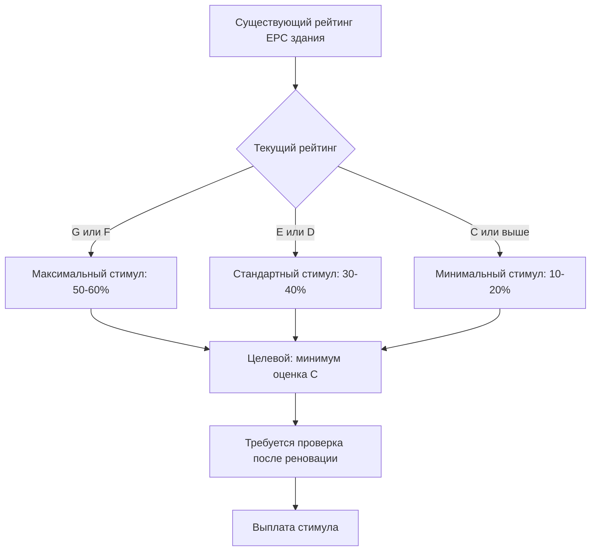

## Обзор европейской системы стимулирования HVAC

Европейские программы стимулирования HVAC работают в рамках комплексной нормативно-правовой и финансовой системы, обусловленной амбициозными климатическими целями. Обязательство Европейского союза достичь климатической нейтральности к 2050 году устанавливает сокращение выбросов в секторе зданий как критически важную задачу, при этом системы HVAC представляют 40-50% энергопотребления зданий. Государства-члены внедряют стимулы через прямые субсидии, налоговые кредиты, льготные кредиты и нормативные требования в соответствии с Директивой об энергетической эффективности зданий (EPBD).

Структура стимулирования приоритизирует развертывание тепловых насосов, отказ от ископаемого топлива в системах отопления и интеграцию возобновляемых источников энергии. Механизмы финансовой поддержки значительно различаются между государствами-членами, но имеют общие задачи снижения первичного энергопотребления, исключения хладагентов с высоким потенциалом глобального потепления и достижения стандартов практически нулевого потребления энергии (NZEB).

## Стимулы развертывания тепловых насосов

Субсидии на тепловые насосы являются крупнейшей категорией европейских стимулов HVAC, отражая политический акцент на электрификацию отопления и охлаждения. Государства-члены предоставляют капитальные гранты, покрывающие 20-60% стоимости установки в зависимости от эффективности системы и интеграции возобновляемой энергии.

### Методология расчета субсидии

Размеры стимулирования теплового насоса непосредственно коррелируют с сезонным коэффициентом производительности (SCOP) и мощностью. Величина субсидии $S$ обычно рассчитывается по формуле:

$$S = C_{base} + k \cdot Q_{rated} \cdot (SCOP - SCOP_{min})$$

Где:
- $C_{base}$ = базовая субсидия (€2000-€5000)
- $k$ = множитель производительности (€100-€300 за кВт)
- $Q_{rated}$ = номинальная тепловая мощность (кВт)
- $SCOP$ = сезонный коэффициент производительности
- $SCOP_{min}$ = минимальный квалифицирующий SCOP (обычно 3,5-4,0)

Повышенные субсидии применяются к тепловым насосам с грунтовым источником, которые достигают более высоких значений SCOP (4,5-5,5) по сравнению с воздушными системами (3,0-4,5) благодаря стабильным температурам грунта. Термодинамическое преимущество вытекает из сниженной разницы температур между источником и приемником:

$$COP_{Carnot} = \frac{T_{cond}}{T_{cond} - T_{evap}}$$

Где температуры указаны в Кельвинах. Системы с грунтовым источником поддерживают $T_{evap}$ на уровне 5-10°C даже в зимний период, по сравнению с -10 до 0°C для воздушных систем, напрямую улучшая теоретический и фактический COP.

## Сравнение национальных программ

| Страна | Субсидия на тепловой насос | Поддержка солнечного теплоснабжения | Запрет природного газа | Стандарт NZEB | Требование EPC |
|---------|------------------|----------------------|-----------------|---------------|-----------------|
| Германия | до €40 000 (35-50%) | €2000-€3500 | Новостройки 2024 | Да | Обязательно при продаже/сдаче в аренду |
| Франция | €4000-€11 000 | €2000-€4000 | Новостройки 2022 | Да | Обязательно при продаже/сдаче в аренду |
| Нидерланды | €2000-€7500 | €1500-€3000 | Все к 2026 | Да | Обязательно при продаже/сдаче в аренду |
| Италия | Налоговый кредит 65% | Налоговый кредит 65% | Нет общенационального запрета | Да | Обязательно при продаже/сдаче в аренду |
| Великобритания | £5000-£7500 | £300-£600 | Новостройки 2025 | Да | Обязательно при продаже/сдаче в аренду |
| Швеция | Налоговое снижение 30% | Включено в программу реновации | Нет общенационального запрета | Да | Обязательно при продаже/сдаче в аренду |

## Требования к интеграции возобновляемых источников энергии

Европейские программы стимулирования все чаще требуют интеграцию возобновляемых источников энергии для получения максимальных уровней поддержки. Это отражает требование Директивы об энергетической эффективности зданий о том, что все новые здания должны быть практически нулевого потребления энергии (NZEB), определяемых как имеющие очень высокие энергетические характеристики с основным источником энергии из возобновляемых источников.

### Стимулы для комбинированных систем

Системы, интегрирующие несколько возобновляемых технологий, получают повышенные субсидии. Типовая конфигурация объединяет:

1. **Воздушный тепловой насос вода-вода** для основной нагрузки отопления/охлаждения
2. **Солнечные тепловые коллекторы** для предварительного нагрева горячей воды для хозяйственных нужд
3. **Фотоэлектрический массив** для компенсации электроэнергии компрессора

Коэффициент первичной энергии (PER) комбинированной системы определяет уровень стимула:

$$PER = \frac{Q_{delivered}}{Q_{primary}} = \frac{Q_{delivered}}{\frac{E_{grid}}{f_{grid}} + \frac{E_{fuel}}{f_{fuel}}}$$

Где:
- $Q_{delivered}$ = полезная тепловая/холодопроизводительность (кВт·ч/год)
- $E_{grid}$ = электроэнергия из сети (кВт·ч/год)
- $E_{fuel}$ = потребление ископаемого топлива (кВт·ч/год)
- $f_{grid}$ = коэффициент первичной энергии электроэнергии из сети (2,0-2,5)
- $f_{fuel}$ = коэффициент первичной энергии топлива (1,1 для природного газа)

Стандарты NZEB требуют PER ≥ 0,8, достижимые с высокоэффективными тепловыми насосами (SCOP > 4,5) и существенным вкладом возобновляемых источников.

## Связь стимулирования с сертификатом энергетической эффективности

Сертификаты энергетической эффективности (EPC) устанавливают обязательную маркировку энергоэффективности зданий в ЕС с оценками от A (наиболее эффективно) до G (наименее эффективно). Многие программы стимулирования дифференцируют поддержку на основе улучшения рейтинга EPC:

Методология расчета EPC следует стандартам EN 15217 и EN 15603, вычисляя годовое первичное энергопотребление на квадратный метр. Замена системы HVAC обеспечивает наибольшее единовременное улучшение возможностей, причем высокоэффективные тепловые насосы снижают потребление первичной энергии на 50-70% по сравнению с обычными котлами.

## Программы поэтапного отказа от ископаемого топлива для отопления

Несколько европейских стран внедряют прямые запреты на использование ископаемого топлива в системах отопления в сочетании со стимулами замены. Эти программы ускоряют декарбонизацию строительного фонда путем обязательного перехода на новые технологии с одновременной финансовой поддержкой.

### Немецкая программа BEG (Bundesförderung für effiziente Gebäude)

Комплексная программа субсидирования энергоэффективности зданий Германии предлагает:

- **35% субсидия** на замену теплового насоса вместо функционирующих ископаемых систем
- **45% субсидия** на замену систем масляного отопления
- **50% субсидия** при сочетании с индивидуальным планом реновации
- **Дополнительно 5%** для тепловых насосов с натуральными хладагентами (пропан, CO₂)

Программа явно отдает предпочтение хладагентам с низким потенциалом глобального потепления, что согласуется с требованиями регулирования F-gas по поэтапному сокращению доступности ХФУ. Системы с натуральными хладагентами не подвергаются риску будущих нормативных ограничений, что оправдывает повышенные уровни субсидирования.

### Французская программа MaPrimeRénov

Франция реструктурировала стимулы в 2020 году для ускорения жилищных реноваций:

- **Субсидии в зависимости от дохода**: €3000-€11 000 для тепловых насосов в зависимости от доходов домохозяйства
- **Обязательный отказ от ископаемого топлива**: приоритет замене масляных и газовых котлов
- **Требования производительности**: минимум SCOP 3,9 для воздушных систем, 4,5 для грунтовых
- **Бонус за интеграцию**: дополнительные €1000 за интеграцию солнечного теплоснабжения или ФЭ

Структура, основанная на доходах, обеспечивает справедливый доступ при сохранении высоких стандартов производительности. Домохозяйства с более низкими доходами получают до €11 000 на установку воздушного теплового насоса вода-вода, покрывающей 80-90% типовых расходов.

## Стимулы систем централизованного теплоснабжения и ТЭЦ

Помимо систем отдельных зданий, европейские программы поддерживают сети централизованного теплоснабжения и установки комбинированного теплоэлектроснабжения (ТЭЦ). Эти технологии достигают превосходной системной эффективности за счет рекуперации тепла отходящих газов и снижения потерь при распределении.

### Критерии эффективности ТЭЦ

Стимулы ТЭЦ требуют демонстрации экономии первичной энергии по сравнению с раздельной генерацией тепла и электроэнергии. Расчет экономии первичной энергии (PES):

$$PES = \left(1 - \frac{1}{\frac{\eta_{CHP,heat}}{\eta_{ref,heat}} + \frac{\eta_{CHP,elec}}{\eta_{ref,elec}}}\right) \times 100\%$$

Где:
- $\eta_{CHP,heat}$ = тепловая эффективность ТЭЦ
- $\eta_{CHP,elec}$ = электрическая эффективность ТЭЦ
- $\eta_{ref,heat}$ = эффективность базового котла (0,90)
- $\eta_{ref,elec}$ = эффективность сетевого электроснабжения (0,52 включая генерацию и передачу)

Квалифицирующиеся системы должны достигать PES ≥ 10%, с повышенными субсидиями для PES ≥ 15%. Современные установки ТЭЦ на природном газе достигают $\eta_{CHP,heat}$ = 0,50-0,55 и $\eta_{CHP,elec}$ = 0,35-0,40, обеспечивая PES 15-25%.

## Программы ускорения для коммерческих зданий

Стимулы HVAC для коммерческих зданий делают упор на комплексные подходы ко всему зданию и передовые системы управления для максимизации энергосбережения. Программы обычно требуют энергоаудитов уровня 2 ASHRAE, демонстрирующих прогнозируемое энергосбережение перед утверждением стимулов.

### Поддержка систем переменного холодопроизводительного потока (VRF)

Системы VRF получают существенные субсидии в проектах реновации благодаря превосходной эффективности при частичной нагрузке и возможностям рекуперации тепла. Уровни стимулирования отражают потенциал снижения энергетических расходов:

$$\text{Годовая экономия} = \sum_{i=1}^{8760} \left(Q_{i} \times \left(\frac{1}{COP_{conventional,i}} - \frac{1}{COP_{VRF,i}}\right) \times C_{elec}\right)$$

Где:
- $Q_{i}$ = почасовая тепловая/холодопроизводительность (кВт)
- $COP_{conventional,i}$ = почасовой COP обычной системы
- $COP_{VRF,i}$ = почасовой COP системы VRF
- $C_{elec}$ = стоимость электроэнергии (€/кВт·ч)

Системы VRF поддерживают COP выше 3,0 при частичной нагрузке (20-50% мощности), в то время как обычные системы деградируют до COP 2,0-2,5, производя 30-40% годовое энергосбережение в типовых коммерческих приложениях.

## Стратегии внедрения и процессы подачи заявок

Успешное получение стимулов требует понимания процедур подачи заявок, требований к технической документации и процессов проверки соответствия. Большинство программ следуют аналогичным структурам:

1. **Предустановочное одобрение**: заявка подается с энергоаудитом и спецификациями системы
2. **Техническая проверка**: проверка критериев эффективности и расчета мощности
3. **Установка сертифицированными подрядчиками**: обеспечение качества благодаря сертификации установщиков
4. **Проверка производительности**: тестирование и документирование наладки после установки
5. **Выплата стимула**: платеж после представления счетов и отчетов о проверке

Стандарт ASHRAE 211 предоставляет общепринятые методологии для оценки энергоэффективности коммерческих зданий, в то время как программы для жилищного сектора обычно принимают упрощенные инструменты расчетов, основанные на стандартах EN 15316 для систем отопления и охлаждения.

## Будущее развитие программ

Европейские программы стимулирования HVAC продолжают развиваться в направлении более амбициозных целей. Ожидаемые разработки включают:

- **Обязательная установка тепловых насосов** при крупных реновациях (пересмотр EPBD)
- **Требования к натуральным хладагентам** для всех субсидируемых систем к 2030 году
- **Сетеориентированные элементы управления**, стимулируемые для обеспечения гибкости спроса
- **Требования по воплощенному углеводороду** для хладагентов и производства оборудования
- **Стимулы, основанные на производительности** с проверкой мониторинга после установки

Эти тенденции отражают признание того, что достижение климатической нейтральности к 2050 году требует трансформации практически всего строительного фонда в течение 25 лет, что требует устойчивой финансовой поддержки в сочетании с прогрессивными нормативными требованиями.
