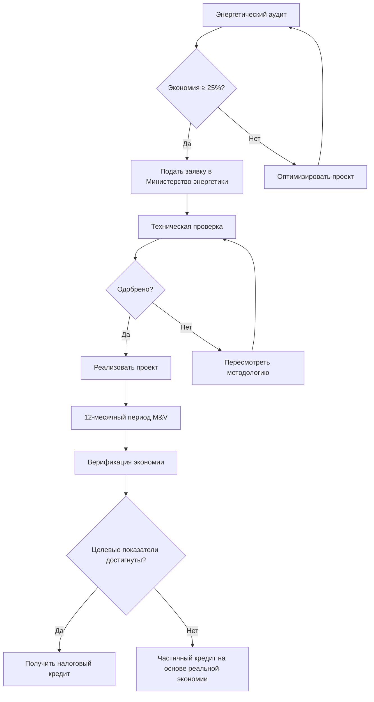
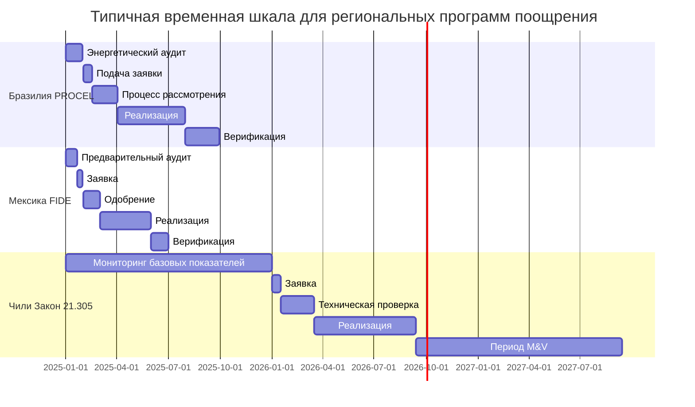

## Региональная нормативно-правовая база

Страны Латинской Америки внедрили разнообразные структуры поощрения для повышения эффективности систем HVAC, обусловленные давлением урбанизации, климатическими обязательствами по Парижскому соглашению и проблемами энергетической безопасности. Программы существенно различаются по странам, но имеют общие цели: снижение пиковой электрической нагрузки, повышение энергетической производительности зданий и переход на хладагенты с низким потенциалом глобального потепления.

Эффективность программ поощрения зависит от стандартизированных протоколов измерений. Большинство программ в Латинской Америке ссылаются на адаптированные версии ASHRAE Standard 90.1 или платформы управления энергией ISO 50001 с учетом страновых модификаций для тропического и субтропического климата.

## Программы энергоэффективности в Бразилии

### PROCEL Building Label (Этикетка PBE Edifica)

Добровольная программа маркирования Бразилии оценивает коммерческие здания по шкале от A (наиболее эффективное) до E, где системы HVAC составляют 40–50% общей оценки в тропическом климате. Здания, достигшие рейтинга уровня A, имеют право на:

- Снижение федерального налога до 15% на IPTU (налог на имущество)
- Ускоренные графики амортизации для энергоэффективного оборудования
- Льготное финансирование через BNDES (Национальный банк развития) на 2–4% ниже рыночных ставок

**Технические требования к вкладу HVAC:**

| Уровень рейтинга | Минимальный COP | Максимальный EER (кДж/кВт·ч) | Утечка воздуховодов (м³/ч на м²) |
|------------------|-----------------|------------------------------|----------------------------------|
| A                | 3,5             | 13,1                         | < 0,21                           |
| B                | 3,2             | 11,7                         | < 0,32                           |
| C                | 2,9             | 10,3                         | < 0,43                           |

Расчет энергетической производительности выполняется следующим образом:

$$
\text{EPI} = \frac{E_{\text{annual}}}{A_{\text{conditioned}}} \times \text{CF}_{\text{climate}}
$$

Где EPI — индекс энергетической производительности (кВт·ч/м²·год), $E_{\text{annual}}$ представляет общее годовое потребление энергии, $A_{\text{conditioned}}$ — кондиционируемую площадь, а $\text{CF}_{\text{climate}}$ — коэффициент климатической коррекции (0,85–1,15 в зависимости от градусо-часов охлаждения).

### Стандарты эффективности INMETRO

Национальный институт метрологии (INMETRO) поддерживает обязательные минимальные стандарты эффективности для оборудования кондиционирования воздуха. Установки, превышающие требования на 20%, имеют право на государственные скидки в среднем 200–800 R$ за 3,517 кВт охлаждающей способности.

## Структура поощрения HVAC в Мексике

### FIDE (Fideicomiso para el Ahorro de Energía Eléctrica)

FIDE администрирует основной фонд энергоэффективности Мексики, предоставляя прямые субсидии для модернизации коммерческих и промышленных систем HVAC:

**Стимулы для коммерческих зданий:**
- Возмещение до 30% капитальных затрат для систем переменного хладоносителя (VRF)
- Субсидия 25% для высокоэффективных чиллеров (кВт/кВт охлаждения < 0,60)
- Бесплатные энергетические аудиты для объектов с охлаждающей способностью более 88,7 кВт

**Методология расчета стимулов для чиллеров:**

$$
\text{Incentive} = (\text{Baseline кВт/кВт} - \text{Actual кВт/кВт}) \times \text{Capacity}_{\text{кВт}} \times \text{FLH} \times \text{Cost}_{\text{кВт·ч}} \times 3
$$

Где FLH представляет часы полной нагрузки (обычно 2000–3000 для коммерческих зданий в Мексике), а коэффициент 3 приблизительно соответствует порогу окупаемости за три года.

### Стандарты NOM-020-ENER

Мексиканские официальные стандарты (NOM) устанавливают минимальные сезонные коэффициенты энергоэффективности (SEER). Оборудование, превышающее NOM-020-ENER на ≥15%, имеет право на ускоренное налоговое вычисление согласно статье 34 Закона о подоходном налоге, позволяющем 100% первогодичную амортизацию вместо стандартных 10-летних графиков.

## Программы энергоэффективности в Чили

### Закон 21.305 Рамки энергоэффективности

Закон Чили 2021 года об энергоэффективности предусматривает:
- Крупные здания (>3000 м²) должны внедрить системы управления энергией
- Модернизация HVAC, достигающая энергосбережения ≥25%, получает налоговые кредиты корпорации, равные 50% от инвестиционных затрат (максимум 15 000 UTM ≈ 900 000 USD)
- Государственные здания должны достичь сертификации LEED Gold или эквивалента, создавая предпочтения при закупках для эффективных технологий HVAC

**Требования верификации:**
- Измерение и верификация до/после модернизации согласно ASHRAE Guideline 14
- Максимум 15% CV(RMSE) для месячных энергетических моделей
- Минимум 12-месячный базовый период

## Стимулы возобновляемой энергии в Колумбии

Закон 1715 предусматривает льготы для систем HVAC на базе возобновляемых источников энергии:
- Налоговое вычитание 50% от инвестиций в возобновляемую энергию
- Освобождение от НДС (19%) для оборудования солнечного отопления и тепловых насосов с грунтовым источником
- Освобождение от таможенной пошлины на импортные компоненты для систем солнечного охлаждения

**Экономика солнечного абсорбционного чиллера:**

Для 35,0 кВт солнечного абсорбционного чиллера в Боготе (1800 часов годовой инсоляции):

$$
\text{Годовая экономия} = \text{COP}_{\text{elec}} \times \frac{\text{кВт} \times 3,517}{\text{EER}_{\text{baseline}}} \times \text{FLH}
$$

С налоговыми стимулами согласно Закону 1715, снижающими эффективную капитальную стоимость примерно на 60%, простые периоды окупаемости снижаются с 12–15 лет до 5–7 лет.

## Программы энергоэффективности в Аргентине

### PRONUREE (Национальная программа рационального и эффективного использования энергии)

Промышленные объекты, реализующие меры по повышению эффективности HVAC, имеют право на:
- Субсидированное техническое содействие (охватывающее 70% затрат на аудит)
- Низкопроцентное финансирование (ставка BADLAR минус 4 процентных пункта)
- Ускоренную амортизацию для квалифицированных инвестиций

Минимальные технические требования включают:
- Коэффициент производительности (COP) ≥ 3,0 для чиллеров
- Приводы с переменной скоростью на всех вентиляторах и насосах >3,73 кВт
- Работа экономайзера при $T_{\text{внешняя}} < T_{\text{возврата}} - 2,8°C$

## Стимулы зеленого строительства в Коста-Рике

Декрет 37071-MINAE устанавливает налоговые льготы для зданий, отвечающих критериям устойчивого проектирования. Положения по HVAC включают:

- 5-летнее освобождение от импортных пошлин на высокоэффективное оборудование (SEER ≥ 16)
- Снижение налога на имущество на 10% для зданий, использующих технологии возобновляемого охлаждения
- Ускоренное оформление разрешений для проектов, включающих естественную вентиляцию согласно ASHRAE Standard 62.1 раздел 5.1

## Налоговые льготы зеленого строительства в Перу

Законодательный декрет 1257 предусматривает снижение налога на имущество (10–25%) для зданий, достигших сертификации EDGE (Excellence in Design for Greater Efficiencies). Системы HVAC должны продемонстрировать:

- 20% снижение энергии в сравнении с базовым показателем ASHRAE 90.1
- Хладагенты с потенциалом глобального потепления < 675
- Минимум 30% пропускная способность приточного воздуха с экономайзером для применимых климатических зон

$$
\text{Снижение налога} = 0,10 + \left(0,15 \times \frac{\text{Энергосбережение} - 20\%}{30\%}\right)
$$

Максимальное снижение 25% достигается при 50% энергосбережении.

## Региональные технические соображения

### Адаптация к тропическому климату

Программы поощрения в Латинской Америке все чаще признают метрики производительности, специфичные для климата. Коэффициент интенсивности охлаждения учитывает круглогодичные потребности в охлаждении:

$$
\text{CLI} = \frac{\text{Пиковая охлаждающая нагрузка (кВт)}}{{A_{\text{floor}} \text{ (м²)}}}
$$

Типичные значения CLI колеблются от 79–111 Вт/м² для эффективного тропического строительства с надлежащим затенением и проектированием оболочки в сравнении с 142–189 Вт/м² для базовых зданий.

### Стимулы переходного периода хладагентов

Несколько стран предлагают повышенные стимулы для принятия хладагентов с низким потенциалом глобального потепления:

| Страна     | Тип стимула                           | Порог ПГП | Дополнительное преимущество |
|-----------|---------------------------------------|-----------|---------------------------|
| Бразилия   | Кредит рейтинга PROCEL               | < 150     | +5% к оценке эффективности |
| Чили       | Приоритетная обработка              | Природный | 30-дневный цикл проверки  |
| Мексика    | Бонус FIDE                           | < 675     | +10% к капитальной субсидии |
| Колумбия   | Расширенный период налогового кредита | < 150     | 7 лет вместо 5 лет         |
| Аргентина  | Освобождение от импортной пошлины   | Природный | 100% отмена тарифа        |

## Стратегия реализации

Успешное участие в программе требует:

1. **Документирование базовых показателей**: Установить 12-месячное потребление энергии до модернизации с анализом счетов коммунальных служб или непрерывным мониторингом согласно протоколам IPMVP
2. **Моделирование производительности**: Продемонстрировать прогнозируемую экономию с использованием DOE-2, EnergyPlus или локально одобренных инструментов моделирования, откалиброванных в соответствии со стандартами ASHRAE Guideline 14
3. **Верификация оборудования**: Предоставить данные производителя об эффективности, сертифицированные по локальным стандартам (INMETRO, NOM, NCh) или международным эквивалентам (AHRI, Eurovent)
4. **Измерение и верификация**: Внедрить системы мониторинга, отвечающие требованиям IPMVP вариант B или C, с минимальным доверительным интервалом 85%
5. **Долгосрочное обслуживание**: Сохранить эффективность благодаря пусконаладке согласно ASHRAE Guideline 0 и постоянному контролю производительности

Программы обычно требуют сертификацию профессионального инженера для заявок, превышающих местные эквиваленты инвестиций в 50 000 USD. Документация должна включать психрометрический анализ, расчеты нагрузок согласно ASHRAE Handbook—Fundamentals и анализ стоимости жизненного цикла, демонстрирующий разумные периоды окупаемости (обычно 3–10 лет в зависимости от программы).

## Сравнение процесса подачи заявок

Расширенные временные рамки для чилийских программ отражают более строгие требования по верификации, но обеспечивают большие значения стимулов, часто превышающие 50% капитальных затрат для квалифицированных проектов.
