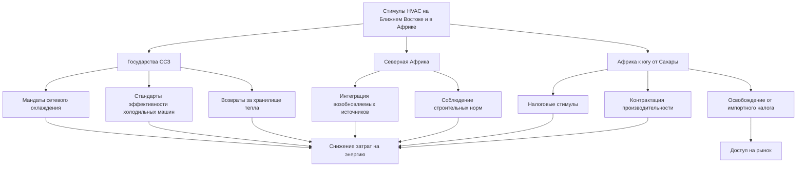

## Региональные климатические проблемы и политический контекст

Регионы Ближнего Востока и Африки сталкиваются с экстремальными тепловыми нагрузками, требующими интенсивных систем охлаждения. На Ближнем Востоке температура окружающей среды превышает 50°C с одновременно высокой влажностью в прибрежных зонах, в то время как в странах к югу от Сахары встречаются разнообразные климаты от экваториального до средиземноморского. Государственные программы стимулирования решают эти проблемы посредством мандатов на эффективность охлаждения, содействия развитию сетевого охлаждения и интеграции возобновляемых источников энергии.

Потребление энергии HVAC в регионе составляет 60-70% пиковых электрических нагрузок в государствах Совета сотрудничества стран Персидского залива (ССЗ), создавая критический стресс для инфраструктуры. Реформа субсидирования энергии с 2015 года сместила политику в сторону стимулов к эффективности, а не субсидий на потребление, коренным образом изменив экономическую базу для инвестиций в HVAC.

## Программы повышения энергоэффективности в Объединённых Арабских Эмиратах

### Инициативы Верховного совета по энергетике Дубая

Стратегия управления спросом на энергию в Дубае предусматривает снижение спроса на энергию на 30% к 2030 году. Ключевые стимулы, связанные с HVAC, включают:

**Стандарты эффективности холодильных машин:**
- Требования минимального коэффициента производительности (COP) для новых установок
- Субсидии на модернизацию систем ниже базовой эффективности
- Скидки на основе производительности, рассчитываемые по формуле:

$$
\text{Скидка} = (\text{COP}_{\text{новая}} - \text{COP}_{\text{базовая}}) \times \text{Годовой кВтч} \times \text{Ставка}
$$

**Интеграция сетевого охлаждения:**
- Отмена платы за подключение для зданий в пределах 500 м от сетей центрального охлаждения
- Сниженные тарифные структуры: 0,05-0,07 дирхама ОАЭ/кВтч в сравнении с 0,12-0,15 дирхама ОАЭ/кВтч для обычных систем
- Снижение емкостных платежей: на 25-40% ниже затрат на капитальное оборудование автономных холодильных машин

### Программа Abu Dhabi Estidama

Система рейтинга Pearl (Жемчужина) в Estidama предусматривает минимальные стандарты энергоэффективности зданий с финансовыми стимулами:

| Рейтинг Pearl | Требование эффективности HVAC | Снижение муниципального сбора |
|--------------|----------------------------|---------------------------|
| 1 Pearl | На 20% ниже базовой линии ASHRAE 90.1 | 0% |
| 2 Pearl | На 30% ниже базовой линии | 25% |
| 3 Pearl | На 40% ниже базовой линии | 50% |
| 4 Pearl | На 50% ниже базовой линии | 75% |
| 5 Pearl | Нулевой расход энергии | 100% |

Энергетическое моделирование должно подтверждать соответствие с использованием утвержденных инструментов моделирования (EnergyPlus, IES-VE или eQUEST) с метеорологическими данными Типового метеорологического года (TMY) для Абу-Даби (24,4°N, 54,7°E).

## Инициативы Saudi Arabia SEEC

Центр энергоэффективности Саудовской Аравии (SEEC) реализует Программу государственной компании энергетических услуг (ESCO) с государственным финансированием:

**Контрактация производительности HVAC:**
- Беспроцентные кредиты до 50 млн SAR (13,3 млн долл. США) на проекты с проверенной экономией энергии
- Условия кредита: 5-10 лет на основе периода простой окупаемости
- Приемлемые технологии: высокоэффективные холодильные машины (COP ≥ 6,0), тепловое хранилище, системы рекуперации тепла

**Влияние тарифной структуры:**
Тарифы на электроэнергию для коммерческих потребителей выросли с 0,048 дирхама ОАЭ/кВтч до 0,180 дирхама ОАЭ/кВтч (реформа 2018 г.), улучшив экономику проектов энергоэффективности HVAC:

$$
\text{Период простой окупаемости} = \frac{\text{Стоимость капитала}}{\text{Годовая экономия кВтч} \times 0,180 + \text{Экономия спроса (кВ)} \times 450}
$$

где платежи за спрос составляют 450 дирхама ОАЭ/кВ-месяц для коммерческих объектов.

**Стимулы для хранилищ тепловой энергии:**
- Возврат 30% стоимости капитала для систем ледяного или охлажденного водяного хранилища
- Тарифы в зависимости от времени суток: 0,30 дирхама ОАЭ/кВтч в пиковое время (12:00-18:00), 0,11 дирхама ОАЭ/кВтч в непиковое время
- Потенциал сдвига нагрузки рассчитывается по формуле:

$$
\text{Экономия затрат} = Q_{\text{сдвинута}} \times (\text{Ставка}_{\text{пиковая}} - \text{Ставка}_{\text{непиковая}}) - \text{Потери хранилища}
$$

## Южная Африка: налоговый стимул энергоэффективности (раздел 12L)

Раздел 12L Закона о налоге на доход предусматривает налоговые вычеты для проверяемой экономии энергии:

**Приемлемые меры HVAC:**
- Установка приводов переменной скорости (VSD) на вентиляторах и насосах
- Высокоэффективные холодильные машины и тепловые насосы
- Оптимизация системы управления зданием (BMS)
- Системы рекуперации тепла и экономайзеры

**Расчет стимула:**
Налоговый вычет составляет 0,95 ZAR/кВтч сэкономленной энергии (примерно 0,053 доллара США/кВтч по курсу 2024 года) для экономии энергии, превышающей 5% базового потребления. Проверка требует привлечения аккредитованных специалистов по измерению и верификации (M&V), следующих протоколу SANS 50010.

Для модернизации коммерческого здания:

$$
\text{Налоговый вычет} = \text{Годовая экономия кВтч} \times 0,95 \text{ (ZAR)} \times \text{Предельная налоговая ставка (28\%)}
$$

**Требования к производительности:**
- Минимальный период измерения 12 месяцев после внедрения
- Независимый отчет M&V, представленный в Южноафриканский национальный институт развития энергетики (SANEDI)
- Корректировка базовой линии для операционных изменений в соответствии с IPMVP вариант C

## Программы возобновляемой энергии и энергоэффективности в Кении

### Гарантированный тариф для солнечных систем HVAC

Закон об энергии Кении 2019 года устанавливает гарантированные тарифы для подключенных к сети систем солнечной энергии, поддерживающих нагрузки HVAC:

- Интеграция солнечной энергии + HVAC: 12 KES/кВтч (0,093 доллара США/кВтч) для соглашений о покупке мощности на 20 лет
- Двусторонний учет доступен для систем до 1 МВт мощности
- Освобождение от импортного налога на коллекторы солнечной тепловой энергии и абсорбционные холодильные машины

### Освобождение от НДС на энергоэффективное оборудование

Освобождение от налога на добавленную стоимость (16%) применяется к:
- Кондиционерам воздуха с коэффициентом энергоэффективности (EER) ≥ 3,5 (эквивалент 12,0 SEER)
- Тепловым насосам для нагрева воды с COP ≥ 3,0
- Системам переменного расхода хладагента (VRF), соответствующим критериям эффективности Кенийского бюро стандартов (KEBS)

Это освобождение снижает установленные затраты на 16%, значительно улучшая экономику проектов на ценочувствительных рынках.

## Региональный сравнительный анализ

## Климатические проектные особенности, учитывающие регион

Региональные программы признают экстремальное влияние климата на производительность HVAC:

**Жаркие влажные прибрежные зоны (Дубай, Доха, Джидда):**
- Холодопроизводительность охлаждения: 150-200 Вт/м² для коммерческих зданий
- Доля скрытой нагрузки: 30-35% от общей холодопроизводительности охлаждения
- Программы стимулирования благоприятствуют колесам энтальпии и системам осушивания по адсорбционному принципу

**Жаркие сухие внутренние зоны (Эр-Рияд, Хартум):**
- Холодопроизводительность охлаждения: 120-180 Вт/м² с высоким солнечным вкладом
- Суточный перепад температур: 15-20°C, позволяющий свободное охлаждение
- Стимулы поддерживают непрямое испарительное охлаждение и стратегии теплоаккумулирования

**Умеренные зоны (Йоханнесбург, Найроби):**
- Смешанные потребности в отоплении и охлаждении
- Акцент на технологию теплового насоса с реверсивной работой
- Согласование стимулов с положениями климатических зон ASHRAE Standard 90.1 3B-4A

## Требования по внедрению и верификации

Региональные программы обычно требуют:

1. **Предварительная квалификация:** инженерный анализ, демонстрирующий предсказанную экономию энергии с использованием утвержденных методов расчета (методы интервалов, методы накопления градусо-дней или почасовое моделирование)

2. **Сертификация оборудования:** испытания третьей стороной в соответствии с AHRI, Eurovent или эквивалентными региональными стандартами

3. **Проверка после установки:** испытание функциональной производительности в соответствии с ASHRAE Guideline 1.1 или региональными протоколами наладки

4. **Непрерывный мониторинг:** непрерывное измерение для стимулов на основе производительности с использованием систем автоматизации зданий (BAS) с интервалами регистрации данных ≤ 15 минут

Эффективность этих программ зависит от механизмов обеспечения соблюдения, технического потенциала агентств-исполнителей и согласованности с более широкими реформами энергетического сектора, направленными на рационализацию субсидий и достижение целевых показателей интеграции возобновляемых источников энергии.

## Компоненты

- Программы повышения энергоэффективности ОАЭ
- Инициативы Saudi Arabia SEEC
- Стимулы энергоэффективности Южной Африки
- Программы возобновляемой энергии Кении
