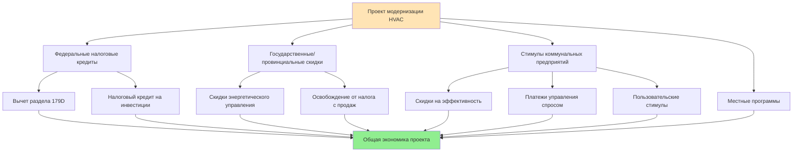

## Обзор системы стимулирования HVAC в Северной Америке

Правительства Северной Америки на федеральном уровне, уровне штатов/провинций и муниципальном уровне предоставляют значительные финансовые стимулы для установки и модернизации высокоэффективного оборудования HVAC. Эти программы снижают барьеры первоначальных затрат и ускоряют внедрение энергоэффективных технологий. Ландшафт стимулирования охватывает прямые скидки, налоговые кредиты, ускоренную амортизацию, низкопроцентное финансирование и платежи на основе производительности.

Термодинамическое и экономическое обоснование основано на общественной выгоде снижения пиковой электрической нагрузки и сокращения выбросов парниковых газов. Системы HVAC составляют 40-60% энергопотребления коммерческих зданий и 50-70% энергопотребления в жилых помещениях в климатически контролируемых пространствах. Повышение эффективности оборудования напрямую приводит к снижению нагрузки на сеть и снижению углеродной интенсивности.

## Федеральные программы США

### Федеральный налоговый кредит на инвестиции (ITC) - Коммерческие здания

Федеральный налоговый кодекс в соответствии с разделами 25D и 48 предусматривает налоговые кредиты на инвестиции для квалифицированного оборудования HVAC, интегрированного с системами возобновляемой энергии. Кредит применяется к коммерческим установкам геотермальных тепловых насосов в размере 30% от стоимости проекта до 2032 года, снижаясь до 26% в 2033 году и 22% в 2034 году.

**Квалифицирующиеся системы включают:**

- Геотермальные тепловые насосы, отвечающие критериям эффективности ENERGY STAR
- Водяные тепловые насосы в коммерческих приложениях
- Системы прямого геотермального обмена
- Абсорбционные холодильные машины, питаемые солнечными тепловыми коллекторами

Базис расчета кредита включает стоимость оборудования, трудозатраты на установку и расходы на наладку. Для коммерческой системы геотермального теплового насоса с коэффициентом производительности (COP) 4,2:

$$\text{Налоговый кредит} = 0,30 \times (\text{Стоимость оборудования} + \text{Установка} + \text{Элементы управления})$$

$$\text{Пример: } \$150 000 \text{ проект} \times 0,30 = \$45 000 \text{ кредит}$$

### Раздел 179D Коммерческий вычет по строениям

Раздел 179D позволяет владельцам зданий вычитать до $1,88 за квадратный фут (с поправкой на инфляцию от базовой суммы $1,80) для улучшений HVAC, которые снижают общее энергопотребление здания на 25% или более по сравнению с базовым показателем ASHRAE 90.1-2007. Частичные вычеты применяются к улучшениям только HVAC, соответствующим пороговым значениям эффективности.

**Методология расчета:**

$$D = A \times d \times \frac{E_{\text{фактический}}}{E_{\text{целевой}}}$$

Где:
- D = общий вычет ($)
- A = площадь здания (м²)
- d = ставка вычета ($/м²)
- E_фактический = достигнутое снижение энергопотребления (%)
- E_целевой = пороговое снижение энергопотребления (25%)

Для систем HVAC в частности, частичный вычет достигает $6,78/м² при достижении системами отопления и охлаждения сокращения энергопотребления на 15% по сравнению с базовым показателем. Здание площадью 9 290 м² получает право на вычет в размере $63 000 при этом пороге.

### Жилой кредит на чистую энергию (Раздел 25C)

Жилое оборудование HVAC, отвечающее требованиям Закона об инфляционном снижении, получает налоговые кредиты до $2 000 в год для тепловых насосов, тепловых насосов для нагрева воды и биомассовых печей, отвечающих стандартам эффективности.

| Тип оборудования | Максимальный кредит | Требование эффективности |
|------------------|---------------------|--------------------------|
| Воздушный тепловой насос | $2 000 | ENERGY STAR Наиболее эффективный |
| Геотермальный тепловой насос | 30% от стоимости (без лимита) | ENERGY STAR сертифицировано |
| Центральный кондиционер | $600 | SEER2 ≥16, EER2 ≥12 |
| Газовая печь | $600 | AFUE ≥97% |
| Тепловой насос для горячей воды | $2 000 | UEF ≥3,3 |
| Обновление электрической панели | $600 | Требуется для теплового насоса |

Кредит на высокоэффективный тепловой насос признает термодинамическое преимущество систем парокомпрессии, работающих в режиме отопления. Тепловой насос с коэффициентом производительности при сезонном отоплении (HSPF2) 10,0 обеспечивает 10 единиц тепловой энергии на единицу электрического входа, что значительно превышает эффективность резистивного отопления в 1,0.

## Государственные и коммунальные программы стимулирования

### Многоуровневые структуры скидок

Государственные энергетические управления и инвестиционные коммунальные компании внедряют многоуровневые программы скидок, вознаграждающие за дополнительные улучшения эффективности. Экономическая структура стимулирует принятие оборудования, превышающего минимальные федеральные стандарты.

**Типичная структура скидок на коммерческие чиллеры:**

| Уровень эффективности | кВ/кВт при полной нагрузке | кВ/кВт IPLV | Скидка ($/кВт) |
|----------------------|------------------------|------------|----------------|
| Базовая линия ASHRAE 90.1 | 0,221 | 0,198 | $0 |
| Уровень 1 | 0,184 | 0,156 | $515 |
| Уровень 2 | 0,156 | 0,136 | $1 029 |
| Уровень 3 | 0,142 | 0,119 | $1 715 |

Величина скидки отражает избежанные коммунальные расходы. Снижение пикового спроса от чиллера мощностью 1 406 кВт, улучшающегося с базовой линии 0,198 кВ/кВт до 0,119 кВ/кВт:

$$\Delta P = Q_{\text{охлаждение}} \times (\text{кВ/кВт}_{\text{база}} - \text{кВ/кВт}_{\text{улучшено}})$$

$$\Delta P = 1 406 \text{ кВт} \times (0,198 - 0,119) = 111 \text{ кВт снижение спроса}$$

При избежанной стоимости емкости коммунального предприятия в размере $200/кВт-год, избежанная стоимость за 10 лет достигает $222 000, что экономически оправдывает общую скидку в размере $688 000 (1 406 кВт × $1 715/кВт).

### Программы стимулирования управления спросом

Программы управления спросом (DR) компенсируют владельцам зданий временное снижение нагрузки HVAC во время периодов стресса сети. Структуры компенсации включают платежи за мощность ($/кВт-год для обязанной доступности) и платежи за энергию ($/кВтч для фактического снижения).

**Требования к участию в программе DR:**

- Автоматизированная способность управления спросом (ADR) через систему автоматизации зданий
- Минимальное обязательство по снижению (обычно 50-100 кВт)
- Телеметрия, обеспечивающая измерение мощности в реальном времени
- Максимальное время отклика (10-30 минут от сигнала отправки)

Стратегии HVAC для событий DR включают:

1. **Предварительное охлаждение:** Снижение установок на 1-1,7°C в непиковые часы, накопление явного охлаждающего потенциала в строительной массе
2. **Глобальный сброс температуры в зоне:** Повышение установок охлаждения на 1-2°C во время события
3. **Циклическая работа:** Последовательность зон HVAC с интервалом 15 минут, поддерживающая минимальную вентиляцию
4. **Ограничение спроса чиллера:** Снижение установки температуры охлажденной воды на 2-3°C, допуская временный дрейф температуры в зоне

Термодинамическая основа предварительного охлаждения использует строительную тепловую массу как накопление энергии. Отношение теплоемкости явного тепла:

$$Q_{\text{накопление}} = m \times c_p \times \Delta T$$

Для бетонной конструкции с эквивалентной массой 900 тонн и удельной теплоемкостью 0,96 кДж/(кг·°C), снижение температуры на 1,7°C накапливает:

$$Q = 900 000 \text{ кг} \times 0,96 \text{ кДж/(кг·°C)} \times 1,7 = 1 468 800 \text{ кДж}$$

Этот накопленный охлаждающий потенциал поддерживает события DR продолжительностью 2-3 часа с минимальным влиянием на комфорт жильцов.

## Канадские провинциальные программы

### Канадский грант «Более зеленые дома»

Федеральный грант "Более зеленые дома" предоставляет до 5 000 канадских долларов для жилых модернизаций HVAC после оценки дома EnergyGuide. Воздушные тепловые насосы для холодного климата получают право на максимальные скидки в связи с приоритетом декарбонизации отопления.

| Категория оборудования | Размер скидки (канадских долларов) | Техническое требование |
|------------------------|------------------------------------|------------------------|
| Тепловой насос для холодного климата | 5 000 | HSPF ≥10 при -15°C |
| Геотермальный тепловой насос | 5 000 | Energy Star сертифицировано |
| Вторичный тепловой насос | 2 500 | Дополнение к существующей системе |
| Умный термостат | 50 | ENERGY STAR сертифицировано |

Спецификация для холодного климата признает деградацию производительности при низких температурах окружающей среды. Обычные воздушные тепловые насосы испытывают снижение мощности по следующей формуле:

$$Q_{\text{мощность}} = Q_{\text{номинальная}} \times \left(1 - k \times (T_{\text{номинальная}} - T_{\text{окружающая}})\right)$$

Где коэффициент деградации k ≈ 0,012/°C. Модели для холодного климата с улучшенным впрыском паров сохраняют мощность отопления до температуры окружающей среды -26°C.

### Провинциальные скидки коммунальных предприятий - Британская Колумбия

BC Hydro и FortisBC предлагают совокупные стимулы для коммерческих модернизаций HVAC, уделяя особое внимание восстановлению тепла и оптимизации элементов управления.

**График коммерческих стимулов:**

- Системы переменного потока хладагента (VRF): $400-600/кВт в зависимости от эффективности
- Вентиляторы рекуперации энергии: $1,50/CFM восстановленного потока воздуха (м³/ч)
- Управление спросом на вентиляцию: $500/зона
- Модернизация экономайзера: $2 000-4 000/система
- Обновление автоматизации зданий: $0,10-0,15/м² кондиционируемой площади

## Программы энергоэффективности Мексики

### Программа CFE ASI (Ahorro Sistemático Integral)

Федеральная комиссия по электроэнергии Мексики (Comisión Federal de Electricidad) управляет программой комплексного систематического сбережения, ориентированной на улучшение HVAC в коммерческом и промышленном секторах. Структура программы предусматривает техническую помощь, энергетические аудиты и финансовые стимулы для квалифицирующихся модернизаций.

**Базис расчета стимула:**

$$I = кВтч_{\text{годовое сбережение}} \times \$_{\text{ставка}} \times F_{\text{окупаемость}}$$

Где F_окупаемость варьируется от 0,3-0,5 в зависимости от периода простой окупаемости проекта. Проекты с периодом окупаемости 2 года получают покрытие 50% стоимости, а проекты с 5-летней окупаемостью получают покрытие 30%.

**Приоритетные мероприятия HVAC:**

- Замена чиллера (требуется улучшение эффективности ≥0,19 кВ/кВт)
- Частотные преобразователи на системах с постоянным объемом
- Интеграция прохладной крыши, снижающей охлаждающие нагрузки
- Высокоэффективное испарительное охлаждение в засушливом климате
- Улучшение теплоизоляции

### FIDE (Fideicomiso para el Ahorro de Energía Eléctrica)

Фонд энергетических сбережений предоставляет беспроцентное финансирование для квалифицирующихся коммерческих проектов HVAC с периодом окупаемости менее 5 лет. Структура финансирования устраняет барьеры первоначальных затрат при сохранении экономической жизнеспособности проекта.

## Совокупное стимулирование и оптимизация

Стратегическое совокупное стимулирование максимизирует финансовую прибыль. Коммерческий владелец здания в Калифорнии, заменяющий холодильную установку мощностью 1 759 кВт, объединяет:

1. **Федеральный вычет 179D:** $6,78/м² × 18 580 м² = $126 000 налоговая выгода
2. **Скидка коммунального предприятия:** 1 759 кВт × $1 364/кВт = $240 000 прямой доход
3. **Регистрация управления спросом:** 111 кВт × $150/кВт-год = $16 650 годовой платеж
4. **Ускоренная амортизация:** График MACRS 7 лет на оставшейся базе стоимости

Совокупные стимулы снижают эффективную первоначальную стоимость на 35-50%, одновременно генерируя постоянный доход от управления спросом, значительно улучшающий внутреннюю норму доходности проекта.

## Стратегия участия в программе

### Требования к документации

Тщательная документация обеспечивает утверждение выплаты стимулов. Критические материалы включают:

- **Предварительное одобрение установки:** Спецификации оборудования, подтверждающие пороговые значения эффективности
- **Информация о счете коммунального предприятия:** Установление базового потребления энергии
- **Проверка установки:** Сертификат подрядчика, фотографии, отчеты о наладке
- **Мониторинг производительности:** Измеренные данные, демонстрирующие энергетические сбережения
- **Налоговая документация:** Формы IRS, сертификация профессионального инженера для раздела 179D

### Временные соображения

Циклы финансирования программ создают стратегические требования по времени. Многие государственные и коммунальные программы работают с бюджетами финансового года с распределением в порядке очередности. Завершение проекта до конца года обеспечивает получение льготных налоговых кредитов, истекающих в конце года, и годовых лимитов на скидки.

Поэтапное снижение федеральных налоговых кредитов требует многолетнего планирования для крупных капитальных проектов. Установка геотермальных тепловых насосов выигрывает от ускорения сроков проекта до 2033 года, когда ITC снизится с 30% до 26%.

## Структура экономического анализа

Анализ чистой приведенной стоимости, включающий все слои стимулирования, определяет жизнеспособность проекта:

$$\text{ЧПС} = -C_0 + \sum_{t=1}^{n} \frac{S_t - O_t}{(1+r)^t} + \sum_{t=1}^{n} \frac{I_t}{(1+r)^t}$$

Где:
- C₀ = первоначальная стоимость капитала минус прямые скидки
- S_t = энергетические сбережения в году t
- O_t = дополнительные расходы на O&M в году t
- I_t = платежи стимулов в году t (DR, налоговые выгоды)
- r = ставка дисконтирования
- n = период анализа

Компоненты стимулов (I_t) часто трансформируют маргинальные экономически обоснованные проекты в проекты с сильно положительной ЧПС, оправдывающие принятие оборудования с премиальной эффективностью, которое в противном случае не прошло бы финансовую проверку.

## Компоненты

- Energy Star скидки США
- Федеральные налоговые кредиты США
- Государственные коммунальные стимулы США
- Стимулы управления спросом США
- Жилой налоговый кредит на возобновляемую энергию
- Коммерческий вычет налога на строения раздела 179D
- Канадское пособие по повышению эффективности дома
- Канадский грант "Более зеленые дома"
- Мексиканская программа CFE ASI
- Мексиканский фонд энергетических сбережений
