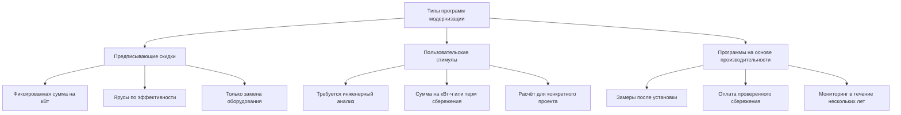

## Обзор программ модернизации HVAC

Государственные программы модернизации предоставляют финансовые стимулы для обновления существующих систем HVAC, нацеленные на улучшение энергоэффективности в жилых, коммерческих и промышленных объектах. Эти программы снижают первоначальные затраты, ускоряют периоды окупаемости и способствуют трансформации рынка в сторону высокоэффективного оборудования.

Программы модернизации обычно стимулируют замену оборудования на основе показателей энергоэффективности (SEER, EER, IEER, AFUE), с размерами скидок, масштабируемыми в соответствии с улучшениями производительности по сравнению с базовыми стандартами.

## Экономические основы льгот на модернизацию

### Расчёт простой окупаемости

Период окупаемости определяет возврат инвестиций для модернизации HVAC:

$$
\text{Период окупаемости (лет)} = \frac{\text{Дополнительные первоначальные затраты} - \text{Скидка}}{\text{Годовое энергосбережение}}
$$

Где годовое энергосбережение вытекает из сокращения рабочих часов и повышения эффективности оборудования:

$$
\text{Годовое сбережение} = \text{ПНЧ} \times \text{Нагрузка} \times \left(\frac{1}{\text{EER}_{\text{старый}}} - \frac{1}{\text{EER}_{\text{новый}}}\right) \times \text{Стоимость}_{\text{электроэнергия}}
$$

**ПНЧ** = полные номинальные часы (типичные значения: 1000–2000 ч/год жилое охлаждение, 2000–4000 ч/год коммерческое)

### Проверка энергосбережения

Программы используют протоколы измерения и проверки (M&V) в соответствии с ASHRAE Guideline 14 для количественной оценки фактического сбережения:

$$
\text{Нормализованное сбережение} = \frac{\text{Исходная энергия} - \text{Энергия после модернизации}}{\text{Градусо-дни отопления/охлаждения}}
$$

Корректировки исходного уровня учитывают нормализацию погоды, изменения занятости и вариации графика работы.

## Структура программы и модели доставки

### Предписывающие программы

Предписывающие скидки предоставляют фиксированные размеры стимулов на основе рейтингов эффективности оборудования. Приемлемость обычно требует:

- Минимальные пороги SEER/EER (обычно SEER ≥16, EER ≥13 для жилого)
- Сертификация AHRI номинальной производительности
- Установка лицензированным подрядчиком
- Надлежащий размер в соответствии с методологией ACCA Manual J/S

Предписывающие скидки упрощают администрирование, но могут не охватывать сбережение от улучшенных средств управления, экономайзеров или оптимизации системы.

### Программы пользовательского стимулирования

Пользовательские программы рассчитывают стимулы на основе инженерного анализа сбережения конкретного проекта:

$$
\text{Стимул} = \text{Сбережение}_{\text{кВт·ч/год}} \times \text{Ставка}_{\text{₽/кВт·ч}} \times \text{Коэффициент стимула}
$$

Типичные ставки стимулов варьируются от 0,05–0,15 $/кВт·ч для коммерческих проектов, с ограничением в 50% дополнительных затрат.

## Характеристики программы по секторам

| Сектор | Типовое оборудование | Диапазон стимулов | Целевая окупаемость |
|--------|------------------|----------------|----------------|
| Жилой | Центральный кондиционер, тепловые насосы, печи | 300–2 000 ₽/ед. | 3–7 лет |
| Малое коммерческое | Крышные блоки 10–88 кВт | 350–1 400 ₽/кВт | 2–5 лет |
| Крупное коммерческое | Чиллеры, котлы, VRF | 175–525 ₽/кВт | 3–6 лет |
| Промышленное | Технологическое охлаждение, компрессоры | 0,28–0,42 ₽/кВт·ч | 1–3 года |
| Муниципальное | Центральные станции, районные системы | Пользовательский расчёт | 5–10 лет |

## Технические требования и стандарты

### Пороги эффективности

Программы устанавливают минимальные требования эффективности выше федеральных стандартов:

**Воздухоохлаждаемые чиллеры (AHRI 550/590):**
- Исходный уровень: IPLV 9,5 EER (≥265 кВт)
- Порог стимула: IPLV ≥13,0 EER
- Премиум-ярус: IPLV ≥15,0 EER

**Система с переменным хладагентом (VRF):**
- EER охлаждения ≥11,0
- COP отопления ≥3,3 при 8°C
- IEER ≥14,0 для частичной нагрузки

### Требования к качеству установки

Программы всё чаще требуют надлежащих практик установки в соответствии со стандартом ACCA Standard 5 и ANSI/ASHRAE Standard 180:

- Тестирование утечек воздуховодов (≤6% общей утечки наружу)
- Проверка воздушного потока (1,2–1,5 м³/ч на кВт)
- Проверка заряда хладагента (±5% от спецификации производителя)
- Тестирование эффективности сгорания для печей (≥80% установившейся эффективности)

## Методология расчёта энергетического воздействия

### Снижение охлаждающей энергии

Для модернизации кондиционирования воздуха с SEER 10 на систему SEER 16:

$$
\text{Годовое сбережение кВт·ч} = \frac{\text{Расчётная нагрузка (кДж/ч)} \times \text{ПНЧ}}{\text{EER}_{\text{сезонный}}} \times \left(\frac{1}{\text{SEER}_{\text{старый}}} - \frac{1}{\text{SEER}_{\text{новый}}}\right)
$$

Пример: 10,5 кВт (36 000 кДж/ч) жилой кондиционер, 1 200 ПНЧ/год:

$$
\text{Сбережение} = \frac{36 000 \times 1 200}{3,413} \times \left(\frac{1}{10} - \frac{1}{16}\right) = 3 164 \text{ кВт·ч/год}
$$

При 0,12 $/кВт·ч годовое сбережение = $45,60. Со скидкой $450, снижающей чистую стоимость с $2 100 на $1 650, окупаемость = 14,5 лет без скидки и 7,2 года со скидкой.

### Снижение энергии отопления

Обновление газовой печи с 80% AFUE на 95% AFUE:

$$
\text{Годовое сбережение Гкал} = \frac{\text{Нагрузка отопления (кДж/год)}}{\text{Энергоёмность}_{\text{газ}}} \times \left(\frac{1}{\text{AFUE}_{\text{старый}}} - \frac{1}{\text{AFUE}_{\text{новый}}}\right)
$$

С нагрузкой отопления 105 600 МДж/год:

$$
\text{Сбережение} = \frac{105 600}{105 500} \times \left(\frac{1}{0,80} - \frac{1}{0,95}\right) = 0,031 \text{ Гкал/год}
$$

## Показатели эффективности программы

### Коммунальная стоимость сэкономленной энергии

Программы оценивают экономичность, используя тест коммунальной стоимости (UCT):

$$
\text{ССЭ} = \frac{\text{Стоимость программы} + \text{Стимул}}{\sum_{t=1}^{n} \frac{\text{Годовое сбережение кВт·ч}}{(1+d)^t}}
$$

Где **d** = ставка дисконта (обычно 3–6% реального). Программы ориентированы на ССЭ ниже избежанной стоимости поставки (генерация + передача + распределение).

### Экономичность для участников

Тест общих ресурсных затрат (TRC) оценивает общественную выгоду:

$$
\text{Коэффициент TRC} = \frac{\text{ПВ(Сбережение энергии + Сбережение спроса)}}{\text{ПВ(Затраты программы + Затраты участников)}}
$$

Коэффициент >1,0 указывает на чистую экономическую выгоду. Большинство программ требуют TRC ≥1,25 для учёта неопределённости и неэнергетических выгод.

## Инновации в развивающихся программах

### Программы для подключённого оборудования

Передовые программы стимулируют использование умных термостатов и оборудования с возможностью реагирования на спрос:

- Взаимодействующие с сетью элементы управления, позволяющие снизить пиковую нагрузку
- Мониторинг производительности в реальном времени и обнаружение неисправностей
- Автоматическая оптимизация на основе прогноза занятости и погоды

Стимулы обычно составляют 50–150 ₽ за устройство с дополнительными платежами за возможность реагирования на спрос.

### Программы переоборудования тепловых насосов

Программы электрификации стимулируют переход с ископаемого топлива на электрические тепловые насосы:

$$
\text{Коэффициент первичной энергии} = \frac{\text{Использование газа}_{\text{исходный}} \times 1,05}{\text{Использование электроэнергии}_{\text{ТН}} \times 3,14}
$$

Коэффициенты преобразования «объект–первичная энергия» в соответствии с ASHRAE 90.1 Приложение C. Программы требуют коэффициента ≤1,0 для чистого сбережения первичной энергии.

### Программы среднего и верхнего потока

Развивающиеся модели предоставляют стимулы дистрибьюторам и производителям, а не конечным пользователям:

- Снижение административного бремени на клиентов
- Трансформация рынка через взаимодействие цепи поставок
- Улучшенное соответствие и контроль качества

Скидки дистрибьютора обычно составляют 60–80% от уровня скидки конечного пользователя с дисконтом в точке продажи клиенту.

## Барьеры участия в программе

Технические барьеры, ограничивающие внедрение модернизации:

- **Разделённые стимулы** в сдаваемых в аренду объектах (владелец оплачивает капитальные затраты, арендатор получает экономию энергии)
- **Финансовые ограничения** на авансовые платежи несмотря на положительный денежный поток
- **Информационная асимметрия** относительно производительности оборудования и качества подрядчика
- **Затраты на перебои** от перерывов в установке в используемых объектах

Программы решают проблемы посредством дополнительных мер: программы прямой установки, финансирование через счёта коммунальных услуг, обучение подрядчиков и техническая помощь.

## Интеграция со стандартами производительности зданий

Программы модернизации всё больше согласуются с обязательными стандартами производительности:

- **Стандарты производительности зданий (BPS)** требуют периодического бенчмаркинга энергии и целевых показателей улучшения
- Ограничения **энергоёмкости (EUI)** запускают обязательную модернизацию
- Программы обеспечивают финансовую основу для соответствия нормативным требованиям

ASHRAE Standard 100 (энергоэффективность в существующих зданиях) предоставляет техническую основу для определения и внедрения экономичных модернизаций.

## Компоненты

- Стимулы по замене оборудования
- Скидки на модернизацию HVAC
- Программы стимулирования изоляции
- Стимулы герметизации воздуха
- Программы обновления освещения
- Программы замены окон
- Программы для жилого сектора
- Программы для коммерческого сектора
- Программы для промышленного сектора
- Программы для муниципальных зданий
