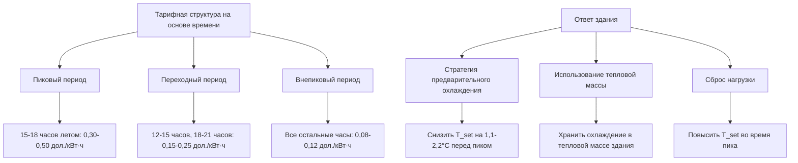

Программы, спонсируемые коммунальными предприятиями, представляют собой инициативы управления спросом (DSM), предназначенные для снижения пикового электрического спроса, улучшения коэффициентов нагрузки и отсрочки инвестиций в инфраструктуру. Эти программы предлагают финансовые стимулы для высокоэффективного оборудования HVAC, одновременно снижая требования к мощности коммунальных предприятий и повышая стабильность сетки.

## Структура программы и экономика

Программы коммунальных предприятий основаны на принципе, что снижение спроса потребителей обходится дешевле, чем производство дополнительной мощности. Экономическое обоснование вытекает из избежанных затрат на емкость:

$$\text{Program Value} = C_{\text{capacity}} \times \Delta P_{\text{peak}} + C_{\text{energy}} \times \Delta E_{\text{annual}} - C_{\text{incentive}}$$

где $C_{\text{capacity}}$ представляет избежанную стоимость на кВт пикового спроса (обычно 100-300 дол./кВт в год), $\Delta P_{\text{peak}}$ — снижение пикового спроса, $C_{\text{energy}}$ — избежанную стоимость энергии за кВт·ч, а $\Delta E_{\text{annual}}$ — годовое снижение энергопотребления. Программы остаются жизнеспособными, когда общие избежанные затраты превышают расходы на стимулы плюс административные затраты.

## Типы программ стимулирования

### Программы замены оборудования

Прямые скидки компенсируют потребителям покупку высокоэффективного оборудования, превышающего минимальные требования кодекса. Типичные структуры стимулов:

| Тип оборудования | Порог эффективности | Диапазон стимула | Снижение пиковой нагрузки |
|------------------|---------------------|-----------------|---------------------------|
| Центральный кондиционер (жилой) | SEER ≥ 16 | 300-800 дол./единица | 0,5-1,0 кВ/кВт охлаждения |
| Тепловой насос (жилой) | HSPF ≥ 9.0 | 500-1200 дол./единица | 0,8-1,5 кВ/кВт охлаждения |
| RTU (коммерческий) | IEER ≥ 13.0 | 75-150 дол./кВт охлаждения | 0,3-0,6 кВ/кВт охлаждения |
| Чиллер (коммерческий) | 0,55 кВт/кВт охлаждения или лучше | 25-100 дол./кВт охлаждения | По базовому уровню ASHRAE 90.1 |
| Частотный преобразователь на моторах HVAC | Любой существующий мотор ≥5 кВт | 100-200 дол./кВт | 20-40% от мощности мотора |
| Вентиляторы ECM | Замена PSC моторов | 50-150 дол./мотор | 0,2-0,5 кВт/мотор |

### Программы индивидуальных стимулов

Крупные коммерческие и промышленные проекты получают индивидуальные стимулы на основе инженерных расчетов. Расчет стимула следует формуле:

$$I = \min(C_{\text{project}} \times f_{\text{cap}}, \, \Delta E_{\text{annual}} \times C_{\text{incentive}})$$

где $f_{\text{cap}}$ представляет максимальную долю стимула от стоимости проекта (обычно 0,3-0,5), а $C_{\text{incentive}}$ составляет 0,05-0,15 дол./кВт·ч экономии за первый год. Программы предусматривают максимальные требования по простому периоду окупаемости (3-7 лет после стимула) для обеспечения сохранения меры.

## Стратегии управления нагрузкой

### Программы прямого управления нагрузкой

Коммунальные предприятия устанавливают устройства управления на оборудование потребителей для циклирования работы во время пиковых событий спроса. Емкость снижения спроса следует формуле:

$$P_{\text{available}} = N_{\text{units}} \times P_{\text{unit}} \times f_{\text{duty}} \times f_{\text{response}}$$

где $N_{\text{units}}$ — количество зарегистрированного оборудования, $P_{\text{unit}}$ — средняя мощность единицы оборудования, $f_{\text{duty}}$ — снижение коэффициента работы (0,5 для 50% циклирования), а $f_{\text{response}}$ учитывает отказы потребителей и оборудование, которое уже отключено (обычно 0,7-0,8). Программы центрального кондиционирования жилого сектора обеспечивают 0,8-1,2 кВ на управляемый киловатт охлаждения во время пиковых событий.

### Тарификация по времени использования и критическая пиковая тарификация

Структуры тарифов поощряют смещение нагрузки HVAC через ценовые сигналы:

Эффективность предварительного охлаждения зависит от тепловой массы здания и характеристик ограждающей конструкции. Достижимое снижение пиковой нагрузки следует формуле:

$$\Delta P_{\text{peak}} = \frac{C_{\text{thermal}} \times \Delta T}{t_{\text{event}}} - Q_{\text{envelope}}$$

где $C_{\text{thermal}}$ представляет тепловую емкость здания (кДж/°C), $\Delta T$ — колебание температуры во время события, $t_{\text{event}}$ — продолжительность пикового периода, а $Q_{\text{envelope}}$ учитывает теплопоступления через ограждающую конструкцию во время события.

## Технические требования и проверка

### Стандарты квалификации оборудования

Программы требуют сертификации третьей стороной по признанным стандартам:

- **Сертификация AHRI** для унитарного оборудования и чиллеров
- **Соответствие базовому уровню ASHRAE 90.1** для индивидуальных мер
- **Спецификации CEE Tier** для уровней повышенной эффективности
- **Квалификация ENERGY STAR** для заводского оборудования

### Протоколы измерения и проверки

Коммунальные предприятия проверяют экономию, используя подходы IPMVP (Международный протокол измерения и проверки производительности):

| Опция M&V | Применение | Точность | Стоимость |
|-----------|-----------|----------|----------|
| Условленная экономия | Замена жилого оборудования | ±20% | Низкая |
| Условный расчет | Малые коммерческие проекты | ±15% | Низко-средняя |
| Изоляция модификации | Проверка отдельной меры | ±10% | Средняя |
| Калибровка всего здания | Крупные индивидуальные проекты | ±5% | Высокая |

Условленная экономия для мер HVAC включает коэффициенты совпадения, связывающие годовую экономию энергии с сокращением пиковой нагрузки:

$$\text{CF} = \frac{\Delta E_{\text{annual}} / 8760}{\Delta P_{\text{peak}}}$$

Типичные коэффициенты совпадения составляют 0,3-0,5 для оборудования охлаждения на коммунальных предприятиях, ориентированных на пик, отражая тот факт, что пиковая нагрузка происходит в течение ограниченного количества часов в год.

## Соображения по внедрению программы

### Управление сетью подрядчиков

Успешные программы поддерживают утвержденные списки подрядчиков с требованиями обучения:

- Размер оборудования в соответствии с процедурами ACCA Manual J
- Дизайн воздуховодов в соответствии со стандартами ACCA Manual D
- Проверка воздушного потока в пределах ±10% от проектного значения
- Проверка заправки хладагента в соответствии со спецификациями производителя
- Испытание безопасности горения для оборудования на жидком топливе

### Проверка качества установки

Проверки после установки проверяют правильность производительности оборудования. Критические точки проверки включают:

- Измерение воздушного потока: 350-450 CFM (595-765 м³/ч) за тонну охлаждения
- Статическое давление: Общее внешнее статическое давление ≤ спецификации производителя
- Температурный перепад: 10-12°C для надлежащем заправленной AC системе
- Заправка хладагента: Перегрев/переохлаждение в пределах допусков производителя
- Работа экономайзера: Функциональное тестирование во всех режимах управления

Проверка выявляет, что 30-40% новых установок имеют дефекты, влияющие на эффективность и мощность, что оправдывает протоколы обеспечения качества.

## Метрики производительности и отчетность

Коммунальные предприятия отслеживают эффективность программы через стандартные метрики:

- **Среднестоимость сэкономленной энергии**: Общая стоимость программы, разделенная на годовую экономию кВт·ч (целевой показатель: 0,02-0,05 дол./кВт·ч)
- **Стоимость за снижение пикового кВ**: Общий стимул плюс административные затраты, разделенные на проверенное сокращение пиковой спроса (целевой показатель: 200-600 дол./кВ)
- **Коэффициент затрат-выгод**: Избежанные затраты коммунального предприятия, разделенные на общие затраты программы (целевой показатель: >1,25 для жизнеспособности программы)
- **Коэффициент чистой к валовой экономии**: Фактическая программой вызванная экономия, разделенная на заявленную экономию, с учетом поездок "зайцев" (типично: 0,6-0,8)

Программы, обеспечивающие среднестоимость ниже маржинальных затрат на производство и мощность, обеспечивают экономическую ценность для системы коммунального предприятия, при этом снижая затраты потребителей на энергию и повышая надежность оборудования.
