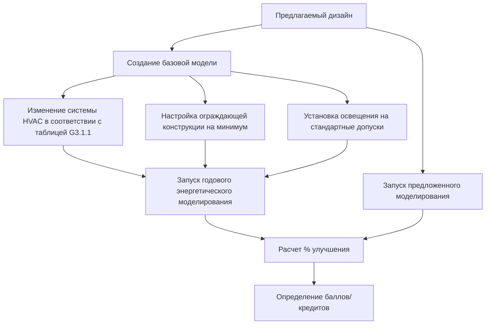

## Обзор систем рейтинга зеленого строительства

Системы рейтинга зеленого строительства предоставляют стандартизированные рамки для оценки производительности зданий по экологическим, санитарно-гигиеническим и экономическим параметрам. Системы HVAC представляют собой наибольший единственный источник потребления энергии в зданиях, обычно составляя 40-60% от общего энергопотребления, что делает их критическими для достижения требований сертификации.

Основные системы рейтинга различаются по географическому охвату, критериям оценки и методологиям подсчета баллов, но все они подчеркивают энергоэффективность, качество внутренней среды и операционную производительность.

## Сравнение основных систем рейтинга

| Система рейтинга | Происхождение | Географический охват | Вес HVAC | Основные метрики |
|-----------------|----------------|----------------------|----------|------------------|
| LEED | США | Глобальный | 33 балла | Энергия и атмосфера |
| BREEAM | Великобритания | Европа/Глобальный | 19% всего | Категория энергии |
| Green Star | Австралия | Азиатско-Тихоокеанский | 25 баллов | Раздел энергии |
| DGNB | Германия | Европа | 22,5% | Техническое качество |
| WELL | США | Глобальный | 21 концепция | Воздух, тепловой комфорт |
| Living Building Challenge | США | Глобальный | Нулевая чистая энергия | На основе производительности |

## Требования LEED для HVAC

### Путь производительности энергии

LEED v4.1 присуждает до 18 баллов за производительность энергии на основе процента улучшения над базовой линией ASHRAE 90.1:

$$E_{improvement} = \frac{E_{baseline} - E_{proposed}}{E_{baseline}} \times 100\%$$

Баллы присуждаются по скользящей шкале:

- 6% улучшение: 1 балл
- 50% улучшение: 18 баллов (новое строительство)
- Нулевая чистая энергия: 20 баллов

### Минимальная производительность энергии

Все проекты должны продемонстрировать 5% улучшение над базовой линией ASHRAE 90.1-2016 Приложение G посредством комплексного энергетического моделирования. Базовая система HVAC определяется типом здания, размером и количеством этажей в соответствии с таблицей G3.1.1.

### Обязательные требования по качеству внутреннего воздуха

**Минимальная производительность качества воздуха**: Подача наружного воздуха должна соответствовать требованиям ASHRAE 62.1 с проверкой посредством расчетов проекта, показывающих:

$$V_{oz} = R_p \times P_z + R_a \times A_z$$

Где расходы вентиляции учитывают плотность занятых людей и площадь пола.

**Контроль табачного дыма в окружающей среде**: Системы HVAC, обслуживающие помещения на расстоянии менее 7,6 м от входов в здание, требуют стратегии вытяжки или наддува для предотвращения инфильтрации дыма.

## Оценка энергии BREEAM

### Сертификат энергетической производительности

BREEAM присуждает кредиты на основе рейтинга сертификата энергетической производительности (EPC) в соответствии с требованиями UK Building Regulations Part L или эквивалентными международными стандартами:

- Рейтинг A+: 15 кредитов
- Рейтинг A: 12 кредитов
- Рейтинг B: 9 кредитов

### Мониторинг энергии

Требуется постоянное поддиапазонное измерение систем HVAC с точками мониторинга для:
- Систем отопления (котлы, тепловые насосы)
- Систем охлаждения (чиллеры, моноблочные агрегаты)
- Вентиляторов вентиляции и оборудования обработки воздуха
- Систем перекачивания

Данные должны быть доступны для управления зданием и анализа тенденций с интервалами не более 30 минут.

## Требования к энергетическому моделированию

### Методология ASHRAE 90.1 Приложение G

Метод оценки производительности требует создания базового здания, идентичного предлагаемому дизайну за исключением определенных изменений:

### Критические параметры моделирования HVAC

**Эффективность системы**: Эффективность оборудования должна соответствовать спецификациям производителя или данным сертификации AHRI:

$$COP_{chiller} = \frac{Q_{cooling}}{W_{compressor} + W_{auxiliaries}}$$

**Мощность вентилятора**: Общая мощность вентилятора системы, ограниченная расчетами перепада давления:

$$P_{fan} = \frac{Q \times \Delta P}{\eta_{fan} \times \eta_{motor}} \times 6356$$

Где P в ваттах, Q в CFM (м³/ч), и ΔП в см водяного столба.

**Работа экономайзера**: В соответствии с ASHRAE 90.1 экономайзеры требуются для систем охлаждения ≥18 950 кДж/ч в климатических зонах 3B, 3C, 4-8. Модели должны включать логику управления экономайзером и позиции заслонок.

## Тепловой комфорт и качество внутреннего воздуха

### Требования стандарта WELL Building

WELL Feature A01 (стандарты качества воздуха) предусматривает:
- PM2.5 ≤ 15 мкг/м³ (среднее годовое значение)
- PM10 ≤ 50 мкг/м³ (среднее годовое значение)
- Озон ≤ 51 ppb (8-часовое среднее)
- CO ≤ 9 ppm (8-часовое среднее)
- NO₂ ≤ 53 ppb (среднее годовое значение)

Фильтрация HVAC должна достигать минимум MERV 13 для всего наружного и рециркулируемого воздуха.

### Соответствие тепловому комфорту

Требуется соответствие стандарту ASHRAE 55 для сертификации с проверкой посредством:

$$PMV = f(M, I_{cl}, T_a, T_r, V_a, RH)$$

Прогнозируемый средний голос учитывает скорость обмена веществ, тепловую изоляцию одежды, температуру воздуха, лучистую температуру, скорость воздуха и относительную влажность. Допустимый диапазон: -0,5 < PMV < +0,5 для 90% удовлетворенности.

## Требования к пусконаладке

### Усиленная пусконаладка (кредит LEED EA)

Помимо фундаментальной пусконаладки, усиленная пусконаладка включает:

1. **Обзор конструкции**: Орган пусконаладки проверяет конструкцию HVAC на 50%, 90% и 100% завершения
2. **Руководство системы**: Комплексная документация, включая последовательность операций, диаграммы управления и уставки
3. **Обучение**: Два отдельных учебных сеанса для персонала эксплуатации
4. **Испытание сезонной работы**: Проверка в условиях как отопления, так и охлаждения
5. **Обзор после ввода в эксплуатацию**: Оценка производительности через 8-10 месяцев после существенного завершения

### Испытание функциональной производительности

Критические испытания HVAC включают:
- Проверка воздушного потока на всех концевых устройствах (допуск ±10%)
- Проверка регулирования температуры (±0,6°C от установленной точки)
- Работа экономайзера во всех режимах управления
- Точечная проверка DDC
- Тренирование данных производительности системы

## Измерение и проверка

### Применение протокола IPMVP

Международный протокол измерения и проверки производительности предоставляет стандартизированные подходы:

**Опция B - Изоляция ретрофита**: Прямое измерение энергии системы HVAC с использованием выделенных счетчиков:

$$Savings = (E_{baseline,adjusted} - E_{post-installation}) \pm Adjustments$$

**Опция D - Откалиброванное моделирование**: Модель комплексного энергопотребления здания, откалиброванная по фактическим данным коммунальных услуг с ежемесячной ошибкой:

$$MBE = \frac{\sum_{i=1}^{12}(M_i - S_i)}{\sum_{i=1}^{12}M_i} \times 100\%$$

Цель: MBE в пределах ±5% и CV(RMSE) в пределах ±15%.

## Учет углерода

### Операционный углерод от HVAC

Годовые выбросы углерода HVAC, рассчитанные из потребления энергии и интенсивности углерода сети:

$$CO_2_{annual} = \sum(E_{electric} \times CI_{grid} + E_{fuel} \times EF_{fuel})$$

Где CI представляет интенсивность углерода (кг CO₂/кВт·ч) и EF представляет коэффициент выбросов для ископаемого топлива.

### Рассмотрение воплощенного углерода

Потенциал глобального потепления хладагента все чаще учитывается в системах рейтинга:

$$CO_{2,eq} = M_{refrigerant} \times GWP \times L_{annual}$$

Хладагенты с низким потенциалом глобального потепления (R-32, R-454B, R-513A) снижают воздействие на углерод за весь жизненный цикл на 50-75% по сравнению с R-410A.

## Стратегия сертификации для проектирования HVAC

### Подход оптимизации баллов

1. **Энергетическая производительность**: Максимальные баллы за счет агрессивных мер по повышению эффективности (приводы с переменной скоростью, рекуперация тепла, высокоэффективное оборудование)
2. **Управление хладагентом**: 1-2 балла за счет выбора хладагента с низким потенциалом глобального потепления и обнаружения утечек
3. **Усиленная пусконаладка**: 3-6 баллов за счет комплексной проверки
4. **Тепловой комфорт**: 1 балл за демонстрацию соответствия ASHRAE 55
5. **Продвинутое измерение**: 1 балл за счет подробной стратегии поддиапазонного измерения

Высокопроизводительное проектирование HVAC, направленное на достижение 30-40% экономии энергии сверх базового кода, обеспечивает достижение уровней сертификации Gold или Platinum, обеспечивая при этом превосходное качество внутренней среды и сниженные эксплуатационные расходы.
