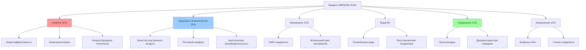

## Обзор

BREEAM (Building Research Establishment Environmental Assessment Method) представляет собой первый в мире метод экологической оценки зданий, разработанный в 1990 году Building Research Establishment (BRE) в Соединённом Королевстве. Системы HVAC играют критическую роль в достижении кредитов BREEAM в нескольких категориях оценки, особенно в разделах "Энергия", "Здоровье и благополучие" и "Управление".

Структура BREEAM оценивает здания по девяти категориям, при этом системы HVAC напрямую влияют на примерно 40-50% доступных кредитов. Производительность измеряется с помощью взвешенной системы оценки, в результате которой получаются уровни сертификации: Pass (≥30%), Good (≥45%), Very Good (≥55%), Excellent (≥70%) и Outstanding (≥85%).

## Кредиты энергоэффективности

### Требования энергоэффективности

Кредиты BREEAM Ene 01 вознаграждают сокращение эксплуатационной энергии и выбросов CO₂ по сравнению с базовым зданием. Расчёт энергоэффективности использует методологию Building Emission Rate (BER):

$$
\text{Энергетические кредиты} = \frac{BER_{базовый} - BER_{фактический}}{BER_{базовый}} \times 100\%
$$

где:
- $BER_{базовый}$ = коэффициент выбросов для базового здания (кг CO₂/м²·год)
- $BER_{фактический}$ = коэффициент выбросов для фактического проекта (кг CO₂/м²·год)

Системы HVAC должны продемонстрировать значительные улучшения по сравнению с минимальными требованиями Part L Building Regulations для достижения более высоких уровней кредитов. Улучшение на 25% приносит приблизительно 6-8 кредитов, в то время как 100% улучшение (углеродная нейтральность) достигает максимума кредитов (15 баллов).

### Стратегии низкоуглеродного проектирования

BREEAM Ene 04 награждает кредитами технологии низкого и нулевого углерода (LZC), которые компенсируют энергетическую потребность здания. Технологии, связанные с HVAC, включают:

**Установки тепловых насосов:**
Сезонный коэффициент производительности (SCOP) определяет эффективное сокращение углерода:

$$
\text{Компенсация углерода} = Q_{тепловая} \times \left(1 - \frac{1}{SCOP \times \eta_{сеть}}\right) \times CF_{вытесняемый}
$$

где:
- $Q_{тепловая}$ = годовая доставленная тепловая энергия (кВт·ч/год)
- $SCOP$ = сезонный коэффициент производительности (обычно 2,5-4,5)
- $\eta_{сеть}$ = углеродный коэффициент сетки электроэнергии относительно вытесняемого топлива
- $CF_{вытесняемый}$ = углеродный коэффициент вытесняемого отопительного топлива (кг CO₂/кВт·ч)

Геотермальные тепловые насосы с SCOP > 4,0 обеспечивают большее сокращение углерода, чем воздушные единицы (SCOP 2,5-3,5) для эквивалентной мощности.

## Кредиты здоровья и благополучия

### Производительность качества внутреннего воздуха

Кредиты BREEAM Hea 02 требуют, чтобы системы вентиляции соответствовали или превышали стандарты эффективности вентиляции. Оценка использует эффективность возраста воздуха:

$$
\epsilon_a = \frac{\tau_n}{\overline{\tau}_p}
$$

где:
- $\epsilon_a$ = эффективность воздухообмена (безразмерная)
- $\tau_n$ = номинальная постоянная времени (объём помещения/скорость подачи воздуха)
- $\overline{\tau}_p$ = средний возраст воздуха в занятой зоне (измеренный или рассчитанный CFD)

Системы вентиляции с вытеснением, достигающие $\epsilon_a > 1,1$, зарабатывают дополнительные кредиты по сравнению с обычной смешивающей вентиляцией ($\epsilon_a \approx 1,0$).

### Критерии теплового комфорта

Кредиты Hea 04 требуют теплового моделирования, демонстрирующего соответствие адаптивным стандартам комфорта согласно CIBSE Guide A или ASHRAE Standard 55. Предсказанный процент недовольных (PPD) не должен превышать 10% для занятых часов:

$$
PMV = \left[0,303 \cdot e^{-0,036M} + 0,028\right] \times L
$$

где:
- $PMV$ = предсказанная средняя оценка (шкала теплового ощущения)
- $M$ = скорость метаболизма (Вт/м²)
- $L$ = тепловая нагрузка на тело (функция активности, одежды, температуры воздуха, радиационной температуры, влажности, скорости воздуха)

Системы HVAC должны поддерживать PMV между -0,5 и +0,5 для максимума кредитов.

## Распределение кредитов BREEAM HVAC

## Пусконаладка и проверка производительности

### Кредиты управления (Man 02)

BREEAM требует комплексной пусконаладки согласно CIBSE Commissioning Code M или эквиваленту. Кредиты присуждаются на основе:

| Уровень пусконаладки | Кредиты | Требования |
|---------------------|---------|------------|
| Базовый | 1 | Функциональное тестирование согласно спецификациям производителя |
| Промежуточный | 2 | Сезонная пусконаладка, проверка управления |
| Расширенный | 3 | Мониторинг производительности, доводка после 12 месяцев эксплуатации |
| Продвинутый | 4 | Непрерывная пусконаладка с интеграцией BMS, проверка энергии |

**Предварительная проверка пусконаладки:**
Производительность приточной установки должна быть проверена в соответствии со спецификациями проекта в пределах допусков:

$$
\text{Коэффициент производительности} = \frac{Q_{измеренный}}{Q_{проект}} \times \frac{\Delta P_{проект}}{\Delta P_{измеренный}}
$$

Приемлемый коэффициент производительности: 0,95-1,05 для достижения кредитов.

### Руководство пользователя здания (Man 03)

Системы HVAC требуют комплексной документации, включая:
- Сезонные графики работы с уставками температур
- Интервалы обслуживания для фильтров, катушек, заслонок
- Эталонные показатели энергопотребления с протоколами мониторинга
- Процедуры диагностики неисправностей для часто встречающихся проблем системы

## Оценка воздействия хладагента

### Кредиты материалов (Mat 05)

BREEAM Pollution 02 кредиты оценивают воздействие хладагента на окружающую среду через полное эквивалентное потепление (TEWI):

$$
TEWI = GWP \times \left(L_{годовой} \times n + m \times (1-\alpha_{восстановление})\right) + n \times E_{годовой} \times \beta
$$

где:
- $GWP$ = потенциал глобального потепления (кг CO₂-экв./кг хладагента)
- $L_{годовой}$ = годовой коэффициент утечки (кг/год)
- $n$ = срок эксплуатации системы (лет)
- $m$ = заряд хладагента (кг)
- $\alpha_{восстановление}$ = коэффициент восстановления в конце жизни (0,7-0,95)
- $E_{годовой}$ = годовое энергопотребление (кВт·ч/год)
- $\beta$ = углеродная интенсивность электроэнергии (кг CO₂/кВт·ч)

Системы, использующие низкоуглеродистые хладагенты (R-32, R-1234yf, естественные хладагенты) с GWP < 675, получают максимум кредитов.

## Сравнение требований BREEAM и LEED для HVAC

| Критерий | BREEAM | LEED v4 |
|-----------|--------|---------|
| Базовая модель энергии | Part L Building Regs | ASHRAE 90.1 Appendix G |
| Минимальная интенсивность вентиляции | BB101 или CIBSE Guide A | ASHRAE 62.1 |
| Стандарт теплового комфорта | CIBSE TM52 / EN 15251 | ASHRAE 55 |
| Орган, ответственный за пусконаладку | Независимый или внутренний | Требуется независимый CxA |
| Пороговое значение хладагента | GWP < 675 для кредитов | GWP < 50 для exemplary |
| Энергомониторинг | Требуется на уровне здания | Предпочтителен на уровне системы |
| Период проверки производительности | 12 месяцев проверки | Опционально (LEED v4.1) |

## Требования к акустической производительности

BREEAM Hea 05 награждает кредитами за акустическую производительность в занятых помещениях. Вклады шума HVAC не должны превышать:

| Тип помещения | Максимум LAeq,T (дБ) | Максимум NR Rating |
|---------------------|---------------------|-------------------|
| Отдельные офисы | 40 | NR 35 |
| Открытые офисные пространства | 45 | NR 40 |
| Переговорные комнаты | 35 | NR 30 |
| Лекционные залы | 35 | NR 30 |

Уровень звуковой мощности системы HVAC в терминальных устройствах:

$$
L_{p,помещение} = L_w + 10\log_{10}\left(\frac{Q}{4\pi r^2} + \frac{4}{R_{помещение}}\right)
$$

где:
- $L_{p,помещение}$ = уровень звукового давления в помещении (дБ)
- $L_w$ = уровень звуковой мощности источника (дБ)
- $Q$ = коэффициент направленности (обычно 2 для приборов, установленных на потолке)
- $r$ = расстояние от источника (м)
- $R_{помещение}$ = постоянная помещения (функция поглощения)

Проектирование воздуховодов на низкой скорости (≤4 м/с в занятых помещениях) и виброизоляция достигают соответствия более легко, чем высокоскоростные системы, требующие обширного ослабления.

## Энергомониторинг и субсчётчики

BREEAM Ene 02 требует раздельного счётчика энергопотребления HVAC от других нагрузок здания. Минимальное разрешение счётчиков:

- Первичное энергопотребление отопительной системы
- Электропотребление системы охлаждения
- Мощность вентилятора приточной установки
- Вспомогательные насосы и органы управления

Частота сбора данных должна поддерживать месячный анализ энергии с автоматическими возможностями отслеживания тенденций. Интеграция BMS обеспечивает детальное обнаружение неисправностей, при этом отклонения энергопотребления >15% от базовой линии запускают протоколы расследования в соответствии с руководством CIBSE TM39.

---

*Методология оценки BREEAM продолжает развиваться, с обновлениями 2023 года, подчеркивающими проверку эксплуатационной производительности и рейтинги энергопотребления в использовании. Проектирование систем HVAC для проектов BREEAM требует комплексного анализа, охватывающего энергоэффективность, комфорт пассажиров, экологическое воздействие и долгосрочную проверку производительности для достижения рейтингов Excellent и Outstanding.*
