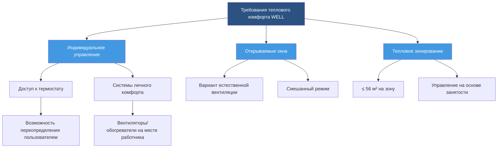
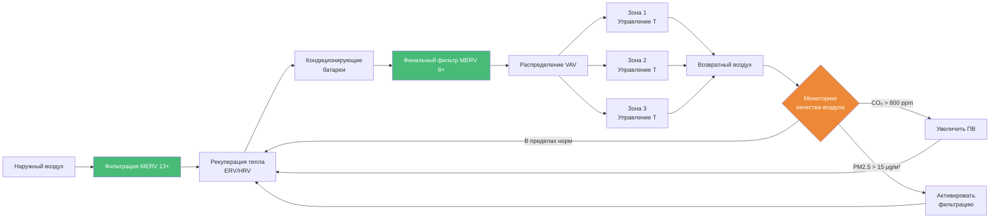

Стандарт WELL Building Standard представляет собой систему, основанную на производительности, предназначенную для измерения, сертификации и мониторинга характеристик построенной среды, влияющих на здоровье и благополучие человека. Для специалистов HVAC сертификация WELL требует тщательного внимания к качеству воздуха, тепловому комфорту, управлению влажностью и эффективности вентиляции — требованиям, которые часто превышают требования стандартных строительных норм.

## Требования концепции Air (Воздух) WELL

Концепция Air (Воздух) формирует основу требований WELL, связанных с HVAC, устанавливая строгие пороги для параметров качества воздуха в помещениях.

### Параметры проектирования вентиляции

WELL устанавливает минимальные нормы вентиляции наружного воздуха на основе ASHRAE 62.1 с улучшенными требованиями для определённых типов помещений:

**Минимальная эффективность вентиляции:**

$$\varepsilon_v = \frac{C_e - C_s}{C_r - C_s} \geq 0.9$$

Где:
- $\varepsilon_v$ = эффективность вентиляции (безразмерная величина)
- $C_e$ = концентрация загрязнителя в вытяжном воздухе (ppm)
- $C_s$ = концентрация загрязнителя в приточном воздухе (ppm)
- $C_r$ = средняя концентрация загрязнителя в помещении (ppm)

Функция WELL A01 требует минимальной нормы наружного воздуха:

| Тип помещения | Требование WELL | Базовое значение ASHRAE 62.1 |
|------------|------------------|---------------------|
| Офис (плотность 7/1000 м²) | 8,0 л/с на человека | 2,4 л/с на человека + 0,20 л/с на м² |
| Классная комната | 5,7 л/с на человека | 4,7 л/с на человека |
| Розничная торговля | 4,7 л/с на человека | 3,5 л/с на человека |
| Спортзал/Фитнес | 9,4 л/с на человека | 9,4 л/с на человека |

### Нормы фильтрации воздуха

Функция WELL A02 устанавливает минимальные значения рейтинга MERV значительно выше, чем в обычной практике:

**Эффективность удаления частиц:**

$$\eta_p = 1 - \frac{C_{down}}{C_{up}}$$

Где:
- $\eta_p$ = эффективность удаления частиц (доля)
- $C_{down}$ = концентрация частиц после фильтра (частиц/м³)
- $C_{up}$ = концентрация частиц перед фильтром (частиц/м³)

| Местоположение фильтра | Минимум WELL | Обычная практика |
|----------------|--------------|---------------------|
| Приём наружного воздуха | MERV 13 | MERV 8 |
| Циркуляционный воздух | MERV 8 | MERV 6-8 |
| Помещения повышенного риска | MERV 14-16 | MERV 11 |

Падение давления через высокоэффективные фильтры требует тщательного подбора вентилятора:

$$\Delta P_f = K \cdot v^2 \cdot \left(1 + \alpha \cdot m_d\right)$$

Где:
- $\Delta P_f$ = падение давления на фильтре (Па)
- $K$ = коэффициент чистого фильтра (Па·с²/м²)
- $v$ = скорость через фильтр (м/с)
- $\alpha$ = коэффициент пылевой нагрузки (м²/г)
- $m_d$ = масса пыли на единицу площади (г/м²)

## Соответствие требованиям теплового комфорта

Функция WELL T01 требует тепловых условий, соответствующих ASHRAE Standard 55, с улучшенными возможностями мониторинга и управления.

### Расчёт теплового комфорта

**Прогнозируемый средний голос (PMV) должен остаться в пределах:**

$$-0.5 \leq PMV \leq +0.5$$

Расчёт PMV включает шесть факторов:

$$PMV = f(M, W, I_{cl}, t_a, \bar{t_r}, v_{ar}, p_a)$$

Где:
- $M$ = скорость метаболизма (met)
- $W$ = внешняя работа (обычно 0 для офисной работы)
- $I_{cl}$ = теплоизоляция одежды (clo)
- $t_a$ = температура воздуха (°C)
- $\bar{t_r}$ = средняя лучистая температура (°C)
- $v_{ar}$ = относительная скорость воздуха (м/с)
- $p_a$ = парциальное давление водяного пара (Па)

## Требования к управлению влажностью

Функция WELL W02 требует управления влажностью для предотвращения плесени и поддержания комфорта пользователей:

**Пределы относительной влажности:**

$$30\% \leq RH \leq 60\%$$

Необходимая скорость удаления влаги для осушения:

$$\dot{m}_w = \rho \cdot \dot{V} \cdot (W_{in} - W_{out})$$

Где:
- $\dot{m}_w$ = скорость удаления влаги (кг/с)
- $\rho$ = плотность воздуха (кг/м³)
- $\dot{V}$ = объёмный расход (м³/с)
- $W_{in}$ = коэффициент влажности на входе (кг воды/кг сухого воздуха)
- $W_{out}$ = коэффициент влажности на выходе (кг воды/кг сухого воздуха)

## Интеграция системы HVAC в WELL

## Требования к мониторингу качества воздуха

Функция WELL A07 требует непрерывного мониторинга:

| Параметр | Пороговое значение | Интервал измерения |
|-----------|-----------|---------------------|
| PM2.5 | ≤ 15 μg/м³ годовое среднее | 10 минут |
| PM10 | ≤ 50 μg/м³ годовое среднее | 10 минут |
| Озон | ≤ 51 ppb 8-часовое среднее | Непрерывно |
| Монооксид углерода | ≤ 9 ppm 8-часовое среднее | Непрерывно |
| Диоксид углерода | ≤ 800 ppm выше наружного | Непрерывно |
| Формальдегид | ≤ 27 ppb | Ежеквартально |
| Летучие органические соединения | ≤ 500 μg/м³ | Ежеквартально |

Требование к плотности размещения датчиков:

$$n_{sensors} = \frac{A_{floor}}{f_{coverage}} \geq n_{min}$$

Где:
- $n_{sensors}$ = необходимое количество датчиков
- $A_{floor}$ = площадь пола (м²)
- $f_{coverage}$ = коэффициент покрытия (700 м²/датчик для PM, 230 м²/датчик для CO₂)
- $n_{min}$ = минимальное количество датчиков на этаж (обычно 1)

## Требования к рекуперации энергии

Функция WELL A04 требует рекуперации энергии вентиляции для климатических зон со значительными нагрузками на отопление или охлаждение:

**Эффективность рекуперации энтальпии:**

$$\varepsilon_h = \frac{h_{supply} - h_{outdoor}}{h_{exhaust} - h_{outdoor}}$$

Где:
- $\varepsilon_h$ = эффективность рекуперации энтальпии (доля)
- $h_{supply}$ = энтальпия приточного воздуха после рекуперации (кДж/кг)
- $h_{outdoor}$ = энтальпия наружного воздуха (кДж/кг)
- $h_{exhaust}$ = энтальпия вытяжного воздуха (кДж/кг)

WELL требует минимальной эффективности 60 % по сухому теплу и 50 % по влаге для рекуператоров энергии (ERV).

## Управление звуком и вибрацией

Функция WELL S02 устанавливает максимальные уровни фонового шума для систем HVAC:

| Тип помещения | Максимальный фоновый шум (дБА) | Кривая NC |
|------------|-------------------------------|----------|
| Частный офис | 40 | NC 35 |
| Открытый офис | 45 | NC 40 |
| Переговорная комната | 35 | NC 30 |
| Классная комната | 35 | NC 30 |
| Палата больницы | 35 | NC 30 |

Ослабление звуковой мощности через воздуховоды:

$$L_{out} = L_{in} - \alpha \cdot L - 10 \log_{10}\left(\frac{A_{out}}{A_{in}}\right)$$

Где:
- $L_{out}$ = уровень звукового давления на выходе (дБ)
- $L_{in}$ = уровень звукового давления на входе (дБ)
- $\alpha$ = коэффициент ослабления (дБ/м)
- $L$ = длина воздуховода (м)
- $A_{out}, A_{in}$ = площади выходного и входного воздуховодов (м²)

## Стратегии реализации

Достижение сертификации WELL требует интегрированного подхода к проектированию:

1. **Увеличенные секции фильтрации** для размещения фильтров MERV 13+ при сохранении приемлемых падений давления ниже 20 Па при расчётном расходе
2. **Выделенные системы приточного воздуха (DOAS)** для разделения вентиляции и тепловых нагрузок, позволяющие обеспечить превосходное управление влажностью
3. **Вентиляция с переменным расходом в зависимости от потребности** с датчиками CO₂, поддерживающими уровни ниже 800 ppm выше наружных концентраций
4. **Индивидуальное управление тепловым комфортом** для пользователей с возможностью регулировки в пределах ±1,7°C от уставки
5. **Распределение с низкой скоростью** ограничение скоростей в терминалах до 2,5 м/с для минимизации шума

Общее увеличение статического давления в системе из-за улучшенной фильтрации:

$$\Delta P_{total} = \Delta P_{MERV8} + \Delta P_{MERV13-MERV8}$$

Обычно добавляет 15-25 Па, требуя выбора вентилятора с адекватной производительностью по давлению и эффективностью двигателя для поддержания требований функции WELL A09 к вентиляции с переменным расходом.

Стандарт WELL Building Standard преобразует проектирование HVAC от минимального соответствия нормам к оптимизированной производительности, ориентированной на здоровье, требуя изощрённого инженерного анализа, непрерывного мониторинга и интегрированных строительных систем, которые приоритизируют благополучие пользователей наряду с энергоэффективностью.
