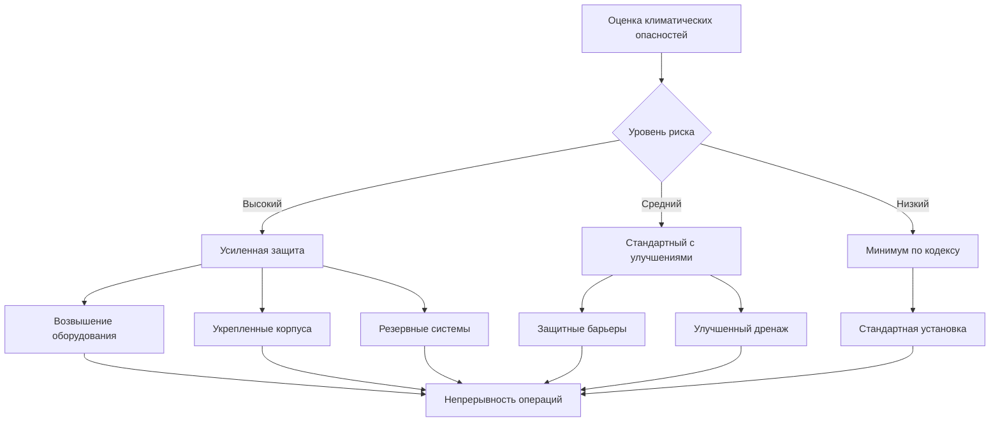
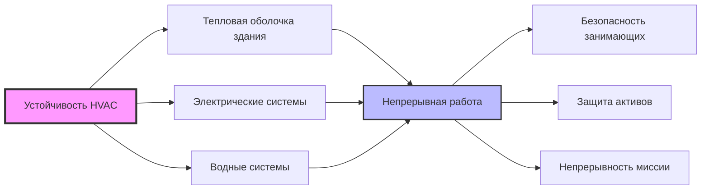

# Устойчивость и адаптация к климату в системах HVAC

Климатическая устойчивость в проектировании HVAC решает проблемы производительности системы в экстремальных условиях, обеспечения непрерывности операций при сбоях и адаптации к долгосрочным климатическим тенденциям. Проектирование устойчивых систем требует анализа тепловых нагрузок в условиях стресса, разработки стратегий резервирования и реализации адаптивных алгоритмов управления.

## Влияние изменения климата на проектирование HVAC

### Температурные экстремумы

Растущие расчетные температуры влияют на холодопроизводительность и энергопотребление. Корректировка расчетной холодильной нагрузки следует формуле:

$$Q_{design,future} = Q_{design,current} \times \frac{(T_{o,future} - T_{i})}{(T_{o,current} - T_{i})}$$

Где:
- $Q_{design,future}$ = Будущая расчетная холодильная нагрузка (кДж/ч)
- $Q_{design,current}$ = Текущая расчетная холодильная нагрузка (кДж/ч)
- $T_{o,future}$ = Прогнозируемая наружная расчетная температура (°C)
- $T_{o,current}$ = Текущая наружная расчетная температура (°C)
- $T_{i}$ = Температура установки в помещении (°C)

ASHRAE Research Project 1613 предоставляет климатические прогнозы расчетных условий до 2100 года. Пропускная способность оборудования должна соответствовать прогнозируемому увеличению температуры на 1,7–5 °C в большинстве климатических зон к 2050 году.

### Влияние влажности и скрытых нагрузок

Повышение абсолютной влажности увеличивает скрытые холодильные нагрузки. Расчет изменения скрытой нагрузки:

$$Q_{latent,change} = \dot{m}_{air} \times (W_{future} - W_{current}) \times h_{fg}$$

Где:
- $\dot{m}_{air}$ = Расход воздуха по массе (кг/ч)
- $W_{future}$ = Будущее соотношение влажности (г воды/кг сухого воздуха)
- $W_{current}$ = Текущее соотношение влажности (г воды/кг сухого воздуха)
- $h_{fg}$ = Скрытая теплота испарения ≈ 2500 кДж/кг

## Стратегии проектирования устойчивости

### Резервирование оборудования

| Уровень резервирования | Конфигурация | Доступность | Применение |
|------------------------|--------------|-------------|-----------|
| N+1 | Одно резервное устройство | 99,5–99,9% | Критические объекты |
| N+2 | Два резервных устройства | 99,9–99,99% | Центры обработки данных, больницы |
| 2N | Полное резервирование | 99,99%+ | Критически важные системы |
| Распределенное | Несколько меньших устройств | 99–99,5% | Коммерческие здания |

Анализ рентабельности резервирования:

$$ROI_{redundancy} = \frac{(C_{downtime} \times P_{failure} \times T_{recovery}) - C_{redundancy}}{C_{redundancy}}$$

Где:
- $C_{downtime}$ = Стоимость часа отказа системы ($/ч)
- $P_{failure}$ = Годовая вероятность отказа основной системы
- $T_{recovery}$ = Ожидаемое время восстановления (часы)
- $C_{redundancy}$ = Капитальная стоимость резервной емкости ($)

### Пассивная живучесть

Здания должны поддерживать пригодные для жизни условия во время отказов механических систем. Время теплового дрейфа без активного охлаждения:

$$t_{drift} = \frac{M_{total} \times c_{p} \times (T_{limit} - T_{initial})}{Q_{gains} - Q_{passive}}$$

Где:
- $t_{drift}$ = Время достижения предела температуры (часы)
- $M_{total}$ = Тепловая инерция здания (кг)
- $c_{p}$ = Удельная теплоемкость (кДж/кг·°C)
- $T_{limit}$ = Верхний температурный предел (°C)
- $T_{initial}$ = Начальная внутренняя температура (°C)
- $Q_{gains}$ = Внутренние и солнечные тепловые поступления (кДж/ч)
- $Q_{passive}$ = Пассивное отведение тепла (кДж/ч)

ASHRAE Standard 55 определяет пределы теплового стресса. Основные внутренние помещения должны поддерживать температуру ниже 32 °C минимум в течение 4 часов после отказа системы.

## Подготовка к экстремальным погодным условиям

### Защита от наводнений

Требования по возвышению оборудования следуют руководящим принципам FEMA для отметки базового наводнения (BFE):

- Критическое оборудование: BFE + 0,6 м минимум
- Наружные агрегаты: крепление на платформе или крыше в зонах наводнения
- Электрические компоненты: Водонепроницаемые корпуса с рейтингом IP67 или выше

Риск затопления наземного оборудования:

$$P_{flood} = 1 - e^{-\lambda \times t}$$

Где:
- $P_{flood}$ = Вероятность события наводнения
- $\lambda$ = Годовая частота наводнений (события/год)
- $t$ = Период времени (годы)

### Устойчивость к ветру и ураганам

ASCE 7 определяет проектирование нагрузки ветра для крышного оборудования. Требования к силе крепления:

$$F_{wind} = q_{z} \times G \times C_{f} \times A_{f}$$

Где:
- $F_{wind}$ = Расчетная сила ветра (кН)
- $q_{z}$ = Скоростной напор на высоте z (кПа)
- $G$ = Коэффициент порывистости (обычно 0,85)
- $C_{f}$ = Коэффициент силы (1,4–2,0 для оборудования)
- $A_{f}$ = Проецируемая площадь (м²)

Оборудование, рассчитанное на ураганы, требует устойчивости к ветру более 240 км/ч в прибрежных зонах. Сейсмическое крепление согласно ASCE 7 Глава 13 предотвращает смещение во время землетрясений.

### Устойчивость электроснабжения

Системы резервного электроснабжения сохраняют критические функции HVAC во время сбоев:

| Тип системы | Время запуска | Время работы | Применение |
|-------------|---------------|--------------|-----------|
| UPS | Мгновенно | 15–60 мин | Управление, критические нагрузки |
| Аккумуляторное хранилище | <1 секунда | 2–8 часов | Промежуточное питание |
| Генератор на природном газе | 10–30 секунд | Дни-недели | Полный резервный источник здания |
| Дизельный генератор | 10–30 секунд | Дни | Аварийное питание |
| Микросеть с солнечной батареей | Варьируется | Неограниченно | Устойчивые объекты |

Расчет размера генератора для нагрузок HVAC:

$$P_{generator} = (P_{cooling} + P_{heating} + P_{fans} + P_{pumps}) \times 1.25$$

Коэффициент 1,25 учитывает пусковые токи двигателей и будущий рост нагрузки.

## Адаптивные стратегии управления

### Предиктивный ответ

Модельное предиктивное управление (MPC) корректирует операции на основе прогнозов погоды. Предварительное охлаждение перед экстремальной жарой снижает пиковый спрос:

$$Q_{precool} = M \times c_{p} \times (T_{normal} - T_{precool})$$

Где:
- $Q_{precool}$ = Энергия, запасенная в тепловой инерции (кДж)
- $M$ = Тепловая инерция здания (кг)
- $T_{normal}$ = Нормальная температура установки (°C)
- $T_{precool}$ = Температура предварительного охлаждения (°C)

Предварительное охлаждение на 1,7–2,8 °C может отложить пиковые нагрузки на 2–4 часа, снижая нагрузку во время стресса в сети.

### Интеграция с регулированием спроса

Автоматическое регулирование спроса (ADR) поддерживает комфорт при снижении потребления во время аварийных ситуаций. Иерархия сброса нагрузки:

1. Сброс температуры подающего воздуха (+1,1 °C)
2. Сокращение вентиляции до минимума по кодексу
3. Корректировка точки установки зоны (±1,1 °C)
4. Отключение неважных площадей

Общий потенциал сброса:

$$P_{shed} = P_{baseline} \times \sum_{i=1}^{n} (r_{i} \times f_{i})$$

Где:
- $P_{shed}$ = Общее снижение мощности (кВт)
- $P_{baseline}$ = Базовая мощность HVAC (кВт)
- $r_{i}$ = Доля сокращения нагрузки для стратегии i
- $f_{i}$ = Доля пораженной площади здания

## Решения для проектирования с учетом будущего

### Рассмотрения избыточности

Традиционная практика избегает избыточности из-за штрафов по эффективности. Адаптация к климату требует преднамеренных запасов емкости:

$$CF_{design} = 1 + (r_{climate} \times t_{lifetime}) + r_{uncertainty}$$

Где:
- $CF_{design}$ = Проектный коэффициент емкости
- $r_{climate}$ = Годовой темп климатических изменений (обычно 0,01–0,03)
- $t_{lifetime}$ = Срок эксплуатации оборудования (15–25 лет)
- $r_{uncertainty}$ = Margin неопределенности (0,05–0,15)

Запас емкости 20–25% соответствует климатическим тенденциям без значительной потери эффективности в оборудовании с переменной емкостью.

### Выбор материалов

Материалы, устойчивые к коррозии, продлевают срок службы оборудования в изменяющихся условиях:

| Окружающая среда | Материал | Покрытие | Ожидаемый срок службы |
|------------------|----------|---------|----------------------|
| Прибрежная/соль | Алюминий с эпоксидной смолой | E-coat + порошковое покрытие | 15–20 лет |
| Высокая влажность | Нержавеющая сталь | Морское покрытие | 20–25 лет |
| Экстремальная жара | Сплав медь-никель | Анодированный | 20–30 лет |
| Стандартный | Оцинкованная сталь | Стандартная краска | 10–15 лет |

## Интеграция с устойчивостью зданий

Координированное планирование устойчивости охватывает:

- **Тепловая оболочка**: Усиленная изоляция расширяет пассивную живучесть
- **Электрическая инфраструктура**: Redundant feeds and backup power
- **Водоснабжение**: Замкнутые системы снижают внешние зависимости
- **Системы управления**: Распределенная архитектура предотвращает отказы в одной точке

## Метрики производительности

Количественное определение устойчивости позволяет проводить сравнение и оптимизацию:

$$R_{HVAC} = \frac{\int_{t_0}^{t_r} Q(t) \, dt}{Q_{nominal} \times t_{r}}$$

Где:
- $R_{HVAC}$ = Метрика устойчивости системы (0–1)
- $Q(t)$ = Холодопроизводительность/теплопроизводительность в момент времени t (кДж/ч)
- $Q_{nominal}$ = Номинальная пропускная способность (кДж/ч)
- $t_r$ = Время восстановления на полную мощность (часы)

Значения выше 0,8 указывают на высокоустойчивые системы, поддерживающие функциональность 80%+ во время сбоев.

Инвестиции в устойчивость балансируют начальные затраты против долгосрочного снижения рисков, стоимости непрерывности операций и требований адаптации к климату. Решения по проектированию, принятые сегодня, определяют производительность зданий в течение 30+ лет эксплуатации, охватывающих значительные климатические изменения.
