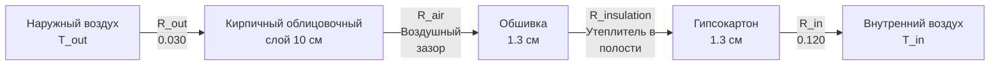

# Теплопередача в ограждающих конструкциях зданий и анализ их тепловых характеристик

Тепловые характеристики ограждающих конструкций определяют нагрузки на отопление и охлаждение, комфорт занятых и энергоэффективность. Данное руководство охватывает механизмы теплопередачи, расчеты коэффициента теплопередачи, тепловые мосты, характеристики остекления, инфильтрацию и контроль влажности в проектировании жилых и коммерческих зданий.

## Механизмы теплопередачи

### Установившаяся теплопроводность через стены

**Закон Фурье (одномерная теплопроводность):**

$$q = -k \cdot A \cdot \frac{dT}{dx}$$

Где:
- $q$ = скорость теплопередачи (кДж/ч)
- $k$ = коэффициент теплопроводности (кДж/(ч·м·°C) или кДж/(ч·м²·°C))
- $A$ = площадь (м²)
- $dT/dx$ = градиент температуры (°C/м)

**Для составной стены (последовательное сопротивление):**

$$q = \frac{A \cdot \Delta T}{R_{total}} = U \cdot A \cdot \Delta T$$

Где:
- $R_{total}$ = общее тепловое сопротивление (м²·°C/кВт)
- $U$ = общий коэффициент теплопередачи (кВт/(м²·°C))
- $\Delta T$ = разность температур (°C)

**Общее сопротивление:**

$$R_{total} = R_{out} + R_{1} + R_{2} + ... + R_{n} + R_{in}$$

Где:
- $R_{out}$ = тепловое сопротивление наружной поверхностной пленки
- $R_{1}, R_{2}, ...$ = тепловые сопротивления слоев материалов
- $R_{in}$ = тепловое сопротивление внутренней поверхностной пленки

**Коэффициенты теплопередачи поверхностной пленки (неподвижный воздух):**

| Поверхность | Зима (6.7 м/с ветер) | Лето (3.4 м/с ветер) |
|---------|----------------------|-----------------------|
| Наружная вертикальная стена | R = 0.030 | R = 0.044 |
| Внутренняя вертикальная стена | R = 0.120 | R = 0.120 |
| Горизонтальная поверхность (поток вверх) | R = 0.107 | R = 0.107 |
| Горизонтальная поверхность (поток вниз) | R = 0.162 | R = 0.162 |

**Тепловое сопротивление материала:**

$$R = \frac{L}{k}$$

Где:
- $L$ = толщина (м)
- $k$ = коэффициент теплопроводности (кВт/(м·°C))

### Расчет коэффициента теплопередачи

**Общий коэффициент теплопередачи:**

$$U = \frac{1}{R_{total}}$$

**Пример: Утепленная стеновая конструкция:**

**Расчет сопротивления:**

| Слой | Толщина | k или R | Сопротивление |
|-------|-----------|--------|------------|
| Наружная воздушная пленка | — | — | 0.030 |
| Кирпичный облицовочный слой | 10 см | k = 0.87 | 0.115 |
| Воздушный зазор (2 см) | — | — | 0.177 |
| Обшивка (ОСП) | 1.3 см | k = 0.108 | 0.142 |
| Стекловолокнистый утеплитель | 14 см | RSI = 3.35 | 3.35 |
| Гипсокартон | 1.3 см | k = 0.193 | 0.078 |
| Внутренняя воздушная пленка | — | — | 0.120 |
| **Итого** | — | — | **R-4.03** |

**U-коэффициент:** $U = 1/4.03 = 0.248$ кВт/(м²·°C)

<h3>Пример решения 1: Расчет потерь тепла через стену</h3>

**Дано:**
- Площадь стены: 93 м²
- Стеновая конструкция: R-4.03 (из таблицы выше)
- Температура внутри: 21°C
- Температура снаружи: -12°C (зимний расчетный день)

**Найти:** Потери тепла через стену

**Решение:**

$$q = U \cdot A \cdot \Delta T$$

$$q = 0.248 \times 93 \times (21 - (-12)) = 0.248 \times 93 \times 33 = 762 \text{ кВт}$$

**Годовое энергопотребление на отопление (упрощенно, 3000 градус-дней):**

$$E_{annual} = U \cdot A \cdot GDD \times 24 / 1000$$

$$E_{annual} = 0.248 \times 93 \times 3000 \times 24 / 1000 = 166.3 \text{ кВт·ч}$$

При стоимости электроэнергии 5 руб/кВт·ч:

$$Cost = 166.3 \times 5 = 831.5 \text{ рублей}$$

**Ответ:** Пиковые потери тепла: 762 кВт; Годовая стоимость: ~832 рублей

## Тепловые мосты

**Тепловой мост:** Проводящий путь через теплоизоляцию (деревянные стойки, конструктивные элементы)

**Эффект:** Локальное увеличение U-коэффициента, риск конденсации, снижение эффективного R-коэффициента

### Метод параллельных путей

**Для стен с деревянным каркасом:**

$$U_{effective} = (U_{cavity} \times f_{cavity}) + (U_{framing} \times f_{framing})$$

Где:
- $f_{cavity}$ = доля площади стены с утеплением в полости
- $f_{framing}$ = доля площади стены с деревянным каркасом (стойками)

**Типичные доли каркаса:**
- Деревянные стойки 50×100 мм с шагом 400 мм: 15–20% каркаса
- Деревянные стойки 50×150 мм с шагом 600 мм: 10–15% каркаса
- Стальные стойки с шагом 400 мм: 25% каркаса (худшие тепловые мосты)

**Пример:**
- R-коэффициент в полости: R-3.35 (стекловолокно между стойками)
- R-коэффициент в зоне стойки: R-0.88 (деревянная стойка через полость)
- Доля каркаса: 15%

$$U_{eff} = (1/3.35 \times 0.85) + (1/0.88 \times 0.15) = 0.254 + 0.170 = 0.424$$

$$R_{eff} = 1/0.424 = 2.36$$

**Тепловые мосты снижают R-3.35 до эффективного R-2.36 (30% снижение)**

### Стратегии снижения влияния тепловых мостов

1. **Непрерывное наружное утепление:** Исключает тепловые мосты
   - Жесткий пенопласт над обшивкой (3–5 см типичная толщина)
   - Добавляет R-0.88 до R-1.76 без тепловых мостов

2. **Улучшенный монтаж каркаса:** Снижение доли каркаса
   - Шаг 600 мм вместо 400 мм
   - Один верхний брус, исключение усиливающих элементов в ненесущих стенах
   - Снижает каркас до 10–12%

3. **Структурные изоляционные панели (SIP):** Минимальные тепловые мосты
   - Эффективный R-коэффициент ≈ 95% от номинального

4. **Тепловой разрыв в стальном каркасе:** Критично для металлических зданий
   - Z-профили с тепловыми вставками
   - Наружное утепление над стойками

## Характеристики остекления

### U-коэффициенты окон и стекла

**Показатели производительности окна:**
- **U-коэффициент:** Общий коэффициент теплопередачи (меньше — лучше)
- **SHGC (коэффициент солнечного теплопоступления):** Доля переданного солнечного излучения (0–1)
- **VT (видимое пропускание):** Доля переданного видимого света (0–1)

**Типичные U-коэффициенты окон для жилых зданий (по NFRC):**

| Тип остекления | Рама | U-коэффициент (кВт/(м²·°C)) | SHGC |
|--------------|-------|--------------------------|------|
| Одинарное прозрачное | Алюминий | 7.39 | 0.76 |
| Одинарное прозрачное | ПВХ | 5.68 | 0.75 |
| Двойное прозрачное | Алюминий | 4.55 | 0.70 |
| Двойное прозрачное | ПВХ | 2.84 | 0.70 |
| Двойное с низкоэмиссионным покрытием (ε=0.10) | ПВХ | 1.70 | 0.40 |
| Тройное с низкоэмиссионным покрытием, аргон | ПВХ | 1.14 | 0.35 |

**Низкоэмиссионное (Low-E) покрытие:** Снижает излучательный теплообмен между стеклами
- $\epsilon$ = 0.84 (прозрачное стекло)
- $\epsilon$ = 0.10 (hard-coat Low-E)
- $\epsilon$ = 0.04 (soft-coat Low-E)

**Заполняющий газ:** Аргон или криптон между стеклами снижает теплопроводность
- Воздух: k = 0.026 кВт/(м·°C)
- Аргон: k = 0.017 кВт/(м·°C) (снижает U-коэффициент ~10%)
- Криптон: k = 0.009 кВт/(м·°C) (дорого, узкие зазоры)

### Солнечное теплопоступление

**Солнечное теплопоступление через окна:**

$$Q_{solar} = A_{window} \times SHGC \times I_{solar}$$

Где:
- $A_{window}$ = площадь остекления (м²)
- $SHGC$ = коэффициент солнечного теплопоступления (0–1)
- $I_{solar}$ = интенсивность солнечного излучения (кВт/м²)

**Пиковое солнечное излучение (ясный день, перпендикулярная поверхность):**
- Южный вертикал: 630–790 кВт/м² (зима)
- Западный вертикал: 570–695 кВт/м² (летний полдень)
- Горизонтальная (крыша): 790–950 кВт/м² (лето)

**Коэффициент затенения (старая метрология):**

$$SC = \frac{SHGC_{actual}}{SHGC_{reference}} \approx 1.15 \times SHGC$$

Где эталон — одинарное прозрачное стекло (SHGC ≈ 0.87)

## Инфильтрация и утечки воздуха

### Измерение утечек воздуха

**Испытание дверцей нагнетателя (Blower Door):** Подпрессовка здания до 50 Па, измерение расхода воздуха

**Показатели:**
- **ACH50:** Воздухообмены в час при давлении 50 Па
- **CFM50:** Кубические футы в минуту (м³/ч) утечек при 50 Па; 1 CFM = 1.699 м³/ч

**Типичные значения ACH50:**
- Существующие дома (без герметизации): 8–15 ACH50
- Стандартное новое строительство: 4–7 ACH50
- Дома Energy Star: 3–5 ACH50
- Пассивный дом: < 0.6 ACH50

**Преобразование в естественную инфильтрацию:**

$$ACH_{natural} = \frac{ACH_{50}}{N}$$

Где $N$ = 20 типично (зависит от климата, защиты от ветра, высоты)

**Потери тепла на инфильтрацию:**

$$Q_{inf} = \rho \cdot c_p \cdot V \cdot ACH \cdot \Delta T$$

Упрощенно:

$$Q_{inf} = 1.21 \times CFM_{inf} \times \Delta T$$

(где 1.21 кВт/(м³/ч·°C) для стандартного воздуха)

<h3>Пример решения 2: Нагрузка на инфильтрацию</h3>

**Дано:**
- Объем дома: 340 м³
- Результат испытания дверцей нагнетателя: ACH50 = 5.0
- Внутри: 21°C
- Снаружи: -6°C (зимний расчетный день)

**Найти:** Потери тепла на инфильтрацию

**Решение:**

Естественные воздухообмены:
$$ACH_{natural} = \frac{5.0}{20} = 0.25 \text{ ACH}$$

Расход инфильтрационного воздуха:
$$CFM_{inf} = \frac{340 \times 0.25 \times 1.699}{60} = 2.41 \text{ м³/ч}$$

Потери тепла на ощущаемое охлаждение:
$$Q_{inf,s} = 1.21 \times 2.41 \times (21 - (-6)) = 78.8 \text{ кВт}$$

Потери на скрытое охлаждение (зима, незначительно):
$$Q_{inf,l} \approx 0$$

**Ответ:** 78.8 кВт потерь тепла на инфильтрацию

**Для герметичного дома (ACH50 = 2.0):**
$$Q_{inf,tight} = 1.21 \times 0.96 \times 27 = 31.5 \text{ кВт}$$

**Экономия:** 47.3 кВт (60% снижение)

## Влияние тепловой массы

**Тепловая масса:** Способность материала накапливать и отдавать тепло

**Емкость аккумулирования тепла:**

$$Q_{stored} = m \cdot c_p \cdot \Delta T = \rho \cdot V \cdot c_p \cdot \Delta T$$

Где:
- $\rho$ = плотность (кг/м³)
- $c_p$ = удельная теплоемкость (кДж/(кг·°C))
- $V$ = объем (м³)

**Объемная теплоемкость:**

$$C_v = \rho \cdot c_p$$

**Материалы:**

| Материал | ρ (кг/м³) | c_p (кДж/(кг·°C)) | C_v (кДж/(м³·°C)) |
|----------|-----------|----------------|------------------|
| Бетон | 2242 | 0.84 | 1883 |
| Кирпич | 1922 | 0.84 | 1614 |
| Гипс | 801 | 1.09 | 873 |
| Древесина | 561 | 1.88 | 1055 |
| Вода | 1000 | 4.18 | 4180 |

**Преимущество:** Тепловая масса смягчает колебания температуры, снижает пиковые нагрузки

**Пример:** Бетонная плита пола (10 см толщина, 93 м²)
- Объем: $93 \times 0.10 = 9.3$ м³
- Масса: $9.3 \times 2242 = 20,851$ кг
- Емкость: $20,851 \times 0.84 = 17,515$ кДж/°C

**Снижение колебания температуры:** Колебание 5.5°C → 2.8°C с тепловой массой

## Контроль влажности и конденсация

### Диффузия пара

**Закон Фика (диффузия пара):**

$$\dot{m}_v = -M \cdot A \cdot \frac{dP_v}{dx}$$

Где:
- $\dot{m}_v$ = массовый расход пара (кг/ч)
- $M$ = паропроницаемость (нг/(Па·с·м²))
- $dP_v/dx$ = градиент парциального давления пара

**Паропроницаемость:** $M = \mu/L$ (свойство материала / толщина)

**Классификация паровых барьеров:**
- **Класс I (непроницаемый):** < 0.018 нг/(Па·с·м²) (полиэтиленовая пленка, фольга)
- **Класс II (полупроницаемый):** 0.018–0.18 нг/(Па·с·м²) (крафт-бумага, некоторые краски)
- **Класс III (паропроницаемый):** 0.18–1.8 нг/(Па·с·м²) (латексная краска)

### Риск конденсации

**Температура точки росы:** Температура, при которой влага конденсируется

**На каждом слое проверить:**

$$T_{interface} > T_{dewpoint}$$

Если $T_{interface} < T_{dewpoint}$, происходит конденсация.

**Стратегии предотвращения конденсации:**

1. **Паровой барьер на теплой стороне:** Предотвращение попадания влаги в стену
2. **Наружное утепление:** Поддерживает обшивку выше температуры точки росы
3. **Вентиляция:** Удаление влаги из здания
4. **Осушение:** Контроль внутренней влажности (< 40% ОВ зимой)

---

**Связанные технические руководства:**
- Тепловые свойства материалов
- Основы теплопередачи
- Расчеты нагрузок отопления
- Расчеты нагрузок охлаждения
- Психрометрические основы

**Литература:**
- ASHRAE Fundamentals Handbook, Chapter 26: Heat, Air, and Moisture Control in Building Assemblies
- ASHRAE Fundamentals Handbook, Chapter 25: Thermal and Water Vapor Transmission Data
- Building Science Corporation: www.buildingscience.com
- Lstiburek, J., "Builder's Guide to Cold Climates"
- Straube, J., "High Performance Enclosures"
