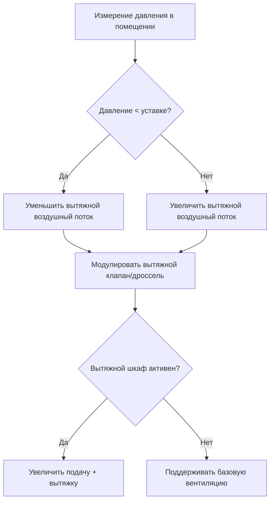

# Управление давлением в зданиях для инженеров HVAC

Управление давлением в зданиях поддерживает перепады давления между помещениями для контроля направления воздушных потоков, предотвращения инфильтрации/экфильтрации и обеспечения комфорта occupants. Критические области применения включают лаборатории, больницы, чистые помещения и подпор воздуха в лестничных клетках.

## Зависимости давления

**Перепад давления:**

$$\Delta P = P_{high} - P_{low}$$

Типичные единицы: Паскали (Па) или дюймы водяного столба (\"w.g.)

**Конвертация:** 1 \"w.g. = 249 Па

**Воздушный поток через отверстие:**

$$Q = C \times A \times \sqrt{2 \Delta P / \rho}$$

Где:
- $Q$ = воздушный поток (CFM (м³/ч))
- $C$ = коэффициент истечения (0.6-0.7)
- $A$ = площадь отверстия (м²)
- $\Delta P$ = разность давлений (Па)
- $\rho$ = плотность воздуха (кг/м³)

**Упрощенная формула для стандартного воздуха:**

$$CFM = 2610 \times A \times \sqrt{\Delta P_{\"w.g.}}$$

<h3>Пример 1: Утечка через дверь</h3>

**Исходные данные:**
- Размер двери: 0.91 м × 2.13 м
- Зазор двери: 1.27 см по всему периметру
- Перепад давления: 0.05 \"w.g.
- Коэффициент истечения: 0.65

**Найти:** Воздушный поток утечки

**Решение:**

Площадь зазора:

$$A = \frac{1.27}{2.54 \times 12} \times 2 \times (0.91 + 2.13) = 0.077 \text{ м}^2$$

Воздушный поток:

$$CFM = 2610 \times 0.65 \times 0.077 \times \sqrt{0.05} = 390 \text{ CFM (м³/ч)}$$

**Ответ:** 390 CFM утечки через зазоры двери

## Подпор воздуха в лабораториях

### Лаборатории с отрицательным давлением

**Назначение:** Контейнирование опасных материалов (BSL-2, BSL-3, химические лаборатории)

**Типичное давление:** -0.01 до -0.05 \"w.g. относительно коридора

**Стратегия управления:**

**Проектирование:**
- Вытяжка > Подача на 100-300 CFM (м³/ч)
- Вытяжка расположена низко (тяжелые пары) и высоко (легкие пары)
- Диффузоры подачи вдали от вытяжки (избегать короткого замыкания потока)

### Лаборатории с положительным давлением

**Назначение:** Защита чувствительных материалов (чистые помещения, полупроводники, фармацевтика)

**Типичное давление:** +0.02 до +0.05 \"w.g. относительно коридора

**Проектирование:**
- Подача > Вытяжка на 100-500 CFM (м³/ч) (зависит от объема помещения)
- Каскадирование давления: Чистая комната > Зона одевания > Коридор

**Пример каскада:**
- Чистая комната ISO 5: +0.05 \"w.g.
- Зона одевания ISO 7: +0.03 \"w.g.
- Коридор: +0.01 \"w.g.
- Помещение: 0 \"w.g.

## Подпор воздуха в лестничных клетках

**Назначение:** Обеспечение незадымленного эвакуационного выхода при пожаре

**Требования нормативов (IBC/NFPA 92):**
- Минимальное давление: 0.10 \"w.g. (25 Па)
- Максимальное давление: 0.35 \"w.g. (87 Па) при закрытых дверях

**Расчетный воздушный поток:**

$$CFM_{stairwell} = CFM_{doors} + CFM_{leakage} + CFM_{weather}$$

**Воздушный поток при открытии двери:**

$$CFM_{door} = 2610 \times A_{door} \times \sqrt{\Delta P}$$

**Типичное значение:** 3,000-5,000 CFM (м³/ч) на лестничную клетку

<h3>Пример 2: Подпор воздуха в лестничной клетке</h3>

**Исходные данные:**
- Лестничная клетка на 10 этажей
- Размер двери: 0.91 м × 2.13 м = 1.95 м²
- Расчетное давление: 0.30 \"w.g. (одна открытая дверь)
- Утечка: 200 CFM (м³/ч)

**Найти:** Требуемый воздушный поток подачи

**Решение:**

Воздушный поток для одной двери:

$$CFM_{door} = 2610 \times 1.95 \times \sqrt{0.30} = 30,000 \text{ CFM (м³/ч)}$$

Общий с учетом утечки:

$$CFM_{total} = 30,000 + 200 = 30,200 \text{ CFM (м³/ч)}$$

**Ответ:** 30,200 CFM (м³/ч) производительность нагнетательного вентилятора

(Примечание: Фактический проект учитывает сценарии открытия дверей согласно NFPA 92)

**Стратегия управления:**
- Рельефный клапан барометрического типа (пассивный)
- Или модулирующий релейный клапан (активное управление)
- Датчик давления в лестничной клетке

## Подпиточный воздух для вытяжных систем

**Подпиточный воздух должен заменять вытяжной воздух** для предотвращения депрессии здания

**Расчет:**

$$CFM_{makeup} = CFM_{exhaust} - CFM_{infiltration}$$

**Источники вытяжки:**
- Вытяжные шкафы кухонь: 200-500 CFM (м³/ч) на погонный фут
- Вытяжные шкафы лабораторий: 100-150 CFM (м³/ч) на фут² площади лицевой панели
- Вытяжка санузлов: 50-75 CFM (м³/ч) наfixture
- Технологическая вытяжка: варьируется в зависимости от применения

**Последствия недостаточного притока воздуха:**
- Затрудненное открывание дверей (высокое отрицательное давление)
- Обратная тяга в горелочных устройствах
- Инфильтрация необработанного воздуха
- Жалобы на комфорт

**Проектные рекомендации:**
- Обеспечить 80–100% объема вытяжного воздуха в виде отдельного приточного
- Остаток восполняется за счет инфильтрации и общей вентиляции
- Приточный воздух должен быть обработан (обогрев/охлаждение)

## Расчет приточного воздуха на сброс

**Приточный воздух на сброс предотвращает избыточное давление**, когда приток наружного воздуха превышает объем вытяжки.

**Типичный сценарий:** Режим экономайзера с 100% наружным воздухом.

**Расчет:**

$$CFM_{relief} = CFM_{OA,max} - CFM_{exhaust} - CFM_{exfiltration}$$

**Типы клапанов сброса:**
1. **Барометрический сброс:** Гравитационный (пассивный)
2. **Силовой сброс:** Клапан с электроприводом (активное управление)
3. **Вентилятор сброса:** Принудительная вытяжка (для крупных систем)

**Расположение:** В верхней части здания (теплый воздух поднимается вверх).

## Практические стратегии управления

### Прямое управление по давлению

**Датчик:** Датчик разности давлений между помещениями.

**Управление:** Модулирует клапаны притока/вытяжки или вентиляторы для поддержания заданного значения.

**Преимущества:** Высокая точность, реакция на все факторы (открывание дверей, ветер, эффект тяги).

**Недостатки:** Дрейф показаний датчиков, требуется калибровка.

### Отслеживание расхода воздуха

**Измерение расходов притока и вытяжки**, поддержание заданного смещения.

**Пример:** Поддержание притока = вытяжка + 150 CFM (м³/ч).

**Преимущества:** Отсутствие дрейфа, простота пусконаладки.

**Недостатки:** Не учитывает инфильтрацию/экфильтрацию.

### Комбинированный подход

Использование отслеживания расхода воздуха с мониторингом давления в качестве резервного или контрольного механизма.

## Практические соображения при проектировании

1. **Расположение датчиков:** Вдали от диффузоров, дверей и оборудования HVAC.
2. **Зазоры под дверьми:** Зазор 2,54 см = ~1,94 м² × 1/12 = 0,16 м² свободной площади.
3. **Предтамбуры:** Разрывают перепад давления (воздушный шлюз с двумя дверями).
4. **Влияние ветра:** Может преодолеть управление давлением 0,05 дюйма вод. ст.
5. **Пусконаладка:** Испытания с открытыми и закрытыми дверями, проверка каскада давлений.

---

**Связанные технические руководства:**
- Стратегии управления HVAC
- Расчет норм вентиляции
- Измерение и балансировка воздушных потоков

**Ссылки:**
- Справочник ASHRAE по применению HVAC, Глава 16: Лаборатории
- NFPA 92: Стандарт систем противодымной защиты
- Международный строительный кодекс (IBC), Раздел 909: Системы противодымной защиты
- ANSI/AIHA Z9.5: Вентиляция лабораторий
