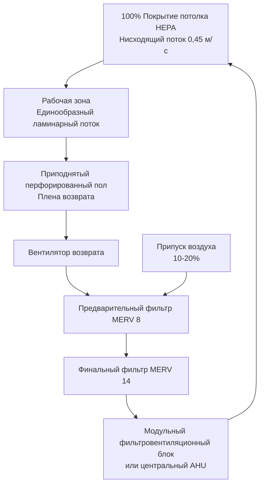
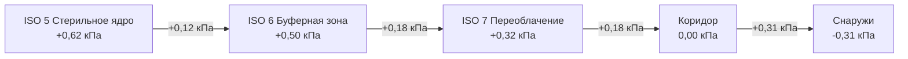
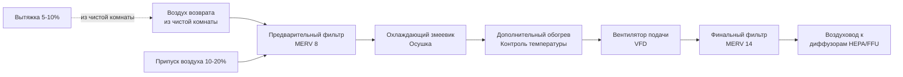

# Проектирование чистых комнат и классификация ISO для инженеров HVAC

Системы HVAC чистых комнат поддерживают контролируемые среды с установленными концентрациями частиц, температурой, влажностью и давлением. Это руководство охватывает классификацию ISO 14644, схемы воздушных потоков, требования к фильтрации и методологию проектирования для фармацевтических, полупроводниковых, биотехнологических и медицинских производств.

## Классификация чистых комнат ISO 14644

### Предельные концентрации частиц

**Таблица классификации ISO 14644-1:**

| Класс ISO | 0,1 мкм | 0,2 мкм | 0,3 мкм | 0,5 мкм | 1 мкм | 5 мкм | Общее название (US FED STD 209E) |
|-----------|---------|---------|---------|---------|-------|-------|-----------------------------------|
| ISO 1 | 10 | 2 | — | — | — | — | — |
| ISO 2 | 100 | 24 | 10 | 4 | — | — | — |
| ISO 3 | 1 000 | 237 | 102 | 35 | 8 | — | Class 1 |
| ISO 4 | 10 000 | 2 370 | 1 020 | 352 | 83 | — | Class 10 |
| ISO 5 | 100 000 | 23 700 | 10 200 | 3 520 | 832 | 29 | Class 100 |
| ISO 6 | 1 000 000 | 237 000 | 102 000 | 35 200 | 8 320 | 293 | Class 1 000 |
| ISO 7 | — | — | — | 352 000 | 83 200 | 2 930 | Class 10 000 |
| ISO 8 | — | — | — | 3 520 000 | 832 000 | 29 300 | Class 100 000 |
| ISO 9 | — | — | — | 35 200 000 | 8 320 000 | 293 000 | Воздух комнаты |

**Единицы:** Частицы на кубический метр

**Максимальная концентрация частиц:**

$$C_N = 10^N \times \left(0.1/D\right)^{2.08}$$

Где:
- $C_N$ = максимально допустимая концентрация (частицы/м³)
- $N$ = номер классификации ISO (1-9)
- $D$ = размер частицы (мкм), от 0,1 до 5,0 мкм

**Пример для ISO 5 при 0,5 мкм:**
$$C_5 = 10^5 \times (0.1/0.5)^{2.08} = 100 000 \times 0.0352 = 3 520 \text{ частиц/м}^3$$

### Операционные состояния

**Как построено:** Объект завершен, все сервисы подключены, нет оборудования или персонала
**В покое:** Оборудование установлено и работает, персонала нет
**Рабочий режим:** Обычное производство с персоналом и активными процессами

Наиболее строгое требование применяется к **рабочему режиму**.

## Схемы воздушных потоков

### Однонаправленный (ламинарный) поток

**Характеристики:**
- Параллельные воздушные потоки с единообразной скоростью (0,3-0,5 м/с)
- Вертикальный нисходящий или горизонтальный кроссток
- Минимальная турбулентность, удаление частиц прямо в возврат/вытяжку
- Требуется для чистых комнат ISO 3-5 (максимальная чистота)

**Проектирование:**

**Покрытие HEPA:**
- ISO 3-4: 80-100% покрытие потолка
- ISO 5: 60-80% покрытие потолка
- Остальное: неперфорированные решетки возврата

**Однородность скорости:** ±20% по рабочей зоне

### Неоднонаправленный (турбулентный смешанный) поток

**Характеристики:**
- Диффузоры HEPA подают воздух на высокой скорости (вызывают смешивание)
- Воздухообмены в час (ACH) разбавляют частицы
- Ниже затраты, чем однонаправленный поток
- Подходит для чистых комнат ISO 6-8

**Проектирование:**
- HEPA фильтры в потолке (15-25% покрытие)
- Низкие боковые или напольные возвраты
- Высокие кратности воздухообмена (60-600 ACH в зависимости от класса)

**Кратности воздухообмена:**

| Класс ISO | ACH (типично) | Поток воздуха (м³/ч/м²) |
|-----------|---------------|-------------------------|
| ISO 5 | 240-480 | 686-1372 |
| ISO 6 | 90-180 | 257-514 |
| ISO 7 | 40-60 | 114-171 |
| ISO 8 | 20-30 | 57-86 |

## Требования к фильтрации

### Каскад фильтров

**Трехступенчатая фильтрация (типично):**

1. **Предварительный фильтр (MERV 8-10):** Защита нижестоящих фильтров, увеличение срока службы
2. **Промежуточный фильтр (MERV 14-15):** Удаление большинства частиц, защита HEPA
3. **Финальный фильтр (HEPA H13 или ULPA U15):** Терминальная фильтрация на диффузорах

**Характеристики фильтра HEPA (EN 1822):**

| Класс фильтра | Эффективность @ MPPS | Типичный размер | Перепад давления |
|---------------|----------------------|-----------------|------------------|
| H13 (HEPA) | ≥99,95% | 0,15-0,3 мкм | 0,62-1,87 кПа |
| H14 (HEPA) | ≥99,995% | 0,15-0,3 мкм | 0,75-2,24 кПа |
| U15 (ULPA) | ≥99,9995% | 0,12 мкм | 1,25-3,12 кПа |

MPPS = наиболее пронизывающий размер частиц (точка минимальной эффективности)

### Модульные фильтровентиляционные блоки (FFU)

**Компоненты:**
- Фильтр HEPA или ULPA (0,6 м × 1,2 м или 0,6 м × 0,6 м типично)
- Встроенный вентилятор (EC мотор, переменная скорость)
- Рама крепления для потолочной сетки

**Преимущества:**
- Модульные, легко заменяются
- Индивидуальный контроль потока
- Сниженная воздуховодная разводка
- Низкое статическое давление (распределенные вентиляторы)

**Недостатки:**
- Выше затраты на обслуживание (много моторов)
- Шум (вентиляторы в занятом пространстве)
- Выделение тепла от моторов

**Применение:** Распространено для чистых комнат ISO 4-6 в полупроводниковой, фармацевтической промышленности

## Проектирование каскадного давления

### Стратегия дифференциального давления

**Принципы:**
- Предотвращение миграции загрязнения из низкочистых в высокочистые зоны
- Поддержание положительного давления в чистых областях относительно окружающих пространств
- Каскад давления: максимальное давление в самой чистой комнате

**Типичные дифференциалы давления:**
- Между чистой комнатой и коридором: +0,12-0,31 кПа
- Между уровнями классификации ISO: +0,12-0,18 кПа
- Чистая комната к наружному воздуху: +0,62-1,24 кПа

**Пример каскада давления:**

### Метод балансировки воздушного потока

**Подача - Возврат - Вытяжка = Положительное давление:**

$$\text{м³/ч}_{\text{подача}} = \text{м³/ч}_{\text{возврат}} + \text{м³/ч}_{\text{вытяжка}} + \text{м³/ч}_{\text{утечка}}$$

Где $\text{м³/ч}_{\text{утечка}}$ создает положительное давление

**Оценка утечки:**

$$\text{м³/ч}_{\text{утечка}} = C \cdot A \cdot \sqrt{\Delta P}$$

Где:
- $C$ = коэффициент потока (зависит от пути утечки)
- $A$ = площадь утечки (м²)
- $\Delta P$ = дифференциал давления (кПа)

**Типовое проектирование:** 5-10% избыточной подачи над возвратом/вытяжкой

<h3>Рабочий пример 1: Расчет воздушного потока чистой комнаты ISO 7</h3>

**Дано:**
- Чистая комната: 12,2 м × 9,1 м × 3,05 м потолок
- Классификация: ISO 7 рабочий режим
- Целевой ACH: 50 (консервативный для ISO 7)
- Тепловая нагрузка: 10,5 кВт (оборудование, освещение, люди)
- Целевая температура: 20°C
- Давление: +0,18 кПа относительно коридора

**Найти:** Подача воздуха, охлаждающая нагрузка, балансировка давления

**Решение:**

Объем комнаты:
$$V = 12,2 \times 9,1 \times 3,05 = 338,5 \text{ м}^3$$

Подача воздуха для требования ACH:
$$\text{м³/ч}_{\text{ACH}} = \frac{50 \times 338,5}{1} = 16 925 \text{ м³/ч}$$

Подача воздуха для охлаждения (принимая ΔT 11°C):
$$\text{м³/ч}_{\text{охлаждение}} = \frac{10 500}{1,2 \times 11} = 796 \text{ м³/ч}$$

**Управляющее требование:** ACH (16 925 м³/ч >> 796 м³/ч)

Подача воздуха: **16 925 м³/ч**

Охлаждающая нагрузка (с подачей 16 925 м³/ч):
- Явная: 10,5 кВт (заданная внутренняя нагрузка)
- Повышение температуры подаваемого воздуха: $\Delta T = \frac{10,5}{1,2 \times 16 925 / 3600} = 1,8°C$
- Температура подаваемого воздуха: 20 - 1,8 = 18,2°C
- Вентиляционная нагрузка охлаждения: $Q = 1,2 \times 16 925 / 3600 \times 11 = 62,2 \text{ кВт}$ (если ОА при 29°C)

Балансировка давления:
- Подача: 16 925 м³/ч
- Возврат в AHU: 16 080 м³/ч (95%)
- Утечка (давление): 845 м³/ч (5%)

**Ответы:**
- Подача воздуха: 16 925 м³/ч (ACH-управляемая)
- Воздухообмены: 50 ACH
- Охлаждающая нагрузка: ~62 кВ (включает вентиляционную нагрузку)
- Утечка давления: 845 м³/ч

## Контроль температуры и влажности

**Типичные требования:**

| Применение | Температура | Влажность |
|------------|-------------|-----------|
| Фармацевтическая стерильная | 20-22°C | 30-50% ОВ |
| Полупроводниковый завод | 20°C ±0,6°C | 40-45% ОВ ±2% |
| Медицинское производство | 20-22°C | 30-60% ОВ |
| Биотехнология | 20-22°C | 40-60% ОВ |

**Важность контроля влажности:**
- **Низкая влажность (< 30% ОВ):** Риск электростатического разряда (ESD), высыхание продукции
- **Высокая влажность (> 60% ОВ):** Конденсация, рост микроорганизмов, коррозия

**Стратегия управления:**
- Охлаждающий змеевик + дополнительный обогрев для осушки
- Паровой увлажнитель (самый чистый, без частиц)
- Стабильность температуры ±1,1°C
- Стабильность влажности ±5% ОВ

## Система HVAC для чистых комнат

### Рециркуляционный агрегат обработки воздуха (RAHU)

**Компоненты:**

**Припуск наружного воздуха:**
- 10-20% от подачи для поддержания положительного давления
- Компенсация вытяжки (вытяжные шкафы, технологическое оборудование)
- Предварительная обработка выделенным агрегатом припуска воздуха (MAU)

**Вытяжка:**
- Местная вытяжка для опасных процессов (вытяжные шкафы, биобезопасные шкафы)
- Общая вытяжка комнаты (5-10% от подачи)
- Фильтрация HEPA на вытяжке при опасных или токсичных материалах

### Последовательности управления

**Контроль давления:**
1. Измерение давления в комнате относительно эталона (коридор)
2. Модуляция подачи или вытяжки для поддержания уставки
3. Типично: модуляция заслонки вытяжки, подача постоянная

**Контроль температуры:**
1. Измерение температуры в комнате
2. Модуляция клапанов охлаждения/дополнительного обогрева
3. Вентилятор подачи поддерживает постоянный поток (независимое давление)

**Контроль влажности:**
1. Измерение влажности в комнате
2. Охлаждающий змеевик для осушки (удаление конденсата)
3. Паровой увлажнитель для увлажнения

## Методология проектирования

**Пошаговое проектирование HVAC чистой комнаты:**

1. **Определить класс чистоты** (типично ISO 5-8)
2. **Выбрать схему воздушного потока** (однонаправленный или турбулентный)
3. **Рассчитать воздухообмены** (таблица или модель генерации частиц)
4. **Определить размер подачи воздуха** (ACH × объем / 60)
5. **Рассчитать охлаждающую нагрузку** (оболочка, свет, оборудование, люди, вентиляция)
6. **Проверить подачу воздуха** (максимум ACH или требование охлаждения)
7. **Спроектировать каскад давления** (подача = возврат + вытяжка + утечка)
8. **Выбрать фильтрацию** (трехступенчатая: предварительная, промежуточная, HEPA/ULPA)
9. **Расположить диффузоры/возвраты** (обеспечить единообразный воздушный поток)
10. **Определить размер воздуховодов и AHU** (низкая скорость для снижения шума)
11. **Спроектировать управление** (давление, температура, влажность)
12. **Определить испытания и пусконаладку** (подсчет частиц, поток, давление)

## Пусконаладка и испытания

**Методы испытаний ISO 14644-3:**

1. **Тест подсчета частиц:** Подтверждение классификации оптическим счетчиком частиц
2. **Скорость потока/объем воздуха:** Проверка ACH или скорости однонаправленного потока
3. **Дифференциал давления:** Подтверждение каскада между комнатами
4. **Тест герметичности фильтра HEPA:** Вызов DOP или PAO (минимум 99,99%)
5. **Визуализация схемы воздуха:** Дымовой тест для подтверждения направления потока
6. **Тест восстановления:** Время возврата к установленной чистоте после загрязнения
7. **Температура и влажность:** Проверка диапазонов управления

**Критерии приемки:**
- Подсчеты частиц ≤ пределы класса ISO (при уверенности 95%)
- Однородность потока ±20% от среднего
- Дифференциалы давления ±0,005 кПа от уставки
- Целостность HEPA: нулевые утечки > 0,01% от концентрации выше по потоку

---

**Связанные технические руководства:**
- Проектирование воздушной фильтрации
- Контроль давления в здании
- Расчеты вентиляционных скоростей
- Стратегии управления HVAC
- Проектирование HVAC в здравоохранении

**Ссылки:**
- ISO 14644-1: Классификация чистоты воздуха по концентрации частиц
- ISO 14644-3: Методы испытаний
- Справочник ASHRAE Applications, глава 18: Чистые помещения
- IEST-RP-CC006: Испытания чистых комнат
- Руководство FDA: Стерильные лекарственные средства, производимые асептическим методом
