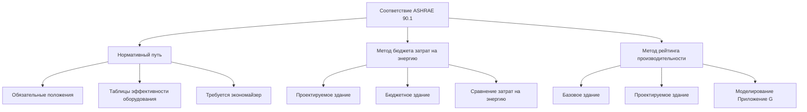

# Анализ соответствия кодексам для инженеров HVAC

Системы HVAC должны соответствовать строительным, механическим, энергетическим и вентиляционным кодексам. Понимание путей соответствия, процедур расчета и требований к документации обеспечивает получение разрешений и законную эксплуатацию.

## Основные органы, устанавливающие кодексы

### Международный механический кодекс (IMC)

**Область применения:** Монтаж, техническое обслуживание, изменение механических систем

**Ключевые главы:**
- Глава 4: Вентиляция (ссылки на ASHRAE 62.1)
- Глава 5: Системы вытяжки
- Глава 6: Воздуховодные системы
- Глава 8: Дымоходы и вентиляционные системы
- Глава 9: Специальные устройства

**Применение:** Принят большинством юрисдикций США с поправками

### Международный строительный кодекс (IBC)

**Область применения:** Конструкции, противопожарная безопасность, эвакуация

**Разделы, относящиеся к HVAC:**
- Раздел 909: Системы управления дымом
- Раздел 1203: Вентиляция
- Раздел 1204: Контроль температуры
- Требования к противопожарным заслонкам

### Стандарт ASHRAE 90.1

**Энергетический стандарт для зданий, кроме малоэтажных жилых зданий**

**Пути соответствия:**

**Нормативные требования (Раздел 6: HVAC):**

1. **Минимальная эффективность оборудования** (Таблицы 6.8.1-A–M)
2. **Экономайзеры:** Требуются для охлаждения ≥190 кВт (климатические зоны 3–8)
3. **Вентиляция с управлением по спросу:** Требуется для помещений с высокой заполняемостью
4. **Ограничения мощности вентиляторов:** На основе типа и размера системы
5. **Изоляция воздуховодов/трубопроводов:** Таблицы 6.8.3-A и B
6. **Гидравлические системные элементы управления:** Переменный расход, изолирующие клапаны

### Стандарт ASHRAE 62.1

**Вентиляция для приемлемого качества воздуха в помещении**

**Процедура определения скорости вентиляции:**

$$V_{oz} = R_p \times P_z + R_a \times A_z$$

Где:
- $V_{oz}$ = скорость подачи наружного воздуха (CFM)
- $R_p$ = скорость подачи наружного воздуха на человека (CFM/человека)
- $P_z$ = численность населения в зоне
- $R_a$ = скорость подачи наружного воздуха на единицу площади (CFM/м²)
- $A_z$ = площадь пола зоны (м²)

**Системный уровень:**

$$V_{ot} = \sum \frac{V_{oz}}{E_z}$$

Где:
- $E_z$ = эффективность распределения воздуха в зоне (таблица 6.2.2.2)
- Обычно 1,0 для потолочного распределения, 0,8 для напольного распределения

<h3>Практический пример 1: вентиляция ASHRAE 62.1</h3>

**Дано:**
- Офисное помещение: 465 м²
- Заполняемость: 50 человек (расчетная)
- Таблица 6.2.2.1: $R_p$ = 2,36 CFM/человека, $R_a$ = 0,0065 CFM/м²
- Эффективность распределения воздуха в зоне: 1,0

**Найти:** Необходимую скорость подачи наружного воздуха

**Решение:**

Наружный воздух зоны:

$$V_{oz} = 2,36 \times 50 + 0,0065 \times 465 = 118 + 3 = 121 \text{ CFM (205 м³/ч)}$$

Системный наружный воздух (однозонная система):

$$V_{ot} = \frac{121}{1,0} = 121 \text{ CFM (205 м³/ч)}$$

**Ответ:** Минимум 121 CFM (205 м³/ч) наружного воздуха требуется

**Процедура качества воздуха в помещении (альтернатива):**
- Подход, основанный на производительности
- Требует анализа источников загрязнения
- Не часто используется из-за сложности

## Нормативное соответствие ASHRAE 90.1

### Таблицы эффективности оборудования

**Пример: воздухоохлаждаемые холодильные машины (таблица 6.8.1-C):**

| Мощность охлаждения | Минимальный EER | Минимальный IPLV |
|-------------------|-------------|---------------|
| < 529 кВт | 9,5 | 11,0 |
| ≥ 529 кВт | 9,7 | 12,0 |

**Пример: котлы (таблица 6.8.1-F):**

| Размер | Топливо | Минимальный КПД |
|------|------|---------------------------|
| < 1055 кВт | Газ | 80% Et |
| ≥ 1055 кВт | Газ | 90% Et (конденсационные) |

### Требования к экономайзерам

**Требуются когда:**
- Мощность охлаждения ≥ 190 кВт
- Климатические зоны 3–8 (не требуются в жарком/влажном климате)

**Типы:**
- Интегрированный (модулирует между экономайзером и механическим охлаждением)
- Неинтегрированный (экономайзер ИЛИ механическое охлаждение)

**Управление:**
- Дифференциальная сухая лампочка
- Или дифференциальная энтальпия (требуется во влажном климате)

**Исключения:**
- Системы вытяжки лабораторных вытяжных шкафов
- Системы с рекуперацией энергии (эффективность >50%)
- При запрете здоровьем/безопасностью

### Ограничения мощности вентиляторов

**Расчет:**

$$PFAN_{max} = CFM \times P_f + A$$

Где:
- $CFM$ = расход воздуха системы
- $P_f$ = ограничение мощности вентилятора (кВт/CFM) из таблицы 6.5.3.1.1B
- $A$ = корректировочные кредиты (например, +0,373 кВт на фильтр, +0,224 кВт на звуковой глушитель)

<h3>Практический пример 2: ограничение мощности вентилятора</h3>

**Дано:**
- VAV система, 9447 CFM (16000 м³/ч)
- Таблица 6.5.3.1.1B: $P_f$ = 0,00112 кВт/CFM
- Компоненты: фильтры MERV 13 (+0,373 кВт), вытяжной вентилятор (+0,224 кВт)

**Найти:** Максимальную допустимую мощность вентилятора

**Решение:**

Базовая мощность вентилятора:

$$PFAN_{base} = 9447 \times 0,00112 = 10,6 \text{ кВт}$$

Корректировки:

$$A = 0,373 + 0,224 = 0,597 \text{ кВт}$$

Максимальная мощность вентилятора:

$$PFAN_{max} = 10,6 + 0,597 = 11,2 \text{ кВт}$$

**Ответ:** Максимум 11,2 кВт общей мощности вентилятора (подача + возврат + вытяжка)

## Метод бюджета затрат на энергию

**Альтернатива на основе производительности к нормативному методу**

**Процесс:**

1. **Моделирование проектируемой конструкции:** Фактическая система HVAC
2. **Моделирование бюджетного здания:** Нормативный базовый уровень (та же геометрия, другой HVAC)
3. **Сравнение затрат на энергию:**

$$Cost_{proposed} \leq Cost_{budget}$$

**Программное обеспечение:** EnergyPlus, eQUEST, TRACE 700, IES-VE

**Преимущества:**
- Гибкость проектирования (можно использовать оборудование с более низкой эффективностью, если конструкция системы это компенсирует)
- Кредит за инновационные стратегии

**Недостатки:**
- Требует подробного энергетического моделирования
- Более дорого и отнимает много времени

## Типичные проблемы соответствия

### Проблема 1: Отсутствие экономайзера

**Проблема:** Проектировщик забыл экономайзер в климатической зоне 4

**Нарушение кодекса:** ASHRAE 90.1, раздел 6.5.1

**Решение:** Добавить воздушный экономайзер с дифференциальным управлением сухой лампочкой

### Проблема 2: Наружный воздух ниже минимума

**Проблема:** Измеренный наружный воздух = 142 м³/ч, требуется = 190 м³/ч

**Нарушение кодекса:** IMC раздел 403 (ссылки на ASHRAE 62.1)

**Решение:** Увеличить минимальное положение заслонки наружного воздуха, переуравновесить

### Проблема 3: Мощность вентилятора превышает лимит

**Проблема:** Общая мощность вентилятора = 33,6 кВт, лимит = 28,3 кВт

**Нарушение кодекса:** ASHRAE 90.1, раздел 6.5.3.1

**Решение:** Снизить падение давления в воздуховоде (переразмерить воздуховоды) или использовать высокоэффективные вентиляторы

### Проблема 4: КПД котла ниже минимума

**Проблема:** Указан котел 80% AFUE без конденсации, 1,76 МВт

**Нарушение кодекса:** ASHRAE 90.1 таблица 6.8.1-F требует ≥90% Et (конденсационные)

**Решение:** Указать конденсационный котел (90–95% Et)

## Требования к документации

**Представление органу имеющей юрисдикцию (AHJ):**

1. **Механические чертежи:** Макет оборудования, маршрутизация воздуховодов/трубопроводов
2. **Спецификации оборудования:** Мощность, эффективность, таблицы соответствия
3. **Расчеты вентиляции:** Листы расчетов ASHRAE 62.1
4. **Соответствие энергопотреблению:** Сертификат соответствия (нормативный путь) или энергетическая модель (путь производительности)
5. **Последовательность операций:** Описание управления
6. **Расчеты нагрузки:** Нагрузки отопления и охлаждения

**Типичное время рассмотрения:** 2–6 недель в зависимости от юрисдикции

## Практические стратегии соответствия

1. **Раннее согласование:** Проверьте местные поправки к IMC/90.1
2. **Предварительное совещание:** Обсудите сложные системы с экспертом по плану
3. **Используйте программное обеспечение соответствия:** Генератор форм соответствия ASHRAE 90.1
4. **Наладка:** Некоторые юрисдикции требуют Cx для соответствия 90.1
5. **Консультанты по энергетическому кодексу:** Рассмотрите возможность для сложных проектов

---

**Связанные технические руководства:**
- Расчеты скорости вентиляции
- Методология энергетического моделирования
- Процедуры наладки

**Ссылки:**
- Международный механический кодекс (IMC), издание 2021 г.
- Международный строительный кодекс (IBC), издание 2021 г.
- Стандарт ASHRAE 90.1: энергетический стандарт для зданий, кроме малоэтажных жилых зданий
- Стандарт ASHRAE 62.1: вентиляция для приемлемого качества воздуха в помещении
- Руководство пользователя ASHRAE 90.1
