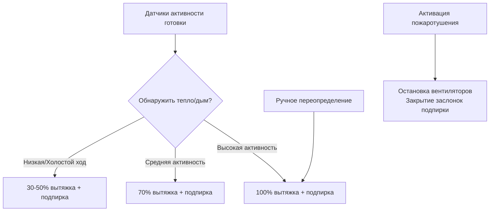

# Коммерческая вентиляция кухни и проектирование вытяжных зонтов

Системы вентиляции коммерческой кухни улавливают тепло, дым, пар, жир и запахи от кухонного оборудования, обеспечивая при этом воздух подпирки для замены вытяжки. Это руководство охватывает типы зонтов, расчеты расходов вытяжки, стратегии подпирки воздуха, управление жиром и принудительную вентиляцию в соответствии с требованиями ASHRAE, NFPA 96 и IMC.

## Классификация зонтов и требования

### Зонты типа I (жиросодержащие)

**Определение:** Зонты для кухонного оборудования, производящего жиросодержащие пары

**Оборудование, требующее зонтов типа I:**
- Угольные грили и решетки
- Фритюрницы (открытые)
- Плиты (газовые или электрические с открытым пламенем или высокой температурой)
- Печи для приготовления при высокой температуре (> 204°C)
- Воки и оборудование для жарки с перемешиванием
- Сковороды (поверхности для готовки > 204°C)

**Требования к конструкции (UL 710, NFPA 96):**
- **Материал:** Нержавеющая сталь калибра 16-20 или углеродистая сталь калибра 18
- **Жировые фильтры:** Пластинчатого или сетчатого типа, сертифицированные UL 1046
- **Наклон:** Дно и стороны наклонены к сборнику жира (минимум 2%)
- **Желоба для жира:** Непрерывный периметральный желоб, дренаж во внешний резервуар
- **Панели доступа:** Для очистки воздуховодов, вентиляторов

**Пожаротушение:** Требуется по NFPA 96
- Система мокрого или сухого химического тушения
- Автоматическое срабатывание (плавкие звенья при 175-260°C)
- Ручные кнопки запуска
- Отсечка топлива, интегрированная с системой пожаротушения

### Зонты типа II (тепло и пар)

**Определение:** Зонты для оборудования, производящего тепло и влагу, но минимум жира

**Оборудование, требующее зонтов типа II:**
- Паровые котлы и автоклавы
- Посудомоечные машины
- Печи низкотемпературные (< 204°C)
- Макаронники и переподогреватели

**Конструкция:**
- Более тонкий материал приемлем (калибр 20-22)
- Жировые фильтры не требуются (конденсационные фильтры опциональны)
- Пожаротушение не требуется

## Расходы вытяжного воздуха

### Рекомендуемые расходы вытяжки ASHRAE

**Расход CFM на погонный фут зонта:**

| Режим оборудования | Тип зонта | Легкий режим | Средний режим | Тяжелый режим | Очень тяжелый режим |
|---|---|---|---|---|---|
| **Настенный зонт** | Type I | 200 CFM/ft (670 м³/ч на м) | 300 CFM/ft (1,010 м³/ч на м) | 400 CFM/ft (1,350 м³/ч на м) | 550 CFM/ft (1,850 м³/ч на м) |
| **Одинарный остров** | Type I | 300 CFM/ft (1,010 м³/ч на м) | 400 CFM/ft (1,350 м³/ч на м) | 500 CFM/ft (1,690 м³/ч на м) | 600 CFM/ft (2,030 м³/ч на м) |
| **Двойной остров** | Type I | 250 CFM/ft (850 м³/ч на м) | 350 CFM/ft (1,180 м³/ч на м) | 450 CFM/ft (1,520 м³/ч на м) | 550 CFM/ft (1,850 м³/ч на м) |
| **Задний зонт/проходной** | Type I | 150 CFM/ft (505 м³/ч на м) | 250 CFM/ft (850 м³/ч на м) | 300 CFM/ft (1,010 м³/ч на м) | 400 CFM/ft (1,350 м³/ч на м) |
| **Бровь** | Type I | 250 CFM/ft (850 м³/ч на м) | 350 CFM/ft (1,180 м³/ч на м) | 450 CFM/ft (1,520 м³/ч на м) | — |

**Классификация режимов оборудования:**

- **Легкий режим:** Электрические печи, паровые котлы, маленькие плиты
- **Средний режим:** Газовые плиты, фритюрницы, сковороды (стандартная мощность)
- **Тяжелый режим:** Угольные грили, воки, высокомощное оборудование
- **Очень тяжелый режим:** Твердое топливо (уголь, дерево), грили на мескитовом дереве

**Метод площади зонта (альтернативный):**

$$CFM = A_{hood} \times V_{capture}$$

Где:
- $A_{hood}$ = площадь входного отверстия зонта (м²)
- $V_{capture}$ = скорость улавливания (30-45 м/мин, типичная)

### Факторы, влияющие на расход вытяжки

**Геометрия зонта:**
- Настенный зонт: Одна открытая сторона (самый низкий расход)
- Остров со всех сторон: Все четыре стороны открыты (самый высокий расход)
- Близлежащий зонт (задний): Близко к оборудованию (пониженный расход)

**Тепловыделение оборудования:**
- Более высокий кДж/ч → больше тепловой струи → требуется более высокий расход

**Свес зонта:**
- Минимум 15 см за пределы оборудования (все стороны)
- Больший свес улучшает улавливание, может снизить расход

<h3>Рабочий пример 1: Расчет вытяжки зонта типа I</h3>

**Дано:**
- Настенный зонт
- Длина зонта: 3,7 м (12 фт)
- Оборудование: Два угольных гриля (тяжелый режим), три газовые плиты (средний режим)
- Свес варочной линии: 23 см за пределы оборудования

**Найти:** Требуемый расход вытяжного воздуха

**Решение:**

**Метод 1: Таблица ASHRAE (на погонный фут)**

Настенный зонт тяжелого режима: 400 CFM/ft (1,350 м³/ч на м)

$$CFM_{exhaust} = 12 \times 400 = 4,800 \text{ CFM (8,150 м³/ч)}$$

**Метод 2: Взвешенный по режиму оборудования**

Угольные грили занимают 1,8 м (6 фт) (тяжелый режим): $6 \times 400 = 2,400$ CFM

Плиты занимают 1,8 м (6 фт) (средний режим): $6 \times 300 = 1,800$ CFM

$$CFM_{total} = 2,400 + 1,800 = 4,200 \text{ CFM (7,130 м³/ч)}$$

**Метод 3: Площадь зонта**

Глубина зонта: 1,2 м (4 фт) (типичный настенный зонт)
Высота зонта над оборудованием: 0,9 м (3 фт)
Входное отверстие: $3,7 \times 0,9 = 3,3$ м² (консервативно, полная высота)
Скорость улавливания: 30 м/мин

$$CFM = 3,3 \times 30 \text{ м/мин} = 99 \text{ м³/мин} = 3,600 \text{ CFM}$$

**Выбор конструкции:** Используем метод 1 (наиболее консервативный): **4,800 CFM (8,150 м³/ч)**

Добавляем 10% коэффициент безопасности: $4,800 \times 1.10 = 5,280$ CFM (8,970 м³/ч)

**Ответ:** 5,280 CFM (8,970 м³/ч) вытяжка (выбрать вентилятор 5,500 CFM)

## Системы воздуха подпирки

### Требования к воздуху подпирки

**Назначение:** Заменить вытяжной воздух для предотвращения отрицательного давления в здании

**Количество воздуха подпирки:**

$$CFM_{makeup} = CFM_{exhaust} - CFM_{transfer}$$

Где $CFM_{transfer}$ = воздух из соседних помещений (столовая и т.д.)

**Типичное проектирование:** 80-100% воздуха подпирки (максимум 20% воздуха передачи из столовой/не кухонных пространств)

**Требования кодекса (IMC раздел 508):**
- Воздух подпирки требуется при вытяжке > 400 CFM
- Воздух подпирки должен быть в пределах 10% от расхода вытяжки

### Методы подачи воздуха подпирки

**1. Прямая подача в зонт (короткий цикл):**
- Воздушная завеса у переда зонта
- Скорости подачи воздуха: 1,5-2,5 м/с
- Температура: на 6-8°C ниже комнатной (избегать теплового шока поварам)

**Преимущества:**
- Снижает энергию обработки воздуха подпирки (требуется меньше нагрева)
- Предотвращает сквозняки на варочной линии

**Недостатки:**
- Может помешать улавливанию при высокой скорости
- Требует тщательного проектирования (тестирование ASHRAE 154P)

**2. Общая разбавление (вдали от зонта):**
- Диффузоры подачи воздуха по периметру кухни
- Низкая скорость (< 2,5 м/с у выходов)
- Обеспечивает общую вентиляцию и герметизацию

**3. Комбинированный метод:**
- 50-70% прямо в зонт (короткий цикл)
- 30-50% общая разбавление

### Температура воздуха подпирки

**Требование нагрева:**

$$Q_{heating} = 1.08 \times CFM_{makeup} \times (T_{supply} - T_{outdoor})$$

**Пример расчета на зиму:**
- Наружный воздух: -18°C
- Целевой воздух подпирки: 15°C (на 6°C ниже комнатной температуры кухни)
- Воздух подпирки: 5,000 CFM (8,500 м³/ч)

$$Q = 1.08 \times 5,000 \times (15 - (-18)) = 178,200 \text{ Btu/hr} = 188 \text{ кДж/с} = 188 \text{ кВт}$$

**Методы нагрева:**
- Газовый модуль воздуха подпирки (прямого или непрямого нагрева)
- Электрическое сопротивление (дорого в эксплуатации)
- Рекуперация тепла из вытяжки (риск накопления жира)
- Лучистые обогреватели у варочной линии (дополнительный комфортный нагрев)

**Летнее охлаждение:**
- Типично без механического охлаждения воздуха подпирки (дорого)
- Испарительное охлаждение в засушливых климатах (Аризона, Нью-Мексико)
- Опирается на стратегию короткого цикла (снижение чувствительной нагрузки)

## Управление жиром и пожарная безопасность

### Извлечение жира

**Эффективность улавливания жиросодержащего пара:**

| Тип фильтра | Эффективность удаления жира | Применение |
|---|---|---|
| Пластинчатые фильтры (UL 1046) | 70-90% | Стандартный (большинство зонтов типа I) |
| Сетчатые фильтры | 50-70% | Легкорежимные приложения |
| Системы водной промывки | 90-98% | Высокопроизводительные (казино, стадионы) |
| Электростатические осадители (ESP) | 85-95% | Переделка, управление запахом |

**Проектирование пластинчатого фильтра:**
- Смещенные пластины создают центробежную силу (капли жира отделяются)
- Съемные для очистки (коммерческая посудомоечная машина минимум раз в неделю)

### Проектирование воздуховода

**Требования NFPA 96:**

**Материал:**
- Углеродистая сталь калибра 16 (непрерывные сварные швы)
- Нержавеющая сталь калибра 18 (Тип 304)

**Наклон:**
- Минимум 0,6 см на 30 см горизонтального хода
- Дренаж к зонту (жир стекает обратно в сборник)

**Панели доступа:**
- Максимум 3,7 м горизонтального расстояния
- На каждом пересечении этажа
- При изменении направления

**Зазоры до горючих материалов:**
- 45 см минимум (незащищенный воздуховод)
- 15 см с системой снижения зазора (сертифицированной)
- Нулевой зазор с заводским кожухом жирового воздуховода

**Никаких заслонок не допускается в жировом выхлопном воздуховоде** (риск пожара/накопления жира)

### Выбор вытяжного вентилятора

**Центробежный вентилятор с вертикальным выхлопом на крыше:**
- Жировой рейтинг (сертификация UL 762)
- Ременной привод (позволяет регулировку скорости, облегчает замену мотора)
- Дренажное соединение у основания вентилятора (сборник жира)
- Откидной кровельный кожух (снятие вентилятора для очистки)

**Материалы вентилятора:**
- Алюминиевое или покрытое стальное рабочее колесо (жиростойкое)
- Нержавеющая сталь предпочтительна для высокопроизводительных или кислотных выхлопов

**Типичное статическое давление вентилятора:** 50-100 Па (1,0-2,0" в.ст.) (воздуховод + жировые фильтры)

## Принудительная вентиляция кухни (DCKV)

### Принцип работы

**Переменная вытяжка в зависимости от кухонной активности:**
- Оптические датчики (обнаружение дыма/паровой струи)
- Температурные датчики (измерение температуры в плену зонта)
- Модуляция скорости вентилятора (VFD)
- Модуляция воздуха подпирки пропорционально

**Соотношение регулирования:** 30-100% от проектного расхода, типично

**Энергетическая экономия:**
- Сниженная энергия вентилятора: 40-60% (мощность вентилятора ∝ расходу³)
- Сниженное нагревание/охлаждение воздуха подпирки: 30-50%
- Общая энергетическая экономия HVAC кухни: 30-40%

### Стратегия управления

**Минимальный расход (режим холостого хода):**
- 30-50% от проектной вытяжки
- Поддерживает улавливание зонта, предотвращает накопление жира
- Соответствует требованиям воздуха подпирки

**Признание кодексом:**
- IMC 2021: Разрешает DCKV с сертифицированными элементами управления и датчиками
- Одобрение местного AHJ может потребоваться
- ASHRAE 154P: Стандартный метод испытания систем DCKV

<h3>Рабочий пример 2: Энергетическая экономия DCKV</h3>

**Дано:**
- Вытяжной зонт: 6,000 CFM (10,200 м³/ч) проектный
- Расход DCKV холостого хода: 40% (2,400 CFM/4,080 м³/ч)
- Часы работы: 16 ч/день (8 ч готовки, 8 ч холостой ход/подготовка)
- Зимняя уличная температура: -7°C в среднем
- Подача воздуха подпирки: 18°C
- Электромотор вентилятора: 5,6 кВт при полном потоке
- Стоимость энергии: 0,12 $/кВч, 2,12 $/м³ газа
- Эффективность нагрева: 80%

**Найти:** Годовую энергетическую и стоимостную экономию

**Решение:**

**Энергетическая экономия вентилятора:**

Мощность полного потока: 5,6 кВт

Мощность холостого хода (40% расхода): $5,6 \times 0.40^3 = 0.36$ кВт

Суточная энергетическая экономия вентилятора (8 ч холостого хода):
$$E_{fan} = (5,6 - 0.36) \times 8 = 41,9 \text{ кВч/день}$$

Годовая: $41,9 \times 365 = 15,294$ кВч/год

Стоимость: $15,294 \times 0.12 = $1,835/год

**Экономия нагрева воздуха подпирки:**

Нагрев полного потока (8 ч готовки):
$$Q = 1.08 \times 6,000 \times (18-(-7)) = 162,000 \text{ Btu/hr} = 171 \text{ кДж/с} = 171 \text{ кВт}$$

Нагрев холостого хода (8 ч холостого хода):
$$Q_{idle} = 1.08 \times 2,400 \times (18-(-7)) = 64,800 \text{ Btu/hr} = 68 \text{ кВт}$$

Суточное снижение нагрева:
$$\Delta Q = (171 - 68) \times 8 = 824 \text{ кВт·ч/день}$$

Годовая: $824 \times 365 = 300,760$ кВт·ч/год = 1,083 м³ газа/год

Учитывая эффективность нагрева 80%: $1,083 / 0.80 = 1,354$ м³ газа/год

Стоимость: $1,354 \times 2.12 = $2,870/год

**Общая годовая экономия:**
$$\$1,835 + \$2,870 = \$4,705/\text{год}$$

**Если система DCKV стоит установленная $15,000:**

Простой период окупаемости: $15,000 / $4,705 = 3,2 года

**Ответ:** $4,705/год экономия (3,2 года окупаемости)

## Балансировка воздуха кухни и герметизация

**Целевое отрицательное давление:** -5-12 Па (-0,02-0,05" в.ст.) относительно столовой

**Назначение:**
- Предотвратить распространение кухонных запахов в столовую
- Поддержать направленность потока воздуха (столовая → кухня → вытяжка)

**Балансировка воздуха:**
$$CFM_{exhaust} > CFM_{makeup} + CFM_{transfer}$$

**Типичный дисбаланс:** вытяжка превышает подачу на 10-20% (создает отрицательное давление)

**Воздух передачи из столовой:**
- Решетки облегченного воздуха или двери с зазором у основания
- 170-340 м³/ч на входное отверстие, типично
- Столовая должна иметь достаточное питание воздухом (система HVAC увеличена для передачи)

## Вытяжка посудомоечной машины

**Зонт типа II или отдельная вытяжка:**
- Вытяжка пара: 75-150 CFM/м² площади посудомоечной машины (270-530 м³/ч на м²)
- Кожух с конденсацией (водяное охлаждение): Улавливает пар, конденсирует в дренаж

**Воздух подпирки для посудомоечной машины:**
- Не требуется, если вытяжка зонта типа II < 400 CFM (исключение IMC)
- Рекомендуется для крупных коммерческих посудомоечных машин (предотвращение обратного тока)

---

**Связанные технические руководства:**
- Расчеты расходов вентиляции
- Управление герметизацией здания
- Выбор вентилятора и производительность
- Проектирование воздушной фильтрации
- Стратегии управления HVAC

**Ссылки:**
- ASHRAE Handbook HVAC Applications, Глава 35: Вентиляция кухни
- NFPA 96: Стандарт управления вентиляцией и пожарной защиты коммерческих кухонь
- IMC (Международный механический кодекс), Глава 5: Системы выхлопа
- UL 710: Стандарт вытяжных зонтов для коммерческого кухонного оборудования
- ASHRAE 154P: Стандартный метод испытания принудительной вентиляции кухни
- Exxo-Air (Ресурс): Руководство по проектированию вентиляции кухни
