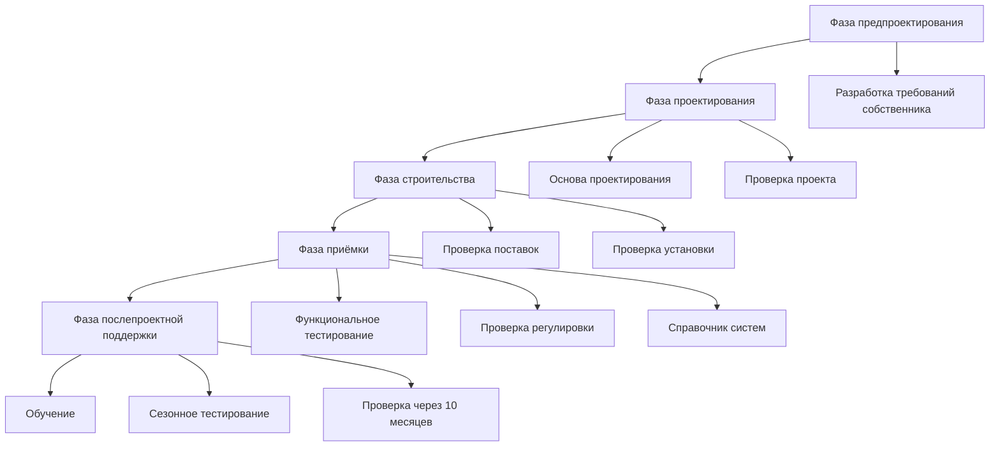

# Процедуры наладки для инженеров HVAC

Наладка (Cx) проверяет, что системы HVAC соответствуют проектным решениям и требованиям собственника путём систематического функционального тестирования производительности. Правильная наладка снижает энергопотребление на 10-20% и минимизирует жалобы пользователей.

## Процесс наладки

**Фазы наладки:**

1. **Предпроектирование:** Разработка требований собственника (Owner's Project Requirements, OPR)
2. **Проектирование:** Создание основы проектирования (BOD), проверка поставок
3. **Строительство:** Проверка установки, проверка поставок
4. **Приёмка:** Функциональное тестирование производительности
5. **Послепроектная поддержка:** Обучение, сезонное тестирование, проверка гарантий

## Требования собственника (OPR)

**Документирует ожидания собственника:**
- Качество внутренней среды (температура, влажность, качество воздуха)
- Целевые показатели энергетической производительности
- Требования к техническому обслуживанию
- Специальные требования (чистые комнаты, лаборатории и т.д.)
- Ограничения по бюджету и графику

**Примеры требований OPR:**
- "Поддерживать операционную комнату при температуре 20-23°C, влажность 20-60%, давление +2,5 Па"
- "Достичь сертификации LEED Gold с экономией затрат на энергию на 30%"
- "Спроектировать систему для работы 24/7 с резервированием N+1"

## Основа проектирования (BOD)

**Документация инженера о том, как будут выполнены требования OPR:**
- Описания систем
- Параметры проектирования и допущения
- Спецификации оборудования
- Последовательности управления
- Требования к техническому обслуживанию

**Связывает OPR с проектными решениями**

## Функциональное тестирование производительности

**Проверяет работу оборудования в соответствии с проектными решениями** в реальных условиях и при моделировании

### Категории тестирования

**1. Контрольные списки предварительной функциональности:**
- Проверка полноты установки
- Проверка данных на заводской табличке в сравнении с поставками
- Подтверждение завершения процедур пуска
- Документирование недостатков

**2. Тесты функциональной производительности:**
- Тестирование последовательностей управления
- Проверка защит и блокировок
- Моделирование режимов отказа
- Измерение производительности при проектных условиях

### Пример: функциональный тест приточно-вытяжного агрегата (AHU)

**Последовательность тестирования:**

1. **Тест экономайзера:**
   - Моделирование температуры наружного воздуха < температуре рециркуляционного воздуха → клапан наружного воздуха открывается на 100%
   - Моделирование температуры наружного воздуха > температуре рециркуляционного воздуха → клапан наружного воздуха возвращается на минимум

2. **Последовательность отопления:**
   - Снижение уставки температуры помещения → проверка открытия клапана отопления
   - Проверка поддержания уставки температуры воздуха нагнетания
   - Проверка защиты от замерзания (температура воздуха нагнетания < 4°C → сигнал тревоги)

3. **Последовательность охлаждения:**
   - Повышение уставки температуры помещения → проверка открытия клапана охлаждения
   - Проверка поддержания уставки температуры воздуха нагнетания
   - Проверка высокопредельной защиты (температура воздуха нагнетания < 10°C → блокировка охлаждения)

4. **Вентиляция:**
   - Проверка минимальной позиции клапана наружного воздуха (в соответствии с ASHRAE 62.1)
   - Измерение фактического расхода наружного воздуха с помощью пневмометра
   - Проверка управления приточным воздухом на основе CO₂, если применимо

5. **Сигналы тревоги и защиты:**
   - Моделирование загрязненного фильтра (увеличение перепада давления) → проверка сигнала тревоги
   - Моделирование отказа вентилятора → проверка сигнала тревоги и запуска резервного вентилятора
   - Моделирование условий замерзания → проверка отключения

<h3>Пример расчёта 1: Функциональный тест VAV-терминала</h3>

**Тест:** Проверка правильного отклика VAV-терминала на команду термостата

**Дано:**
- Проектный расход воздуха: 570 м³/ч макс., 170 м³/ч мин. (30%)
- Уставка помещения: 22°C
- Клапан подогрева

**Процедура тестирования:**

**Шаг 1:** Проверка минимального расхода воздуха
- Установить температуру помещения 18°C (запрос на отопление)
- Измерить расход воздуха прибором для измерения расхода воздуха
- **Ожидается:** 170 м³/ч ±10%
- **Результат:** 168 м³/ч → ПРОЙДЕН

**Шаг 2:** Проверка максимального расхода воздуха охлаждения
- Установить температуру помещения 27°C (запрос на охлаждение)
- **Ожидается:** Расход воздуха увеличивается до 570 м³/ч перед подогревом
- **Результат:** 563 м³/ч → ПРОЙДЕН

**Шаг 3:** Проверка работы подогрева
- Поддерживать температуру помещения 27°C, повысить уставку до 22°C
- **Ожидается:** Расход воздуха снижается до минимума, клапан подогрева открывается
- Измерить повышение температуры воздуха нагнетания
- **Результат:** Расход воздуха 170 м³/ч, температура воздуха нагнетания 35°C → ПРОЙДЕН

**Шаг 4:** Проверка мёртвой зоны
- Установить температуру помещения = уставке (22°C)
- **Ожидается:** Расход воздуха на минимуме, отопление и охлаждение отключены
- **Результат:** 170 м³/ч, подогрев отключен → ПРОЙДЕН

**Заключение:** VAV-терминал работает в соответствии с последовательностью управления

## Проверка регулировки расходов воздуха и воды

**Агент по наладке проверяет работу подрядчика по регулировке:**

1. **Проверка плана регулировки:** Методология, приборы, допуски
2. **Наблюдение тестирования:** Наблюдение 10-20% измерений
3. **Проверка отчётов:** Проверка расчётов, допусков балансировки
4. **Выборочная проверка:** Независимое повторное измерение 5-10% точек

**Критерии приёмки:**
- Расход воздуха: ±10% от проектного значения
- Расход жидкости: ±10% от проектного значения
- Температура: ±1°C от уставки
- Давление: ±5 Па от уставки

## Проверка систем управления

**Проверка трендов и последовательностей системы управления зданием:**

1. **Установка трендов:**
   - Частота выборки: минимум 15-минутные интервалы
   - Продолжительность: 48-72 часа (для захвата циклов занятости/незанятости)
   - Точки: температура подачи/обратки, позиции клапанов, позиции заслонок, состояние вентилятора

2. **Анализ трендов:**
   - Проверка стабильности управления (поиск оптимума, колебания)
   - Проверка соответствия уставок проектным значениям
   - Подтверждение активности графиков сброса
   - Выявление одновременного отопления/охлаждения

**Типичные найденные проблемы:**
- Слишком агрессивная настройка ПИД-регулятора (колебания)
- Экономайзер не включен
- Ночной сброс температуры не запрограммирован
- Клапан наружного воздуха заклинен

## Сезонное тестирование

**Некоторые системы требуют тестирования вне сезона строительства:**

- **Отопление:** Тестирование зимой (или моделирование низкой температуры наружного воздуха)
- **Охлаждение:** Тестирование летом (или моделирование высокой температуры наружного воздуха)
- **Свободное охлаждение:** Тестирование экономайзера в условиях переходного сезона

**Отложенное тестирование:** Планируется в течение первого года эксплуатации

## Журнал проблем и отслеживание недостатков

**Ведение основного журнала проблем:**

| Проблема № | Система | Описание | Приоритет | Ответственный | Статус | Разрешение |
|---------|---------|-------------|----------|-------------|--------|------------|
| CX-001 | AHU-1 | Клапан экономайзера застрял на минимуме | Высокий | Подрядчик | Закрыто | Привод заменён 12.05 |
| CX-002 | VAV-205 | Расход воздуха на 20% ниже проектного | Средний | Регулировщик | Открыто | Планируется регулировка заслонки |

**Уровни приоритета:**
- **Критический:** Безопасность жизни, нарушение кодекса
- **Высокий:** Значительная потеря энергии, влияние на комфорт
- **Средний:** Незначительная проблема производительности
- **Низкий:** Документация, косметическое улучшение

## Справочник систем

**Доставляется собственнику:**

1. **Описание проекта:** Описания систем, основа проектирования
2. **Документация оборудования:** Руководства по эксплуатации и обслуживанию, чертежи цеха, гарантии
3. **Последовательности управления:** Подробные письменные последовательности со списком точек
4. **Чертежи в исполнении:** Отмеченные в красные линии чертежи, отражающие фактическую установку
5. **Отчёты о регулировке:** Итоговые измерения расходов воздуха и воды
6. **Отчёты о функциональных тестах:** Результаты всех тестов наладки
7. **Документация по обучению:** Материалы сеансов обучения, видеозаписи

## Обучение

**Предоставляется персоналу учреждения:**

1. **Обзор систем:** Принцип работы каждой системы
2. **Обучение пользовательскому интерфейсу:** Навигация в системе управления зданием, процедуры переопределения
3. **Профилактическое обслуживание:** Замена фильтров, проверка ремней, сезонные задачи
4. **Устранение неисправностей:** Типичные проблемы и решения

**Сеансы обучения:**
- Минимум 4 часа для сложных систем
- Практические демонстрации
- Предоставление учебного пособия
- Запись сеансов для будущего персонала

## Практическое применение

1. **Новое строительство:** Полная наладка в соответствии с ASHRAE Guideline 0
2. **Существующие здания:** Ретро-наладка (RCx) выявляет экономию энергии 5-15%
3. **LEED:** Улучшенная наладка (EAc3) требует дополнительного тестирования
4. **Соответствие кодексам:** Некоторые юрисдикции требуют наладку (California Title 24)

---

**Связанные технические руководства:**
- Измерение и регулировка расходов воздуха
- Стратегии управления HVAC
- Анализ соответствия кодексам

**Ссылки:**
- ASHRAE Guideline 0: The Commissioning Process
- ASHRAE Guideline 1.1: HVAC&R Technical Requirements for the Commissioning Process
- ASHRAE Standard 202: Commissioning Process for Buildings and Systems
- NEBB Procedural Standards for Building Systems Commissioning
