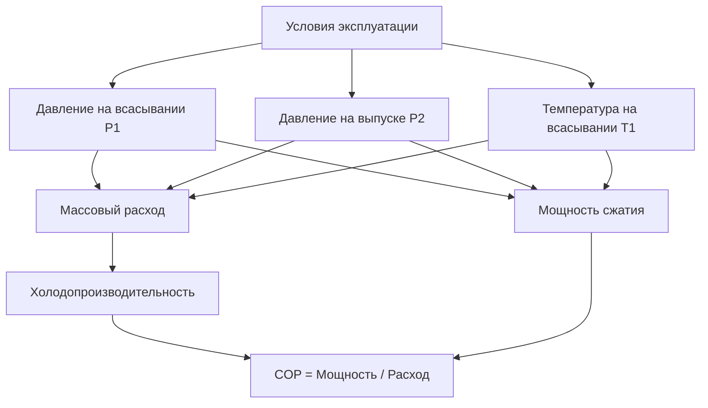
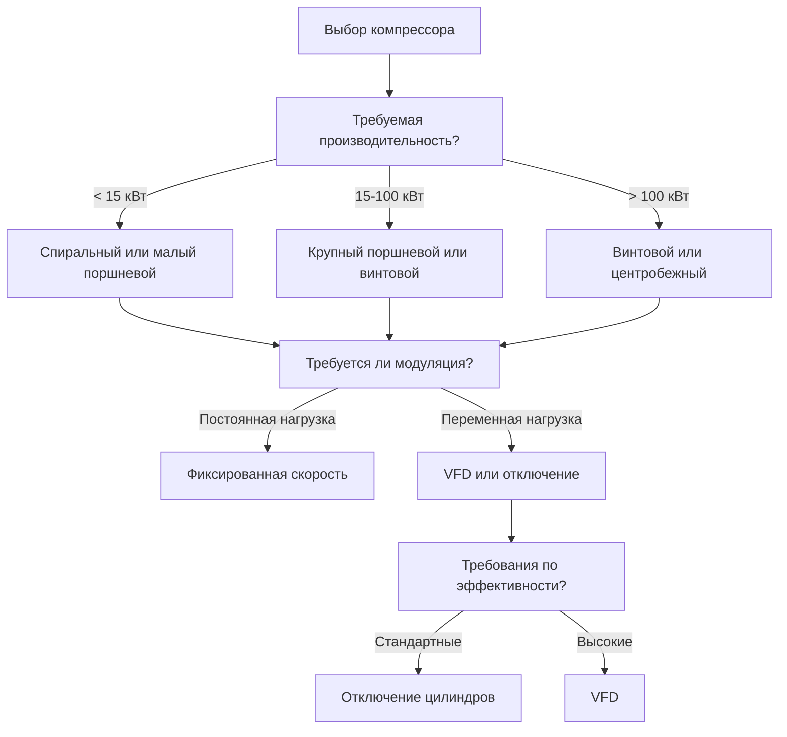

# Выбор компрессора и анализ производительности холодильных систем

Выбор компрессора определяет эффективность холодильной системы, производительность, надежность и эксплуатационные расходы. Это руководство охватывает типы компрессоров, показатели производительности, критерии выбора и стратегии модуляции мощности для коммерческих и промышленных холодильных установок.

## Типы компрессоров и их применение

### Компрессоры объемного вытеснения

**Поршневые компрессоры:**
- **Диапазон мощностей:** 0,3-60 кВт (0,3-60 тонн)
- **Степень сжатия:** До 10:1 одноступенчатые, 20:1 двухступенчатые
- **Применение:** Коммерческая холодильная техника, холодильники, промышленные процессы
- **Преимущества:** Широкий диапазон мощностей, высокая способность создавать давление, доказанная надежность
- **Недостатки:** Пульсирующий поток, вибрация, требует больше обслуживания, чем спиральные

**Принцип работы:**

**Спиральные компрессоры:**
- **Диапазон мощностей:** 0,3-15 кВт (0,3-15 тонн)
- **Степень сжатия:** До 6:1
- **Применение:** Жилые/легкие коммерческие кондиционеры, тепловые насосы, холодильная техника
- **Преимущества:** Тихая работа, высокая эффективность, меньше движущихся частей, хорошее управление маслом
- **Недостатки:** Ограниченный диапазон мощностей, чувствительность к гидравлическим ударам

**Винтовые компрессоры (ротационные с двойным винтом):**
- **Диапазон мощностей:** 6-300+ кВт (6-300+ тонн)
- **Степень сжатия:** До 20:1
- **Применение:** Промышленная холодильная техника, крупные коммерческие системы, охлаждение процессов
- **Преимущества:** Непрерывный поток, компактность, масляное охлаждение (снижает температуру выпуска), модуляция мощности через золотниковый клапан
- **Недостатки:** Более высокая начальная стоимость, требует сепаратора масла

### Динамические компрессоры

**Центробежные компрессоры:**
- **Диапазон мощностей:** 100-10 000+ тонн
- **Степень сжатия:** 3-5:1 на ступень (возможны многоступенчатые)
- **Применение:** Крупные чиллеры, районное охлаждение, промышленные процессы
- **Преимущества:** Очень высокая производительность, плавная работа, компактные габариты, долгий срок службы
- **Недостатки:** Предел помпажа (минимальный расход), меньшая эффективность при неполной нагрузке, высокая начальная стоимость

**Принцип работы:**
Хладагент ускоряется радиально через рабочее колесо (кинетическая энергия), затем замедляется в диффузоре (рост давления).

## Показатели производительности

### Объемный КПД

**Определение:** Отношение фактического массового расхода к расходу вытеснения

$$\eta_v = \frac{\dot{m}_{actual}}{\dot{m}_{displacement}} = \frac{\dot{m}_{actual}}{\rho_1 \cdot V_d \cdot N}$$

Где:
- $\dot{m}_{actual}$ = фактический массовый расход хладагента (кг/ч)
- $\rho_1$ = плотность газа на всасывании (кг/м³)
- $V_d$ = объем вытеснения на один оборот (м³/об)
- $N$ = частота вращения компрессора (об/мин)

**Потери, снижающие объемный КПД:**

1. **Мертвый объем:** Газ, остающийся в цилиндре в конце такта выпуска, повторно расширяется во время всасывания
   
   $$\eta_{clearance} = 1 - C \left[ \left(\frac{P_2}{P_1}\right)^{1/n} - 1 \right]$$
   
   Где $C$ = отношение мертвого объема (обычно 0,03-0,08)

2. **Перепад давления:** Потери в клапанах всасывания/выпуска и проходах

3. **Теплопередача:** Нагрев газа на всасывании снижает плотность

4. **Утечки:** Мимо поршневых колец и клапанов

**Типичные значения объемного КПД:**
- Поршневые: 65-85% (ниже при высокой степени сжатия)
- Спиральные: 85-95%
- Винтовые: 85-95%
- Центробежные: Не применимо (динамический компрессор)

### Изоэнтропийный КПД

**Определение:** Отношение идеальной изоэнтропийной работы к фактической работе

$$\eta_s = \frac{W_{isentropic}}{W_{actual}} = \frac{h_{2s} - h_1}{h_2 - h_1}$$

Где:
- $h_1$ = энтальпия на всасывании (кДж/кг)
- $h_{2s}$ = энтальпия выпуска при изоэнтропийном сжатии (кДж/кг)
- $h_2$ = фактическая энтальпия выпуска (кДж/кг)

**Типичные значения изоэнтропийного КПД:**
- Поршневые: 65-75%
- Спиральные: 60-70%
- Винтовые: 70-80%
- Центробежные: 70-85% (на номинальном режиме), снижается при неполной нагрузке

**Мощность сжатия:**

$$P_{comp} = \frac{\dot{m} (h_2 - h_1)}{\eta_{motor}}$$

Где $\eta_{motor}$ = КПД двигателя (типично 0,90-0,95)

### Соотношения между производительностью и мощностью

**Холодопроизводительность:**

$$\dot{Q}_{evap} = \dot{m} (h_1 - h_4)$$

Где $h_4$ = энтальпия, поступающая в испаритель (кДж/кг)

**COP (коэффициент производительности):**

$$COP = \frac{\dot{Q}_{evap}}{P_{comp}} = \frac{h_1 - h_4}{h_2 - h_1}$$

**Теплоотвод в конденсаторе:**

$$\dot{Q}_{cond} = \dot{m} (h_2 - h_3) = \dot{Q}_{evap} + P_{comp}$$

## Карты производительности компрессора

Производительность компрессора изменяется в зависимости от условий эксплуатации (температура всасывания, давление выпуска, перегрев).

**Стандарты оценки производительности:**
- **AHRI 540:** Оценка производительности компрессоров объемного вытеснения
- **AHRI 550/590:** Оценка производительности центробежных компрессоров

**Точка номинальных условий (Application Rating Point, ARP):**
Стандартные условия для сравнения производительности компрессоров

| Хладагент | Темп. испарения | Темп. конденсации | Темп. на всасывании | Переохлаждение |
|-----------|-----------------|-------------------|---------------------|-----------------|
| R-404A | -12°C | 37,8°C | 18,3°C | 5,6°C |
| R-134a | 4,4°C | 37,8°C | 18,3°C | 5,6°C |
| R-717 (NH₃) | -12°C | 35°C | 18,3°C | 0°C |

<h3>Пример расчета 1: производительность поршневого компрессора</h3>

**Дано:**
- Хладагент: R-404A
- Температура испарения: -17,8°C (давление на всасывании: 255 кПа)
- Температура конденсации: 37,8°C (давление на выпуске: 1943 кПа)
- Перегрев на всасывании: 11,1°C (температура на всасывании: -6,7°C)
- Объем вытеснения компрессора: 0,283 м³/мин
- Объемный КПД: 75%
- Изоэнтропийный КПД: 70%
- КПД двигателя: 92%

**Найти:** Массовый расход, холодопроизводительность, мощность компрессора, COP

**Решение:**

Из таблиц R-404A при -17,8°C насыщенный газ:
- $h_1'$ = 773 кДж/кг (насыщенный газ)
- При -6,7°C перегретый: $h_1$ = 808 кДж/кг, $v_1$ = 0,0738 м³/кг

Из таблиц R-404A при 37,8°C насыщенная жидкость:
- $h_3$ = 505 кДж/кг (насыщенная жидкость)

Изоэнтропийное сжатие от состояния 1:
- $h_{2s}$ = 893 кДж/кг

Фактическая энтальпия выпуска:
$$h_2 = h_1 + \frac{h_{2s} - h_1}{\eta_s} = 808 + \frac{893 - 808}{0.70} = 929 \text{ кДж/кг}$$

Массовый расход:
$$\dot{m} = \eta_v \cdot \frac{V_d}{v_1} = 0.75 \times \frac{0.283}{0.0738} = 2.88 \text{ кг/мин} = 172.8 \text{ кг/ч}$$

Процесс расширения (изоэнтальпийный):
$$h_4 = h_3 = 505 \text{ кДж/кг}$$

Холодопроизводительность:
$$\dot{Q}_{evap} = \dot{m} (h_1 - h_4) = 2.88 \times (808 - 505) = 873.6 \text{ кВт} = 9.73 \text{ кДж}$$

Мощность компрессора:
$$P_{comp} = \frac{\dot{m} (h_2 - h_1)}{\eta_{motor}} = \frac{2.88 \times (929 - 808)}{0.92} = 3.74 \text{ кВт}$$

COP:
$$COP = \frac{873.6}{3740} = 2.33$$

**Ответы:**
- Массовый расход: 172,8 кг/ч
- Холодопроизводительность: 9,73 кДж
- Мощность компрессора: 3,74 кВт (0,38 кВт/кВт холода)
- COP: 2,33

## Методы модуляции мощности

Управление переменной производительностью повышает эффективность при неполной нагрузке и улучшает контроль температуры.

### Модуляция поршневого компрессора

**1. Отключение цилиндров:**
- Отключение цилиндров (обычно ступени 25%, 50%, 75%, 100%)
- Электромагнитный клапан удерживает клапан всасывания открытым (сжатия нет)
- Распространено для 4-, 6-, 8-цилиндровых компрессоров

**2. Горячий газовый обход:**
- Рециркуляция газа выпуска во всасывание
- Поддерживает минимальную нагрузку компрессора
- Неэффективно (потраченная энергия), используется только для минимальной производительности

**3. Преобразователь частоты (VFD):**
- Непрерывно переменная производительность (20-100%)
- Наибольшая эффективность при неполной нагрузке
- Требует двигатель, пригодный для работы с инвертором, масляный насос для низких оборотов

### Модуляция спирального компрессора

**1. Цифровое (циклическое включение/выключение):**
- Быстрое включение/выключение (10-20 секунд) для мощности 10-100%
- Электромагнитный клапан предотвращает сжатие во время выключения
- Хорошая эффективность, простое управление

**2. Переменная скорость:**
- Диапазон производительности 20-100%
- Отличная эффективность при неполной нагрузке
- Требует специализированный спиральный компрессор

### Модуляция винтового компрессора

**1. Золотниковый клапан:**
- Регулируемое внутреннее отношение объемов
- Непрерывно переменная производительность 10-100%
- Сохраняет хорошую эффективность во всем диапазоне
- Стандартный метод модуляции винтовых компрессоров

**2. Переменная скорость:**
- В комбинации с золотниковым клапаном для максимальной эффективности
- Распространено в промышленной холодильной технике

### Модуляция центробежного компрессора

**1. Направляющие аппараты входа (IGV):**
- Предварительное закручивание потока входа для снижения производительности
- Диапазон производительности 40-100%
- Снижение КПД при низкой производительности

**2. Переменная скорость:**
- Лучшая эффективность во всем диапазоне эксплуатации
- Расширение предела помпажа до более низкой производительности
- Магнитные подшипники обеспечивают широкий диапазон скоростей

**3. Горячий газовый обход:**
- Защита от помпажа (минимальный расход)
- Очень неэффективно, используется только для минимальной производительности

## Критерии выбора

**Основные факторы выбора:**

1. **Производительность:** Согласование диапазона компрессора с нагрузкой приложения
2. **Хладагент:** Убедиться, что компрессор разработан для хладагента (давления, материалы)
3. **Диапазон температур:** Низкотемпературные приложения требуют двухступенчатые или каскадные системы
4. **Эффективность:** Баланс между начальной стоимостью и эксплуатационными расходами (анализ полного жизненного цикла)
5. **Модуляция:** Переменные нагрузки требуют управления производительностью
6. **Надежность:** Учесть требования обслуживания, цикл нагрузки
7. **Шум:** Спиральные наиболее тихие, поршневые наиболее шумные, требуется изоляция
8. **Управление маслом:** Сепаратор масла требуется для винтовых, возврат масла для длинных линий

## Практические рассмотрения

**Минимальное время работы:**
- Предотвращение частых циклов (износ, потеря эффективности)
- Типично: 3-5 минут

**Минимальная производительность:**
- Горячий газовый обход или отключение производительности
- Поддержание циркуляции масла при низкой нагрузке

**Управление перегревом на всасывании:**
- Типично 5,6-11,1°C (предотвращение гидравлических ударов)
- Термостатический расширительный клапан (TXV) или электронный расширительный клапан (EEV)

**Пределы температуры выпуска:**
- Поршневые: 107-121°C макс (разложение масла)
- Спиральные: 107°C макс
- Винтовые: 93-107°C макс (масляное охлаждение)
- Центробежные: Без ограничений (без масла)

**Предотвращение гидравлических ударов:**
- Аккумулятор на всасывании для систем с риском миграции жидкости
- Цикл продувки перед остановкой
- Электрический нагреватель картера

---

**Связанные технические руководства:**
- Цикл испарительного охлаждения
- Выбор хладагента и свойства
- Расчеты холодильной нагрузки
- Проектирование испарителя
- Проектирование конденсатора

**Ссылки:**
- ASHRAE Handbook of Refrigeration, Chapter 37: Compressors
- AHRI Standard 540: Performance Rating of Positive Displacement Compressors
- AHRI Standard 550/590: Performance Rating of Centrifugal Compressors
- Stoecker, W.F., "Industrial Refrigeration Handbook"
- Dossat, R.J., "Principles of Refrigeration"
