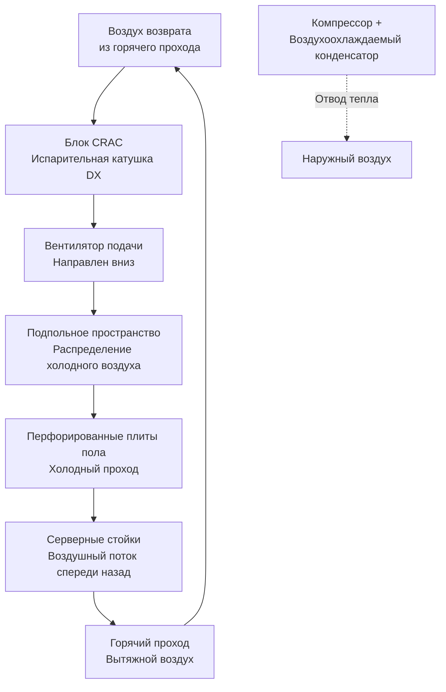
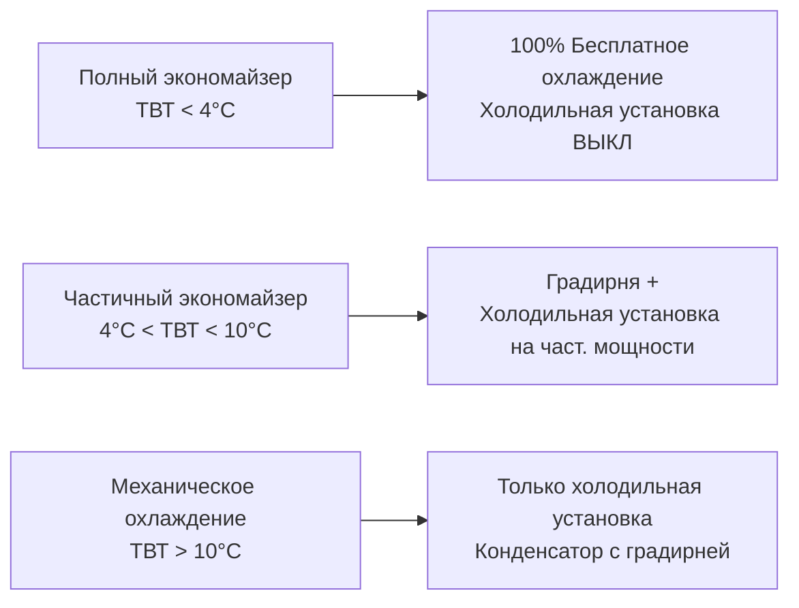

# Стратегии охлаждения центров обработки данных и управление тепловыми нагрузками

Системы охлаждения центров обработки данных удаляют тепло от IT-оборудования при поддержании температуры и влажности в установленных диапазонах. Это руководство охватывает технологии охлаждения, стратегии изоляции, метрики эффективности и конфигурации резервирования для критичных по надежности объектов.

## Тепловые нагрузки центра обработки данных

### Генерация тепла IT-оборудованием

**Теплоотдача серверов:**

$$Q_{IT} = P_{IT} \times 3,412$$

Где:
- $Q_{IT}$ = рассеяние тепла (кДж/ч)
- $P_{IT}$ = потребление мощности IT (ватты)
- 3,412 = коэффициент преобразования (кДж/ч на ватт)

**Типовые плотности мощности:**

| Применение | Плотность мощности (Вт/м²) | Тепловая нагрузка (кДж/ч·м²) |
|-------------|---------------------------|------------------------------|
| Традиционные серверы офиса | 540-1,080 | 1,840-3,680 |
| Серверы высокой плотности | 1,620-3,230 | 5,520-11,010 |
| Blade-серверы | 3,230-5,380 | 11,010-18,350 |
| HPC (высокопроизводительные вычисления) | 5,380-10,760 | 18,350-36,700 |

**Тепловые нагрузки на стойку:**

| Тип сервера | Мощность на стойку (кВт) | Тепловая нагрузка (кВт) |
|-------------|---------------------------|-------------------------|
| Стандартные серверы 1U | 3-8 кВт | 0,85-2,30 кВт |
| Высокоплотные blade | 15-25 кВт | 4,25-7,10 кВт |
| GPU/AI вычисления | 30-50 кВт | 8,50-14,20 кВт |

### Компоненты полной охлаждающей нагрузки

**Полное охлаждение центра обработки данных:**

$$Q_{total} = Q_{IT} + Q_{lighting} + Q_{UPS} + Q_{transmission} + Q_{people}$$

**Коэффициент эффективности инфраструктуры:**
- IT-оборудование: 60-80% от полной нагрузки
- Потери UPS: 5-10%
- Освещение: 2-5%
- Передача через ограждение: 2-5%

**Пример:** нагрузка IT 1 МВт → требуется охлаждение 1,15-1,25 МВт

## Технологии охлаждения

### Кондиционеры компьютерных помещений (CRAC)

**Прямое испарительное охлаждение (DX):**
- Автономный охлаждающий агрегат (компрессор, конденсатор, испаритель)
- Воздухоохлаждаемый конденсатор (наружный) или водяной
- Производительность: 1,4-17 кВт типовая

**Конфигурация:**

**Преимущества:**
- Простая автономная работа
- Не требуется инфраструктура холодной воды
- Распространено в меньших центрах обработки данных (< 465 м²)

**Недостатки:**
- Меньшая эффективность, чем охлаждение холодной водой (PUE 1,6-2,0)
- Утечки хладагента нарушают работу
- Ограниченная производительность на один агрегат

### Воздухообработчик компьютерного помещения (CRAH)

**Охлаждение холодной водой:**
- Воздухообработчик с катушкой холодной воды
- Отдельная центральная установка охлаждения
- Производительность: 2,8-28+ кВт на агрегат

**Преимущества:**
- Более высокая эффективность (PUE 1,3-1,5 с эффективными холодильными установками)
- Масштабируемость (добавлять CRAH по мере необходимости)
- Возможность использования водяного экономайзера
- Отсутствие хладагента в компьютерном помещении

**Недостатки:**
- Требует инфраструктуры холодной воды
- Более высокая стоимость проекта
- Критическое обнаружение утечек и защита

**Типовой проект холодной воды:**
- Подача: 7°C
- Возврат: 13-16°C (6-8°C ΔT)
- Расход: 0,38 л/с·кВт (стандартный), 0,19 л/с·кВт (проект с большим ΔT)

### Встроенное охлаждение в рядах

**Близкорасположенное охлаждение:**
- Охлаждающие агрегаты установлены между серверными стойками в горячем или холодном проходе
- Короткий путь воздуха (снижает энергию вентиляторов, повышает эффективность)
- Холодная вода или DX хладагент

**Преимущества:**
- Более высокая плотность охлаждения (поддерживает 4,25-8,5 кВт/стойку)
- Точное управление температурой
- Сниженные требования к воздушному потоку (короткое расстояние)
- Модульное расширение

**Применение:** вычисления высокой плотности, blade-серверы, HPC

### Тепловые обменники в задней двери

**Пассивное охлаждение:**
- Тепловой обменник установлен на задней части стойки
- Катушки холодной воды поглощают тепло в источнике
- Вентиляторы не требуются (вентиляторы серверов обеспечивают воздушный поток)

**Производительность:** 5,7-10 кВт на дверь

**Преимущества:**
- Бесшумная работа (без вентиляторов)
- Охлаждение очень высокой плотности
- Не требуется напольное пространство

**Недостатки:**
- Требует инфраструктуру холодной воды на каждой стойке
- Вес и конструктивная нагрузка
- Более высокие затраты на стойку

### Жидкостное охлаждение (прямое к чипу)

**Холодные плиты:**
- Холодильные радиаторы с жидкостным охлаждением на процессорах, GPU
- Вода или диэлектрическая жидкость циркулирует через стойку
- Отвод тепла к холодной воде объекта или CDU (блок распределения хладагента)

**Производительность:** 14,2-28+ кВт на стойку (экстремальная плотность)

**Применение:**
- Суперкомпьютеры, кластеры HPC
- Серверы AI/ML обучения (GPU интенсивные)
- Добыча криптовалюты

**Блок распределения хладагента (CDU):**
- Холодная вода объекта (7-18°C) → хладагент сервера (16-29°C)
- Пластинчатый теплообменник разделяет контуры
- Предотвращает загрязнение контура сервера

## Стратегии изоляции

### Изоляция горячего прохода (HAC)

**Изоляция горячих проходов:**
- Двери, крыша, торцевые панели изолируют вытяжной воздух
- Воздуховоды возврата воздуха от верхней части изоляции к блокам CRAC/CRAH
- Холодные проходы остаются открытыми (подача воздуха в помещение)

**Преимущества:**
- Предотвращает рециркуляцию горячего воздуха в холодные проходы
- Позволяет более высокую температуру возврата воздуха (16-27°C) → повышенная эффективность холодильной установки
- Снижает байпасный воздушный поток (потраченное охлаждение)

**Типовое улучшение:** снижение энергии охлаждения на 20-30%

### Изоляция холодного прохода (CAC)

**Изоляция холодных проходов:**
- Двери, крыша, торцевые панели изолируют подающий воздух
- Подающий воздух подается в изоляцию из подпольного пространства или сверху
- Горячие проходы выпускают в помещение

**Преимущества:**
- Более эффективное использование подающегося воздуха (без байпаса)
- Лучшее управление влажностью (меньше смешивания)
- Позволяет более широкий диапазон температур в горячем проходе (безопасность)

**Сравнение с HAC:**
- CAC: лучшая эффективность, более сложная установка
- HAC: более простой переоборудование, комфорт дежурного персонала (прохладное помещение)

### Эффективность изоляции

**Увеличение температуры подающегося воздуха:**
- Без изоляции: подача 13-18°C → вход стойки 27-32°C (потери от смешивания)
- С изоляцией: подача 18-24°C → вход стойки 21-27°C (минимальное смешивание)

**Позволяет более высокие температуры подачи:**
- Традиционная: подача 13°C
- С изоляцией: подача 18-24°C
- Эффективность холодильной установки улучшается ~3,6% на 1°C повышения температуры холодной воды

<h3>Практический пример 1: Энергосбережение при изоляции</h3>

**Дано:**
- Центр обработки данных: 200 кВт нагрузка IT
- Блоки CRAH: 4 × 17 кВт (68 кВт всего)
- Холодильная установка: водяная, 0,55 кВт/кВт при 7°C ХВ
- Сценарий 1 (без изоляции): 7°C ХВ, 13°C подача, 20% байпас воздуха
- Сценарий 2 (изоляция горячего прохода): 13°C ХВ, 18°C подача, 5% байпас

**Найти:** годовое энергосбережение с изоляцией

**Решение:**

**Сценарий 1: Без изоляции**

Тепло IT: $200 \text{ кВт} = 200 \text{ кВт}$

Потеря байпаса: $200 \times 0,20 = 40 \text{ кВт}$ потрачено

Требуемое охлаждение: $200 + 40 = 240 \text{ кВт}$

Мощность холодильной установки: $240 \times 0,55 = 132 \text{ кВт}$

**Сценарий 2: С изоляцией**

Байпас сокращен до 5%: $200 \times 0,05 = 10 \text{ кВт}$

Требуемое охлаждение: $200 + 10 = 210 \text{ кВт}$

Более высокая температура ХВ (13°C вместо 7°C) улучшает эффективность: 0,45 кВт/кВт

Мощность холодильной установки: $210 \times 0,45 = 94,5 \text{ кВт}$

**Энергосбережение:**
$$\Delta P = 132 - 94,5 = 37,5 \text{ кВт}$$

**Годовое сбережение (8 760 ч/год):**
$$E_{savings} = 37,5 \times 8,760 = 328,500 \text{ кВтч/год}$$

При $0,12/кВтч: сбережение затрат = $39,420/год

**Окупаемость:** если установка HAC стоит $150,000, окупаемость = 3,8 года

**Ответ:** снижение энергии охлаждения на 37,5 кВт (28% сбережение), $39,420/год

## Экономайзерное охлаждение

### Воздушный экономайзер

**Бесплатное охлаждение наружным воздухом:**
- Когда температура наружного воздуха < температура возвращаемого воздуха, используется 100% наружный воздух
- Прямая подача наружного воздуха в холодные проходы или подпольное пространство
- Механическое охлаждение включается, когда наружный воздух становится недостаточным

**Стратегии управления:**
1. **Разностная температура:** ТНВ < температура возвращаемого воздуха
2. **Фиксированная сухая температура:** ТНВ < 13-18°C
3. **Разностная энтальпия:** энтальпия наружного воздуха < энтальпия возвращаемого воздуха (предотвращает поступление воздуха с высокой влажностью)

**Эффективность климата:**

| Климат | Ежегодные часы бесплатного охлаждения | Преимущество экономайзера |
|--------|----------------------------------------|--------------------------|
| Сиэтл | 6,500-7,500 ч | Отличное |
| Сан-Франциско | 7,000-8,000 ч | Отличное |
| Чикаго | 4,500-5,500 ч | Хорошее |
| Феникс | 2,000-3,000 ч | Среднее |
| Майами | 500-1,500 ч | Плохое |

**Проблемы:**
- Фильтрация (наружные взвеси, загрязнение)
- Управление влажностью (риск конденсации)
- Требования воздуха питания (повышение давления в здании)

### Водяной экономайзер

**Байпас холодильной установки с градирней:**
- Когда температура по влажному термометру наружного воздуха < 7-10°C, используется вода градирни напрямую
- Пластинчатый теплообменник изолирует воду градирни от контура холодной воды
- Холодильная установка остается выключенной (энергия компрессора исключена)

**Режимы работы:**

**Преимущества над воздушным:**
- Отсутствие поступления наружного воздуха (лучшее управление влажностью/взвесями)
- Эффективно в большем количестве климатов (использует температуру по влажному термометру, а не сухую температуру)
- Без проблем повышения давления в здании

**Требования:**
- Емкость градирни (рассчитана на режим экономайзера)
- Пластинчатый теплообменник
- Элементы управления и логика переключения

## Метрики эффективности

### Эффективность использования мощности (PUE)

**Определение:**

$$PUE = \frac{Полная\ мощность\ объекта}{Мощность\ IT-оборудования}$$

**Интерпретация:**
- PUE = 2,0: 50% эффективность (нагрузке IT 1 Вт требуется 2 Вт всего, 1 Вт для охлаждения/инфраструктуры)
- PUE = 1,5: 67% эффективность
- PUE = 1,2: 83% эффективность (лучшая практика отрасли)
- PUE = 1,05: 95% эффективность (гипермасштабные объекты, климаты с бесплатным охлаждением)

**Компоненты накладных расходов (не IT мощность):**
- Охлаждение (холодильные установки, насосы, вентиляторы CRAC/CRAH): 30-50%
- Потери UPS: 5-10%
- Освещение: 2-5%
- Сетевое оборудование: 5-10%

### Эффективность инфраструктуры центра обработки данных (DCiE)

$$DCiE = \frac{1}{PUE} = \frac{Мощность\ IT-оборудования}{Полная\ мощность\ объекта}$$

**Пример:** PUE 1,5 → DCiE = 66,7%

### Частичная PUE (pPUE)

**Эффективность только охлаждения:**

$$pPUE_{cooling} = 1 + \frac{Мощность\ системы\ охлаждения}{Мощность\ IT}$$

**Позволяет оценить систему охлаждения независимо от UPS, освещения**

## Резервирование и доступность

### Классификации Tier (Uptime Institute)

**Tier I: Основная емкость (99,671% доступность, 28,8 ч/год простоя)**
- Один путь для электропитания и охлаждения
- Без резервных компонентов
- Обслуживание требует отключения

**Tier II: Резервная емкость (99,741%, 22 ч/год)**
- Один путь (архитектура N)
- Резервные компоненты (N+1)
- Обслуживание компонентов, не распределения

**Tier III: Поддерживаемое обслуживание (99,982%, 1,6 ч/год)**
- Множественные пути распределения (активен только один)
- Резервирование N+1
- Обслуживание без отключения
- Плановое обслуживание: нулевой простой

**Tier IV: Отказоустойчивость (99,995%, 0,4 ч/год)**
- Множественные активные пути распределения (2N или 2N+1)
- Секционирование (единичный отказ не каскадирует)
- Непрерывная работа при любом отказе

### Конфигурации охлаждающего резервирования

**N (без резервирования):**
- Минимальное охлаждение для полной нагрузки IT
- Единственная точка отказа
- Tier I

**N+1 (резервирование компонентов):**
- Один дополнительный охлаждающий агрегат сверх минимума
- Пример: 3 × 11 кВт CRAH для нагрузки 22 кВт (при отказе любого агрегата остается 22 кВт)
- Tier II

**2N (полное резервирование):**
- Две полностью независимые системы
- Каждая система обрабатывает 100% нагрузку
- Пример: две отдельные холодильные установки (А + Б), каждая 100% емкость
- Tier III-IV

**2N+1 (резервированное распределение + резервирование компонентов):**
- Две независимые системы + запасной агрегат
- Наивысшая надежность
- Tier IV

## Спецификации температуры и влажности

**ASHRAE TC 9.9 Тепловые руководства для центров обработки данных:**

| Класс | Диапазон температуры | Диапазон влажности | Диапазон точки росы |
|-------|----------------------|-------------------|---------------------|
| A1 (предприятие) | 15-32°C | 20-80% ОВ | 5-15°C ТР |
| A2 (предприятие) | 10-35°C | 20-80% ОВ | 5-15°C ТР |
| A3 (серверы объема) | 5-40°C | 8-85% ОВ | -2-17°C ТР |
| A4 (критичное) | 5-45°C | 8-90% ОВ | -2-17°C ТР |

**Рекомендуемый рабочий диапазон (класс A1):**
- Температура: 18-27°C
- Влажность: 40-60% ОВ
- Точка росы: 6-15°C (предотвращает конденсацию)

**Более широкие диапазоны снижают энергию охлаждения, но могут влиять на надежность**

---

**Связанные технические руководства:**
- Анализ производительности холодильных установок
- Расчеты охлаждающих нагрузок
- Управление повышением давления в здании
- Методология энергетического моделирования
- Стратегии управления HVAC

**Ссылки:**
- ASHRAE TC 9.9: Тепловые руководства для сред обработки данных
- Uptime Institute: Стандарт уровня инфраструктуры сайта центра обработки данных
- U.S. Department of Energy: Руководство по лучшим практикам энергоэффективного проектирования центров обработки данных
- Серия книг ASHRAE Datacom: Рассмотрение проектирования, управление тепловыми нагрузками
- The Green Grid: Протоколы измерения PUE и DCiE
