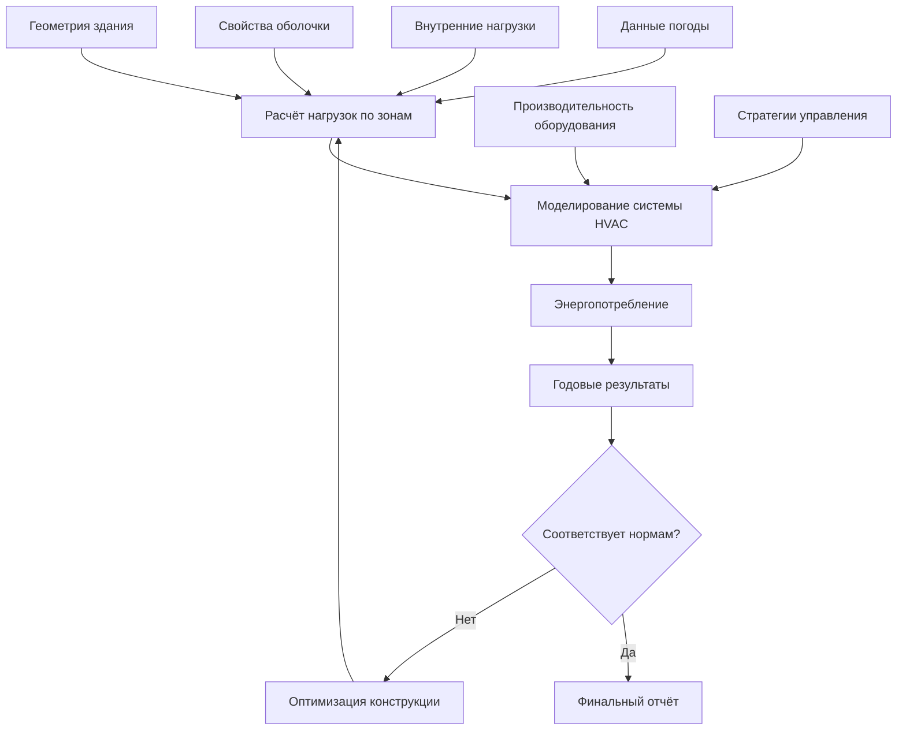

# Методология энергетического моделирования для инженеров HVAC

Энергетическое моделирование прогнозирует энергопотребление HVAC для оптимизации проектирования, соответствия нормативам и анализа эксплуатации. Методы варьируются от простых расчётов градусо-дней до детальных почасовых симуляций.

## Метод градусо-дней

**Градусо-дни отопления (HDD):**

$$HDD = \sum_{days} \max(T_{balance} - T_{outdoor,avg}, 0)$$

**Градусо-дни охлаждения (CDD):**

$$CDD = \sum_{days} \max(T_{outdoor,avg} - T_{balance}, 0)$$

Где $T_{balance}$ = температура баланса (обычно 18,3°C для жилых зданий)

**Годовая энергия отопления:**

$$Q_{heat} = UA \times 24 \times HDD \times \eta^{-1}$$

Где:
- $UA$ = коэффициент теплопотерь здания (кДж/ч·°C)
- $\eta$ = коэффициент полезного действия системы отопления

**Годовая энергия охлаждения:**

$$Q_{cool} = UA \times 24 \times CDD \times COP^{-1}$$

<h3>Практический пример 1: Энергия отопления методом градусо-дней</h3>

**Дано:**
- UA здания: 2,378 кДж/ч·°C
- Климат: Чикаго (3,611 HDD при базе 18,3°C)
- Коэффициент полезного действия котла: 85%
- Стоимость природного газа: 0,94 $/м³

**Найти:** Годовую энергию отопления и стоимость

**Решение:**

Годовая нагрузка отопления:

$$Q = 2378 \times 24 \times 3611 = 206,170,000 \text{ кДж/год}$$

Потребление газа:

$$Gas = \frac{206,170,000}{0.85 \times 37,200} = 6,495 \text{ м³/год}$$

Годовая стоимость:

$$Cost = 6,495 \times 0.94 = \$6,106$$

**Ответ:** 6,495 м³/год, $6,106/год стоимость отопления

**Ограничения:**
- Предполагает постоянную точку баланса
- Игнорирует внутренние тепловыделения
- Нет почасовых вариаций
- Линейная зависимость (неточна для сложных систем)

**Точность:** ±20-30% для простых зданий

## Метод интервалов

**Разделяет климатические данные на интервалы температур** (интервалы 2,8°C)

**Для каждого интервала:**

$$Energy_{bin} = Load_{bin} \times Hours_{bin} \times PLR \times Efficiency^{-1}$$

Где:
- $Load_{bin}$ = нагрузка при температуре интервала
- $Hours_{bin}$ = часы в данном диапазоне температур (из данных TMY)
- $PLR$ = коэффициент частичной нагрузки

**Нагрузка отопления при температуре интервала:**

$$Load = UA \times (T_{balance} - T_{bin}) + Ventilation_{load}$$

**Нагрузка охлаждения при температуре интервала:**

$$Load = UA \times (T_{bin} - T_{balance}) + Ventilation_{load} - Internal_{gains}$$

**Производительность при частичной нагрузке:**

Учитывает деградацию эффективности оборудования при частичной нагрузке

$$COP_{part} = COP_{rated} \times (a + b \times PLR + c \times PLR^2)$$

**Преимущества перед методом градусо-дней:**
- Учитывает производительность при частичной нагрузке
- Включает распределение климатических данных по часам
- Более точен для выбора оборудования HVAC

**Точность:** ±10-20%

<h3>Практический пример 2: Энергия охлаждения методом интервалов</h3>

**Дано:**
- UA здания: 1,421 кДж/ч·°C
- Точка баланса: 15,6°C (с внутренними тепловыделениями)
- Интервал: 26,7-29,4°C (среднее 28,1°C)
- Часов в интервале: 400 часов/год
- Коэффициент COP чиллера при расчётной нагрузке: 3,5
- Коэффициент эффективности при частичной нагрузке: 1,1 (улучшенный COP)

**Найти:** Энергию охлаждения для этого интервала

**Решение:**

Нагрузка в интервале:

$$Load = 1421 \times (28,1 - 15,6) = 17,673 \text{ кДж/ч}$$

COP при частичной нагрузке:

$$COP_{part} = 3,5 \times 1,1 = 3,85$$

Энергия охлаждения:

$$Energy = \frac{17,673 \times 400}{3,85 \times 3,6} = 510 \text{ кВт·ч}$$

**Ответ:** 510 кВт·ч для интервала температур 26,7-29,4°C

(Повторить для всех интервалов и суммировать для годовой энергии)

## Детальное почасовое моделирование

**Программные инструменты:**
- DOE-2 / eQUEST (бесплатно, широко используется для LEED)
- EnergyPlus (бесплатно, открытый исходный код, детальная физика)
- TRACE 700 / HAP (коммерческие, удобные)
- IES-VE (детальное естественное освещение, интеграция CFD)

**Требуемые входные данные:**
1. **Геометрия:** План здания, ориентация, зонирование
2. **Оболочка:** Конструкция стен/крыши/окон, U-значения, SHGC
3. **Внутренние нагрузки:** Расписание занятости, освещения, оборудования
4. **Системы HVAC:** Типы оборудования, эффективности, стратегии управления
5. **Климат:** Данные погоды TMY3 (8,760 почасовых значений)

**Процесс моделирования:**

**Методы расчёта:**
- Метод теплового баланса (EnergyPlus)
- Метод весовых коэффициентов (DOE-2)
- Радиационные временные серии (ASHRAE)

**Выходные данные:**
- Годовое энергопотребление по видам (отопление, охлаждение, вентиляторы, насосы, освещение)
- Пиковый спрос
- Стоимость энергии
- Выбросы CO2
- Профили почасовых нагрузок

**Точность:** ±5-15% при надлежащей калибровке

## Калибровка модели

**Сравнение смоделированного и измеренного энергопотребления** для существующих зданий

**Метрики калибровки (ASHRAE Guideline 14):**

**Месячная калибровка:**

$$MBE = \frac{\sum (measured - modeled)}{\sum measured} \times 100\%$$

**Цель:** MBE в пределах ±5%

$$CV(RMSE) = \frac{\sqrt{\frac{\sum (measured - modeled)^2}{n}}}{\overline{measured}} \times 100\%$$

**Цель:** CV(RMSE) в пределах 15%

**Процесс калибровки:**
1. **Анализ счётов за электроэнергию:** Определение базового потребления
2. **Первоначальная модель:** Использование проектных параметров
3. **Сравнение:** Выявление расхождений (месячно или почасово)
4. **Корректировка входных данных:** Расписания, уставки, инфильтрация, нагрузки от оборудования
5. **Итерация:** Уточнение до достижения допусков

**Распространённые калибровочные корректировки:**
- Расписания занятости (часто отличаются от проектных)
- Уставки термостатов (вмешательство жильцов)
- Коэффициенты инфильтрации (герметичность здания варьируется)
- Нагрузки от оборудования (фактическое оборудование отличается от проектного)

## Моделирование соответствия нормативам

**ASHRAE 90.1 Приложение G (Метод рейтинга производительности):**

1. **Базовое здание:** Предписываемая минимальная эффективность
2. **Предложенный проект:** Фактический проект
3. **Процент улучшения:**

$$Improvement = \frac{Cost_{baseline} - Cost_{proposed}}{Cost_{baseline}} \times 100\%$$

**Требования LEED:**
- Новое строительство: улучшение на 5-50% (шкала баллов)
- Стержень и оболочка: улучшение на 5-50%

**Правила моделирования:**
- Идентичная геометрия, ориентация, зонирование
- Базовая система HVAC в соответствии с Таблицей G3.1.1 (по типу/размеру здания)
- Базовая оболочка в соответствии с предписывающими требованиями

## Практические применения

1. **Оптимизация проекта:** Сравнение вариантов систем HVAC
2. **Выбор размера оборудования:** Правильный выбор размера на основе годовой производительности
3. **Анализ окупаемости:** Оценка модернизации энергоэффективности
4. **Соответствие нормативам:** Демонстрация соответствия ASHRAE 90.1 / энергетическим кодексам
5. **Сертификация LEED:** Кредит EA 1 (Оптимизация энергетической производительности)
6. **Измерение и проверка (M&V):** Калиброванная модель как базовая линия для экономии

---

**Связанные технические руководства:**
- Методология расчёта нагрузок
- Расчёты нагрузок отопления
- Расчёты нагрузок охлаждения

**Ссылки:**
- ASHRAE Handbook of Fundamentals, Chapter 19: Energy Estimating and Modeling Methods
- ASHRAE Standard 90.1: Energy Standard for Buildings Except Low-Rise Residential Buildings
- ASHRAE Guideline 14: Measurement of Energy, Demand, and Water Savings
- DOE Building Energy Software Tools Directory
