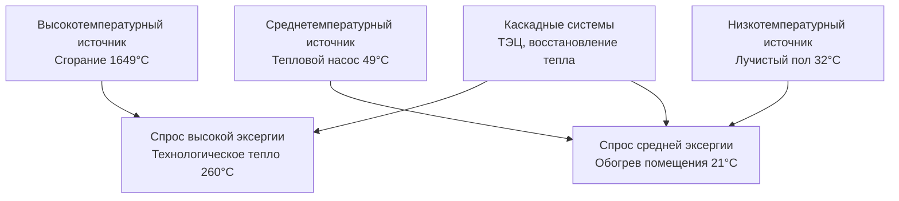

# Анализ эксергии и термодинамическая оптимизация систем HVAC

Анализ эксергии выявляет термодинамические неэффективности сверх анализа энергии по первому закону, показывая, где потенциал полезной работы разрушается в системах HVAC. Это руководство охватывает основы эксергии, методологию расчета и стратегии оптимизации для чиллеров, котлов, теплообменников и тепловых систем зданий.

## Основы эксергии

### Определение эксергии

**Эксергия (доступность):** Максимальная теоретическая полезная работа, которую можно получить из системы при достижении ею равновесия с окружающей средой.

$$Ex = (H - H_0) - T_0(S - S_0)$$

Где:
- $Ex$ = удельная эксергия (кДж/кг)
- $H$ = энтальпия в состоянии системы (кДж/кг)
- $H_0$ = энтальпия в мертвом состоянии (окружающая среда)
- $S$ = энтропия в состоянии системы (кДж/кг·К)
- $S_0$ = энтропия в мертвом состоянии
- $T_0$ = температура окружающей среды (К)

**Мертвое состояние (эталон):** Условия окружающей среды
- Типичное значение: $T_0$ = 25°C (298 К), $P_0$ = 101,3 кПа

**Физическая интерпретация:**
- **Энергия (первый закон):** Полное содержание энергии (сохраняется, не может быть уничтожена)
- **Эксергия (второй закон):** Полезная энергия (качество, может быть разрушена необратимостью)

### Энергия против эксергии

**Пример: 0,454 кг воды при 93°C против 0,908 кг при 60°C**

**Содержание энергии:**
- 93°C: $H = 390$ кДж/кг, Всего = 177 кДж
- 60°C: $H = 251$ кДж/кг, Всего = $0,908 \times 251 = 228$ кДж

228 кДж > 177 кДж (больше энергии в воде при 60°C)

**Содержание эксергии (относительно окружающей среды 25°C):**

Вода при 93°C:
$$Ex = (390 - 105) - 298 \times (1,193 - 0,367) = 285 - 245 = 40 \text{ кДж/кг}$$

Вода при 60°C:
$$Ex = (251 - 105) - 298 \times (0,831 - 0,367) = 146 - 138 = 8 \text{ кДж/кг}$$

Всего: $0,908 \times 8 = 7,3$ кДж

**Результат:** Вода при 93°C имеет более высокую эксергию (40 кДж против 7,3 кДж) несмотря на более низкую энергию
- Более высокая температура = более высокое термодинамическое качество = больший потенциал полезной работы

### Баланс эксергии

**Система установившегося потока:**

$$\sum Ex_{in} = \sum Ex_{out} + Ex_{destroyed} + Ex_{product}$$

**Разрушение эксергии (необратимость):**

$$Ex_{destroyed} = T_0 \cdot S_{gen}$$

Где $S_{gen}$ = скорость генерации энтропии (кДж/ч·К)

**Источники разрушения эксергии:**
1. **Теплопередача через конечную разность температур**
2. **Трение (поток жидкости, механическое)**
3. **Смешивание потоков в различных состояниях**
4. **Дросселирование (падение давления без извлечения работы)**
5. **Химические реакции (сгорание)**

## Эффективность второго закона

### Экзергетическая эффективность

**Определение:**

$$\eta_{ex} = \frac{Ex_{product}}{Ex_{input}} = 1 - \frac{Ex_{destroyed}}{Ex_{input}}$$

**Сравнение с эффективностью первого закона:**

$$\eta_{energy} = \frac{Energy_{output}}{Energy_{input}}$$

**Пример: Обогрев помещения котлом (уличный воздух 0°C, помещение 21°C)**

**Эффективность первого закона:** 85% (15% потери дымовых газов)

**Эффективность второго закона:**
- Входная эксергия: сгорание природного газа (высокая температура, высокая эксергия)
- Выходная эксергия: обогрев помещения при 21°C (низкая температура, низкая эксергия)
- Экзергетическая эффективность: 5-10% (огромное термодинамическое несоответствие)

**Вывод:** Высокая энергетическая эффективность ≠ высокая экзергетическая эффективность при необходимости низкотемпературной энергии

## Анализ эксергии компонентов HVAC

### Теплообменники

**Разрушение эксергии в противоточном теплообменнике:**

$$Ex_{destroyed} = \dot{m}_h c_{p,h} \ln\frac{T_{h,out}}{T_{h,in}} + \dot{m}_c c_{p,c} \ln\frac{T_{c,out}}{T_{c,in}} + T_0 \Delta S_{gen}$$

**Упрощенно (постоянные свойства):**

$$Ex_{destroyed} = T_0 \left[\dot{m}_h c_{p,h} \ln\frac{T_{h,out}}{T_{h,in}} + \dot{m}_c c_{p,c} \ln\frac{T_{c,out}}{T_{c,in}}\right]$$

**Минимизация разрушения эксергии:**
1. Минимизация разности температур (ΔT) между потоками
   - Больший теплообменник (большая площадь) → меньше ΔT → меньше разрушения эксергии
   - Компромисс: капитальная стоимость против операционной потери эксергии

2. Балансировка мощностей ($\dot{m}c_p$)
   - Согласованные потоки → меньше генерации энтропии

3. Противоточная конфигурация
   - Минимальное разрушение эксергии (наименьшая локальная ΔT)

<h3>Практический пример 1: Анализ эксергии теплообменника</h3>

**Дано:**
- Пластинчатый теплообменник (противоток)
- Горячая сторона: 4,536 кг/ч воды, 82°C → 60°C
- Холодная сторона: 4,536 кг/ч воды, 49°C → 71°C
- Окружающая среда: 25°C (298 К)
- $c_p$ = 4,18 кДж/кг·К

**Найти:** Скорость теплопередачи, скорость разрушения эксергии

**Решение:**

**Теплопередача:**
$$\dot{Q} = \dot{m}_h c_p (T_{h,in} - T_{h,out}) = 4,536 \times 4,18 \times (82-60) = 415,000 \text{ кДж/ч}$$

Проверка энергетического баланса:
$$\dot{Q}_c = 4,536 \times 4,18 \times (71-49) = 415,000 \text{ кДж/ч}$$ ✓

**Генерация энтропии:**

Изменение энтропии горячей стороны:
$$\Delta S_h = \dot{m}_h c_p \ln\frac{T_{h,out}}{T_{h,in}} = 4,536 \times 4,18 \times \ln\frac{333}{355} = -132 \text{ кДж/ч·К}$$

(Использование абсолютной температуры: 60+273=333 К, 82+273=355 К)

Изменение энтропии холодной стороны:
$$\Delta S_c = 4,536 \times 4,18 \times \ln\frac{344}{322} = 145 \text{ кДж/ч·К}$$

Полная генерация энтропии:
$$S_{gen} = 145 - 132 = 13 \text{ кДж/ч·К}$$

**Разрушение эксергии:**
$$Ex_{destroyed} = T_0 \times S_{gen} = 298 \times 13 = 3,874 \text{ кДж/ч}$$

**Экзергетическая эффективность:**

Входная эксергия (горячий поток):
$$Ex_{in} = \dot{m}_h c_p \left[(T_{h,in}-T_0) - T_0 \ln(T_{h,in}/T_0)\right]$$
$$Ex_{in} = 4,536 \times 4,18 \times \left[(82-25) - 298 \ln(355/298)\right] = 60,400 \text{ кДж/ч}$$

$$\eta_{ex} = 1 - \frac{3,874}{60,400} = 0,936 = 93,6\%$$

**Ответ:** 3,874 кДж/ч разрушения эксергии (93,6% экзергетическая эффективность)

**Стратегии улучшения:**
- Увеличение площади теплообменника (снижение ΔT): 22°C → 11°C подхода → меньше разрушения эксергии
- Противоток (уже оптимизирован)

### Холодильные машины с компрессией пара

**Разбор разрушения эксергии (типичный чиллер):**

| Компонент | % от общего разрушения эксергии |
|-----------|----------------------------------|
| Компрессор | 40-50% |
| Конденсатор | 25-35% |
| Испаритель | 15-20% |
| Расширительный вентиль | 5-10% |

**Экзергетический COP:**

$$COP_{ex} = \frac{Ex_{cooling}}{W_{compressor}}$$

Где эксергия охлаждения:

$$Ex_{cooling} = \dot{Q}_{evap} \left(1 - \frac{T_0}{T_{evap}}\right)$$

**Сравнение:**
- Энергетический COP = $\dot{Q}_{evap} / W_{compressor}$ (типично 3-6)
- Экзергетический COP = $Ex_{cooling} / W_{compressor}$ (типично 0,3-0,6)

**Интерпретация:** Даже эффективные чиллеры разрушают 40-70% входной работной эксергии

### Котлы и сгорание

**Разрушение эксергии при сгорании:**

$$Ex_{destroyed,combustion} = T_0 \sum_{products} \dot{n}_i s_i - T_0 \sum_{reactants} \dot{n}_j s_j$$

**Основные необратимости:**
1. **Химическая реакция:** Смешивание газов сгорания (наибольшее)
2. **Теплопередача:** Температура пламени (1649°C) → стенки печи (816°C) → вода (177°C)
3. **Выход дымовых газов:** Горячие газы выброшены в атмосферу (потеря эксергии)

**Типичная экзергетическая эффективность котла:** 30-40% (против 85-90% энергетической эффективности)

**Большинство эксергии разрушается при самом сгорании (не восстанавливается)**

**Стратегии улучшения:**
- Минимизация избытка воздуха (меньший поток дымовых газов)
- Экономайзер (восстановление эксергии дымовых газов)
- Конденсирующий котел (восстановление скрытого тепла при низкой температуре)
- **Фундаментальное ограничение:** Сгорание высоко необратимо (не может приблизиться к эффективности Карно)

## Оптимизация на основе эксергии

### Тепловые системы зданий

**Экзергетический спрос на обогрев помещения:**

$$Ex_{heating} = \dot{Q}_{heating} \left(1 - \frac{T_0}{T_{room}}\right)$$

**Пример:** 29,3 кВт теплоснабжения
- Помещение: 21°C (294 К)
- Уличный воздух: 0°C (273 К)

Энергетический спрос: 29,3 кВт

Экзергетический спрос:
$$Ex = 29,3 \left(1 - \frac{273}{294}\right) = 2,1 \text{ кВт}$$

**Экзергетический спрос составляет всего 7% энергетического спроса** (низкотемпературное тепловое требование)

**Следствие:** Идеальный источник отопления — низкотемпературный (тепловые насосы, восстановление отходящего тепла, солнечные тепловые системы), а не высокотемпературное сгорание

### Согласование по температуре

**Система, оптимизированная по эксергии, с согласованием:**

**Принцип:** Согласовать температуру источника с температурой спроса
- Высокотемпературное сгорание → высокотемпературные процессы
- Низкотемпературные источники → обогрев/охлаждение помещений
- Каскад: Использование отходящего тепла от высокотемпературного процесса для низкотемпературных нужд

### Комбинированное производство тепла и электроэнергии (ТЭЦ)

**Анализ эксергии ТЭЦ:**

**Традиционное раздельное производство:**
- Электричество от электростанции: 33% эффективность (67% отходящее тепло)
- Тепло от котла: 85% эффективность

**ТЭЦ (когенерация):**
- Электричество от газового двигателя: 35-40% эффективность
- Восстановленное отходящее тепло: 40-50% (горячая вода, пар)
- Общая эффективность: 75-90%

**Экзергетическая эффективность:**

ТЭЦ: $$\eta_{ex,CHP} = \frac{W_{elec} + Ex_{heat}}{Ex_{fuel}}$$

**Типично:** 50-60% экзергетическая эффективность (против 30% традиционной)

**Ключевой момент:** Использование отходящего тепла при надлежащем температурном уровне (не перегрев низкотемпературных нагрузок)

<h3>Практический пример 2: ТЭЦ против раздельного производства</h3>

**Дано:**
- Спрос здания: 373 кВт электроэнергии, 8,78 ГДж/ч теплоснабжения (82°C горячая вода)
- Вариант 1: Электричество из сети (40% КПД генерации) + котел (85% КПД)
- Вариант 2: ТЭЦ (35% электро, 45% восстановление тепла, 82°C)
- Топливо: Природный газ (НДВ = 39,6 МДж/кг, эксергия ≈ НДВ)
- Окружающая среда: 25°C

**Найти:** Расход топлива и экзергетическая эффективность для каждого варианта

**Решение:**

**Вариант 1: Раздельное производство**

Расход топлива для электроэнергии:
$$\dot{m}_{fuel,elec} = \frac{373 \times 3,6}{0,40 \times 39,6} = 84,6 \text{ кг/ч}$$

Расход топлива для теплоснабжения:
$$\dot{m}_{fuel,heat} = \frac{8,78}{0,85 \times 39,6} = 0,261 \text{ кг/ч}$$

Общий расход топлива: $84,6 + 0,261 = 84,9$ кг/ч

Общая энергия топлива: $84,9 \times 39,6 = 3,362$ ГДж/ч

**Вариант 2: ТЭЦ**

Расход топлива ТЭЦ для 373 кВт электроэнергии:
$$\dot{m}_{fuel,CHP} = \frac{373 \times 3,6}{0,35 \times 39,6} = 96,9 \text{ кг/ч}$$

Энергия топлива ТЭЦ: $96,9 \times 39,6 = 3,837$ ГДж/ч

Восстановленное тепло: $3,837 \times 0,45 = 1,727$ ГДж/ч

Дефицит: $8,78 - 1,727 = 7,053$ ГДж/ч (дополнительный котел)

Расход топлива котла: $7,053 / (0,85 \times 39,6) = 0,210$ кг/ч

Общий расход ТЭЦ: $96,9 + 0,210 = 97,1$ кг/ч

Общая энергия топлива: $97,1 \times 39,6 = 3,845$ ГДж/ч

**Экономия топлива:** $(3,362 - 3,845)/3,362 = -14,3\%$

(Примечание: В этом примере ТЭЦ требует больше топлива из-за более низкой электрической эффективности. Преимущества появляются при полном использовании восстановленного тепла и в сценариях с более высокой электрической эффективностью.)

**Экзергетическая эффективность:**

Эксергия 82°C тепла:
$$Ex_{heat} = 8,78 \left(1 - \frac{298}{355}\right) = 1,42 \text{ ГДж/ч}$$

Вариант 1:
$$\eta_{ex,sep} = \frac{373 \times 3,6/1000 + 1,42}{3,362} = 0,48 = 48\%$$

Вариант 2:
$$\eta_{ex,CHP} = \frac{373 \times 3,6/1000 + 1,42}{3,845} = 0,47 = 47\%$$

**Ответ:**
- Экзергетическая эффективность: 47-48%
- Преимущества ТЭЦ появляются при высшей электрической эффективности (50%+) и полном использовании тепла

## Практические приложения

**Анализ эксергии выявляет:**
1. **Наибольшие необратимости:** Сосредоточить усилия по оптимизации
2. **Неэффективности компонентов:** Сверх энергетического анализа
3. **Возможности интеграции систем:** Каскад, восстановление тепла
4. **Согласование температур:** Правильный источник для правильного спроса

**Рекомендации по проектированию:**
- **Чиллеры:** Снижение подъема (меньше ΔT испаритель-конденсатор), компрессор с переменной частотой вращения
- **Теплообменники:** Максимизация площади (ниже ΔT), противоток
- **Котлы:** Экономайзеры, конденсирующее исполнение (если возможно)
- **Системы зданий:** Тепловые насосы для кондиционирования помещений, лучистое отопление (низкотемпературное распределение)
- **ТЭЦ:** Согласование температуры восстановленного тепла со спросом

---

**Связанные технические руководства:**
- Термодинамические циклы
- Основы теплопередачи
- Анализ производительности чиллера
- Методология энергетического моделирования
- Технология тепловых насосов

**Ссылки:**
- Bejan, A., "Advanced Engineering Thermodynamics"
- Moran, M.J., Shapiro, H.N., "Fundamentals of Engineering Thermodynamics"
- Dincer, I., Rosen, M.A., "Exergy: Energy, Environment and Sustainable Development"
- ASHRAE Transactions: "Exergy Analysis of HVAC Systems"
- Shukuya, M., "Exergy Concept and Its Application to the Built Environment"
