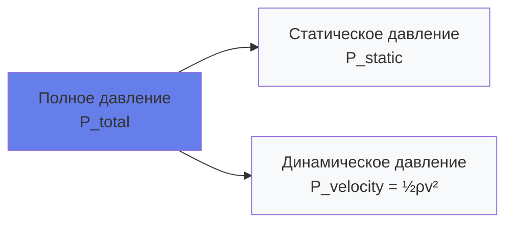
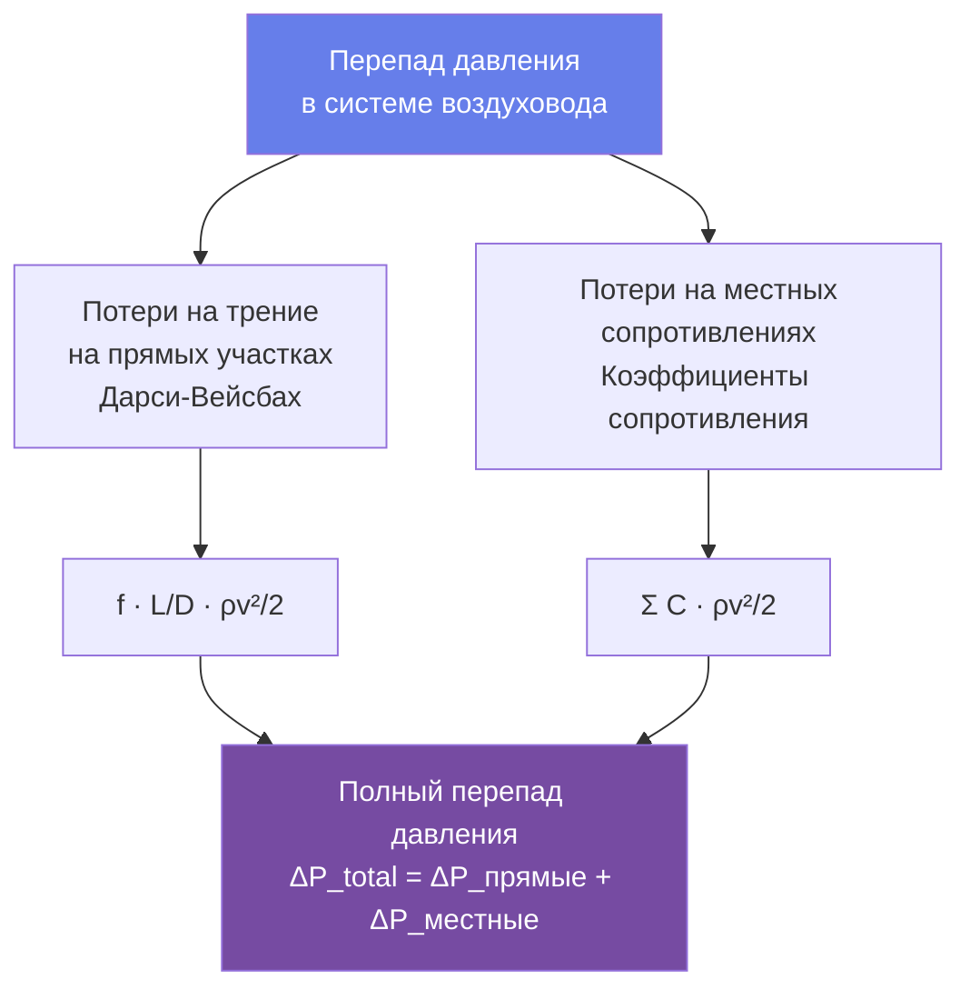

# Механика жидкостей для инженеров HVAC

Течение жидкостей определяет распределение воздуха и воды в системах HVAC. Точное предсказание перепадов давления, требуемой мощности насосов и вентиляторов, а также скоростей потока требует применения принципов механики жидкостей. Данное руководство содержит инженерные уравнения для несжимаемого потока в воздуховодах и трубопроводах, необходимые для проектирования систем распределения.

## Фундаментальные свойства жидкостей

### Плотность

Масса на единицу объёма определяет импульс и энергетическое содержимое текущей жидкости.

**Воздух** (на уровне моря, 21°C):
$$\rho_{air} = 1.20 \text{ кг/м}^3$$

**Вода** (при 15°C):
$$\rho_{water} = 1000 \text{ кг/м}^3$$

### Вязкость

Динамическая вязкость ($\mu$) количественно характеризует сопротивление внутреннему трению жидкости:

**Воздух** (при 21°C):
$$\mu_{air} = 1.81 \times 10^{-5} \text{ Па·с}$$

**Вода** (при 15°C):
$$\mu_{water} = 1.12 \times 10^{-3} \text{ Па·с}$$

Кинематическая вязкость ($\nu$):

$$\nu = \frac{\mu}{\rho}$$

Единицы: м²/с

## Уравнение Бернулли

Для установившегося, несжимаемого потока без трения вдоль линии тока полная энергия остаётся постоянной:

$$P_1 + \frac{1}{2}\rho v_1^2 + \rho g z_1 = P_2 + \frac{1}{2}\rho v_2^2 + \rho g z_2$$

Где:
- $P$ = статическое давление (Па)
- $\rho$ = плотность жидкости (кг/м³)
- $v$ = скорость жидкости (м/с)
- $g$ = ускорение свободного падения = 9.81 м/с²
- $z$ = высота (м)

На практике HVAC выражается в единицах давления (Па):

$$P_{total} = P_{static} + P_{velocity}$$

Где динамическое давление:

$$P_{velocity} = \frac{1}{2}\rho v^2$$

Для воздуха в стандартных условиях (1.20 кг/м³):

$$P_v = \frac{\rho v^2}{2 \times 1000} \text{ Па} = 0.6 v^2 \text{ Па (при } v \text{ в м/с)}$$

## Число Рейнольдса и режимы течения

Число Рейнольдса определяет, является ли течение ламинарным или турбулентным:

$$Re = \frac{\rho v D}{\mu} = \frac{v D}{\nu}$$

Где:
- $D$ = характерный размер (диаметр трубопровода или гидравлический диаметр воздуховода, м)
- $v$ = средняя скорость (м/с)

**Классификация режимов течения:**
- $Re < 2300$: Ламинарное течение (редко в системах HVAC, кроме малых трубопроводов при низком расходе)
- $2300 < Re < 4000$: Переходное течение
- $Re > 4000$: Турбулентное течение (типично для систем HVAC)

Гидравлический диаметр для прямоугольных воздуховодов:

$$D_h = \frac{4A}{P} = \frac{4ab}{2(a+b)} = \frac{2ab}{a+b}$$

Где $a$ и $b$ — размеры воздуховода (м).

### Пример с решением 1: Расчёт числа Рейнольдса

**Дано:**
- Поток воздуха через прямоугольный воздуховод 300 × 200 мм
- Скорость воздуха: 6,4 м/с
- Плотность воздуха: $\rho = 1.20$ кг/м³
- Кинематическая вязкость воздуха: $\nu = 1.50 \times 10^{-5}$ м²/с

**Найти:** Число Рейнольдса и режим течения

**Решение:**

Шаг 1: Расчёт гидравлического диаметра.

$$D_h = \frac{2ab}{a+b} = \frac{2 \times 0.300 \times 0.200}{0.300 + 0.200} = 0.240 \text{ м}$$

Шаг 2: Расчёт числа Рейнольдса.

$$Re = \frac{vD_h}{\nu} = \frac{6.4 \times 0.240}{1.50 \times 10^{-5}} = 102,400$$

**Ответ:** $Re = 102400$ (турбулентное течение)

**Инженерный вывод:** Число Рейнольдса значительно превышает 4000, что подтверждает турбулентное течение. Все системы воздуховодов HVAC работают в турбулентном режиме при типичных скоростях (3-12 м/с), что обосновывает использование корреляций для коэффициента трения турбулентного течения при расчёте потерь давления.

## Перепад давления в воздуховодах и трубопроводах

### Уравнение Дарси-Вейсбаха

Универсальное уравнение для перепада давления на прямых участках:

$$\Delta P = f \frac{L}{D} \frac{\rho v^2}{2}$$

Где:
- $\Delta P$ = перепад давления (Па)
- $f$ = коэффициент трения Дарси (безразмерный)
- $L$ = длина воздуховода/трубопровода (м)
- $D$ = диаметр или гидравлический диаметр (м)

### Корреляции для коэффициента трения

Для турбулентного течения в гладких воздуховодах (листовой металл):

**Уравнение Кулебрука** (неявное):

$$\frac{1}{\sqrt{f}} = -2.0 \log_{10}\left(\frac{\epsilon/D}{3.7} + \frac{2.51}{Re\sqrt{f}}\right)$$

Где $\epsilon$ = абсолютная шероховатость (м).

**Уравнение Свамее-Джейна** (явное приближение):

$$f = \frac{0.25}{\left[\log_{10}\left(\frac{\epsilon/D}{3.7} + \frac{5.74}{Re^{0.9}}\right)\right]^2}$$

Для гладких воздуховодов ($\epsilon \approx 0$):

$$f \approx \frac{0.25}{[\log_{10}(Re/7)]^2}$$

Типичные значения абсолютной шероховатости:

| Материал | Шероховатость ε (м) |
|----------|-------------------|
| Стекло, вытянутые трубки | 1.5 × 10⁻⁶ |
| Коммерческая сталь, ПВХ | 0.046 × 10⁻³ |
| Оцинкованный стальной воздуховод | 0.15 × 10⁻³ |
| Стеклофибровый воздуховод | 0.46 × 10⁻³ |
| Бетон | 0.3 - 3.0 × 10⁻³ |

### Потери на местных сопротивлениях

Местные сопротивления (отводы, тройники, заслонки) вызывают локальные перепады давления:

$$\Delta P_{fitting} = C \frac{\rho v^2}{2}$$

Где $C$ = коэффициент сопротивления (безразмерный).

Метод эквивалентной длины выражает потери на местных сопротивлениях через эквивалентную длину прямого воздуховода:

$$L_{eq} = C \frac{D}{f}$$

Типичные коэффициенты сопротивления:

| Тип местного сопротивления | Коэффициент C |
|---------------------------|--------------|
| Отвод 90° с плавным переходом (r/D = 1.5) | 0.3 - 0.5 |
| Отвод 90° с острым углом (без направляющих) | 1.2 - 1.3 |
| Тройник, ответвление | 0.9 - 1.8 |
| Внезапное расширение (d/D = 0.5) | 0.6 |
| Внезапное сужение (d/D = 0.5) | 0.4 |
| Заслонка, полностью открыта | 0.2 - 0.5 |
| Заслонка, угол открытия 60° | 4 - 6 |

### Пример с решением 2: Расчёт перепада давления в воздуховоде

**Дано:**
- 30 м воздуховода диаметром 300 мм
- Поток воздуха: 1200 м³/ч (0.333 м³/с)
- Три отвода 90° (C = 0.4 каждый)
- Плотность воздуха: 1.20 кг/м³
- Коэффициент трения: f = 0.018 (из диаграммы Муди или уравнения)

**Найти:** Полный перепад давления

**Решение:**

Шаг 1: Расчёт площади воздуховода и скорости.

$$A = \frac{\pi D^2}{4} = \frac{\pi (0.300)^2}{4} = 0.0707 \text{ м}^2$$

$$v = \frac{Q}{A} = \frac{0.333}{0.0707} = 4.71 \text{ м/с}$$

Шаг 2: Расчёт динамического давления.

$$P_v = \frac{\rho v^2}{2} = \frac{1.20 \times (4.71)^2}{2} = 13.3 \text{ Па}$$

Шаг 3: Расчёт перепада давления на прямом участке.

$$\Delta P_{straight} = f \frac{L}{D} P_v = 0.018 \times \frac{30}{0.300} \times 13.3 = 23.9 \text{ Па}$$

Шаг 4: Расчёт потерь на местных сопротивлениях.

$$\Delta P_{fittings} = 3 \times C \times P_v = 3 \times 0.4 \times 13.3 = 16.0 \text{ Па}$$

Шаг 5: Расчёт полного перепада давления.

$$\Delta P_{total} = 23.9 + 16.0 = 39.9 \text{ Па} \approx 40 \text{ Па}$$

**Ответ:** Полный перепад давления = 40 Па, состоящий из 23.9 Па (60%) трения и 16.0 Па (40%) местных сопротивлений.

**Инженерный вывод:** Местные сопротивления вносят 40% от полного перепада давления несмотря на то, что составляют лишь 3-4% от длины системы. Минимизация местных сопротивлений и использование гладких радиусных отводов значительно снижает мощность вентилятора. Для данного примера замена острых отводов (C = 1.3) на радиусные (C = 0.4) экономит 29.7 Па потерь на местных сопротивлениях.

## Мощность насосов и вентиляторов

Механическая мощность, необходимая для перемещения жидкости:

$$\dot{W} = \frac{Q \Delta P}{\eta}$$

Где:
- $\dot{W}$ = мощность (кВт)
- $Q$ = объёмный расход (м³/с)
- $\Delta P$ = полный перепад давления (Па)
- $\eta$ = общий КПД (вентилятора или насоса, безразмерный)

Для воздуха (в единицах СИ):

$$P_{кВт} = \frac{Q_{м³/с} \times \Delta P_{Па}}{1000 \times \eta}$$

Для воды (в единицах СИ):

$$P_{кВт} = \frac{Q_{м³/с} \times \Delta P_{Па}}{1000 \times \eta}$$

Типичные КПД:
- **Вентиляторы**: 50-75% (полный КПД включая двигатель и трансмиссию)
- **Насосы**: 60-85% (полный КПД включая двигатель)

## Проектирование трубопроводов для водяных систем

### Уравнение Хейзена-Уильямса

Эмпирическое уравнение, широко используемое для потока воды в трубопроводах:

$$v = 0.400 C R^{0.63} S^{0.54}$$

Где:
- $v$ = скорость (м/с)
- $C$ = коэффициент Хейзена-Уильямса (безразмерный)
- $R$ = гидравлический радиус = $D/4$ для круглых труб (м)
- $S$ = градиент трения = $\Delta P / (\rho g L)$ (безразмерный)

Для круглых труб:

$$\Delta P = \frac{10.674 L Q^{1.85}}{C^{1.85} D^{4.87}} \text{ кПа}$$

Где:
- $\Delta P$ = перепад давления (кПа)
- $L$ = длина трубопровода (м)
- $Q$ = расход (л/с)
- $D$ = внутренний диаметр (мм)

Коэффициенты Хейзена-Уильямса:

| Материал трубопровода | C-коэффициент (новый) | C-коэффициент (старый) |
|----------------------|-------------------|-------------------|
| Медь | 140 - 150 | 120 - 130 |
| ПВХ/ХПВХ | 150 | 140 |
| Сталь (новая гладкая) | 140 | 100 - 120 |
| Сталь (слегка корродированная) | 110 | 80 - 100 |
| Чугун (новый) | 130 | 90 - 110 |
| Бетон | 120 - 140 | 100 - 120 |

### Ограничения скорости

Проектные скорости для контроля шума и эрозии:

| Применение | Максимальная скорость |
|-----------|---------------------|
| Линия всасывания (насосы) | 1.2 - 2.1 м/с |
| Линия нагнетания (общие) | 2.4 - 3.0 м/с |
| Линия нагнетания (чувствительные к шуму) | 1.2 - 1.8 м/с |
| Подача/возврат охлаждённой воды | 2.4 - 3.6 м/с |
| Конденсаторная вода | 2.4 - 3.6 м/с |
| Подача/возврат горячей воды | 1.8 - 3.0 м/с |

## Практические приложения

### Проектирование системы воздуховодов

1. **Метод равного падения давления**: Проектирование воздуховодов на постоянный перепад давления на единицу длины (типично 0.3-0.6 Па/м)
2. **Метод восстановления статического давления**: Проектирование воздуховодов для поддержания постоянного статического давления на каждом ответвлении
3. **Метод ограничения скорости**: Проектирование воздуховодов на максимально допустимые скорости (главные воздуховоды 6-10 м/с, ответвления 4-6 м/с)

### Проектирование системы трубопроводов

1. **Проектирование по скорости**: Выбор размера труб для поддержания скоростей в допустимых пределах (1.2-3.0 м/с)
2. **Ограничение перепада давления**: Проектирование труб для ограничения перепада давления (типично 12 Па/м или 6 кПа на 100 м)
3. **Экономическая оптимизация**: Баланс между начальной стоимостью (большие трубы) и эксплуатационной стоимостью (мощность насоса)

### Выбор насосов и вентиляторов

1. **Кривая системы**: Построение кривой перепада давления от расхода с использованием уравнения Дарси-Вейсбаха
2. **Рабочая точка**: Пересечение кривой системы и кривой производительности насоса/вентилятора
3. **Коэффициенты безопасности**: Добавление 10-15% к рассчитанному перепаду давления на неопределённости и старение

## Распространённые ошибки проектирования

- **Игнорирование потерь на местных сопротивлениях**: Местные сопротивления часто составляют 30-50% от полного перепада давления
- **Использование скоростей воды > 3.0 м/с**: Вызывает эрозию, шум и риск гидроудара
- **Недостаточное внимание шуму воздуховодов**: Скорости > 10 м/с генерируют неприемлемый шум
- **Игнорирование изменений высоты**: Статическое давление изменяется на 98 Па/м для воды, на 12 Па/м для воздуха
- **Использование коэффициентов трения гладких труб для старых систем**: Коррозия и отложения значительно увеличивают трение

## Резюме

Принципы механики жидкостей определяют проектирование систем распределения HVAC:

- **Уравнение Бернулли** связывает энергию давления, скорости и высоты
- **Число Рейнольдса** определяет режим течения (ламинарное или турбулентное)
- **Уравнение Дарси-Вейсбаха** рассчитывает потери на трение на прямых участках
- **Коэффициенты потерь на местных сопротивлениях** количественно определяют перепады давления на отводах, тройниках и переходах
- **Уравнение Хейзена-Уильямса** обеспечивает эмпирический метод проектирования водяных трубопроводов
- **Мощность насосов/вентиляторов** пропорциональна расходу и перепаду давления, обратно пропорциональна КПД

Точные расчёты перепадов давления обеспечивают правильный выбор насосов и вентиляторов, проектирование воздуховодов и трубопроводов, а также энергоэффективное проектирование систем.

---

**Связанные технические руководства:**
- Основы проектирования воздуховодов
- Основы гидронных систем
- Выбор и производительность насосов
- Выбор и производительность вентиляторов

**Ссылки:**
- ASHRAE Handbook of Fundamentals, Chapter 3: Fluid Flow
- ASHRAE Duct Fitting Database (DFDB)
- SMACNA HVAC Systems Duct Design, 4th Edition
- Crane Technical Paper No. 410: Flow of Fluids Through Valves, Fittings, and Pipe
