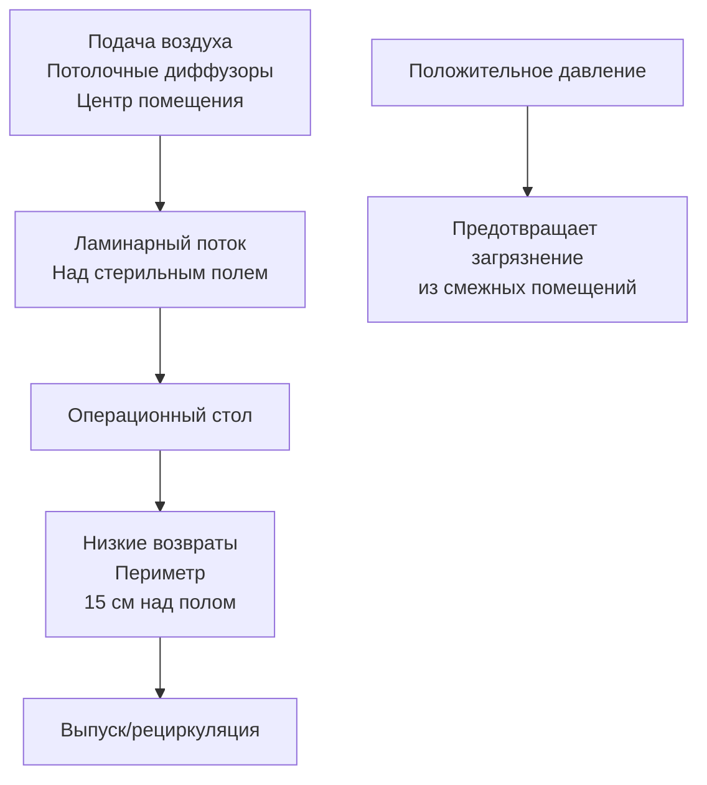
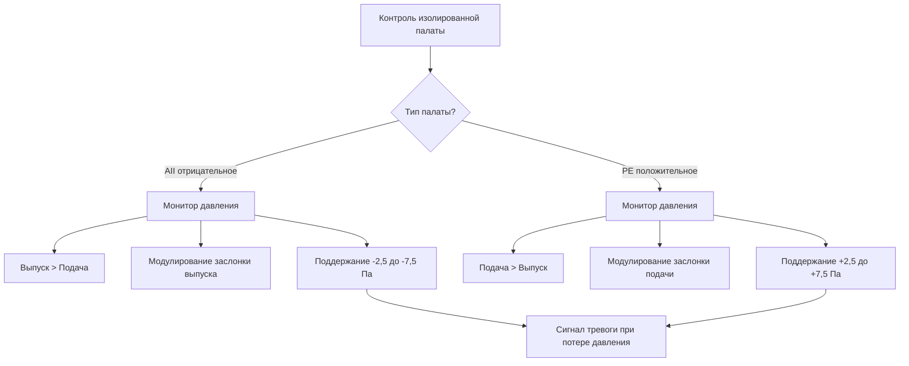

# Проектирование систем HVAC в здравоохранении для операционных и отделений интенсивной терапии

Системы HVAC в учреждениях здравоохранения защищают пациентов, персонал и посетителей от патогенов, передаваемых по воздуху, одновременно поддерживая строгий контроль температуры и влажности. Это руководство охватывает требования к проектированию операционных, изолированных помещений и отделений интенсивной терапии в соответствии со стандартом ASHRAE 170 и рекомендациями FGI.

## Нормативная база

**Основные стандарты:**
- **ASHRAE 170:** Вентиляция медицинских учреждений
- **FGI Guidelines:** Стандарты проектирования Института руководящих принципов объектов
- **Joint Commission:** Требования аккредитации
- **Нормы штатов/местные коды:** Часто более строгие

**Ключевые показатели:**
- Воздухообмены в час (ACH)
- Отношения давлений
- Диапазоны температуры и влажности
- Эффективность фильтрации (классификация MERV)

## Проектирование систем HVAC операционной (ОР)

### Требования вентиляции

**Минимумы ASHRAE 170:**
- **Общий ACH:** минимум 20 (15 наружный воздух + 5 рециркуляция)
- **Наружный воздух:** минимум 4 ACH
- **Давление:** Положительное (минимум +2,5 Па относительно коридора)
- **Температура:** 20-23°C (регулируется хирургической бригадой)
- **Относительная влажность:** 20-60%

**Повышенные требования (общепринятая практика):**
- Общий ACH: 20-25
- Ламинарный поток из потолка: 25-35 ACH над стерильным полем
- HEPA-фильтрация: 99,97% при 0,3 мкм

### Схема движения воздуха

**Принципы проектирования:**
- Подача из потолочного центра (однонаправленный поток над столом)
- Низкие решетки возврата/выпуска по периметру (удаление загрязненного воздуха)
- Отсутствие диффузоров подачи непосредственно над дверями
- Поддержание ламинарного потока от потолка до 1,2-1,8 м над полом

### Фильтрация

**Трехступенчатая фильтрация (типично):**

1. **Предварительный фильтр:** MERV 8 (защита нижестоящих фильтров)
2. **Промежуточный фильтр:** минимум MERV 14
3. **Финальный фильтр:** HEPA (99,97% при 0,3 мкм) или MERV 17

**Расположение фильтра:** Финальные фильтры в потолочном плену или в концевых устройствах

**Доступ для обслуживания:** Критичен - спланировать процедуру замены фильтра

### Контроль температуры и влажности

**Контроль температуры:**
- Регулируемое значение: 20-23°C
- Стабильность ±1°C
- Управление отдельной комнатой (предпочтения хирурга варьируются)

**Причины охлаждения:**
- Хирургические светильники генерируют тепло (150-600 кВт)
- Персонал в халатах под светом
- Тепловыделение оборудования

**Контроль влажности:**
- Диапазон: 20-60% ОВ
- Целевое значение: 30-50% ОВ (снижает статику, рост бактерий)
- Осушение: Охлаждающая катушка + подогрев
- Увлажнение: Пар (наиболее гигиеничный способ)

<h3>Пример решения 1: Определение размеров вентиляции ОР</h3>

**Дано:**
- Операционная: 6,1 м × 6,1 м × 3,05 м высота потолка
- Конструкция: 25 общий ACH, 5 наружный воздух ACH
- Температура: 21°C
- Влажность: 40% ОВ
- Наружный воздух: 35°C, 70% ОВ

**Найти:** Подача воздуха, наружный воздух CFM, охлаждающая нагрузка

**Решение:**

Объем помещения:
$$V = 6,1 \times 6,1 \times 3,05 = 113,5 \text{ м}^3$$

Общая подача воздуха:
$$CFM_{подача} = \frac{25 \times 113,5}{0,0283 \times 60} = 1,667 \text{ CFM (2,826 м}^3\text{/ч)}$$

Наружный воздух:
$$CFM_{НВ} = \frac{5 \times 113,5}{0,0283 \times 60} = 333 \text{ CFM (565 м}^3\text{/ч)}$$

Возвратный воздух:
$$CFM_{ВА} = 1,667 - 333 = 1,334 \text{ CFM (2,261 м}^3\text{/ч)}$$

Температура смешанного воздуха (до охлаждения):
$$T_{СВ} = \frac{333 \times 35 + 1,334 \times 21}{1,667} = 24°C$$

Чувствительное охлаждение (до 13°C подачи):
$$Q_s = 1,08 \times 1,667 \times (24 - 13) = 20,1 \text{ кВт}$$

Скрытое охлаждение (НВ с 70% до 40% ОВ):
Из психрометрической диаграммы:
- НВ: W = 0,0251 кг/кг
- Подача: W = 0,0062 кг/кг при 13°C, 90% ОВ

$$Q_l = 4,84 \times 333 \times (0,0251 - 0,0062) = 16,8 \text{ кВт}$$

Общая охлаждающая нагрузка:
$$Q_t = 20,1 + 16,8 = 36,9 \text{ кВт} = 10,5 \text{ т охлаждения}$$

Плюс внутренние нагрузки (светильники, оборудование, люди) ~2,8 кВт

**Общее проектирование:** ~11,3 кВт охлаждения

**Ответ:**
- Подача воздуха: 1,667 CFM (2,826 м³/ч)
- Наружный воздух: 333 CFM (565 м³/ч)
- Охлаждающая нагрузка: ~11,3 кВт

## Палаты изоляции при воздушно-капельной инфекции (AII)

### Изоляция при отрицательном давлении

**Назначение:** Содержание аэрозолей, передающихся по воздуху (туберкулез, COVID-19, корь)

**Требования ASHRAE 170:**
- **Давление:** Отрицательное (минимум -2,5 Па относительно коридора)
- **Общий ACH:** минимум 12
- **Наружный воздух:** минимум 2 ACH
- **Фильтрация:** MERV 14 на подаче, HEPA на выпуске (рекомендуется, но опционально)
- **Передача воздуха:** Из коридора → палата → ванная → выпуск

**Подход к проектированию:**

$$CFM_{выпуск} = CFM_{подача} + CFM_{смещение}$$

Где $CFM_{смещение}$ = 28-56 м³/ч (создает отрицательное давление)

**Мониторинг давления:** Требуется по нормам
- Датчик непрерывного контроля давления
- Визуальный индикатор у двери
- Сигнал тревоги при сбое дифференциала давления

### Палаты защитного окружения (PE)

**Назначение:** Защита иммунокомпрометированных пациентов (пересадка костного мозга, химиотерапия)

**Требования ASHRAE 170:**
- **Давление:** Положительное (минимум +2,5 Па относительно преддверия)
- **Общий ACH:** минимум 12
- **Фильтрация:** HEPA на подаче (99,97% при 0,3 мкм)
- **Передача воздуха:** Палата → преддверие → коридор

**Преддверие (воздушный шлюз):**
- Нейтральное или положительное давление
- Предотвращает загрязнение при входе/выходе
- Минимум 10 ACH

### Стратегии управления

**Методы управления давлением:**

1. **Смещение воздушного потока:** Фиксированный дифференциал подача/выпуск
   - Простой, надежный
   - Требует хорошей конструкции воздуховодов

2. **Активное управление давлением:** Модулирующие заслонки
   - Точное поддержание давления
   - Компенсирует открывание дверей, загрязнение фильтра

3. **Выделенный вентилятор выпуска с VFD**
   - Лучше для критичных применений
   - Наибольшая надежность

## Проектирование отделения неотложной помощи (ОНП)

**Зоны ожидания:**
- 100% наружный воздух (без рециркуляции)
- Минимум 12 ACH
- Выпуск наружу
- Отрицательное давление относительно смежных помещений

**Комнаты сортировки/осмотра:**
- Преобразуемые в изоляцию при отрицательном давлении
- 12 ACH, возможность отрицательного давления
- Индивидуальный выпуск помещения

## Конфигурация механической системы

### Выделенная система наружного воздуха (DOAS)

**Преимущества для здравоохранения:**
- Разделение вентиляции и чувствительного охлаждения
- Точный контроль влажности
- Возможна рекуперация энергии (с предосторожностями)
- Снижен риск рециркуляции

**Конфигурация:**
- DOAS подает 100% НВ во все помещения
- Вентиляторные доводчики или панели лучистого отопления для чувствительного охлаждения
- Отдельная система выпуска

### Системы с полным воздухом

**Одноканальная VAV:** Не рекомендуется для ОР (изменение воздушного потока)

**Постоянный объем:** Предпочтительна для критичных помещений
- Предсказуемый воздушный поток
- Надежное управление давлением
- Простое устранение неполадок

**Двухканальная:** Позволяет индивидуальный контроль температуры помещения

## Оценка рисков передачи инфекции (ICRA)

**Требуется при строительстве/ремонте:**

1. **Оценка риска:** Популяции пациентов, тип строительства
2. **Барьеры:** Предотвращение миграции пыли
3. **Отрицательное давление:** Зоны строительства
4. **HEPA-фильтрация:** Временные устройства
5. **Мониторинг:** Подсчет частиц, давление

## Практические соображения проектирования

1. **Резервирование:** Двойные воздухообработчики для критичных помещений
2. **Дежурное питание:** Все HVAC системы безопасности жизни на генераторе
3. **Увлажнение:** Пар предпочтителен (гигиеничен, без аэрозолей)
4. **Дренаж:** Конденсат не должен скапливаться в воздуховодах
5. **Акустика:** Максимум NC 35 в палатах пациентов
6. **Доступ для обслуживания:** Спланировать замену фильтров без остановки помещения

---

**Связанные технические руководства:**
- Контроль давления в зданиях
- Проектирование воздушной фильтрации
- Расчеты вентиляционных ставок

**Ссылки:**
- ASHRAE Standard 170: Вентиляция медицинских учреждений
- FGI Guidelines for Design and Construction of Hospitals
- CDC Guidelines for Environmental Infection Control in Health-Care Facilities
- Joint Commission Environment of Care Standards
