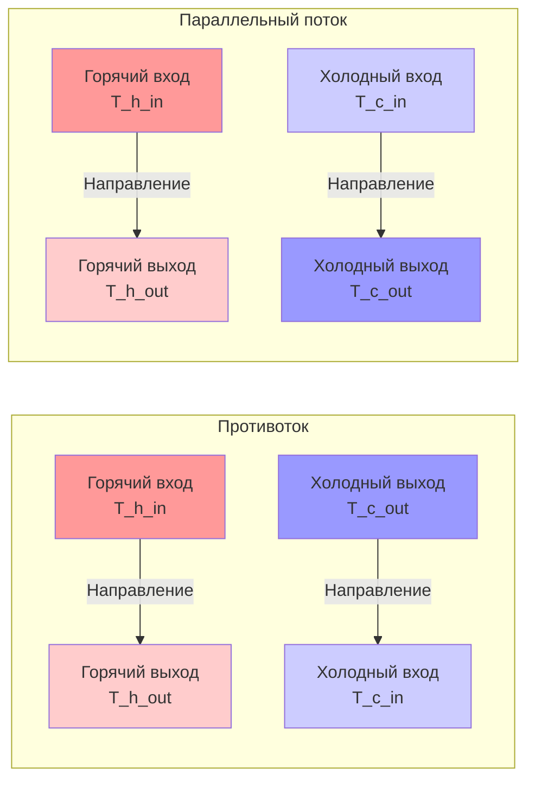
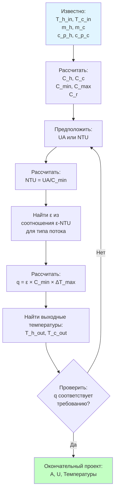
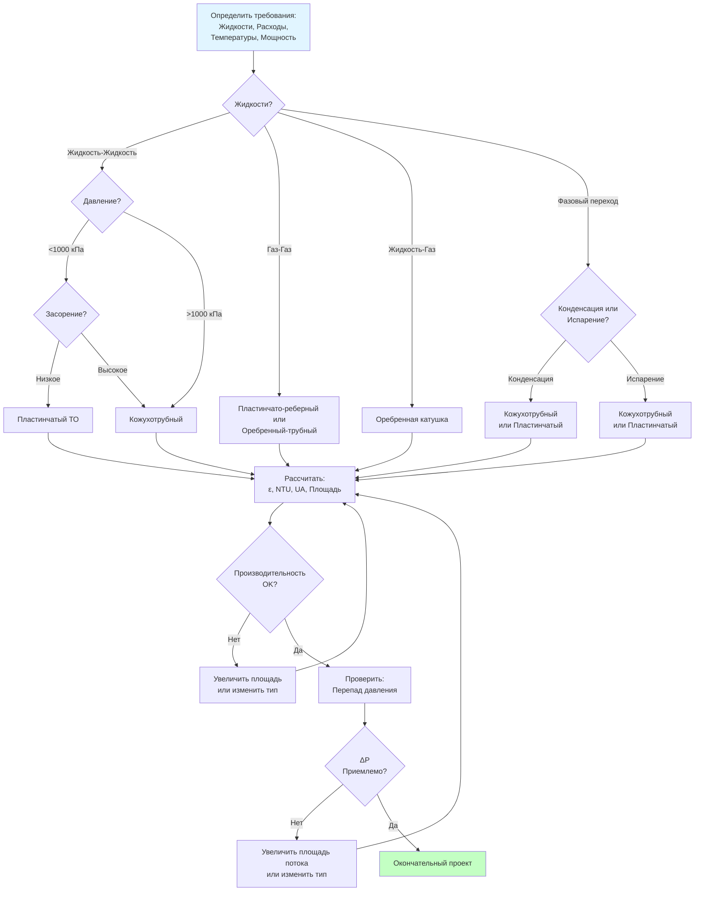
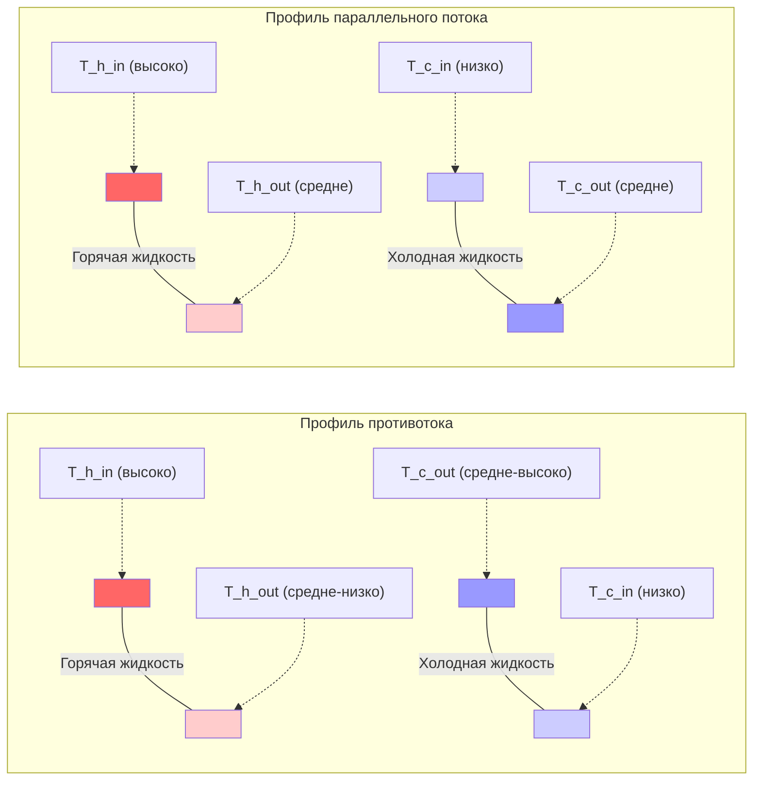

# Теплообменники в приложениях HVAC: проектирование, выбор и анализ производительности

Теплообменники передают тепловую энергию между потоками жидкости без смешивания, являясь основой оборудования HVAC, включая охлаждающие катушки, конденсаторы, испарители, котлы и системы рекуперации энергии. Данное руководство содержит математический аппарат, процедуры проектирования и методы анализа производительности для выбора размеров, расчета и оценки теплообменников в коммерческих и промышленных приложениях HVAC.

## Основы теплопередачи

### Три способа теплопередачи

Теплопередача через поверхности теплообменника включает три различных механизма, действующих одновременно.

**Теплопроводность через твердые стенки (закон Фурье):**

$$q = -k A \frac{dT}{dx}$$

Где:
- $q$ = тепловой поток (кДж/ч или Вт)
- $k$ = коэффициент теплопроводности (кДж/(ч·м·К) или Вт/(м·К))
- $A$ = площадь поперечного сечения (м²)
- $dT/dx$ = температурный градиент (К/м)

Для тонкостенных труб (типичная конструкция теплообменника):

$$q = \frac{2\pi k L (T_1 - T_2)}{\ln(r_o/r_i)}$$

Где:
- $L$ = длина трубы (м)
- $r_o$ = наружный радиус (м)
- $r_i$ = внутренний радиус (м)

**Конвекция на границах раздела жидкость-твердое тело (закон охлаждения Ньютона):**

$$q = h A (T_s - T_f)$$

Где:
- $h$ = коэффициент конвекции (кДж/(ч·м²·К) или Вт/(м²·К))
- $T_s$ = температура поверхности (К)
- $T_f$ = средняя температура жидкости (К)

**Излучение между поверхностями (незначительный фактор в большинстве теплообменников HVAC):**

$$q = \sigma \epsilon A (T_1^4 - T_2^4)$$

Где:
- $\sigma$ = постоянная Стефана-Больцмана = 5.67×10⁻⁸ Вт/(м²·К⁴)
- $\epsilon$ = коэффициент излучения (безразмерный, 0-1)

### Общий коэффициент теплопередачи

Теплопередача через стенки теплообменника объединяет конвекцию с обеих сторон и теплопроводность через стенку в последовательной тепловой сети:

$$\frac{1}{UA} = \frac{1}{h_i A_i} + \frac{r_o \ln(r_o/r_i)}{2\pi k L} + \frac{1}{h_o A_o}$$

Для тонкостенных труб, где $A_i \approx A_o \approx A$:

$$U = \frac{1}{\frac{1}{h_i} + \frac{t}{k} + \frac{1}{h_o}}$$

Где:
- $U$ = общий коэффициент теплопередачи (кДж/(ч·м²·К) или Вт/(м²·К))
- $t$ = толщина стенки (м)
- $h_i$ = коэффициент конвекции внутри
- $h_o$ = коэффициент конвекции снаружи

**Типичные значения U для теплообменников HVAC:**

| Тип теплообменника | Жидкости | U (Вт/(м²·К)) |
|---------------------|---------|--------------|
| Кожухотрубный (вода-вода) | Вода/вода | 850-1700 |
| Оребренная катушка | Воздух/вода | 28-85 |
| Оребренная катушка | Воздух/хладагент | 45-114 |
| Пластинчатый теплообменник | Вода/вода | 1100-2800 |
| Двустенный (гликоль/вода) | Гликоль/вода | 450-850 |
| Конденсирующий (пар) | Пар/вода | 1700-5700 |
| Испаряющий (хладагент) | Хладагент/вода | 850-2270 |

### Корреляции для расчета конвекции

Точный расчет коэффициента конвекции требует эмпирических зависимостей на основе безразмерных чисел.

**Число Рейнольдса (режим течения):**

$$Re = \frac{\rho V D}{\mu} = \frac{V D}{\nu}$$

Где:
- $\rho$ = плотность (кг/м³)
- $V$ = скорость (м/с)
- $D$ = характерный размер (м)
- $\mu$ = динамическая вязкость (Па·с)
- $\nu$ = кинематическая вязкость (м²/с)

**Число Прандтля (тепловая и динамическая диффузия):**

$$Pr = \frac{c_p \mu}{k} = \frac{\nu}{\alpha}$$

Где:
- $c_p$ = удельная теплоемкость (Дж/(кг·К))
- $\alpha$ = коэффициент температурной проводности (м²/с)

**Число Нуссельта (безразмерная теплопередача):**

$$Nu = \frac{h D}{k}$$

**Уравнение Диттуса-Бёльта (турбулентное течение в трубах, Re > 10000):**

$$Nu = 0.023 Re^{0.8} Pr^n$$

Где:
- $n = 0.4$ при нагреве (жидкость нагревается)
- $n = 0.3$ при охлаждении (жидкость охлаждается)

**Корреляция Сидера-Тейта (улучшенная точность с коррекцией вязкости):**

$$Nu = 0.027 Re^{0.8} Pr^{1/3} \left(\frac{\mu_b}{\mu_w}\right)^{0.14}$$

Где:
- $\mu_b$ = вязкость при средней температуре жидкости
- $\mu_w$ = вязкость при температуре стенки

**Ламинарное течение в трубах (Re < 2300):**

$$Nu = 3.66 \quad \text{(постоянная температура стенки)}$$
$$Nu = 4.36 \quad \text{(постоянный тепловой поток)}$$

### Пример расчета 1: Расчет коэффициента конвекции

**Дано:**
Вода течет по медной трубе при следующих условиях:
- Расход: 10 л/мин
- Внутренний диаметр трубы: 0.75 дюйма = 19.05 мм
- Температура воды: 15.6°C
- Свойства воды при 15.6°C:
  - Плотность: $\rho = 998$ кг/м³
  - Вязкость: $\mu = 1.12 \times 10^{-3}$ Па·с
  - Теплопроводность: $k = 0.588$ Вт/(м·К)
  - Удельная теплоемкость: $c_p = 4190$ Дж/(кг·К)

**Найти:** Коэффициент внутренней конвекции $h_i$

**Решение:**

Шаг 1: Расчет скорости течения.

$$V = \frac{Q}{A} = \frac{10 \text{ л/мин} \times 10^{-6} \text{ м}^3/\text{л}}{60 \text{ с} \times \pi (0.01905/2)^2}$$

$$V = \frac{0.0000167}{60 \times 2.847 \times 10^{-4}} = 0.975 \text{ м/с}$$

Шаг 2: Расчет числа Рейнольдса.

$$Re = \frac{\rho V D}{\mu} = \frac{998 \times 0.975 \times 0.01905}{1.12 \times 10^{-3}} = 16,880$$

Течение турбулентное (Re > 10000).

Шаг 3: Расчет числа Прандтля.

$$Pr = \frac{c_p \mu}{k} = \frac{4190 \times 1.12 \times 10^{-3}}{0.588} = 7.97 \approx 8.0$$

Шаг 4: Применение уравнения Диттуса-Бёльта (жидкость нагревается, n = 0.4).

$$Nu = 0.023 Re^{0.8} Pr^{0.4} = 0.023 \times (16,880)^{0.8} \times (8.0)^{0.4}$$

$$Nu = 0.023 \times 2455 \times 2.30 = 130$$

Шаг 5: Расчет коэффициента конвекции.

$$h_i = \frac{Nu \times k}{D} = \frac{130 \times 0.588}{0.01905} = 4020 \text{ Вт/(м}^2\text{·К)}$$

**Ответ:** $h_i = 4020$ Вт/(м²·К)

**Инженерная рекомендация:** Высокие коэффициенты конвекции для турбулентного течения воды (3000-5000 Вт/(м²·К)) делают внутреннее сопротивление малым. Конвекция со стороны воздуха (28-284 Вт/(м²·К)) обычно определяет общее тепловое сопротивление, требуя оребрения для увеличения площади со стороны воздуха.

## Метод логарифмической средней разности температур (LMTD)

Метод LMTD рассчитывает производительность теплообменника, когда известны входные и выходные температуры. Этот прямой подход подходит для задач оценки (проверка производительности существующего оборудования).

### Определение LMTD

Разность температур варьируется по длине теплообменника по мере обмена теплом между жидкостями. Логарифмическая средняя разность температур учитывает эту вариацию:

$$\Delta T_{lm} = \frac{\Delta T_1 - \Delta T_2}{\ln(\Delta T_1 / \Delta T_2)}$$

Где:
- $\Delta T_1$ = разность температур на одном конце
- $\Delta T_2$ = разность температур на другом конце

**Для противоточного расположения:**

$$\Delta T_1 = T_{h,in} - T_{c,out}$$
$$\Delta T_2 = T_{h,out} - T_{c,in}$$

**Для параллельного потока:**

$$\Delta T_1 = T_{h,in} - T_{c,in}$$
$$\Delta T_2 = T_{h,out} - T_{c,out}$$

### Уравнение теплопередачи

$$q = U A \Delta T_{lm}$$

Где:
- $q$ = тепловой поток (кДж/ч или Вт)
- $U$ = общий коэффициент теплопередачи (Вт/(м²·К))
- $A$ = площадь теплопередачи (м²)
- $\Delta T_{lm}$ = логарифмическая средняя разность температур (К)

### Энергетический баланс

Тепло, отданное горячей жидкостью, равно теплу, полученному холодной жидкостью (при пренебрежении потерями):

$$q = \dot{m}_h c_{p,h} (T_{h,in} - T_{h,out}) = \dot{m}_c c_{p,c} (T_{c,out} - T_{c,in})$$

Где:
- $\dot{m}$ = массовый расход (кг/с)
- $c_p$ = удельная теплоемкость (Дж/(кг·К))

**Тепловая емкость потока:**

$$C = \dot{m} c_p$$

Единицы: Вт/К

### Коэффициент коррекции LMTD для перекрестного потока и многопроходных конфигураций

Реальные теплообменники редко достигают чистого противотока. Коэффициенты коррекции учитывают конфигурацию потока:

$$q = U A F \Delta T_{lm,cf}$$

Где:
- $F$ = коэффициент коррекции LMTD (безразмерный, 0 < F ≤ 1.0)
- $\Delta T_{lm,cf}$ = LMTD для противоточной конфигурации

**Параметры коэффициента коррекции:**

$$P = \frac{T_{c,out} - T_{c,in}}{T_{h,in} - T_{c,in}} = \frac{\text{повышение температуры холодной жидкости}}{\text{максимальное возможное повышение температуры}}$$

$$R = \frac{T_{h,in} - T_{h,out}}{T_{c,out} - T_{c,in}} = \frac{C_c}{C_h} = \frac{\dot{m}_c c_{p,c}}{\dot{m}_h c_{p,h}}$$

**Типичные значения F:**
- Противоток: $F = 1.00$ (по определению)
- Параллельный поток: $F = 0.90$ до 0.98
- 1 проход со стороны кожуха, 2 прохода со стороны трубок: $F = 0.80$ до 0.95
- Перекрестный поток (оба потока не смешиваются): $F = 0.95$ до 0.99

Рекомендация по проектированию: выбирайте конфигурации с $F \geq 0.80$ для обеспечения разумного размера теплообменника.

### Пример расчета 2: Оценка теплообменника методом LMTD

**Дано:**
Противоточный теплообменник охлаждает смазочное масло с помощью охлаждающей воды:
- Температура входа масла: 82.2°C
- Температура выхода масла: 48.9°C
- Расход масла: 227 кг/ч
- Удельная теплоемкость масла: 2.1 кДж/(кг·К)
- Температура входа воды: 21.1°C
- Расход воды: 454 кг/ч
- Удельная теплоемкость воды: 4.19 кДж/(кг·К)
- Общий коэффициент теплопередачи: U = 454 Вт/(м²·К)
- Площадь теплопередачи: A = 2.32 м²

**Найти:**
1. Температура выхода воды
2. Тепловой поток
3. Проверка методом LMTD

**Решение:**

Шаг 1: Расчет теплового потока со стороны масла.

$$q = \dot{m}_{oil} c_{p,oil} (T_{oil,in} - T_{oil,out})$$

$$q = 227 \times 2.1 \times (82.2 - 48.9) = 227 \times 2.1 \times 33.3 = 15,883 \text{ Вт}$$

Шаг 2: Расчет температуры выхода воды из энергетического баланса.

$$q = \dot{m}_{water} c_{p,water} (T_{water,out} - T_{water,in})$$

$$15,883 = 454 \times 4.19 \times (T_{water,out} - 21.1)$$

$$15,883 = 1902.3 \times (T_{water,out} - 21.1)$$

$$T_{water,out} = 21.1 + \frac{15,883}{1902.3} = 21.1 + 8.35 = 29.45°C$$

Шаг 3: Расчет LMTD для противотока.

$$\Delta T_1 = T_{h,in} - T_{c,out} = 82.2 - 29.45 = 52.75 \text{ К}$$

$$\Delta T_2 = T_{h,out} - T_{c,in} = 48.9 - 21.1 = 27.8 \text{ К}$$

$$\Delta T_{lm} = \frac{52.75 - 27.8}{\ln(52.75/27.8)} = \frac{24.95}{0.625} = 39.9 \text{ К}$$

Шаг 4: Проверка теплового потока с использованием уравнения LMTD.

$$q_{calc} = U A \Delta T_{lm} = 454 \times 2.32 \times 39.9 = 41,900 \text{ Вт}$$

Расхождение: расчетный поток (41,900 Вт) существенно больше баланса энергии (15,883 Вт).

Это указывает на то, что заданный коэффициент U или площадь несовместимы с фактическими рабочими температурами. В реальном проектировании мы итерировали бы для поиска согласованных значений.

**Правильный подход - поиск требуемой площади:**

$$A_{required} = \frac{q}{U \Delta T_{lm}} = \frac{15,883}{454 \times 39.9} = 0.087 \text{ м}^2$$

**Ответ:**
- Температура выхода воды: 29.45°C
- Тепловой поток: 15,883 Вт
- Требуемая площадь: 0.087 м² (фактическая площадь 2.32 м² сильно завышена)

**Инженерная рекомендация:** Завышение размеров теплообменников на 200-400% обычно для запаса по засорению и работе при неполной нагрузке. Фактический LMTD при работе будет ниже расчетного, снижая теплопередачу в соответствии с нагрузкой.

## Метод эффективности-NTU (ε-NTU)

Метод ε-NTU решает задачи выбора размеров, когда известны входные температуры и расходы, но выходные температуры неизвестны. Этот подход подходит для задач проектирования (выбор размера теплообменника).

### Эффективность теплообменника

Эффективность представляет фактическую теплопередачу как долю максимально возможной термодинамической передачи:

$$\epsilon = \frac{q_{actual}}{q_{max}}$$

Максимальная теплопередача происходит, когда жидкость с минимальной тепловой емкостью претерпевает максимальное изменение температуры:

$$q_{max} = C_{min}(T_{h,in} - T_{c,in})$$

Где:

$$C_{min} = \min(C_h, C_c) = \min(\dot{m}_h c_{p,h}, \dot{m}_c c_{p,c})$$

**Фактическая теплопередача:**

$$q_{actual} = C_h(T_{h,in} - T_{h,out}) = C_c(T_{c,out} - T_{c,in})$$

### Число единиц переноса (NTU)

NTU представляет тепловой размер теплообменника относительно тепловой емкости жидкости:

$$NTU = \frac{UA}{C_{min}}$$

Физическая интерпретация: NTU измеряет способность теплообменника приближать температуру холодной жидкости к температуре входа горячей жидкости. Большее NTU означает:
- Большую площадь поверхности
- Более высокий коэффициент U
- Более низкий минимальный коэффициент тепловой емкости

### Коэффициент тепловой емкости

$$C_r = \frac{C_{min}}{C_{max}}$$

Где $0 \leq C_r \leq 1$

Частные случаи:
- $C_r = 0$: жидкость с фазовым переходом (кипение или конденсация)
- $C_r = 1$: сбалансированные тепловые емкости
- $C_r \to 0$: одна жидкость имеет значительно большую тепловую емкость

### Соотношения эффективности для конфигураций потока

**Противоток:**

$$\epsilon = \frac{1 - e^{-NTU(1-C_r)}}{1 - C_r e^{-NTU(1-C_r)}} \quad \text{при } C_r < 1$$

$$\epsilon = \frac{NTU}{1 + NTU} \quad \text{при } C_r = 1$$

**Параллельный поток:**

$$\epsilon = \frac{1 - e^{-NTU(1+C_r)}}{1 + C_r}$$

**Перекрестный поток (оба потока не смешиваются):**

$$\epsilon = 1 - \exp\left[\frac{NTU^{0.22}}{C_r}(e^{-C_r \cdot NTU^{0.78}} - 1)\right]$$

**Фазовый переход (конденсация или испарение, $C_r = 0$):**

$$\epsilon = 1 - e^{-NTU}$$

Все конфигурации достигают одного и того же предельного значения эффективности при NTU → ∞:

$$\epsilon_{max} = \begin{cases}
1.0 & C_r = 0 \\
\frac{C_r}{1+C_r} & C_r > 0, \text{ параллельный поток} \\
1.0 & \text{противоток}
\end{cases}$$

**Превосходство противотока:** Противоток достигает ε → 1.0 при любом $C_r$, в то время как максимальная эффективность параллельного потока снижается с увеличением $C_r$.

### Пример расчета 3: Выбор размера теплообменника методом ε-NTU

**Дано:**
Проектирование противоточного теплообменника для системы рекуперации энергии вентилятора:
- Вытяжной воздух: 943 м³/ч при 22.2°C
- Приточный воздух: 943 м³/ч при -9.4°C
- Плотность воздуха: $\rho = 1.2$ кг/м³
- Удельная теплоемкость воздуха: $c_p = 1.006$ кДж/(кг·К)
- Общий коэффициент теплопередачи: U = 68 Вт/(м²·К)
- Требуемая эффективность: ε = 0.70

**Найти:** Требуемая площадь теплопередачи

**Решение:**

Шаг 1: Преобразование объемного расхода в массовый расход.

$$\dot{m} = \rho \times \frac{Q}{3600} = 1.2 \times \frac{943}{3600} = 0.315 \text{ кг/с}$$

Шаг 2: Расчет коэффициентов тепловой емкости.

$$C_h = C_c = \dot{m} c_p = 0.315 \times 1.006 = 0.317 \text{ кВт/К}$$

$$C_{min} = C_{max} = 0.317 \text{ кВт/К}$$

$$C_r = \frac{C_{min}}{C_{max}} = 1.0$$

Шаг 3: Для противотока с $C_r = 1.0$, соотношение эффективности:

$$\epsilon = \frac{NTU}{1 + NTU}$$

Решение для NTU:

$$0.70 = \frac{NTU}{1 + NTU}$$

$$0.70(1 + NTU) = NTU$$

$$0.70 + 0.70 \cdot NTU = NTU$$

$$0.70 = 0.30 \cdot NTU$$

$$NTU = 2.33$$

Шаг 4: Расчет требуемой площади поверхности.

$$NTU = \frac{UA}{C_{min}}$$

$$A = \frac{NTU \times C_{min}}{U} = \frac{2.33 \times 317}{68} = 10.9 \text{ м}^2$$

Шаг 5: Проверка выходных температур.

Максимальная возможная теплопередача:

$$q_{max} = C_{min}(T_{h,in} - T_{c,in}) = 0.317 \times (22.2 - (-9.4)) = 10.03 \text{ кВт}$$

Фактическая теплопередача:

$$q = \epsilon \times q_{max} = 0.70 \times 10.03 = 7.02 \text{ кВт}$$

Температура выхода вытяжного воздуха:

$$T_{h,out} = T_{h,in} - \frac{q}{C_h} = 22.2 - \frac{7020}{317} = 22.2 - 22.1 = 0.1°C$$

Температура выхода приточного воздуха:

$$T_{c,out} = T_{c,in} + \frac{q}{C_c} = -9.4 + \frac{7020}{317} = -9.4 + 22.1 = 12.7°C$$

**Ответ:**
- Требуемая площадь теплопередачи: 10.9 м²
- Приточный воздух подогревается с -9.4°C до 12.7°C
- Вытяжной воздух охлаждается с 22.2°C до 0.1°C
- Рекуперация энергии: 7.02 кВт (2.0 кВт эквивалента охлаждения)

**Инженерная рекомендация:** Эта рекуперация с эффективностью 70% сокращает нагрузку отопления на 7.02 кВт. При 2500 градусо-днях отопления и КПД системы отопления 80%, годовая экономия энергии = 7.02 × 2500 × 24 / 0.80 = 0.529 МВт·ч/год. При цене 0.15 €/кВт·ч, годовая экономия = 79 €.

## Типы теплообменников для приложений HVAC

### Кожухотрубные теплообменники

Кожухотрубные конфигурации работают при высоких давлениях, больших мощностях и процессах с фазовым переходом. Приложения включают чиллеры, конденсаторы, пар-вода и горячие водогенераторы.

**Конструкция:**
- Трубки: прямые медные или стальные трубки, обычно диаметром 19-25 мм
- Кожух: стальной или медный кожух, содержащий пучок трубок
- Трубные решетки: толстые металлические пластины на концах трубок
- Перегородки: направляют поток со стороны кожуха через трубки, увеличивают турбулентность
- Проходы: несколько проходов трубок увеличивают скорость и теплопередачу

**Конфигурации потока:**
- 1 проход со стороны кожуха, 2 прохода со стороны трубок (наиболее распространено)
- 1 проход со стороны кожуха, 4 прохода со стороны трубок (высокая скорость на трубках)
- 2 прохода со стороны кожуха, 4 прохода со стороны трубок (ближе к противотоку)

**Параметры проектирования:**

Скорость на стороне трубок: 0.9-3.0 м/с (вода), предотвращает засорение и обеспечивает турбулентный поток

Скорость на стороне кожуха: 0.3-0.9 м/с, ограничена перепадом давления

Шаг трубок: 1.25 × наружный диаметр трубки (треугольный) или 1.25 × наружный диаметр трубки (квадратный), влияет на доступ для чистки

**Преимущества:**
- Высокая способность выдерживать давление (>2000 кПа)
- Большая мощность (>350 кВт охлаждения)
- Проверенная надежность
- Обслуживается в полевых условиях
- Обрабатывает загрязняющие жидкости

**Недостатки:**
- Большой физический размер
- Значительный вес
- Дорогостоящий
- Низкая эффективность (обычно 0.6-0.8)

**Перепад давления (сторона трубок, турбулентное течение):**

$$\Delta P = \left(f \frac{L}{D} + K\right) \frac{\rho V^2}{2}$$

Где:
- $f$ = коэффициент трения Дарси (безразмерный)
- $L$ = длина трубки (м)
- $D$ = внутренний диаметр трубки (м)
- $K$ = коэффициент потерь для фитингов и проходов (безразмерный)

Коэффициент трения (турбулентный, гладкие трубы):

$$f = \frac{0.316}{Re^{0.25}} \quad \text{при } Re < 20000$$

$$f = 0.184 Re^{-0.2} \quad \text{при } Re > 20000$$

### Пластинчатые теплообменники

Пластинчатые теплообменники используют тонкие гофрированные металлические пластины в раме, создавая чередующиеся каналы горячего и холодного потоков. Приложения включают гидравлическое отопление/охлаждение, горячее водоснабжение и рекуперацию энергии.

**Конструкция:**
- Пластины: тонкие пластины из нержавеющей стали, титана или медного припоя, толщиной 0.4-0.8 мм
- Уплотнения: эластомерные прокладки между пластинами (тип с прокладками) или припаянные соединения (припаянный тип)
- Рама: стальная рама сжимает стопку пластин
- Порты: угловые порты направляют поток через каналы

**Картина потока:** пластины создают сложный турбулентный поток с высокими коэффициентами теплопередачи

**Параметры проектирования:**

Расстояние между пластинами: 3-5 мм

Скорость потока в канале: 0.3-1.0 м/с (вода)

Скорость в портах: <0.9 м/с (предел эрозии)

**Преимущества:**
- Очень компактный (1/5 размера кожухотрубного)
- Высокая эффективность (0.85-0.95)
- Очень высокие коэффициенты U (1100-2800 Вт/(м²·К) для вода-вода)
- Легко расширяется (добавление пластин)
- Истинный противоток
- Низкое засорение (высокая турбулентность)

**Недостатки:**
- Ограничение по давлению (1000-2000 кПа в зависимости от типа)
- Ограничение по температуре (прокладки: <177°C, припаянный: <232°C)
- Требуется замена прокладок
- Подвержен засорению мусором между пластинами
- Более высокий перепад давления, чем кожухотрубный

**Оценка перепада давления:**

$$\Delta P = \frac{4fLG^2}{2\rho D_h} + 1.3 \times \frac{N_{channels}G^2}{2\rho}$$

Где:
- $G$ = массовый поток (кг/(ч·м²))
- $D_h$ = гидравлический диаметр (м)
- $N_{channels}$ = количество каналов
- Второй член учитывает потери в портах и распределении

### Оребренные катушки

Оребренные катушки передают тепло между воздухом и жидкостью, доминируя в приложениях HVAC со стороны воздуха. Приложения включают охлаждающие катушки, нагревательные катушки, конденсаторы и испарители.

**Конструкция:**
- Трубки: медные трубки, диаметром 9.5-16 мм
- Оребрение: алюминиевые ребра механически закреплены на трубках, 8-18 ребер на дюйм
- Циркуляция: трубки соединены последовательно-параллельно для требуемой скорости
- Фронтальная площадь: площадь лицевой стороны катушки, открытая для потока воздуха

**Типы ребер:**
- Плоские ребра: плоские алюминиевые пластины, наиболее распространены
- Гофрированные ребра: повышенная турбулентность
- Направленные ребра: вырезанные и согнутые направляющие улучшают теплопередачу
- Шпорные ребра: отдельные ребра на каждой трубке

**Параметры проектирования:**

Скорость в фасе: 1.5-3.0 м/с (охлаждение), 2.0-4.0 м/с (отопление)

Глубина в рядах: 3-8 рядов для охлаждения, 1-4 ряда для отопления

Расстояние между ребрами: 8-14 ребер/дюйм (охлаждение), 10-18 ребер/дюйм (отопление)

Скорость на трубке: 0.6-2.4 м/с (вода), 6-18 м/с (испарение хладагента)

**Теплопередача со стороны воздуха:**

Оребренные поверхности обеспечивают 10-20-кратное увеличение площади со стороны воздуха в сравнении с голыми трубками, компенсируя низкие коэффициенты конвекции со стороны воздуха.

Коэффициент общей площади поверхности:

$$\frac{A_{total}}{A_{tube,bare}} = 1 + \frac{A_{fin}}{A_{tube,bare}} \times \eta_{fin}$$

**Эффективность ребра:**

Ребра проводят тепло от основания к концу. Температура уменьшается по длине ребра, снижая эффективность.

$$\eta_{fin} = \frac{\tanh(mL)}{mL}$$

Где:

$$m = \sqrt{\frac{2h}{k t}}$$

- $h$ = коэффициент конвекции со стороны воздуха (Вт/(м²·К))
- $k$ = теплопроводность ребра (Вт/(м·К))
- $t$ = толщина ребра (м)
- $L$ = высота ребра от поверхности трубки до конца (м)

Типичная эффективность алюминиевого ребра: 0.70-0.85

**Общая эффективность поверхности:**

$$\eta_o = 1 - \frac{A_{fin}}{A_{total}}(1 - \eta_{fin})$$

**Преимущества:**
- Стандартное оборудование HVAC
- Низкая стоимость
- Широкий диапазон мощностей
- Обрабатывает влажную работу катушки (осушение)

**Недостатки:**
- Подвержена накоплению грязи на ребрах
- Перепад давления со стороны воздуха увеличивается с загрязнением
- Риск уноса конденсата при высоких скоростях в фасе
- Риск замерзания в холодном климате

**Перепад давления со стороны воздуха:**

$$\Delta P_{air} = \frac{K_{coil} \times (V_{face})^{1.9} \times rows}{1000} \text{ мм вод. ст.}$$

Приблизительно для чистых катушек с 10-12 ребрами/дюйм.

### Пластинчато-реберные теплообменники

Пластинчато-реберные теплообменники припаивают ребра между параллельными пластинами, создавая компактные высокопроизводительные теплообменники для газовых приложений. Приложения включают воздух-воздух рекуперацию энергии и криогенные системы.

**Конструкция:**
- Пластины: алюминиевые или стальные пластины образуют проходы потока
- Ребра: гофрированные, направленные или смещенные ребра припаяны к пластинам
- Заголовки: коллекторы распределяют поток к проходам
- Ядро: припаянная сборка создает монолитную структуру

**Конфигурация потока:** истинный противоток или перекрестный поток

**Параметры проектирования:**

Гидравлический диаметр: 1-4 мм (очень компактный)

Плотность ребер: 400-1000 ребер/м² фронтальной площади

Плотность площади поверхности: 700-4000 м²/м³ (чрезвычайно компактный)

**Преимущества:**
- Наибольшая плотность площади поверхности среди всех теплообменников
- Отличный для газовых приложений
- Легкий
- Высокая эффективность (>0.90)

**Недостатки:**
- Не может быть разобран для чистки
- Подвержен засорению
- Дорогостоящее производство
- Ограничено совместимыми материалами (припаиваемыми)

## Расчеты эффективности и производительности

### Предельные значения максимальной эффективности

Конфигурация потока и коэффициент тепловой емкости ограничивают достижимую эффективность:

| Конфигурация | $C_r = 0$ | $C_r = 0.5$ | $C_r = 1.0$ |
|--------------|-----------|-------------|-------------|
| Противоток | 1.00 | 1.00 | 1.00 |
| Параллельный поток | 1.00 | 0.67 | 0.50 |
| Перекрестный поток (не смешиваемый) | 1.00 | 0.90 | 0.75 |
| 1-2 кожухотрубный | 1.00 | 0.85 | 0.67 |

(Все значения при NTU → ∞)

**Следствия для проектирования:**
- Противоток всегда превосходит для приложений без фазового перехода
- Сбалансированные тепловые емкости ($C_r$ близко 1.0) наказывают не-противоточные расположения
- Фазовый переход ($C_r = 0$) исключает эффекты картины потока

### Температурная эффективность

Альтернативное определение эффективности на основе любой жидкости:

**Эффективность горячей жидкости:**

$$\epsilon_h = \frac{T_{h,in} - T_{h,out}}{T_{h,in} - T_{c,in}}$$

**Эффективность холодной жидкости:**

$$\epsilon_c = \frac{T_{c,out} - T_{c,in}}{T_{h,in} - T_{c,in}}$$

**Связь с общей эффективностью:**

$$\epsilon = \epsilon_h \times C_r \quad \text{если холодный поток является } C_{min}$$

$$\epsilon = \epsilon_c \times C_r \quad \text{если горячий поток является } C_{min}$$

### Оценка производительности

Производительность теплообменника зависит от чистоты, свойств жидкостей и расходов. Расчеты оценки прогнозируют производительность при нерасчетных условиях.

**Тепловое сопротивление засорения:** отложения на поверхностях теплопередачи снижают U-значение со временем

$$\frac{1}{U_{fouled}} = \frac{1}{U_{clean}} + R_{f,i} + R_{f,o}$$

Где:
- $R_f$ = тепловое сопротивление засорения (м²·К/Вт)
- Подстрочные индексы $i$ и $o$ обозначают внутренние и внешние поверхности

**Типичные тепловые сопротивления засорения (стандарты TEMA):**

| Жидкость | $R_f$ (м²·К/Вт) |
|----------|----------------|
| Обработанная питательная вода котла | 0.00009 |
| Городская вода (<52°C) | 0.00018 |
| Охлаждающая вода из градирни | 0.00035 |
| Речная вода | 0.0005-0.0009 |
| Морская вода | 0.00009-0.00018 |
| Жидкий хладагент | 0.00018 |
| Топливное масло | 0.0009 |
| Смазочное масло двигателя | 0.00018 |
| Пар (без масла) | 0.00009 |
| Воздух и промышленные газы | 0.00035 |

**Коэффициент засорения при проектировании:** добавить 15-30% к расчетной площади поверхности для учета засорения:

$$A_{design} = A_{clean} \times (1 + запас \: засорения)$$

Типичные запасы засорения:
- Чистые жидкости (обработанная вода, хладагенты): 15-20%
- Умеренное засорение (вода из градирни): 20-30%
- Значительное засорение (речная вода, воздух): 30-50%

## Коэффициенты засорения и техническое обслуживание

### Механизмы засорения

**Кристаллизационное засорение:** растворенные минералы осаждаются на поверхностях теплопередачи
- Причины: жесткая вода, карбонат кальция, сульфат кальция
- Местоположение: горячие поверхности (>60°C), испарители
- Профилактика: водоподготовка, поддержание скорости >0.9 м/с

**Засорение взвешенными частицами:** взвешенные частицы оседают и накапливаются
- Причины: грязь, песок, продукты коррозии
- Местоположение: области низкой скорости, сторона кожуха
- Профилактика: фильтрация, поддержание турбулентного потока

**Засорение химическими реакциями:** химические реакции производят отложения
- Причины: полимеризация, окисление, коррозия
- Местоположение: высокотемпературные поверхности
- Профилактика: ингибиторы коррозии, контроль pH

**Биологическое засорение:** рост микроорганизмов образует биопленку
- Причины: бактерии, водоросли, грибки
- Местоположение: системы охлаждающей воды из градирни, <60°C
- Профилактика: биоциды, УФ-обработка, поддержание скорости

**Засорение коррозией:** продукты коррозии накапливаются как отложения
- Причины: кислород, дисбаланс pH, гальваническая коррозия
- Местоположение: разнородные металлы, застойные области
- Профилактика: выбор материалов, ингибиторы коррозии

### Методы чистки

**Механическая чистка:**
- Чистка трубок щетками: ручная или пневматическая щетка проходит через трубки
- Высокомощный водяной струй: 20000-70000 кПа удаляет твердые отложения
- Пулевая чистка: пластиковые снаряды пропускаются через трубки
- Частота: ежегодно для систем охлаждающей воды из градирни

**Химическая чистка:**
- Кислотная чистка: растворяет минеральные отложения (соляная, сульфаминовая кислота)
- Щелочная чистка: удаляет органические отложения
- Удаление накипи: удаляет отложения жесткой воды
- Частота: каждые 3-5 лет или по мере необходимости

**Проектирование для очистки:**
- Съемные пучки трубок
- Прямые трубки (без U-образных для механической чистки)
- Квадратный шаг трубок (доступ к каналам чистки)
- Люки очистки и дверцы доступа
- Задвижки изоляции для снятия системы

### Мониторинг и деградация производительности

**Индикаторы производительности:**

$$U_{actual} = \frac{q}{A \Delta T_{lm}}$$

Сравните с расчетным U-значением. Деградация >20% указывает на засорение.

**Температурный подход:**

$$Approach = T_{cold,out} - T_{hot,out}$$

Увеличивающийся подход указывает на засорение.

**Увеличение перепада давления:** засорение увеличивает сопротивление потоку

$$\frac{\Delta P_{fouled}}{\Delta P_{clean}} > 1.2 \text{ указывает на засорение}$$

## Анализ перепада давления

### Общее уравнение перепада давления

$$\Delta P = \Delta P_{friction} + \Delta P_{acceleration} + \Delta P_{elevation}$$

Для горизонтального однофазного потока член повышения исключается.

**Перепад давления трения (внутренний поток):**

$$\Delta P_f = f \frac{L}{D} \frac{\rho V^2}{2}$$

**Коэффициент трения Дарси:**

Ламинарный поток (Re < 2300):

$$f = \frac{64}{Re}$$

Турбулентный поток, гладкие трубы (уравнение Блазиуса, Re < 100000):

$$f = \frac{0.316}{Re^{0.25}}$$

Турбулентный поток, шероховатые трубы (уравнение Коулбрука):

$$\frac{1}{\sqrt{f}} = -2.0 \log\left(\frac{\epsilon/D}{3.7} + \frac{2.51}{Re\sqrt{f}}\right)$$

Где $\epsilon$ = абсолютная шероховатость (м)

**Вторичные потери (фитинги, вход, выход):**

$$\Delta P_{minor} = K \frac{\rho V^2}{2}$$

Типичные значения K:
- 90° колено: K = 0.9
- 45° колено: K = 0.4
- Тройник (прямой проход): K = 0.6
- Тройник (боковой проход): K = 1.8
- Задвижка (открыта): K = 0.2
- Вход (острый): K = 0.5
- Выход: K = 1.0

### Перепад давления со стороны воздуха

**Перепад давления катушки:**

$$\Delta P_{coil} = K_{coil} \left(\frac{V_{face}}{0.5}\right)^{1.9} \times rows$$

Единицы: мм водяного столба

Где $V_{face}$ = скорость в фасе (м/с)

Типичные значения $K_{coil}$:
- 8 ребер/дюйм: $K_{coil}$ = 0.08
- 10 ребер/дюйм: $K_{coil}$ = 0.10
- 12 ребер/дюйм: $K_{coil}$ = 0.12
- 14 ребер/дюйм: $K_{coil}$ = 0.15

**Перепад давления системы воздуховодов:**

Общий перепад давления системы включает катушки, фильтры, заслонки, воздуховоды:

$$\Delta P_{total} = \Delta P_{coil} + \Delta P_{filter} + \Delta P_{duct} + \Delta P_{fittings}$$

Проектирование для общего перепада давления системы: 375-750 Па для типичных систем HVAC

### Перепад давления со стороны воды

**Перепад давления на стороне трубок:**

$$\Delta P_{tube} = \left(f \frac{L}{D} + 4N_{passes}\right) \frac{\rho V^2}{2}$$

Где:
- $4N_{passes}$ учитывает потери входа/выхода на каждый проход

**Пределы проектирования перепада давления:**
- Охлажденная вода: 3.0-6.0 м напора (30-60 кПа)
- Конденсаторная вода: 4.5-9.0 м напора (45-90 кПа)
- Горячая вода отопления: 3.0-7.5 м напора (30-75 кПа)

Более высокие перепады давления увеличивают энергию насоса:

$$P_{pump} = \frac{GPM \times \Delta P_{psi}}{1715 \times \eta_{pump}}$$

Единицы: киловатт

Где $\eta_{pump}$ = КПД насоса (типично 0.60-0.80)

### Пример расчета 4: Расчет перепада давления

**Дано:**
Вода течет через кожухотрубный теплообменник:
- Расход: 37.8 л/мин
- Внутренний диаметр трубки: 0.75 дюйма = 19.05 мм
- Длина трубки: 3.05 м
- Количество проходов: 2
- Количество трубок на проход: 20
- Температура воды: 15.6°C
- Свойства воды:
  - Плотность: $\rho = 998$ кг/м³
  - Вязкость: $\mu = 1.12 \times 10^{-3}$ Па·с

**Найти:** Перепад давления со стороны трубок

**Решение:**

Шаг 1: Расчет скорости в одной трубке.

Расход на проход:

$$Q_{pass} = \frac{37.8 \text{ л/мин}}{20 \text{ трубок}} = 1.89 \text{ л/мин}$$

$$V = \frac{Q}{A} = \frac{1.89 \times 10^{-6} / 60}{π (0.01905/2)^2} = 1.11 \text{ м/с}$$

Шаг 2: Расчет числа Рейнольдса.

$$Re = \frac{\rho V D}{\mu} = \frac{998 \times 1.11 \times 0.01905}{1.12 \times 10^{-3}} = 18,900$$

Течение турбулентное.

Шаг 3: Расчет коэффициента трения (гладкая труба).

$$f = \frac{0.316}{Re^{0.25}} = \frac{0.316}{(18,900)^{0.25}} = \frac{0.316}{11.7} = 0.0270$$

Шаг 4: Расчет перепада давления.

$$\Delta P = \left(f \frac{L}{D} + 4N_{passes}\right) \frac{\rho V^2}{2}$$

$$\Delta P = \left(0.0270 \times \frac{3.05}{0.01905} + 4 \times 2\right) \frac{998 \times (1.11)^2}{2}$$

$$\Delta P = (4.33 + 8) \times \frac{998 \times 1.23}{2}$$

$$\Delta P = 12.33 \times 613 = 7,560 \text{ Па} = 75.6 \text{ мм вод. ст.}$$

В кПа:

$$\Delta P = 7.56 \text{ кПа}$$

**Ответ:** Перепад давления со стороны трубок = 7.56 кПа = 0.75 м напора

**Инженерная рекомендация:** Этот перепад давления очень низкий и приемлем для большинства приложений HVAC. Входы/выходы (4 прохода) составляют 8/(4.33+8) = 65% от общего перепада давления. Увеличение скорости трубки до 1.8 м/с увеличило бы перепад давления в коэффициент $(1.8/1.11)^2 \approx 2.6$, до 1.96 кПа.

## Критерии выбора и определение размеров

### Блок-схема выбора

### Процедура проектирования

**Шаг 1: Определение требований**
- Тепловой поток (кДж/ч или кВт)
- Типы жидкостей и свойства
- Входные температуры
- Расходы или выходные температуры
- Пределы давления
- Коэффициенты засорения
- Ограничения по пространству

**Шаг 2: Расчет коэффициентов тепловой емкости**

$$C_h = \dot{m}_h c_{p,h}$$
$$C_c = \dot{m}_c c_{p,c}$$
$$C_{min} = \min(C_h, C_c)$$
$$C_r = C_{min}/C_{max}$$

**Шаг 3: Расчет требуемой эффективности**

$$\epsilon_{required} = \frac{q}{C_{min}(T_{h,in} - T_{c,in})}$$

**Шаг 4: Выбор конфигурации потока**
- Противоток для максимальной эффективности
- Перекрестный поток для приложений со стороны воздуха
- Многопроходный кожухотрубный для ограничений по пространству

**Шаг 5: Расчет требуемого NTU**

Используйте соотношение ε-NTU для выбранной конфигурации.

**Шаг 6: Оценка общего коэффициента теплопередачи**

На основе жидкостей и типа теплообменника (используйте таблицы в этом руководстве).

**Шаг 7: Расчет требуемой площади поверхности**

$$A = \frac{NTU \times C_{min}}{U_{clean}}$$

**Шаг 8: Добавление запаса по засорению**

$$A_{design} = A_{clean} \times (1.0 + запас \: засорения)$$

**Шаг 9: Расчет перепада давления**

Проверьте оба потока жидкостей против пределов давления.

**Шаг 10: Итерация, если необходимо**

Отрегулируйте U-значение, конфигурацию потока или тип теплообменника.

### Критерии оптимизации

**Экономическая оптимизация:**

Минимизируйте общую стоимость жизненного цикла = стоимость капитала + стоимость эксплуатации

$$Cost_{total} = Cost_{HX} + PV(Cost_{energy})$$

Где:
- $Cost_{HX}$ = стоимость покупки и установки теплообменника
- $PV(Cost_{energy})$ = текущая стоимость энергии насоса/вентилятора за жизненный цикл оборудования

Большие теплообменники (более высокая эффективность, меньший ΔT) снижают энергопотребление, но увеличивают первоначальную стоимость. Оптимум балансирует эти факторы.

**Оптимизация производительности:**

Максимизируйте эффективность при условиях:
- Ограничения перепада давления
- Ограничения размера
- Ограничения стоимости

Обычно достигается путем:
- Противоточной конфигурации
- Максимизации NTU (площадь поверхности)
- Минимизации $C_r$ (несбалансированный поток)

## Противоток vs Параллельный поток vs Перекрестный поток

### Профили температур

**Противоток:** горячая и холодная жидкости текут в противоположных направлениях

Профиль температуры:
- Максимальная теплопередача для заданного размера
- Наиболее тесный подход между выходными температурами
- Выход холодной жидкости может превышать выход горячей жидкости (если $C_c < C_h$)

**Параллельный поток:** горячая и холодная жидкости текут в одном направлении

Профиль температуры:
- Более низкая эффективность, чем противоток
- Выходы горячей и холодной жидкостей подходят к одинаковой температуре
- Выход холодной жидкости не может превышать выход горячей жидкости

**Перекрестный поток:** жидкости текут перпендикулярно

Профиль температуры:
- Эффективность между противотоком и параллельным потоком
- Зависит от того, смешиваются ли потоки или нет

### Сравнение эффективности

При одинаковом NTU и $C_r$:

$$\epsilon_{противоток} > \epsilon_{перекрестный} > \epsilon_{параллельный}$$

Пример: NTU = 2.0, $C_r$ = 0.75

| Конфигурация | Эффективность |
|--------------|---------------|
| Противоток | 0.70 |
| Перекрестный поток (оба не смешиваемые) | 0.65 |
| Параллельный поток | 0.55 |

### Рекомендации по применению

**Используйте противоток, когда:**
- Требуется максимальная эффективность
- Требуется тесный температурный подход
- Приложения рекуперации энергии
- Жидкостные теплообменники

**Используйте параллельный поток, когда:**
- Материалы чувствительны к температуре (ограничивают выход горячей жидкости)
- Экстренное охлаждение (быстрое начальное охлаждение)
- Редко указывается в современном HVAC

**Используйте перекрестный поток, когда:**
- Теплопередача жидкость-воздух (катушки)
- Требуется компактная упаковка
- Одна жидкость распределена по большой площади

## Практические примеры проектирования

### Пример расчета 5: Полное проектирование теплообменника

**Дано:**
Проектирование теплообменника для охлаждения 18.9 л/мин смазочного масла двигателя с использованием воды из градирни:
- Температура входа масла: 93.3°C
- Требуемая температура выхода масла: 60°C
- Температура входа охлаждающей воды: 29.4°C
- Максимальная температура выхода воды: 43.3°C
- Свойства масла:
  - Плотность: $\rho_o = 880$ кг/м³
  - Удельная теплоемкость: $c_{p,o} = 2.1$ кДж/(кг·К)
  - Вязкость: $\mu_o = 0.04$ Па·с
  - Теплопроводность: $k_o = 0.138$ Вт/(м·К)
- Свойства воды (при 36°C):
  - Плотность: $\rho_w = 994$ кг/м³
  - Удельная теплоемкость: $c_{p,w} = 4.18$ кДж/(кг·К)
  - Вязкость: $\mu_w = 6.95 \times 10^{-4}$ Па·с
  - Теплопроводность: $k_w = 0.63$ Вт/(м·К)

**Найти:** Полная спецификация теплообменника включая тип, размер и перепад давления

**Решение:**

Шаг 1: Расчет тепловой нагрузки.

$$\dot{m}_o = \rho_o \times Q = 880 \times \frac{18.9 \times 10^{-3}}{60} = 0.280 \text{ кг/с}$$

$$q = \dot{m}_o c_{p,o} (T_{o,in} - T_{o,out}) = 0.280 \times 2.1 \times (93.3 - 60.0)$$

$$q = 0.280 \times 2.1 \times 33.3 = 19.6 \text{ кВт}$$

Шаг 2: Расчет требуемого расхода воды.

$$\dot{m}_w = \frac{q}{c_p(T_{out} - T_{in})} = \frac{19.6}{4.18 \times (43.3 - 29.4)} = \frac{19.6}{57.1} = 0.343 \text{ кг/с}$$

$$Q_w = \frac{0.343}{994} \times 60 = 20.7 \text{ л/мин}$$

Проверка эмпирического правила: 1.0 л/мин воды на кВт охлаждения × 19.6 кВт = 19.6 л/мин (близко)

Шаг 3: Расчет коэффициентов тепловой емкости.

$$C_o = 0.280 \times 2.1 = 0.588 \text{ кВт/К}$$

$$C_w = 0.343 \times 4.18 = 1.434 \text{ кВт/К}$$

$$C_{min} = 0.588 \text{ кВт/К}$$ (сторона масла)

$$C_r = \frac{0.588}{1.434} = 0.410$$

Шаг 4: Расчет требуемой эффективности.

$$\epsilon = \frac{q}{C_{min}(T_{h,in} - T_{c,in})} = \frac{19.6}{0.588 \times (93.3 - 29.4)} = \frac{19.6}{37.7} = 0.520$$

Шаг 5: Выбор типа теплообменника.

Для жидкость-жидкость, умеренное засорение (вода из градирни), умеренное давление:
- Выберите пластинчатый теплообменник для компактности и высокого U-значения
- Конфигурация противотока

Шаг 6: Расчет требуемого NTU (противоток).

$$\epsilon = \frac{1 - e^{-NTU(1-C_r)}}{1 - C_r e^{-NTU(1-C_r)}}$$

Численное решение (пробный/ошибочный метод или ПО):

$$0.520 = \frac{1 - e^{-NTU(1-0.410)}}{1 - 0.410 \times e^{-NTU(1-0.410)}}$$

$$NTU \approx 1.15$$

Шаг 7: Оценка общего коэффициента теплопередачи.

Для пластинчатого теплообменника масло-вода: $U_{clean} \approx 680$ Вт/(м²·К)

С засорением: $R_{f,oil} = 0.001$ м²·К/Вт, $R_{f,water} = 0.002$ м²·К/Вт

$$\frac{1}{U_{design}} = \frac{1}{680} + 0.001 + 0.002 = 0.00147 + 0.003 = 0.00447$$

$$U_{design} = 224 \text{ Вт/(м}^2\text{·К)}$$

Шаг 8: Расчет требуемой площади теплопередачи.

$$A = \frac{NTU \times C_{min}}{U_{design}} = \frac{1.15 \times 588}{224} = 3.02 \text{ м}^2$$

Шаг 9: Выбор модели пластинчатого теплообменника.

Стандартный пластинчатый теплообменник с прокладками:
- 20 пластин (10 каналов на жидкость)
- Размер пластины: 0.5 м × 1.8 м = 0.9 м² на пластину
- Эффективная площадь: 20 × 0.9 = 18 м² одностороннее число
- Двусторонняя эффективная площадь (оба потока): 2.7 м² (близко к требуемым 3.02 м²)

Шаг 10: Проверка перепада давления (упрощенно).

Предполагаемый перепад давления пластинчатого теплообменника: 30-50 кПа обычно для этого применения.

Сторона масла: Приемлемо до 200 кПа (закачиваемая жидкость)
Сторона воды: Приемлемо до 200 кПа (вода из градирни)

**Ответ:**

Спецификация теплообменника:
- Тип: Пластинчатый теплообменник с прокладками, противоток
- Мощность: 19.6 кВт (5.6 кВт эквивалента охлаждения)
- Количество пластин: 20 (10 каналов каждой жидкости)
- Размер пластины: 0.5 м × 1.8 м
- Площадь теплопередачи: 2.7 м²
- Общий U-значение: 224 Вт/(м²·К) (с проектным засорением)
- Расход воды: 20.7 л/мин
- Расход масла: 18.9 л/мин
- Эффективность: 52.0%
- Выход воды: 43.3°C
- Выход масла: 60.0°C
- Предполагаемый перепад давления: 30-50 кПа обе стороны

**Инженерная рекомендация:** Эта умеренная эффективность (52%) требует NTU < 1.2, результирующая компактность теплообменника. Более высокая эффективность потребовала бы экспоненциально большей площади. Коэффициент засорения масло-стороны (0.001) и вода-стороны (0.002) снижают U-значение на 31%, требуя площади на 45% больше, чем чистые условия.

### Пример расчета 6: Проектирование оребренной охлаждающей катушки

**Дано:**
Проектирование охлаждающей катушки для приточной установки:
- Воздушный поток: 1885 м³/ч
- Входящий воздух: 26.7°C ТБ, 19.4°C ТШ
- Выходящий воздух: 13°C ТБ, 12.2°C ТШ (насыщенный)
- Входящая охлажденная вода: 6.7°C
- Максимальная выходящая вода: 13.3°C
- Площадь фаса катушки: 1.86 м²
- Скорость в фасе: 1885/1.86 = 1.013 м/с (низкая скорость для лаборатории)

**Найти:** Требуемая глубина катушки (рядов) и расход воды

**Решение:**

Шаг 1: Расчет теплового потока со стороны воздуха.

Из психрометрической диаграммы:
- Входящая энтальпия воздуха: $h_1 = 50.1$ кДж/кг
- Выходящая энтальпия воздуха: $h_2 = 33.2$ кДж/кг

Массовый расход воздуха:

$$\dot{m}_a = \rho \times \frac{Q}{3600} = 1.184 \times \frac{1885}{3600} = 0.618 \text{ кг/с}$$

Общее охлаждение:

$$q_{total} = \dot{m}_a (h_1 - h_2) = 0.618 \times (50.1 - 33.2) = 10.45 \text{ кВт}$$

$$q_{total} = 10.45 / 3.517 = 2.97 \text{ кВт эквивалента охлаждения}$$

Ощутимое охлаждение:

$$q_{sensible} = 1200 \times \frac{Q}{3600} \times (T_1 - T_2) = 1200 \times \frac{1885}{3600} \times (26.7 - 13)$$

$$q_{sensible} = 628 \times 13.7 = 8.61 \text{ кВт}$$

Скрытое охлаждение:

$$q_{latent} = q_{total} - q_{sensible} = 10.45 - 8.61 = 1.84 \text{ кВт}$$

SHR (коэффициент ощутимого тепла):

$$SHR = \frac{8.61}{10.45} = 0.824$$

Шаг 2: Расчет требуемого расхода воды.

$$\dot{m}_w = \frac{q_{total}}{c_p (T_{out} - T_{in})} = \frac{10.45}{4.18 \times (13.3 - 6.7)} = \frac{10.45}{27.4} = 0.381 \text{ кг/с}$$

$$L/\text{мин} = 0.381 \times 60 = 22.9 \text{ л/мин}$$

Эмпирическое правило: 1.4 л/мин на кВт охлаждения × 2.97 кВт = 4.2 л/мин (правило недостаточно; более точный расчет дает 22.9 л/мин)

Шаг 3: Оценка общего U-значения для охлаждающей катушки.

Для оребренной катушки влажной поверхностью (осушение):
- Ребра 3/8 дюйма алюминиевые, 12 ребер/дюйм
- Медные трубки
- Низкая скорость в фасе (1.0 м/с)

$U_{wet} \approx 142$ Вт/(м²·К) (эффективный, на основе смоченной площади поверхности)

Шаг 4: Расчет требуемой площади теплопередачи с использованием LMTD.

Средняя температура воды:

$$T_{w,avg} = \frac{6.7 + 13.3}{2} = 10.0°C$$

Для влажной катушки, используйте анализ на основе энтальпии. Упрощенный подход LMTD:

$$\Delta T_1 = T_{air,in} - T_{w,out} = 26.7 - 13.3 = 13.4 \text{ К}$$

$$\Delta T_2 = T_{air,out} - T_{w,in} = 13.0 - 6.7 = 6.3 \text{ К}$$

$$\Delta T_{lm} = \frac{13.4 - 6.3}{\ln(13.4/6.3)} = \frac{7.1}{0.759} = 9.35 \text{ К}$$

Требуемая площадь:

$$A = \frac{q_{total}}{U \times \Delta T_{lm}} = \frac{10450}{142 \times 9.35} = 7.88 \text{ м}^2$$

Это эффективная смоченная площадь поверхности.

Шаг 5: Расчет требуемой глубины катушки.

Площадь фаса = 1.86 м²

Для 3/8" трубок, 12 ребер/дюйм, типичная оребренная катушка:
- Площадь поверхности на ряд на м² фаса ≈ 42.5 м² полной поверхности / м² фаса

Требуемые рядов:

$$rows = \frac{7.88}{1.86 \times 42.5} = \frac{7.88}{79} = 0.10$$

Это кажется слишком маленьким. Давайте пересчитаем с более реалистичным подходом.

Фактически, для низкой скорости в фасе и влажной поверхности, используйте данные производителя:

Типичная охлаждающая катушка при 1.0 м/с скорости в фасе, 6.7°C входящая вода:
- 4 ряда: 3.5-4.5 кВт на 1 м² фаса
- Для требуемых 10.45 кВт: фаса требуемая = 10.45 / 4.0 = 2.6 м²

Или увеличить скорость в фасе до 2.0 м/с с фасой 1.86 м²...

**Пересмотренный расчет с 2.0 м/с скоростью в фасе:**

Производительность типичной 4-рядной катушки при 2.0 м/с:
- Примерно 8.5 кВт охлаждения при 6.7°C входящей воде
- Требуемые рядов: требуемых = требуется 10.45 кВт / 8.5 кВт на 4 рядов = 1.23 × 4 = 5 рядов рекомендуется

**Ответ:**

Рекомендуемая спецификация охлаждающей катушки:
- Площадь фаса: 1.86 м² (можно также использовать 2.5 м² для лучшей производительности)
- Скорость в фасе: 1.0-2.0 м/с (низкая до средней)
- Глубина катушки: 4-5 рядов
- Расстояние между ребрами: 12 ребер/дюйм
- Расход воды: 22.9 л/мин
- Соединения воды: G1" NPT
- Мощность: 10.45 кВт полной (8.61 кВт ощутимая, 1.84 кВт скрытая)
- Выходящий воздух: 13°C ТБ, насыщенный

**Инженерная рекомендация:** Теплопередача влажной катушки сложна из-за одновременной теплоты и массопередачи. Программное обеспечение выбора катушки производителя учитывает эффективность ребра, площадь смоченной поверхности, образование конденсата и перепад давления со стороны воздуха. Расчеты вручную дают приблизительные размеры; окончательный выбор требует данных производителя или подробное моделирование.

## Резюме

Проектирование теплообменников для приложений HVAC требует интеграции основ теплопередачи, анализа конфигурации потока и практических ограничений:

**Ключевые принципы:**
- Общий коэффициент теплопередачи $U$ объединяет конвекционные сопротивления и теплопроводность стенки в последовательной тепловой сети
- Метод LMTD подходит для задач оценки (известные температуры)
- Метод ε-NTU подходит для задач проектирования (неизвестные выходные температуры)
- Противоток максимизирует эффективность при любом коэффициенте тепловой емкости
- Засорение деградирует производительность со временем, требуя завышения размеров

**Выбор теплообменника:**
- Кожухотрубный: высокое давление, большая мощность, проверенная надежность
- Пластинчатый: компактный, высокая эффективность, жидкость-жидкость
- Оребренный: воздух-жидкость, стандартное оборудование HVAC
- Пластинчато-реберный: газ-газ, ультра-компактный

**Процедура проектирования:**
1. Определение тепловых требований и свойств жидкостей
2. Расчет коэффициентов тепловой емкости и требуемой эффективности
3. Выбор конфигурации потока и типа теплообменника
4. Определение NTU и площади поверхности с использованием соотношений ε-NTU
5. Добавление запаса засорения (15-50%)
6. Проверка ограничений перепада давления
7. Итерация до оптимизации производительности и стоимости

**Рассмотрения обслуживания:**
- Мониторинг деградации U-значения через температурные измерения
- Чистка при падении производительности >20% или увеличении перепада давления >20%
- Механическая чистка для трубок, химическая чистка для твердых отложений
- Проектирование доступности (съемные пучки, люки очистки)

Надлежащий выбор и определение размеров теплообменника обеспечивает энергоэффективное функционирование системы HVAC с приемлемой первоначальной стоимостью, стоимостью эксплуатации и требованиями обслуживания.

---

**Связанные технические руководства:**
- Основы теплопередачи
- Теплопередача ограждающих конструкций здания
- Механика жидкостей для HVAC
- Системы рекуперации энергии
- Производительность охлаждающей башни
- Анализ производительности чиллера

**Ссылки:**
- ASHRAE Handbook of Fundamentals, Глава 4: Heat Transfer
- Incropera, F.P., DeWitt, D.P., *Fundamentals of Heat and Mass Transfer*, 7-е издание
- Kays, W.M., London, A.L., *Compact Heat Exchangers*, 3-е издание
- Shah, R.K., Sekulic, D.P., *Fundamentals of Heat Exchanger Design*
- TEMA Standards, *Standards of the Tubular Exchanger Manufacturers Association*, 10-е издание
- ARI Standard 410: *Forced-Circulation Air-Cooling and Air-Heating Coils*
- Wang, S.K., *Handbook of Air Conditioning and Refrigeration*, 2-е издание
