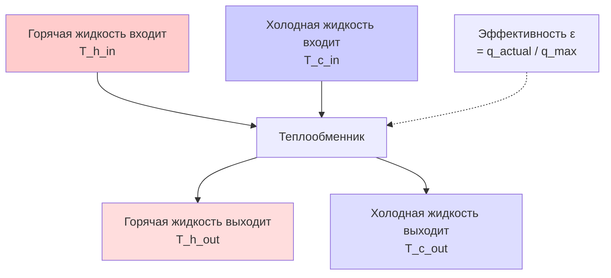

# Основы теплопередачи для инженеров HVAC

Теплопередача управляет обменом энергии во всех системах HVAC. Точное предсказание потока тепла через ограждающие конструкции зданий, поверхности теплообменников и потоки воздуха определяет производительность системы, потребление энергии и обеспечение комфорта. В этом руководстве представлена математическая база для расчётов кондукции, конвекции и радиации, необходимая для проектирования HVAC.

## Виды теплопередачи

Тепло передаётся через три различных физических механизма, каждый из которых описывается разными уравнениями и свойствами материалов.

### Кондукция (теплопроводность)

Кондукция тепла происходит через твёрдые материалы посредством столкновения молекул и переноса электронов. Закон Фурье количественно описывает стационарную кондукцию:

$$q = -k A \frac{dT}{dx}$$

Где:
- $q$ = скорость теплопередачи (кДж/ч или Вт)
- $k$ = коэффициент теплопроводности (кДж/(ч·м·K) или Вт/(м·K))
- $A$ = площадь поперечного сечения, перпендикулярного направлению теплопередачи (м²)
- $dT/dx$ = градиент температуры (K/м)

Для одномерной стационарной кондукции через плоскую стену с постоянными свойствами:

$$q = \frac{kA(T_1 - T_2)}{L}$$

Где:
- $T_1, T_2$ = температуры поверхностей (°C или K)
- $L$ = толщина стены (м)

**Тепловое сопротивление кондукции**:

$$R_{cond} = \frac{L}{kA}$$

Единицы: ч·K/кДж или K/Вт

### Конвекция

Конвекция передаёт тепло между твёрдой поверхностью и движущейся жидкостью (воздухом или водой). Закон охлаждения Ньютона описывает конвективную теплопередачу:

$$q = hA(T_s - T_\infty)$$

Где:
- $h$ = коэффициент теплопередачи конвекции (кДж/(ч·м²·K) или Вт/(м²·K))
- $T_s$ = температура поверхности (°C или K)
- $T_\infty$ = температура объёма жидкости (°C или K)

**Тепловое сопротивление конвекции**:

$$R_{conv} = \frac{1}{hA}$$

Коэффициент конвекции $h$ зависит от:
- Режима потока (ламинарный vs. турбулентный)
- Свойств жидкости (вязкость, теплопроводность, плотность)
- Геометрии поверхности
- Скорости потока

Типичные диапазоны коэффициентов конвекции для приложений HVAC:

| Применение | h (Вт/(м²·K)) |
|------------|---------------|
| Свободная конвекция, воздух | 3 - 11 |
| Принудительная конвекция, воздух (низкая скорость) | 11 - 57 |
| Принудительная конвекция, воздух (высокая скорость) | 57 - 570 |
| Свободная конвекция, вода | 113 - 570 |
| Принудительная конвекция, вода | 570 - 28,000 |
| Кипение воды | 2,800 - 57,000 |
| Конденсация пара | 5,700 - 113,000 |

### Радиация

Тепловая радиация передаёт энергию через электромагнитные волны без необходимости в среде. Закон Стефана-Больцмана управляет излучением абсолютно чёрного тела:

$$q = \sigma A T^4$$

Где:
- $\sigma$ = постоянная Стефана-Больцмана = 5,67×10⁻⁸ Вт/(м²·K⁴)
- $T$ = абсолютная температура (K)

Для реальных поверхностей (серых тел) с обменом радиацией:

$$q = \epsilon \sigma A (T_1^4 - T_2^4)$$

Где:
- $\epsilon$ = степень черноты (от 0 до 1, безразмерная)

Для линеаризованной радиации между поверхностями при близких температурах:

$$q = h_r A (T_1 - T_2)$$

Где коэффициент радиационной теплопередачи:

$$h_r = \epsilon \sigma (T_1 + T_2)(T_1^2 + T_2^2)$$

Типичные степени черноты:

| Поверхность | Степень черноты (ε) |
|------------|---------------------|
| Полированный алюминий | 0,05 - 0,10 |
| Окисленный алюминий | 0,20 - 0,30 |
| Оцинкованная сталь | 0,25 - 0,30 |
| Окрашенные поверхности | 0,85 - 0,95 |
| Кирпич, бетон | 0,85 - 0,95 |
| Стекло | 0,90 - 0,95 |
| Чёрная краска | 0,95 - 0,98 |

## Композитная теплопередача

Системы HVAC включают несколько видов теплопередачи в последовательном и параллельном расположении.

### Тепловые сопротивления в последовательности

Для теплопередачи через несколько слоёв (ограждающие конструкции здания, стенки теплообменника):

Полное тепловое сопротивление:

$$R_{total} = R_1 + R_2 + R_3 + ... + R_n = \sum_{i=1}^{n} R_i$$

Скорость теплопередачи:

$$q = \frac{\Delta T_{overall}}{R_{total}} = \frac{T_{in} - T_{out}}{R_{total}}$$

### Коэффициент общей теплопередачи (коэффициент U)

Коэффициент U представляет общую теплопроводность на единицу площади:

$$U = \frac{1}{R_{total} \cdot A} = \frac{1}{\frac{1}{h_i A} + \frac{L_1}{k_1 A} + \frac{L_2}{k_2 A} + ... + \frac{1}{h_o A}}$$

Упрощение для единичной площади ($A = 1$):

$$U = \frac{1}{\frac{1}{h_i} + \frac{L_1}{k_1} + \frac{L_2}{k_2} + ... + \frac{1}{h_o}}$$

Единицы: Вт/(м²·K)

Более низкие значения U указывают на лучшую изоляцию. Строительные коды указывают максимальные значения U для компонентов ограждения.

### Примеры расчёта 1: Расчёт коэффициента U стены

**Дано:**
Наружная стена коммерческого здания состоит из (изнутри наружу):
- Внутренний воздушный слой: $h_i = 8,2$ Вт/(м²·K)
- Гипсокартон 13 мм: $L_1 = 0,013$ м, $k_1 = 0,16$ Вт/(м·K)
- Теплоизоляция из стекловолокна 89 мм (R-13): $L_2 = 0,089$ м, $k_2 = 0,047$ Вт/(м·K)
- Фанера 13 мм: $L_3 = 0,013$ м, $k_3 = 0,12$ Вт/(м·K)
- Наружный воздушный слой: $h_o = 34$ Вт/(м²·K)

**Найти:** Общий коэффициент U

**Решение:**

Шаг 1: Рассчитать тепловое сопротивление каждого слоя.

$$R_i = \frac{1}{h_i} = \frac{1}{8,2} = 0,122 \text{ м²·K/Вт}$$

$$R_1 = \frac{L_1}{k_1} = \frac{0,013}{0,16} = 0,081 \text{ м²·K/Вт}$$

$$R_2 = \frac{L_2}{k_2} = \frac{0,089}{0,047} = 1,894 \text{ м²·K/Вт}$$

$$R_3 = \frac{L_3}{k_3} = \frac{0,013}{0,12} = 0,108 \text{ м²·K/Вт}$$

$$R_o = \frac{1}{h_o} = \frac{1}{34} = 0,029 \text{ м²·K/Вт}$$

Шаг 2: Суммировать сопротивления для нахождения полного теплового сопротивления.

$$R_{total} = R_i + R_1 + R_2 + R_3 + R_o$$
$$R_{total} = 0,122 + 0,081 + 1,894 + 0,108 + 0,029 = 2,234 \text{ м²·K/Вт}$$

Шаг 3: Рассчитать коэффициент U.

$$U = \frac{1}{R_{total}} = \frac{1}{2,234} = 0,448 \text{ Вт/(м²·K)}$$

**Ответ:** $U = 0,448$ Вт/(м²·K) или R-значение = 2,23 м²·K/Вт

**Инженерное замечание:** Данная конструкция стены соответствует требованиям большинства норм энергоэффективности коммерческих зданий с теплоизоляцией R-13 или лучше для наружных стен. Слой теплоизоляции (R₂ = 1,894) составляет 85% от полного теплового сопротивления, демонстрируя принцип, что сопротивление определяется материалами с наименьшей теплопроводностью. Удвоение толщины гипсокартона увеличило бы R_total только на 0,08, подчёркивая важность теплоизоляции.

## Эффективность теплообменника

Теплообменники передают тепловую энергию между двумя потоками жидкостей без их смешивания. Эффективность ($\epsilon$) количественно выражает фактическую теплопередачу относительно максимально возможной передачи.

### Энергетический баланс теплообменника

Для противоточного или параллельно-точного теплообменника:

$$q = \dot{m}_h c_{p,h} (T_{h,in} - T_{h,out}) = \dot{m}_c c_{p,c} (T_{c,out} - T_{c,in})$$

Где:
- $\dot{m}$ = массовый расход (кг/с)
- $c_p$ = удельная теплоёмкость (кДж/(кг·K))
- Индексы $h$ и $c$ обозначают горячий и холодный потоки

### Метод эффективности-NTU

Эффективность теплообменника:

$$\epsilon = \frac{q_{actual}}{q_{max}}$$

Где $q_{max} = C_{min}(T_{h,in} - T_{c,in})$

Тепловая ёмкость потока:

$$C = \dot{m} c_p$$

Минимальная тепловая ёмкость потока:

$$C_{min} = \min(C_h, C_c)$$

Коэффициент теплоёмкости:

$$C_r = \frac{C_{min}}{C_{max}}$$

Количество передачи единиц (NTU):

$$NTU = \frac{UA}{C_{min}}$$

Где:
- $U$ = коэффициент общей теплопередачи
- $A$ = площадь поверхности теплопередачи

Для противоточных теплообменников:

$$\epsilon = \frac{1 - e^{-NTU(1-C_r)}}{1 - C_r \cdot e^{-NTU(1-C_r)}} \quad \text{при } C_r < 1$$

$$\epsilon = \frac{NTU}{1 + NTU} \quad \text{при } C_r = 1$$

### Примеры расчёта 2: Эффективность теплообменника

**Дано:**
Противоточный воздушный теплообменник в рекуператоре энергии:
- Вытяжной воздух: $\dot{m}_h = 1700$ м³/ч (тысяч CFM) при входе 22°C
- Наружный воздух: $\dot{m}_c = 1700$ м³/ч при входе -12°C
- Измеренная температура вытяжного воздуха на выходе: -1°C
- Плотность воздуха: $\rho = 1,2$ кг/м³
- Удельная теплоёмкость воздуха: $c_p = 1,0$ кДж/(кг·K)

**Найти:** Эффективность теплообменника

**Решение:**

Шаг 1: Преобразовать объёмный расход в массовый расход.

$$\dot{m} = \rho \times \text{м³/ч} = 1,2 \times 1700 = 2040 \text{ кг/ч} = 0,567 \text{ кг/с}$$

Шаг 2: Рассчитать тепловые ёмкости потоков.

$$C_h = C_c = \dot{m} c_p = 0,567 \times 1,0 = 0,567 \text{ кДж/(K·с)} = 567 \text{ кДж/(K·ч)}$$

Так как $C_h = C_c$, то $C_r = 1$ и $C_{min} = 0,567$ кДж/(K·с)

Шаг 3: Рассчитать фактическую теплопередачу из горячего потока.

$$q_{actual} = \dot{m}_h c_p (T_{h,in} - T_{h,out}) = 0,567 \times 1,0 \times (22 - (-1))$$
$$q_{actual} = 13,0 \text{ кВт}$$

Шаг 4: Рассчитать максимально возможную теплопередачу.

$$q_{max} = C_{min}(T_{h,in} - T_{c,in}) = 0,567 \times (22 - (-12)) = 19,3 \text{ кВт}$$

Шаг 5: Рассчитать эффективность.

$$\epsilon = \frac{q_{actual}}{q_{max}} = \frac{13,0}{19,3} = 0,673 = 67,3\%$$

**Ответ:** Эффективность теплообменника = 67,3%

**Инженерное замечание:** Эта эффективность типична для пластинчатых теплообменников типов энергетических рекуператоров вентиляции. Температура холодного воздуха на выходе может быть рассчитана из энергетического баланса: $T_{c,out} = T_{c,in} + q_{actual}/C_c = -12 + 23 = 11$°C, что представляет предпрогрев наружного воздуха на 23°C. Это снижает нагрузку отопления на 13,0 кВт (примерно 3,7 кВт эквивалента теплоотдачи сэкономлено).

## Теплопроводность распространённых материалов

| Материал | Коэффициент теплопроводности k | Типичное применение |
|----------|--------------------------------|---------------------|
|  | **Вт/(м·K)** |  |
| **Металлы** |
| Медь | 386 | Трубки теплообменника |
| Алюминий | 221 | Оребрение теплообменника |
| Сталь | 47 | Воздуховоды, конструкции |
| Нержавеющая сталь | 15 | Санитарные трубопроводы |
| **Теплоизоляция** |
| Стекловолокно (плита) | 0,047 | Изоляция стен/потолков |
| Жёсткий пенопласт (полиизоцианурат) | 0,024 | Кровельная изоляция |
| Напыляемая пена (закрытоячеистая) | 0,028 | Герметизация воздуха |
| Минеральная вата | 0,043 | Огнестойкая изоляция |
| **Строительные материалы** |
| Бетон (нормальный вес) | 1,56 | Конструкции, тепловая инерция |
| Кирпич | 0,69 | Внешняя облицовка |
| Гипсокартон | 0,16 | Внутренние перегородки |
| Фанера | 0,12 | Обшивка |
| **Газы** |
| Воздух (неподвижный) | 0,026 | Воздушные зазоры, полости |
| Аргон (герметичное остекление) | 0,017 | Заполнение окон с низкой эмиссией |

## Практические приложения

### Проектирование ограждающей конструкции здания

1. **Соответствие коэффициента U**: Рассчитать композитные коэффициенты U для соответствия нормативам (ASHRAE 90.1, IECC)
2. **Тепловые мосты**: Учесть шпильки, балки и крепежи, обходящие изоляцию
3. **Производительность окон**: Оценить коэффициенты U по рейтингам NFRC и SHGC для выбора остекления
4. **Кровельная изоляция**: Определить размер жёсткой изоляции для соответствия требованиям климатической зоны

### Определение размеров оборудования HVAC

1. **Потери/приход тепла**: Применить коэффициенты U к площадям ограждения для расчётов нагрузок
2. **Потери тепла в воздуховодах**: Рассчитать потери/приход тепла через неизолированные или изолированные участки воздуховодов
3. **Потери тепла в трубопроводах**: Определить размер изоляции трубопроводов для ограничения потерь тепла в распределительных системах горячего водоснабжения
4. **Выбор теплообменника**: Использовать рейтинги эффективности для оценки оборудования утилизации энергии

### Анализ производительности системы

1. **Теплообменник печи**: Коэффициенты конвекции на сторонах газов сгорания и воздуха
2. **Охлаждающий змеевик**: Комбинированная конвекция и конденсация на поверхностях испарителя
3. **Потери в дымоходе котла**: Кондукция через огнеупорные материалы и металлические поверхности
4. **Излучение от излучающих панелей**: Радиация и конвекция от напольных/потолочных поверхностей

## Типичные ошибки проектирования

- **Игнорирование воздушных слоёв**: Сопротивления конвекции на поверхностях составляют 10-30% от общего R-значения
- **Использование коэффициентов U центра стекла**: Рамы и краевые эффекты увеличивают коэффициенты U окна на 20-50%
- **Пренебрежение тепловыми мостами**: Стальные шпильки могут снизить номинальное R-значение стены на 50%
- **Чрезмерное упрощение радиации**: Линеаризованные уравнения радиации точны только при малых разностях температур
- **Путаница между R-значением и коэффициентом U**: R-значение — это сопротивление (выше лучше), коэффициент U — это теплопроводность (ниже лучше)

## Резюме

Анализ теплопередачи является основой для всего проектирования систем HVAC:

- **Кондукция** через твёрдые тела следует закону Фурье: $q = kA(T_1 - T_2)/L$
- **Конвекция** между поверхностями и жидкостями следует закону Ньютона: $q = hA(T_s - T_\infty)$
- **Радиация** между поверхностями следует закону Стефана-Больцмана: $q = \epsilon \sigma A (T_1^4 - T_2^4)$
- **Композитная теплопередача** использует сетевые модели последовательного/параллельного теплового сопротивления
- **Коэффициенты U** количественно выражают общую теплопередачу через конструкции зданий (ниже лучше)
- **Эффективность теплообменника** измеряет эффективность утилизации энергии методом ε-NTU

Точные расчёты теплопередачи обеспечивают надлежащий выбор оборудования, соответствие нормам энергетической эффективности и проектирование энергоэффективных систем.

---

**Связанные технические руководства:**
- Психрометрические основы
- Расчёты нагрузок отопления
- Расчёты нагрузок охлаждения
- Теплопередача ограждающей конструкции здания

**Ссылки:**
- ASHRAE Handbook of Fundamentals, Глава 4: Теплопередача
- ASHRAE Handbook of Fundamentals, Глава 26: Контроль тепла, воздуха и влаги в строительных конструкциях
- Incropera, F.P., DeWitt, D.P., Fundamentals of Heat and Mass Transfer, 7-е издание
- ASHRAE Standard 90.1: Энергетический стандарт для зданий, кроме малоэтажных жилых зданий
