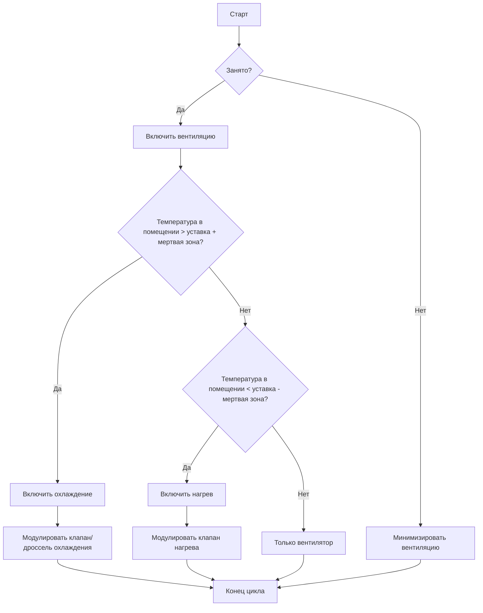
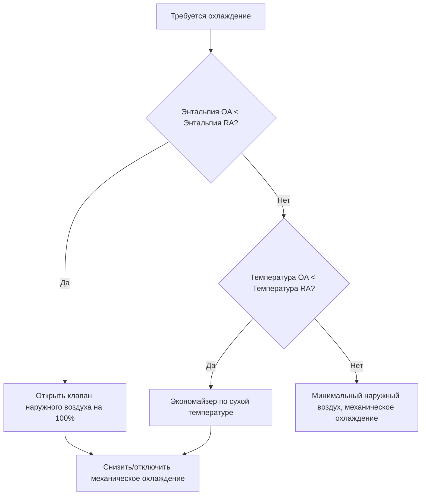

# Стратегии управления HVAC для инженеров

Системы управления HVAC регулируют температуру, влажность, давление и качество воздуха в помещении путем модуляции мощности оборудования. Правильный выбор и настройка стратегии управления обеспечивают комфорт, энергоэффективность и долговечность оборудования.

## Теория управления PID

**Пропорционально-интегрально-дифференциальный (PID) регулятор:**

$$u(t) = K_p e(t) + K_i \int_0^t e(\tau) d\tau + K_d \frac{de(t)}{dt}$$

Где:
- $u(t)$ = управляющий выход (0-100%)
- $e(t)$ = ошибка (уставка - измеренное значение)
- $K_p$ = пропорциональный коэффициент усиления
- $K_i$ = интегральный коэффициент усиления
- $K_d$ = дифференциальный коэффициент усиления

### Пропорциональное управление

**Выход:**

$$u = K_p \times e$$

**Характеристики:**
- Быстрый отклик
- Ошибка смещения (не достигает уставки точно)
- Слишком высокий коэффициент усиления: колебания
- Слишком низкий коэффициент усиления: медленный отклик

**Типичные применения:** Управление температурой подаваемого воздуха

### Интегральное управление

**Устраняет смещение** путем интегрирования ошибки во времени

**Характеристики:**
- Устраняет ошибку установившегося режима
- Медленный отклик
- Может вызвать нестабильность при слишком высоком коэффициенте усиления

**Типичные применения:** Управление температурой в помещении

### Дифференциальное управление

**Предвосхищает будущую ошибку** на основе скорости изменения

**Характеристики:**
- Улучшает стабильность
- Снижает перерегулирование
- Чувствительно к шуму

**Редко используется отдельно** в HVAC из-за шума датчиков

## Настройка управления

**Метод Циглера-Николса:**

1. Установить $K_i = 0$, $K_d = 0$
2. Увеличивать $K_p$ до возникновения устойчивых колебаний
3. Записать предельное усиление $K_u$ и период $P_u$
4. Рассчитать параметры PID:

$$K_p = 0.6 K_u$$
$$K_i = \frac{1.2 K_u}{P_u}$$
$$K_d = 0.075 K_u P_u$$

**Практическая настройка:**
- Начать с управления только по P
- Добавить I для устранения смещения
- Добавить D только при необходимости для стабильности

## Графики пересчета (Reset Schedules)

**Пересчет по температуре наружного воздуха:**

$$T_{supply} = T_{design} - m \times (T_{OA} - T_{design,OA})$$

Где $m$ = коэффициент пересчета (обычно 0.5-1.0)

<h3>Пример 1: Пересчет температуры подаваемого воздуха</h3>

**Дано:**
- Расчетная температура наружного воздуха: 35°C
- Расчетная температура подаваемого воздуха: 13°C
- Текущая температура наружного воздуха: 21°C
- Коэффициент пересчета: 0.8

**Найти:** Уставка температуры подаваемого воздуха

**Решение:**

$$T_{supply} = 13 - 0.8 \times (21 - 35) = 13 - 0.8 \times (-14) = 13 + 11.2 = 24.2°C$$

**Ответ:** Температура подаваемого воздуха пересчитывается до 24.2°C, что снижает энергопотребление на охлаждение в мягких условиях.

**Типичные графики пересчета:**
- Температура подаваемой холодной воды vs. температура наружного воздуха
- Температура подаваемой горячей воды vs. температура наружного воздуха
- Статическое давление в воздуховоде vs. положение клапана VAV
- Температура подаваемого воздуха vs. нагрузка в помещении

## Последовательности операций

**Последовательность для однозонного VAV:**

1. **Минимальный расход воздуха:** Поддержание требования по наружному воздуху
2. **Охлаждение:** Увеличение расхода воздуха до максимума перед включением механического охлаждения
3. **Нагрев:** Снижение расхода воздуха до минимума, затем включение догрева

**Последовательность для двухканальной системы:**

1. **Охлаждение:** Клапан горячего канала закрыт, клапан холодного канала модулируется
2. **Мертвая зона:** Оба клапана в минимальном положении
3. **Нагрев:** Клапан холодного канала закрыт, клапан горячего канала модулируется

## Продвинутые стратегии управления

### Оптимальный старт/остановка

**Предсказывает время запуска оборудования** для достижения уставки к началу рабочего дня

**Расчет времени запуска:**

$$t_{start} = t_{occupancy} - \frac{T_{setpoint} - T_{current}}{R}$$

Где $R$ = скорость прогрева/охлаждения здания (°C/час)

**Экономия энергии:** Снижение времени работы на 10-30%

### Вентиляция по требованию (DCV)

**Модулирует подачу наружного воздуха** в зависимости от occupancy (датчики CO₂)

**Расчет наружного воздуха:**

$$OA_{CFM} = \frac{(C_{space} - C_{outdoor}) \times OA_{people}}{C_{limit} - C_{outdoor}}$$

Где:
- $C_{space}$ = концентрация CO₂ в помещении (ppm)
- $C_{outdoor}$ = концентрация CO₂ на улице (~400 ppm)
- $C_{limit}$ = расчетный предел CO₂ (обычно 1000 ppm)
- $OA_{people}$ = наружный воздух на человека (CFM/человек (м³/ч))

### Управление экономайзером

**Экономайзер по сухой температуре:** Сравнение температуры наружного и возвратного воздуха

**Экономайзер по энтальпии:** Сравнение энтальпии наружного и возвратного воздуха (учитывает влажность)

### Каскадное управление

**Главный контроллер** задает уставку для **подчиненного контроллера**

**Пример:** Давление в воздуховоде (главный) управляет скоростью вентилятора (подчиненный)

**Преимущества:**
- Повышенная стабильность
- Быстрая реакция
- Улучшенное подавление возмущений

## Практическое применение

1. **Настройка:** Использовать заводские настройки по умолчанию в качестве отправной точки, затем тонкая настройка на основе производительности
2. **Мертвые зоны:** Мертвая зона 1.1–2.2°C снижает частоту циклирования и энергопотребление
3. **Размещение датчиков:** Избегать прямого солнечного света, сквозняков и источников тепла
4. **Пусконаладка:** Проверить соответствие последовательностей работы проектным требованиям

---

**Связанные технические руководства:**
- Проектирование систем с переменным расходом
- Управление подпорным давлением в здании
- Процедуры пусконаладки

**Ссылки:**
- Справочник ASHRAE по применению HVAC, Глава 47: Проектирование и применение систем управления
- Руководство ASHRAE 13: Спецификация систем автоматизации зданий
- Руководство ASHRAE 36: Высокоэффективные последовательности работы для систем HVAC
