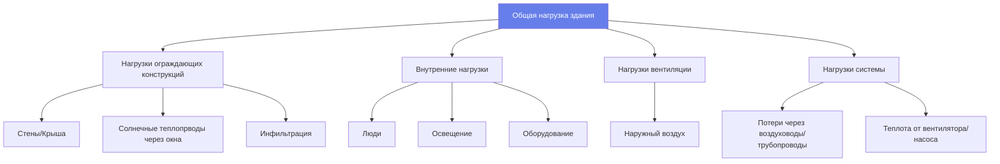

# Методология расчета тепловых нагрузок для инженеров HVAC

Точные расчеты тепловых нагрузок определяют требуемую производительность системы HVAC. Недостаточная мощность вызывает дискомфорт и проблемы с влажностью; избыточная мощность увеличивает первоначальные затраты, снижает эффективность и вызывает короткие циклы. В этом руководстве представлена утвержденная ASHRAE методология расчета расчетных тепловых нагрузок отопления и охлаждения.

## Основы расчета нагрузок

### Расчетные условия

**Условия наружного воздуха (ASHRAE Handbook):**
- **Отопление:** температура сухого термометра 99,6% или 99% (самая холодная температура, превышаемая 99,6% или 99% часов в год)
- **Охлаждение:** 0,4%, 1% или 2% сухого термометра и средней совпадающей температуры по влажному термометру

**Условия внутреннего воздуха (ASHRAE Standard 55):**
- **Зима:** 20-22°C, 30-50% ОВ
- **Лето:** 23-26°C, 40-60% ОВ

**Пример:** Чикаго, штат Иллинойс
- Отопление 99,6%: -21°C
- Охлаждение 0,4%: 34°C DB / 24°C МСВ

### Компоненты нагрузки

## Расчет тепловой нагрузки отопления

**Общая тепловая нагрузка отопления:**

$$q_h = q_{transmission} + q_{infiltration} + q_{ventilation}$$

### Потери через передачу тепла

$$q_{trans} = U \times A \times (T_{in} - T_{out})$$

Где:
- $U$ = общий коэффициент теплопередачи (Вт/(м²·K))
- $A$ = площадь поверхности (м²)
- $T_{in}$ = расчетная внутренняя температура (°C)
- $T_{out}$ = расчетная наружная температура (°C)

**Теплопотери ниже уровня земли** (подвальные стены/полы):
Используйте методы F-фактора или C-фактора из ASHRAE Chapter 18.

### Нагрузка на инфильтрацию

$$q_{inf} = 1.20 \times V_{inf} \times (T_{in} - T_{out})$$

Где $V_{inf}$ (в м³/ч) определяется из:
- **Теста дверью вентилятора:** $CFM_{50}$ преобразуется в естественную инфильтрацию
- **Метод трещин:** утечка воздуха через трещины в ограждающих конструкциях здания
- **Количество воздухообменов в час:** консервативная оценка (0,35-1,0 ACH)

**Типичные скорости инфильтрации:**
- Плотная конструкция: 0,15-0,25 ACH
- Средняя конструкция: 0,35-0,60 ACH
- Рыхлая конструкция: 0,60-1,00 ACH

### Нагрузка на вентиляцию

$$q_{vent} = 1.20 \times V_{OA} \times (T_{in} - T_{out})$$

Где $V_{OA}$ (в м³/ч) в соответствии со стандартом ASHRAE 62.1 или 62.2.

## Расчет охлаждающей нагрузки

**Общая охлаждающая нагрузка:**

$$q_c = q_{envelope} + q_{internal} + q_{ventilation} + q_{system}$$

### Теплопрвод в сравнении с охлаждающей нагрузкой

**Теплопрвод:** мгновенная скорость передачи тепла в помещение
**Охлаждающая нагрузка:** скорость, с которой тепло должно быть удалено для поддержания температуры

**Эффект запаздывания:** тепловая масса задерживает преобразование радиационного теплопрвода в охлаждающую нагрузку.

### Солнечный теплопрвод через окна

$$q_{solar} = A \times SHGC \times SHGF \times CLF$$

Где:
- $A$ = площадь окна (м²)
- $SHGC$ = коэффициент теплопрвода солнечной радиации (безразмерный, 0-1)
- $SHGF$ = коэффициент теплопрвода солнечной радиации из таблиц (Вт/м²)
- $CLF$ = коэффициент охлаждающей нагрузки учитывает тепловую массу

**Значения SHGC:**
- Одиночный прозрачный: 0,86
- Двойной прозрачный: 0,76
- Двойной low-E: 0,40-0,70
- Тройной low-E: 0,25-0,40

### Теплопроводность через ограждающие конструкции

$$q_{cond} = U \times A \times CLTD$$

Где CLTD = разность температур охлаждающей нагрузки учитывает:
- Эквивалентную солнечную температуру (эффект солнечной радиации)
- Накопление тепловой массой
- Время суток

### Внутренние источники тепла

**Люди:**

$$q_{people} = N \times (q_{sensible} + q_{latent})$$

Типичный офисный сотрудник:
- Явное тепло: 293 кДж/ч
- Скрытое тепло: 235 кДж/ч
- Итого: 528 кДж/ч

**Освещение:**

$$q_{lights} = W \times 3.6 \times F_{use} \times F_{ballast}$$

Где:
- $W$ = установленная мощность освещения (Вт)
- 3,6 = коэффициент преобразования (кДж/Вт·ч)
- $F_{use}$ = коэффициент использования (как правило, 1,0 для расчета)
- $F_{ballast}$ = коэффициент балласта (1,0 для LED, 1,2 для люминесцентных)

**Оборудование:**

$$q_{equip} = W \times 3.6 \times F_{use} \times F_{load}$$

Где $F_{load}$ учитывает фактическую мощность по сравнению с номинальной.

### Решенный пример: охлаждающая нагрузка офисного помещения

**Дано:**
Личный офис: 3,66 м × 4,57 м × 2,74 м высота потолка
- Наружная стена: 4,57 м × 2,74 м, U = 0,45 Вт/(м²·K)
- Окно: 1,83 м × 1,22 м, SHGC = 0,40, западная ориентация
- Внутри: 24°C, снаружи: 35°C DB
- Занятость: 2 человека
- Освещение: 180 Вт LED
- Компьютер/оборудование: 300 Вт

**Найти:** пиковую охлаждающую нагрузку

**Решение:**

Шаг 1: Теплопроводность стены (используйте CLTD = 8°C для легкой стены, 15:00 запад).

$$q_{wall} = 0.45 \times (4.57 \times 2.74 - 2.23) \times 8 = 39 \text{ Вт}$$

Шаг 2: Солнечный теплопрвод окна (SHGF = 630 Вт/м² для запада в 15:00, CLF = 0,85).

$$q_{solar} = 2.23 \times 0.40 \times 630 \times 0.85 = 476 \text{ Вт}$$

Шаг 3: Теплопроводность окна (U = 2,84 для двойного остекления).

$$q_{window} = 2.84 \times 2.23 \times (35 - 24) = 70 \text{ Вт}$$

Шаг 4: Люди (2 × 528 кДж/ч = 2 × 147 Вт с CLF = 0,90).

$$q_{people} = 2 \times 147 \times 0.90 = 265 \text{ Вт}$$

Шаг 5: Освещение (LED, без коэффициента балласта).

$$q_{lights} = 180 \times 3.6 = 648 \text{ Вт}$$

Шаг 6: Оборудование (предположим использование 75%).

$$q_{equip} = 300 \times 3.6 \times 0.75 = 810 \text{ Вт}$$

Шаг 7: Вентиляция (7,08 м³/ч на человека × 2 человека = 14,16 м³/ч).

$$q_{vent} = 1.20 \times 14.16 \times (35 - 24) = 187 \text{ Вт}$$

Шаг 8: Сумма всех компонентов.

$$q_{total} = 39 + 476 + 70 + 265 + 648 + 810 + 187 = 2,495 \text{ Вт}$$

**Ответ:** Пиковая охлаждающая нагрузка = 2,495 Вт ≈ 0,71 кВт

**Инженерный вывод:** солнечный теплопрвод (476 Вт) доминирует в этом офисе, ориентированном на запад, представляя 19% от общей нагрузки. Внутреннее затенение или низкоэмиссионное стекло (SHGC = 0,25) уменьшило бы солнечный теплопрвод до 299 Вт, сократив общую нагрузку на 10%. Это демонстрирует, почему выбор окна значительно влияет на определение размера HVAC и затраты на энергию.

## Коэффициенты неравномерности и безопасности

### Коэффициенты неравномерности

Не все нагрузки возникают одновременно. Применяйте коэффициенты неравномерности к:

**Освещение:** 0,70-0,90 (некоторые лампы выключены)
**Подключенные нагрузки:** 0,50-0,75 (оборудование неактивно)
**Занятость:** 0,80-0,95 (присутствуют не все люди)

**НЕ применяйте коэффициенты неравномерности к:**
- Нагрузкам ограждающих конструкций (всегда присутствуют при расчетных условиях)
- Нагрузкам вентиляции (требуются кодексом)

### Коэффициенты безопасности

**Общая практика:** НЕ добавляйте коэффициенты безопасности к рассчитанным нагрузкам
**Обоснование:** методы ASHRAE уже консервативны (расчетные условия редко возникают одновременно)

**Допустимые корректировки:**
- Теплопрвод/теплопотери через воздуховоды: добавьте 5-10% потерь при распределении
- Теплота от вентилятора: добавьте 2,9 кДж/ч на кВт охлаждения
- Будущая мощность: увеличьте размер для известного расширения (документируйте отдельно)

## Блочная нагрузка в сравнении с расчетом по помещениям

### Метод по отдельным помещениям

- Рассчитывает нагрузку для каждого помещения отдельно
- Суммирует для определения мощности системы
- Требуется для:
  - Определения размера систем VAV
  - Проектирования управления зонами
  - Определения размера воздуховодов/диффузоров

### Метод блочной нагрузки

- Рассматривает все здание как одну зону
- Быстрее, но менее точно
- Приемлемо для:
  - Жилых зданий (малые однозонные системы)
  - Предварительной оценки
  - Расчетов бюджета

## Программные инструменты

**Manual J** (жилые здания):
- Расчет нагрузок для частных домов
- Упрощенный метод ASHRAE
- Широко используется для жилых зданий

**Метод теплового баланса ASHRAE:**
- Строгое почасовое моделирование
- Учитывает тепловую массу, запаздывание
- Требуется для LEED, энергетических кодексов

**Коммерческое программное обеспечение:**
- Carrier HAP
- Trane TRACE 700
- IES VE
- DesignBuilder

## Общие ошибки при расчете

- **Использование средних температур:** необходимо использовать расчетные условия (99,6%/0,4%)
- **Игнорирование внутренних источников тепла:** освещение и оборудование значительны в коммерческих зданиях
- **Неправильный SHGC:** использование коэффициента U вместо SHGC для солнечных теплопрводов
- **Отсутствие неравномерности:** увеличивает размер системы на 20-40%
- **Добавление произвольных коэффициентов безопасности:** приводит к избыточному размеру
- **Игнорирование нагрузок вентиляции:** может составлять 20-40% от общей охлаждающей нагрузки

## Резюме

Точные расчеты нагрузок требуют:

- **Расчетные условия** из климатических данных ASHRAE (99,6% отопление, 0,4% охлаждение)
- **Нагрузки ограждающих конструкций**, рассчитанные с использованием коэффициентов U, SHGC и методов CLTD/CLF
- **Внутренние источники тепла** от людей, освещения и оборудования
- **Нагрузки вентиляции** в соответствии с требованиями ASHRAE 62.1
- **Коэффициенты неравномерности**, применяемые надлежащим образом к не одновременным нагрузкам
- **Выбор между блочной нагрузкой и расчетом по помещениям** на основе типа системы

Надлежащая методология предотвращает недостаточный размер (проблемы с комфортом) и избыточный размер (штрафы за эффективность).

---

**Связанные технические руководства:**
- Расчеты тепловой нагрузки отопления
- Расчеты охлаждающей нагрузки
- Основы теплопередачи
- Психрометрические процессы

**Источники:**
- ASHRAE Handbook of Fundamentals, Chapter 18: Residential Cooling and Heating Load Calculations
- ASHRAE Handbook of Fundamentals, Chapter 18: Nonresidential Cooling and Heating Load Calculations
- ACCA Manual J: Residential Load Calculation, 8th Edition
- ASHRAE Standard 62.1: Ventilation for Acceptable Indoor Air Quality
